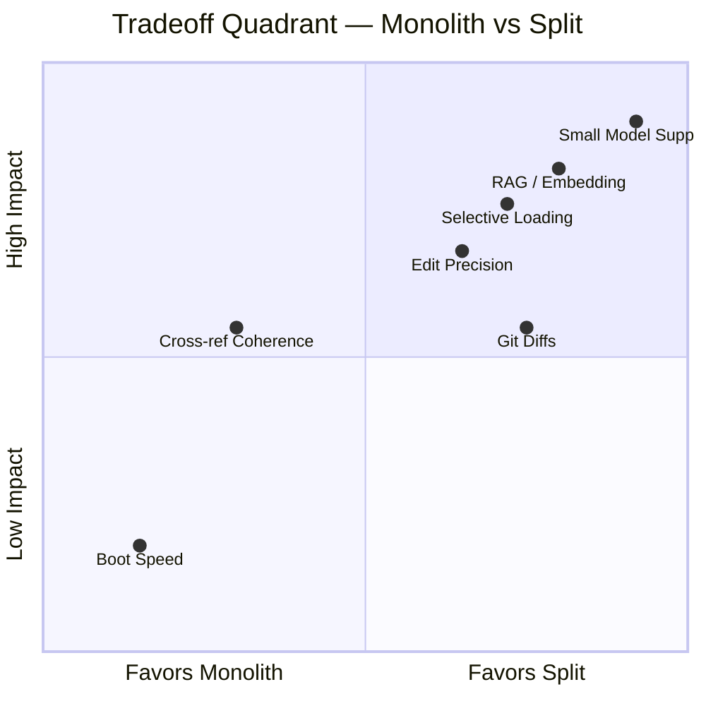

<!-- (c) 2026-* Frederick Bloom -- 9000-tradeoff-analysis.md -- Hanaden AI -->
<!-- #!/usr/bin/env ai-exec flow_type=REFERENCE -->
---
title: "Spec Split Tradeoff Analysis"
class: design-meta
version: 0.0.1
status: active-development
prefix-range: ">=9000 — meta/reference, excluded from cumulative load"
DOB: 2026-08-11T19:03:00Z
copyright: (c) 2026 Hanaden - Frederick Bloom
---

> [!NOTE]
> **META DOCUMENT** — prefix `>= 9000`. Not part of the cumulative load chain.
> The manifest MUST ignore files with prefix `>= 9000` when computing load ceilings.
> These are reference/analysis docs for human and AI review on demand only.

---

# Spec Split: Tradeoff Analysis

## Current State (Monolith)

| File | Lines | Bytes | Top-Level Sections |
|------|------:|------:|-------------------:|
| hanaden-ai-daemon.design.md | 911 | 38,120 | 11 |
| hanaden-ai-daemon.config.md | 243 | 8,395 | 18 |
| hanaden-ai-daemon-cmdstream.design.md | 470 | 15,019 | 11 |
| **Total** | **1,624** | **61,534** | — |

---

## Proposed Split: `####-slug.md` with Cumulative Load

### Naming Convention

```
boot/specs/
  0000-frontmatter-identity.md        # design §1
  0100-definitions.md                 # design §2
  0200-boot-sequence.md               # design §3
  0300-file-classification.md         # design §4
  0400-inotify-architecture.md        # design §5
  0500-event-model.md                 # design §6
  0600-ai-standing-rules.md           # design §7
  0700-variable-scoping.md            # design §8
  0800-ai-exec-coprogram.md           # design §9
  0900-daemon-io.md                   # design §10
  1000-anti-regression.md             # design §11
  1100-config-paths.md                # config: paths, core files, RO files
  1200-config-shebang-inotify.md      # config: shebang, inotify, ai-exec
  1300-config-lifecycle-sidecar.md    # config: lifecycle, sidecar, toolchain
  1400-config-logging-timers.md       # config: logging, rotation, timers
  1500-cmdstream-channels.md          # cmdstream §1-2
  1600-cmdstream-routing-protocol.md  # cmdstream §3-4
  1700-cmdstream-aiexec-bash.md       # cmdstream §5-7
  1800-cmdstream-ops.md               # cmdstream §8-11
  9000-tradeoff-analysis.md           # THIS FILE — meta, not in load chain
```

**Gap rationale**: `+100` leaves 99 insertion slots between any two files for future decomposition (e.g., `0250-boot-verify-toolchain.md`) without renumbering.

---

## Cumulative Load Rule

```
load(N)  ⟹  load(0000..N)       # strict linear, no gaps, no cherry-pick
load(N)  where N >= 9000  ⟹  load ONLY that file   # meta docs are standalone
```

The spec files form a **knowledge stack** — each layer depends on all below it. This is not a performance compromise; it is the correctness guarantee.

| Without predecessors loaded... | ...the AI will... |
|-------------------------------|-------------------|
| Missing `0100-definitions` | Not know FATAL/HALT/ABEND semantics, RFC 2119 keyword weights |
| Missing `0200-boot-sequence` | Not understand subprocess registry, how handlers register |
| Missing `0300-file-classification` | Not know which file types trigger which dispatch paths |
| Missing `0400-inotify-architecture` | Not understand how events arrive at the event model |

---

## Load Profiles

| Profile | Ceiling | Files Loaded | ~Tokens | When |
|---------|---------|--------------|--------:|------|
| `BOOT_ONLY` | 0100 | 0000–0100 | 2,900 | Session init, verify identity + rules |
| `BOOT_FULL` | 1000 | 0000–1000 | 17,350 | Full daemon impl, boot sequence work |
| `CONFIG` | 1400 | 0000–1400 | 23,300 | Tuning parameters, paths, sidecar setup |
| `CMDSTREAM` | 1800 | 0000–1800 | 31,200 | I/O protocol work, bash integration |
| `FULL` | 1800 | 0000–1800 | 31,200 | Complete spec |

### Boot Token Comparison

```
Monolith boot:    ~18,000 tokens (load all 3 files)
Manifest boot:     ~4,400 tokens (manifest + 0000 + 0100)
                   ─────────
                   ~75% reduction at session start
```

---

## Scorecard: Monolith vs Split

| Dimension | Monolith | Split (`####-`) | Winner |
|-----------|:--------:|:---------------:|:------:|
| Boot simplicity (tool calls) | ⭐⭐⭐⭐⭐ | ⭐⭐ | Monolith |
| SST (Single Source of Truth) integrity | ⭐⭐⭐⭐⭐ | ⭐⭐⭐ | Monolith |
| Cross-reference coherence | ⭐⭐⭐⭐ | ⭐⭐⭐ | Monolith |
| Selective/targeted reading | ⭐⭐ | ⭐⭐⭐⭐⭐ | **Split** |
| Edit precision (less collateral) | ⭐⭐⭐ | ⭐⭐⭐⭐⭐ | **Split** |
| Git diff / code review clarity | ⭐⭐⭐ | ⭐⭐⭐⭐ | **Split** |
| RAG / embedding retrieval | ⭐⭐ | ⭐⭐⭐⭐⭐ | **Split** |
| Small-context model support | ⭐ | ⭐⭐⭐⭐⭐ | **Split** |
| Future extensibility (insert sections) | ⭐⭐ | ⭐⭐⭐⭐⭐ | **Split** |
| Cognitive overhead (human) | ⭐⭐⭐⭐ | ⭐⭐⭐ | Monolith |

**Overall**: Split wins 6 dimensions, Monolith wins 4. The monolith wins are all about **simplicity and coherence** — which the cumulative load rule and manifest address.

---

## Tradeoff Quadrant



---

## Impact by AI Agent Type

### Large-Context Agents (Claude, Gemini)

- Context window easily holds everything either way — **Neutral**
- Selective loading via manifest reduces boot tokens — **Moderate benefit**
- Edit precision on small files — **Clear benefit**
- Cumulative load rule eliminates coherence risk — **Mitigated**

### Mid-Context Agents (GPT-4o, o3)

- 128K context fits both — **Neutral on capacity**
- RAG/embedding retrieval works **much better** on focused ~85-line docs — **Significant benefit**
- GPT-4o loses track of distant instructions in long docs; smaller files reduce this — **Moderate benefit**

### Small/Local Models (Llama, Mistral, 8K–32K)

- **Cannot fit monolith** (design.md alone is ~15K tokens)
- Split files let them load only to the needed ceiling — **Major benefit**
- Instruction following dramatically better with focused docs — **Major benefit**

---

## Manifest Retention Model

| Holder | How | Why |
|--------|-----|-----|
| **AI agent** | Manifest ≤ 60 lines; stays in context permanently | Trigger-match → ceiling → load |
| **Daemon** | Parsed at boot into `SPEC_MANIFEST[]` dict | Serves `spec-load` cmd; validates integrity |

### Daemon-Assisted Loading

```json
{"cmd": "spec-load", "ceiling": 1700}
```

Daemon concatenates `0000..1700` in one round-trip — eliminates multi-tool-call overhead.

---

## Mitigations That Close the Gap

| Monolith Advantage | Mitigation in Split Model |
|--------------------|--------------------------|
| Boot simplicity | Manifest `always-load` field → only 3 tool calls at boot |
| SST integrity | `specs/` directory IS the single source; `cat ????-*.md` reconstitutes |
| Cross-reference coherence | Cumulative load rule ensures full prerequisite chain |
| Cognitive overhead | `cat boot/specs/????-*.md` gives human the full monolith view |

---

## Verdict

> The cumulative-load manifest with `+100` numbering eliminates the monolith's advantages
> while gaining all the split benefits. The `>= 9000` meta-doc prefix keeps reference/analysis
> material accessible without polluting the prerequisite load chain.
