<!-- #!/usr/bin/env ai-exec flow_type=REFERENCE -->
---
title: "Daemon Implementation Language Tradeoff Analysis"
class: design-meta
version: 0.0.1
status: active-development
prefix-range: ">=9000 — meta/reference, excluded from cumulative load"
DOB: 2026-08-14T01:56:42Z
copyright: (c) 2026 Hanaden - Frederick Bloom
companion-canvas: canvases/daemon-language-tradeoff.canvas.tsx
sources: |
  PROJECT_HOME/boot/specs/{config,cmdstream,design}/**
  Cargo script unstable feature (RFC 3424 / cargo#12207)
  https://rhai.rs/book/index.html
  https://rhai.rs/book/safety/index.html
changelog: |
  0.0.1  2026-08-14  Add §12 additional evaluation criteria.
                     Add §13 concrete Rhai architecture (DEV + PROD).
  0.1.0  2026-08-14  Initial blank-slate equal-weight scorecard.
                     Candidates: Python, Go, Rust, Rust Script (-Zscript),
                     Zig, Java (min), Rhai (+Rust).
                     Includes DEV→SHIP Rust Script graduate path.
---

> [!NOTE]
> **META DOCUMENT** — prefix `>= 9000`. Not part of the cumulative load chain.
> The manifest MUST ignore files with prefix `>= 9000` when computing load ceilings.
> On-demand reference for humans and AI agents. Blank slate (tabular rasa):
> scores ignore the current Python lock-in in `design/0900` except as a migration note.

---

# Daemon Implementation Language Tradeoff

Equal-weight analysis of languages for the HANADEN-AI daemon — a production
mission-critical I/O hub that:

- Runs at agent conversation start (JSON-Lines / JSON:API over FIFO) **or**
  as a standalone OS daemon
- Uses / self-starts an AI sidecar (uv/llm → CLI → Ollama)
- Honors inotify, persistent bash, `execv` self-regen, bwrap sandbox

## Headline verdict

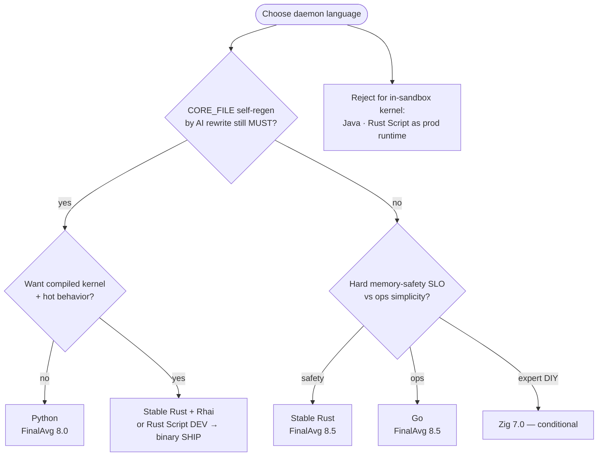

| Rank | Language | FinalAvg | Sum/100 | Recommendation |
|------|----------|---------:|--------:|----------------|
| 1 | **Rust** (stable crate→binary) | **8.5** | 85 | Prefer (mission-first) |
| 1 | **Go** | **8.5** | 85 | Prefer (ops-first); tie-break → Rust on Mission |
| 3 | Python | 8.0 | 80 | Conditional Prefer if AI self-regen MUST |
| 4 | Rhai (+Rust) | 7.7 | 77 | Companion only — not solo daemon |
| 5 | Zig | 7.0 | 70 | Conditional — expert team |
| 6 | Java (min, no Spring) | 6.2 | 62 | Reject for in-sandbox kernel |
| 7 | Rust Script (`cargo +nightly -Zscript`) | 5.8 | 58 | Dev-only → graduate to compiled SHIP |

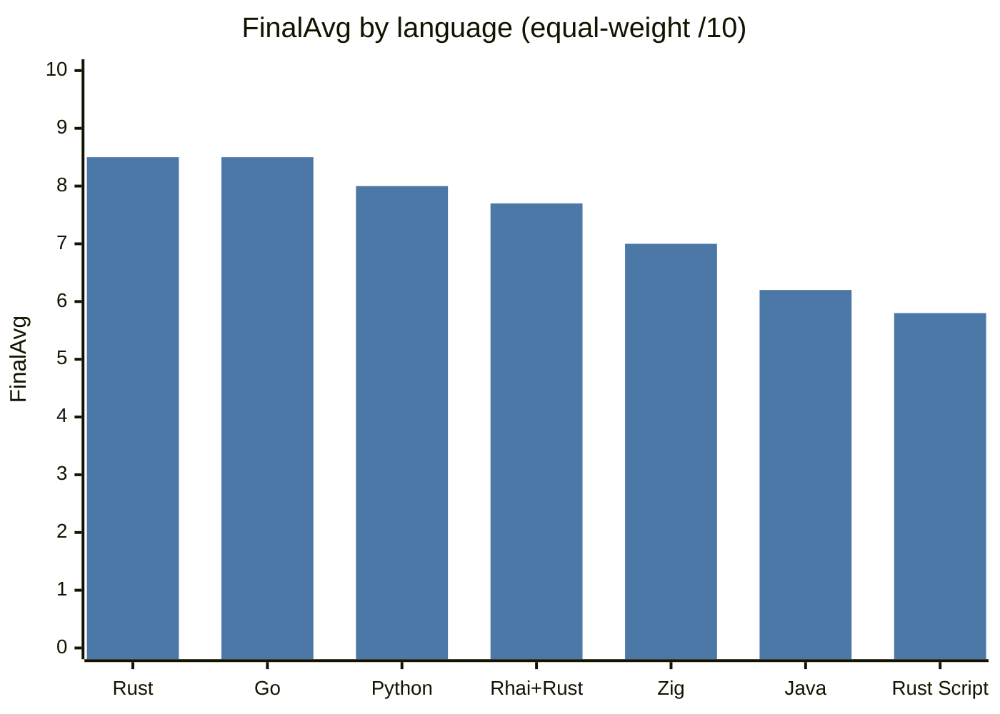

---

## 1. Scoring methodology

### Process

1. Extract MUST behaviors from `PROJECT_HOME/boot/specs` (config → cmdstream → design).
2. Define **10 orthogonal dimensions** covering those behaviors.
3. For each dimension: measurable question + integer **anchors** (what 3 vs 8 vs 10 means).
4. Score each candidate **1–10** with written evidence (SST capability, not popularity).
5. **Rollup:** `FinalAvg(L) = Σ score(L,d) / 10` — each dim weight = **0.1**. No hidden multipliers.
6. Rank by FinalAvg desc. **Ties:** Mission-critical → Self-regen/execv → Leanability.

### Explicit non-inputs

- Current Python lock-in in `design/0900` ignored for scoring (migration cost only).
- Spring not scored (excluded by preference); Java scored as minimal JVM.
- Workload assumption: **I/O-bound** hub with catalog storms (not ML compute).

### Rollup formula

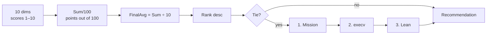

---

## 2. Requirement surface (from specs)

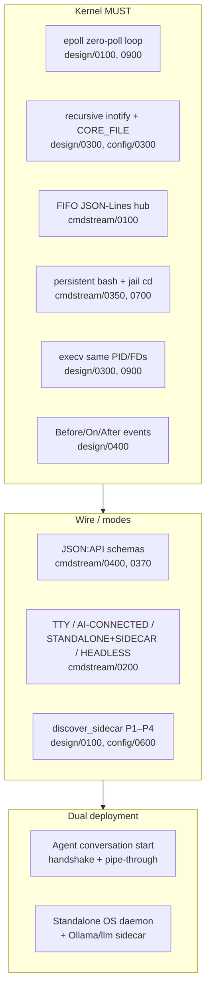

| ID | Must implement | Spec anchors |
|----|----------------|--------------|
| epoll | Zero-poll epoll loop (stdin + inotify + timers) | design/0100, design/0900 |
| inotify | Recursive inotify catalog; CORE_FILE → hot-reload or self-regen | design/0300, config/0300 |
| fifo | Named FIFO JSON-Lines hub + stdout/stderr tee + rotation | cmdstream/0100, 0800 |
| wire | JSON:API-aligned schemas; cmd-processor-json canonical path | cmdstream/0370, 0400 |
| bash | Persistent bash + sentinel; concurrent stderr; jail cd | cmdstream/0350, 0700 |
| modes | TTY / AI-CONNECTED / STANDALONE+SIDECAR / HEADLESS | cmdstream/0200 |
| sidecar | discover_sidecar: config → uv/llm → CLI → Ollama | design/0100, config/0600 |
| execv | os.execv self-regen; same PID/FDs; no new ephemeral dir | design/0300, design/0900 |
| events | Before/On/After serial event registry | design/0400 |
| dual | Agent conversation start OR standalone OS daemon | design/0800, cmdstream/0000 |

---

## 3. Scorecard column glossary

| Column | Full name | What it means | Range | How it is used |
|--------|-----------|---------------|-------|----------------|
| **Language** | Candidate runtime / delivery mode | Option under evaluation. Stable Rust = crate→binary. Rust Script = `cargo +nightly -Zscript` single-file package as the daemon. Rhai (+Rust) = architecture, not a solo OS process. | Enumerated set | Row identity |
| **FinalAvg** | Equal-weight final average (/10) | Headline score = mean of all 10 dimension scores | 1.0–10.0 | Primary ranking key |
| **Sum/100** | Raw total of all dimension scores | Sum of 10 integers before dividing. **Not a percent** — points out of 100 | 10–100 | Audit trail for FinalAvg |
| **Perf** | Runtime performance | Steady-state JSON-Lines / inotify storms / bash streaming (I/O-bound) | 1–10 | Subset scan |
| **Mission** | Mission-critical reliability | Memory safety, long-run stability, **delivery channel** acceptable for prod kernel (stable vs nightly) | 1–10 | First tie-break |
| **Lean** | Leanability / AI regen | How easily an AI agent authors/regenerates the daemon to match SST | 1–10 | Third tie-break |
| **execv** | Self-regen (execv) + hot reload | CORE_FILE → validate → `execv` same PID/FDs; config hot-reload | 1–10 | Second tie-break |
| **Ops** | Production operations | systemd, reproducible builds, observability, stable toolchain | 1–10 | Ship readiness scan |
| **bwrap** | bwrap sandbox fit | Lean launch: artifact size, toolchain binds, EPHEMERAL_HOME layout | 1–10 | Jail friendliness |
| **Recommendation** | Actionable use recommendation | Prefer / Conditional / Dev-only / Companion / Reject | Free text | Primary human decision label |

---

## 4. Rollup arithmetic

Dimension order in sum strings:

1. Spec surface fit
2. Runtime performance
3. Mission-critical reliability
4. Agent pipe + OS daemon
5. AI sidecar integration
6. JSON:API / self-doc wire
7. Leanability / AI regen
8. Self-regen (execv) + hot reload
9. Production ops
10. bwrap sandbox fit

| Language | Dimension scores | Sum | ÷N | FinalAvg |
|----------|------------------|----:|----|---------|
| Rust | 8+10+10+9+8+9+5+7+9+10 | 85 | ÷10 | **8.5** |
| Go | 8+9+8+10+8+9+7+6+10+10 | 85 | ÷10 | **8.5** |
| Python | 9+5+6+9+9+8+10+9+7+8 | 80 | ÷10 | **8.0** |
| Rhai (+Rust) | 6+7+8+7+7+8+8+9+8+9 | 77 | ÷10 | **7.7** |
| Zig | 7+10+8+8+6+6+4+6+6+9 | 70 | ÷10 | **7.0** |
| Java (min) | 5+7+7+7+7+8+5+3+9+4 | 62 | ÷10 | **6.2** |
| Rust Script (-Zscript) | 7+8+3+6+7+8+8+4+2+5 | 58 | ÷10 | **5.8** |

**Tie Rust vs Go:** FinalAvg equal → Mission 10 vs 8 → **Rust ranks above Go**.

---

## 5. Ranked scorecard (with recommendation)

| Language | FinalAvg | Sum/100 | Perf | Mission | Lean | execv | Ops | bwrap | Recommendation |
|----------|---------:|--------:|-----:|--------:|-----:|------:|----:|------:|----------------|
| Rust | 8.5 | 85 | 10 | 10 | 5 | 7 | 9 | 10 | Prefer (mission-first) — fixed compiled kernel; pair with Rhai if hot behavior must regen |
| Go | 8.5 | 85 | 9 | 8 | 7 | 6 | 10 | 10 | Prefer (ops-first) — fixed compiled daemon; AI speaks JSON-Lines only |
| Python | 8.0 | 80 | 5 | 6 | 10 | 9 | 7 | 8 | Conditional Prefer — keep if AI self-regen (generate→py_compile→execv) remains MUST |
| Rhai (+Rust) | 7.7 | 77 | 7 | 8 | 8 | 9 | 8 | 9 | Companion — embed in stable Rust host; never sole daemon process |
| Zig | 7.0 | 70 | 10 | 8 | 4 | 6 | 6 | 9 | Conditional — expert team only; accept ecosystem + LLM-codegen risk |
| Java (min) | 6.2 | 62 | 7 | 7 | 5 | 3 | 9 | 4 | Reject (in-sandbox kernel) — fails execv/FD + lean bwrap |
| Rust Script (-Zscript) | 5.8 | 58 | 8 | 3 | 8 | 4 | 2 | 5 | Dev-only → graduate — author with -Zscript; ship cross-compiled binaries (see §8a) |

---

## 6. Full score matrix

| Dimension | Python | Go | Rust | Rust Script | Zig | Java | Rhai+Rust |
|-----------|-------:|---:|-----:|------------:|----:|-----:|----------:|
| Spec surface fit | 9 | 8 | 8 | 7 | 7 | 5 | 6 |
| Runtime performance | 5 | 9 | 10 | 8 | 10 | 7 | 7 |
| Mission-critical reliability | 6 | 8 | 10 | 3 | 8 | 7 | 8 |
| Agent pipe + OS daemon | 9 | 10 | 9 | 6 | 8 | 7 | 7 |
| AI sidecar integration | 9 | 8 | 8 | 7 | 6 | 7 | 7 |
| JSON:API / self-doc wire | 8 | 9 | 9 | 8 | 6 | 8 | 8 |
| Leanability / AI regen | 10 | 7 | 5 | 8 | 4 | 5 | 8 |
| Self-regen (execv) + hot reload | 9 | 6 | 7 | 4 | 6 | 3 | 9 |
| Production ops | 7 | 10 | 9 | 2 | 6 | 9 | 8 |
| bwrap sandbox fit | 8 | 10 | 10 | 5 | 9 | 4 | 9 |

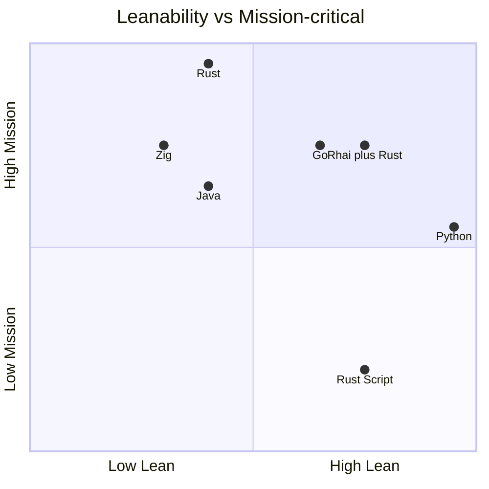

---

## 7. Per-dimension evidence

### 7.1 Spec surface fit

**Measures:** Can the language implement epoll, recursive inotify, FIFO, persistent bash pipes, signals, serial Before/On/After events?

**Anchors:** 2=missing kernel primitives · 5=JNI/awkward glue · 7=immature libs · 8=solid · 9=maps 1:1 to pseudocode · 10=unused

| Language | Score | Evidence |
|----------|------:|----------|
| Python | 9 | Pseudocode is Python-shaped (asyncio, ctypes inotify, os.execv, Popen). design/0900 mandates these. |
| Go | 8 | netpoll + goroutines + x/sys/unix cover FIFO/inotify/signals. |
| Rust | 8 | tokio/mio + nix/inotify complete; more boilerplate. |
| Rust Script | 7 | Same APIs after compile; single-file poor for multi-module daemon. |
| Zig | 7 | Direct Linux syscalls excellent; JSON/async less mature. |
| Java | 5 | inotify needs JNA/JNI; execv model fights JVM. |
| Rhai (+Rust) | 6 | Rhai alone cannot do inotify/execv; Rust host owns syscalls. |

### 7.2 Runtime performance

**Measures:** Steady-state latency/throughput for JSON-Lines, inotify storms, bash streaming — I/O-bound with bursts.

**Anchors:** 5=adequate I/O-bound · 8=near-native with caveats · 9=excellent daemon · 10=best native no-GC

| Language | Score | Evidence |
|----------|------:|----------|
| Python | 5 | Fine I/O-bound; GIL + interpreter tax under storms — weakest ceiling. |
| Go | 9 | Fast JSON, cheap goroutines, low RSS; mild GC. |
| Rust | 10 | No GC; best ceiling for mission bursts. |
| Rust Script | 8 | Steady-state ≈ Rust; deducted for cold/regen compile on critical path. |
| Zig | 10 | Native, no GC; equals Rust on raw runtime. |
| Java | 7 | Strong after warmup; GC + high RSS. |
| Rhai (+Rust) | 7 | Host fast; scripted path slower than pure Rust. |

### 7.3 Mission-critical reliability

**Measures:** Memory safety, long-run stability, delivery channel acceptable for prod kernel (no experimental runtime).

**Anchors:** 2=experimental · 3=nightly-gated · 6=disciplined dynamic · 8=strong systems · 10=memory-safe stable

| Language | Score | Evidence |
|----------|------:|----------|
| Python | 6 | Mature CPython; interpreter/GIL risks if hard SLOs. |
| Go | 8 | Excellent daemon track record; not Rust-level memory safety. |
| Rust | 10 | Ownership + stable toolchain; best hard-SLO fit. |
| Rust Script | 3 | Nightly unstable `-Zscript` — disqualifying as prod delivery. |
| Zig | 8 | No GC; less battle-tested ecosystem. |
| Java | 7 | Enterprise culture; JNI risk on inotify path. |
| Rhai (+Rust) | 8 | Rust host safety; Rhai sandbox limits hot-reload blast radius. |

### 7.4 Agent pipe + OS daemon

**Measures:** Dual mode — agent handshake/FIFO pass-through **and** standalone HEADLESS OS daemon.

| Language | Score | Evidence |
|----------|------:|----------|
| Python | 9 | FIFO + asyncio natural; matches generated daemon. |
| Go | 10 | Idiomatic service + stdin/FIFO; best dual-mode. |
| Rust | 9 | Fully capable; slightly more wiring than Go. |
| Rust Script | 6 | Wire OK; boot may compile; weak systemd unit (needs nightly cargo). |
| Zig | 8 | Capable; more DIY packaging. |
| Java | 7 | Standalone OK; agent-start in bwrap heavy. |
| Rhai (+Rust) | 7 | Modes owned by Rust host. |

### 7.5 AI sidecar integration

**Measures:** discover_sidecar P1–P4, pipes/HTTP, AI_EXEC_TIMEOUT, queue when absent.

| Language | Score | Evidence |
|----------|------:|----------|
| Python | 9 | subprocess + env probe matches SST; uv/llm adjacent. |
| Go | 8 | os/exec + HTTP solid. |
| Rust | 8 | tokio::process + reqwest solid. |
| Rust Script | 7 | Same crates; first-run dep fetch in sandbox is a liability. |
| Zig | 6 | Process spawn OK; fewer LLM client conventions. |
| Java | 7 | ProcessBuilder + HTTP fine; heavier. |
| Rhai (+Rust) | 7 | Sidecar I/O in Rust; Rhai orchestrates if APIs registered. |

### 7.6 JSON:API / self-doc wire

**Measures:** JSON-Lines schemas, error objects, additionalProperties:false, agent-facing self-doc wire.

| Language | Score | Evidence |
|----------|------:|----------|
| Python | 8 | json + validators; dynamic typing needs discipline. |
| Go | 9 | encoding/json + struct tags. |
| Rust | 9 | serde + schemars compile-time schemas. |
| Rust Script | 8 | serde_json via frontmatter; less multi-crate layout room. |
| Zig | 6 | JSON less ergonomic for large schema sets. |
| Java | 8 | Jackson/Gson mature; verbose without Spring. |
| Rhai (+Rust) | 8 | Serialization in Rust; Rhai maps if bridged. |

### 7.7 Leanability / AI regen

**Measures:** AI agent author/regen cycle length; project complexity; LLM codegen strength.

| Language | Score | Evidence |
|----------|------:|----------|
| Python | 10 | Fastest generate→run; SST written for it. |
| Go | 7 | Clear; still a compile cycle. |
| Rust | 5 | Correct async/unsafe harder; slowest full-crate regen. |
| Rust Script | 8 | Single-file + embedded manifest lean for agents. |
| Zig | 4 | Weaker LLM accuracy; alloc pitfalls. |
| Java | 5 | Verbose; agents over-pull frameworks. |
| Rhai (+Rust) | 8 | Hot logic in small scripts easy to regen. |

### 7.8 Self-regen (execv) + hot reload

**Measures:** CORE_FILE → validate → execv same PID/FDs; config.md hot-reload in-place.

| Language | Score | Evidence |
|----------|------:|----------|
| Python | 9 | os.execv + py_compile is the SST path; FDs survive. |
| Go | 6 | syscall.Exec works; AI must produce new binary. |
| Rust | 7 | execv(binary) OK; validation = compile; slower than Python. |
| Rust Script | 4 | exec’ing cargo wrapper fragile for FD inheritance. |
| Zig | 6 | execve fine; still needs compile. |
| Java | 3 | No true same-PID execv without native helpers. |
| Rhai (+Rust) | 9 | Reload scripts in-place; host execv only when kernel changes. |

### 7.9 Production ops

**Measures:** systemd, reproducible builds, observability, stable toolchain, on-call.

| Language | Score | Evidence |
|----------|------:|----------|
| Python | 7 | Widely operated; weaker than static binaries. |
| Go | 10 | Single static binary + systemd reference model. |
| Rust | 9 | Static binary excellent; slightly heavier CI than Go. |
| Rust Script | 2 | Nightly + unstable — not ops-acceptable prod runtime. |
| Zig | 6 | Improving; fewer off-the-shelf patterns. |
| Java | 9 | Superb ops/observability; heavy footprint. |
| Rhai (+Rust) | 8 | Ops = Rust binary; scripts are versioned data. |

### 7.10 bwrap sandbox fit

**Measures:** Lean launch under bwrap-enhanced; toolchain binds; /homes tmpfs; EPHEMERAL_HOME.

| Language | Score | Evidence |
|----------|------:|----------|
| Python | 8 | python3 + stdlib fits current launch. |
| Go | 10 | One static binary; minimal binds. |
| Rust | 10 | Same when built statically. |
| Rust Script | 5 | Needs cargo+nightly+registry — fights lean bwrap. |
| Zig | 9 | Tiny native binary. |
| Java | 4 | JRE/JDK bind opposite of lean. |
| Rhai (+Rust) | 9 | One Rust binary embedding Rhai; scripts as data. |

---

## 8. Deployment modes

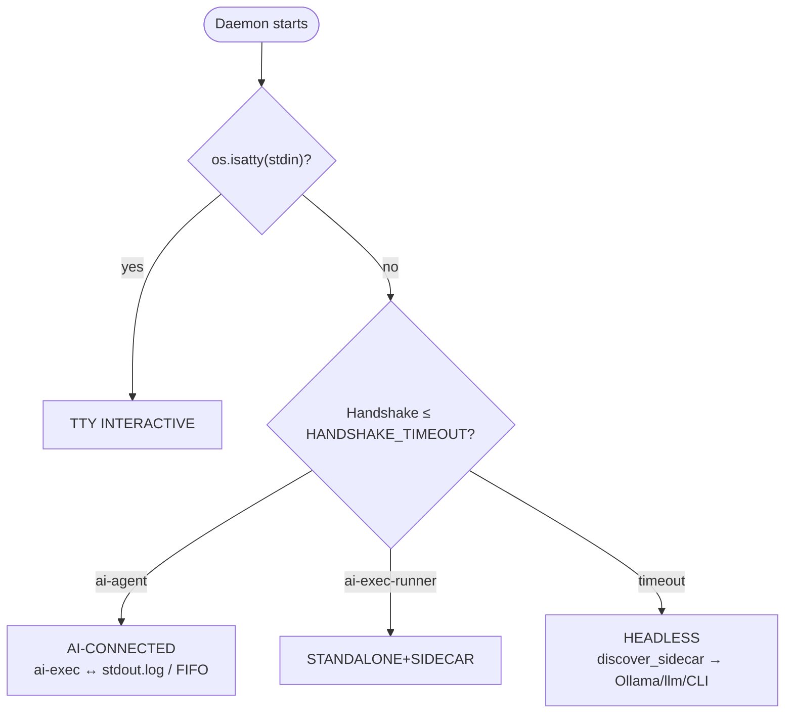

| Mode | Behavior | Strong fits | Weak / fail |
|------|----------|-------------|-------------|
| Agent conversation start | Generate/launch in bwrap; handshake; JSON-Lines FIFO | Python / Go / Rust | Rust Script weak (compile); Java awkward; Rhai alone no |
| Agent pass-through | AI reads stdout.log, writes FIFO; ai-exec req/resp | All hosts with JSON-Lines | Host must stream reliably |
| Standalone OS daemon | HEADLESS + discover_sidecar | Go / Rust best; Python fine | Rust Script reject for prod; Java heavy |
| Self-started AI sidecar | Pipes or HTTP to Ollama; queue if none | Python/Go/Rust | Rust Script OK after warm cache only |
| Self-regen on CORE_FILE | AI rewrite → validate → execv same FDs | Python; Rust+Rhai hybrid | Rust Script fragile; Java fails model |

---

## 8a. Rust Script in DEV → cross-platform compiled SHIP

### Verdict

**Yes — as a two-phase lifecycle.** Develop with `cargo +nightly -Zscript` (or single-file package ergonomics), then ship **prebuilt release binaries** per OS/CPU. Production MUST NOT invoke `cargo +nightly -Zscript` at daemon runtime.

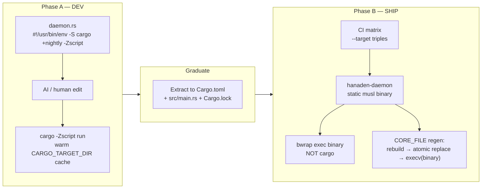

### Phase A — DEV (author / agent loop)

- Artifact: `daemon.rs` with shebang `#!/usr/bin/env -S cargo +nightly -Zscript` and embedded `---cargo` frontmatter deps (tokio, serde, nix, …).
- Loop: edit → run → handshake JSON-Lines → iterate. First run compiles; later runs hit Cargo cache (CARGO_TARGET_DIR / CARGO_HOME).
- When testing FD preservation: **exec the cached binary**, not the cargo wrapper.
- Constraints: nightly on DEV host; `-Zscript` unstable; not for HEADLESS prod units.

### Phase B — SHIP (cross CPU / OS compiled binaries)

- Graduate to normal Cargo package (`Cargo.toml` + `src/main.rs` + `Cargo.lock`) for reproducible CI.
- Primary triples for this SST:
  - `x86_64-unknown-linux-musl`
  - `aarch64-unknown-linux-musl`
  (static, bwrap-friendly)
- Add Darwin/Windows targets only if those hosts are in product scope.
- **SST limit:** inotify + bwrap-enhanced is **Linux-kernel-centric**. Cross-OS binaries are buildable, but full daemon behavior needs alternate FS-watch backends and non-bwrap sandbox on non-Linux — a product decision, not a Rust limitation.
- Runtime: bwrap launches `/path/to/hanaden-daemon`. NEVER `cargo +nightly -Zscript` in prod sandbox.
- Self-regen in SHIP: AI updates source → CI builds binary → atomic replace → `execv(binary)` preserving FDs.

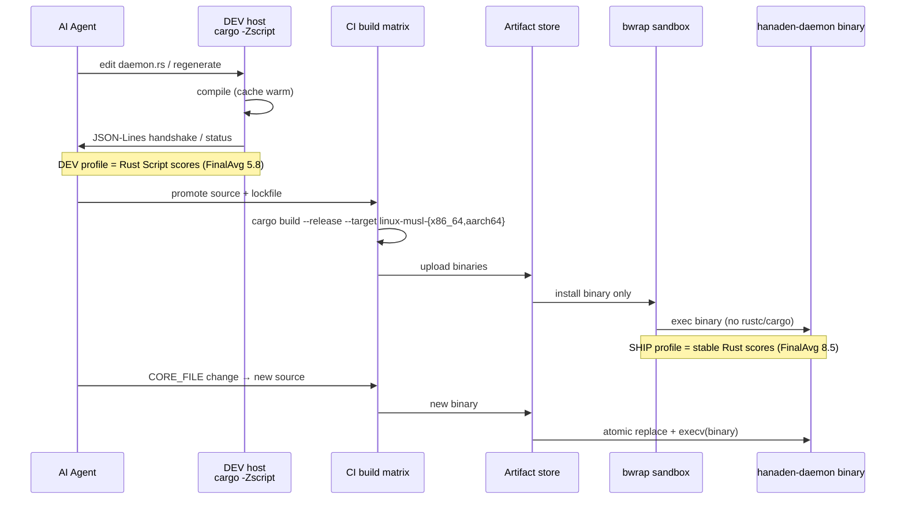

### DEV vs SHIP concern matrix

| Concern | DEV (Rust Script) | SHIP (compiled binary) |
|---------|-------------------|------------------------|
| Toolchain | Nightly + -Zscript required | Stable rustc in CI only; none in runtime jail |
| Startup | Compile on miss; warm cache fast | Milliseconds — exec binary |
| bwrap | Heavy (cargo/rustc/registry) or host-only | Lean — one static binary |
| execv / FD preserve | Fragile if exec’ing cargo wrapper | Correct if execv(binary) after atomic replace |
| Cross CPU | Build on that CPU or ad hoc cross | CI matrix of `--target` triples |
| Cross OS | Dev usually Linux (SST) | Binaries buildable elsewhere; inotify/bwrap Linux-primary |
| Score profile | Rust Script FinalAvg **5.8** | Stable Rust FinalAvg **8.5** once graduated |
| Recommendation | Authoring / agent prototypes | Required for production mission-critical |

> [!WARNING]
> Do not conflate the two scores. Rust Script FinalAvg 5.8 grades running the
> daemon *through* cargo nightly script. The DEV→SHIP path is valid only if
> SHIP switches to the **stable Rust delivery contract (8.5)**. Shipping
> still-as-script is not a compliant mission-critical mode.

---

## 9. Per-language analysis

### Python — FinalAvg 8.0 (80/100)

**Role:** Current SST assumption; best AI-agent self-regen loop.

**Rollup:** `9+5+6+9+9+8+10+9+7+8 = 80 ÷ 10 = 8.0`

**Pros**

- Maps 1:1 to existing pseudocode (asyncio, ctypes inotify, os.execv, Popen)
- Fastest agent turnaround: generate → py_compile → execv
- uv/llm/Ollama sidecar probe already specified in Python terms
- Excellent JSON + stdlib; lean for I/O-bound hub

**Cons**

- Weakest ceiling under inotify storms / large catalogs
- GIL + interpreter crashes less ideal for hard mission-critical SLOs
- Packaging/runtime drift inside bwrap needs discipline

**Verdict:** Best for correctness-first iteration; acceptable prod if I/O-bound SLOs hold.

### Go — FinalAvg 8.5 (85/100)

**Role:** Strongest pure-daemon systems language for this shape (ops-first).

**Rollup:** `8+9+8+10+8+9+7+6+10+10 = 85 ÷ 10 = 8.5`

**Pros**

- Static binary, tiny sandbox story, systemd-native
- Goroutines + netpoll match FIFO + bash + sidecar pipes
- Excellent JSON; easy dual mode
- Predictable ops: one binary, fast start, low RSS

**Cons**

- Self-regen requires compile-or-replace binary — breaks AI→py_compile→execv unless fixed binary + script layer
- Mild GC; not as hard-realtime as Rust/Zig

**Verdict:** Top pick if the daemon is a fixed compiled product and AI only drives policy/sidecar.

### Rust (stable) — FinalAvg 8.5 (85/100)

**Role:** Highest reliability/performance for mission-critical kernel (crate → binary).

**Rollup:** `8+10+10+9+8+9+5+7+9+10 = 85 ÷ 10 = 8.5`

**Pros**

- Memory safety without GC; tokio/mio; nix execv/FIFO/signals
- Best long-run stability; tiny static binary for bwrap
- serde + schemars can lock JSON Schema at compile time

**Cons**

- Highest AI regen cost for full crate rewrites (Lean 5)
- Unsafe/FFI for some Linux edges; longer to land full SST surface

**Verdict:** Best long-term prod kernel if regen is compile-deploy, not per-CORE_FILE AI rewrite of the whole binary.

### Rust Script (`cargo +nightly -Zscript`) — FinalAvg 5.8 (58/100)

**Role:** Experimental Cargo single-file packages as the daemon delivery vehicle.

**Rollup:** `7+8+3+6+7+8+8+4+2+5 = 58 ÷ 10 = 5.8`

**Pros**

- Single `.rs` + embedded Cargo.toml — agent-friendly packaging
- After warm cache, runtime is real Rust performance
- Useful for prototypes, agent-side tools, JSON-Lines clients

**Cons**

- Nightly + unstable `-Zscript` — disqualifying for mission-critical prod kernel
- Boot/regen may compile on critical path; weak systemd story
- bwrap must expose cargo/rustc/registry — not lean
- FD-preserving execv across cargo wrapper is fragile

**Verdict:** Dev-only → graduate to compiled SHIP (§8a). Do not run as prod kernel via cargo.

### Zig — FinalAvg 7.0 (70/100)

**Role:** Maximum control / C-level POSIX; thin ecosystem.

**Rollup:** `7+10+8+8+6+6+4+6+6+9 = 70 ÷ 10 = 7.0`

**Pros**

- Explicit allocators; no GC; direct Linux syscalls
- Excellent binary size and sandbox fit

**Cons**

- JSON/async less mature for JSON:API schema volume
- Smaller talent + weaker LLM codegen → delivery risk

**Verdict:** Viable for experts; higher delivery risk for full prod SST coverage.

### Java (min, no Spring) — FinalAvg 6.2 (62/100)

**Role:** Enterprise ops strength; poor fit for execv/kernel-daemon model.

**Rollup:** `5+7+7+7+7+8+5+3+9+4 = 62 ÷ 10 = 6.2`

**Pros**

- Mature JSON; virtual threads (21+) for pipes
- Excellent observability; sidecar HTTP easy without Spring

**Cons**

- inotify needs JNI/JNA
- Cannot honor os.execv same-PID/FD self-regen without awkward native glue
- Heavy RSS; bwrap JVM bootstrap is not lean

**Verdict:** Reject for in-sandbox kernel; optional external control plane only.

### Rhai (+Rust) — FinalAvg 7.7 (77/100)

**Role:** Embedded policy/handler layer on Rust host ([rhai.rs](https://rhai.rs/book/index.html)) — not a solo daemon.

**Rollup:** `6+7+8+7+7+8+8+9+8+9 = 77 ÷ 10 = 7.7`

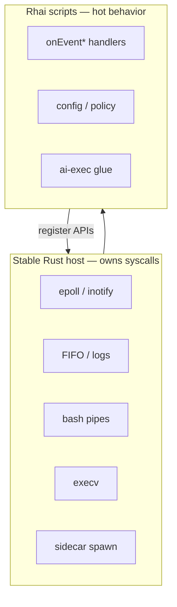

**Pros**

- Hot-reload scripts without recompiling the Rust kernel
- Sandboxed scripting for handlers / ai-exec glue / config policy
- Keeps syscalls in Rust — correct split

**Cons**

- Cannot own the daemon alone
- Second language in the SST — docs/training cost

**Verdict:** Best companion to stable Rust for self-documenting, hot-reloadable behavior.

---

## 10. Stable Rust vs Rust Script

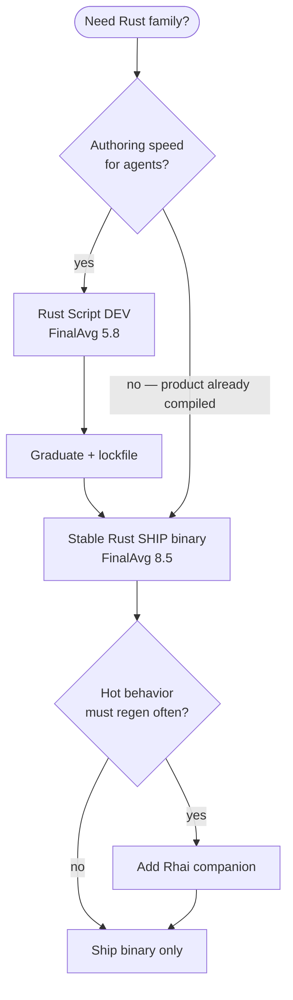

| | Stable Rust | Rust Script (-Zscript) |
|--|-------------|------------------------|
| FinalAvg | **8.5** | **5.8** |
| Delivery | crate → release binary | nightly cargo script shebang |
| Prod kernel | Yes | No |
| Lean for AI | 5 (full crate) | 8 (single file) |
| Mission | 10 | 3 |
| Ops | 9 | 2 |
| Path | Direct SHIP | DEV → graduate → SHIP (§8a) |

---

## 11. Decision guide

1. **CORE_FILE self-regen by AI rewriting daemon source remains MUST** → Python, **or** stable Rust + Rhai (regen scripts only), **or** Rust Script only in DEV then CI-ship binary (§8a).
2. **Versioned compiled product; AI speaks JSON-Lines only** → Go or stable Rust (tie: Rust for hard memory-safety SLOs; Go for ops simplicity).
3. **Rust Script (-Zscript)** → DEV authoring / prototypes only; NEVER the long-running production process — ship cross-compiled binaries (§8a).
4. **Zig** only with a dedicated systems owner; **Java** only as optional out-of-sandbox control plane.

> [!IMPORTANT]
> `design/0900` still hardcodes Python/asyncio/ctypes. Blank-slate scores are
> **not** permission to diverge without an SST change.

---

## 12. Additional criteria to consider (beyond the 10 scored dims)

The scored rubric is necessary but not complete for a mission-critical ship
decision. These criteria should be scored or gated in a follow-on pass
(v0.3+). Each maps to real SST failure modes.

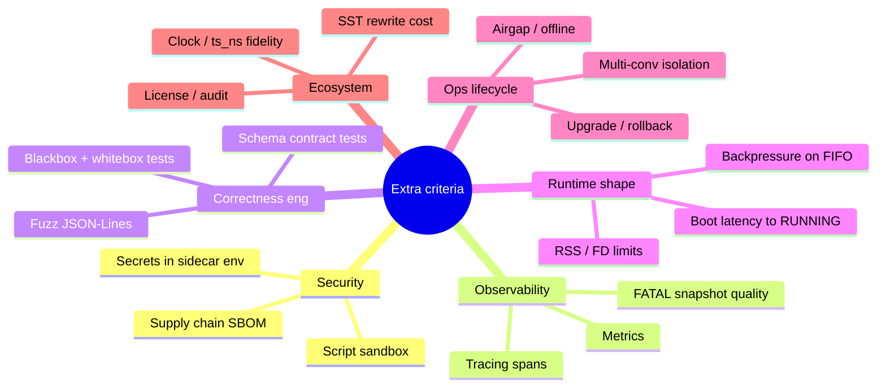

| # | Criterion | Why it matters for *this* daemon | What “good” looks like |
|---|-----------|----------------------------------|------------------------|
| A | **Security / attack surface** | FIFO is a shared write surface; ai-exec content is untrusted text; Rhai/scripts can DOS the host if unbounded ([Rhai safety](https://rhai.rs/book/safety/index.html)) | No raw FS/net from scripts; max_operations / call-stack limits; Don’t Panic; secrets only in host env for sidecar |
| B | **Supply chain / SBOM** | Sidecar plugins (`uv tool run llm`) + crates/pypi are live deps | Lockfiles, pinned hashes, offline mirror for prod, CVE response SLA |
| C | **Observability** | FATAL/HALT requires stack + vars; mission ops needs traces across bash/ai-exec | Structured logs, correlating `ts_ns`/`id`, optional OpenTelemetry; reproducible FATAL snapshots |
| D | **Testability (blackbox + whitebox)** | Project rule: all functions blackbox *and* whitebox tested; anti-reward-hacking forbids keyword-scan fakes | Host unit tests + script tests + real bwrap suites that mutate behavior |
| E | **Boot latency to `RUNNING`** | Agent conversation start is latency-sensitive (handshake 2s) | p95 boot budget documented; no compile-on-boot in prod |
| F | **Memory / FD / backpressure** | Persistent bash + sidecar pipes + inotify + FIFO writers | Bounded queues; non-blocking FIFO; explicit FD CLOEXEC; RSS SLO |
| G | **Concurrency correctness** | stdin, inotify, bash stdout/stderr, sidecar, timers share one event loop | Clear ownership; no blocking calls on the epoll thread; stress tests |
| H | **Determinism / reproducibility** | Self-regen and CI must produce same binary/script hashes | Locked deps; hermetic builds; content-hash scripts at boot |
| I | **Airgap / offline** | Prod may not reach crates.io/pypi; sidecar may be local Ollama only | Runtime needs zero network for the kernel; sidecar optional |
| J | **Multi-conversation isolation** | `AI_CONV_ID` → separate EPHEMERAL_HOME; many daemons per host | No cross-talk of FIFO/logs/pids; cgroup/ulimit story |
| K | **Upgrade / rollback** | execv replaces image; bad regen must abort (design/0300) | Atomic replace + validate; keep N previous binaries/scripts; abort keeps old image |
| L | **SST rewrite / migration cost** | design/0900 hardcodes Python/asyncio/ctypes | Costed plan to retarget anti-regression before language switch |
| M | **Clock / `ts_ns` fidelity** | Wire schema requires nanosecond timestamps | Monotonic + wall clock policy; no ms-only clocks on the wire |
| N | **Debuggability** | Production ABEND must be actionable | Symbolicated stacks for host; script source maps / line numbers for Rhai |
| O | **Licensing / compliance** | Mission-critical redistribution | Compatible licenses for host + scripts + sidecar CLIs |
| P | **I18n / UTF-8 wire discipline** | JSON-Lines UTF-8; paths and shell output are messy | Explicit lossy vs strict modes; never corrupt `exec_line` streaming |

### Suggested use of these criteria

- **Gate (pass/fail):** A, D, I, K, L — fail means “do not ship that delivery mode.”
- **Score (1–10, optional second rubric):** B, C, E, F, G, H, J, M, N — fold into FinalAvg only after weights are agreed.
- **Record-only:** O, P — usually not language-differentiating until legal/compliance review.

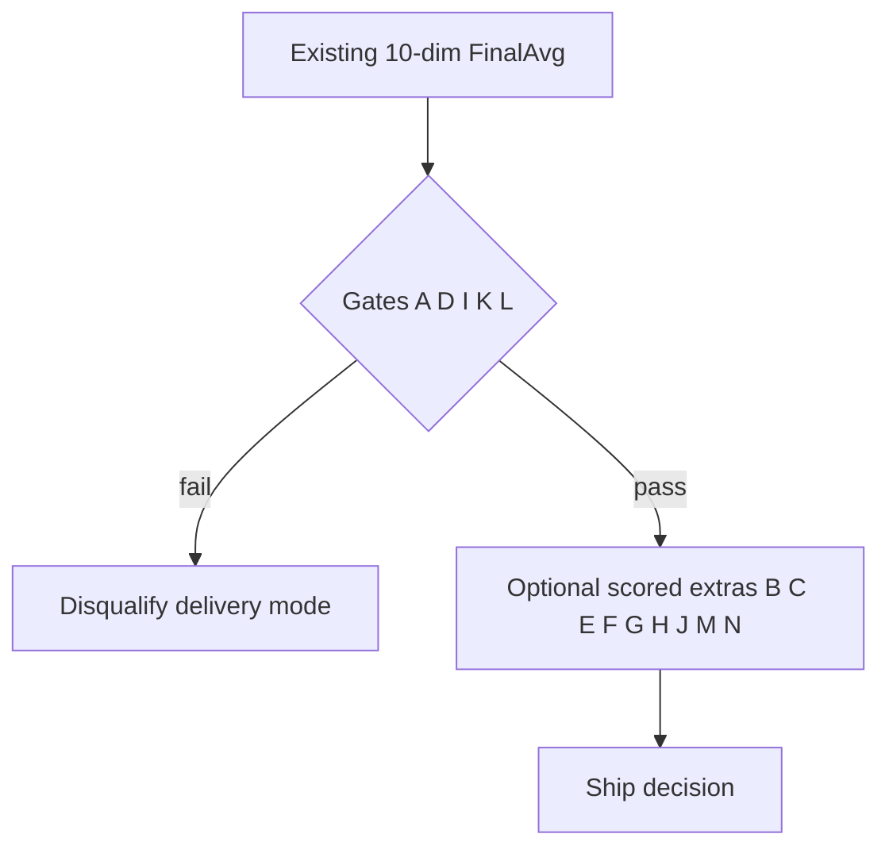

---

## 13. Rhai approach — what implementation really looks like

Rhai is **not** a second daemon. It is an **embedded policy/handler VM** inside a
stable Rust **host** that owns every POSIX/kernel concern the SST requires.

Mental model:

| Layer | Language | Responsibility |
|-------|----------|----------------|
| **Host kernel** | Rust (stable binary) | epoll, inotify, FIFO, logs, persistent bash, sidecar spawn, JSON-Lines codec, signals, `execv`, jail realpath, catalog |
| **Behavior scripts** | Rhai (`.rhai`) | `onEvent*` triplets, routing policy, ai-exec prompt shaping, config-derived constants, soft business rules |
| **Wire** | JSON-Lines | Unchanged — agents still speak cmdstream schemas |
| **Sidecar** | External process | Ollama / `uv tool run llm` / CLI — host spawns; scripts may *request* dispatch |

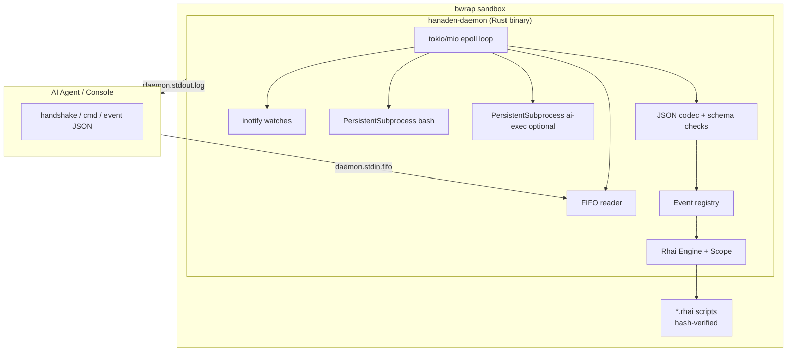

### 13.1 API surface the host registers into Rhai

Scripts MUST-NOT get raw `std::fs` / raw sockets. They call **host-provided**
functions (Rust closures registered on the Engine), for example:

| Rhai API (illustrative) | Host action |
|-------------------------|-------------|
| `log(level, msg)` | LOGGER with FATAL/HALT rules |
| `emit(obj_map)` | Serialize JSON-Lines to stdout/log |
| `exec(shell)` | Persistent bash + sentinel; returns ExecResult map |
| `cd(path)` | Jail guard; mutates `session_cwd` |
| `dispatch_ai_exec(path)` | Route per caller_mode (FIFO vs sidecar pipe vs queue) |
| `catalog_get(path)` / `catalog_len()` | Read-only catalog views |
| `phase()` / `caller_mode()` / `now_ns()` | Runtime introspection |
| `register_handler(name, fn)` | Bind Rhai fn into Before/On/After registry |
| `reload_config()` | Hot-reload config.md params into scope |
| `queue_ai_exec(path)` | HEADLESS queue |

Rhai safety knobs (prod MUST enable): `max_operations`, `max_call_stack_depth`,
`max_string_size`, `max_array_size`, `max_expr_depths` — per
[Rhai Safety](https://rhai.rs/book/safety/index.html). Don’t Panic: script
errors become LOGGER.error / wire `error` objects, never host abort unless
policy says FATAL.

### 13.2 Event dispatch with Rhai

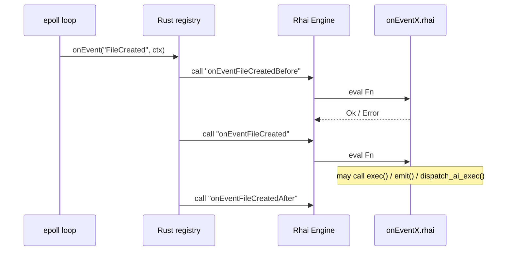

Serial Before → On → After stays in Rust (SST). Rhai functions are the
*bodies*; missing members remain NOOP.

Example sketch (illustrative, not normative SST):

```rhai
// handlers/file_created.rhai
fn onEventFileCreated(ctx) {
    log("INFO", `file created: ${ctx.path}`);
    if ctx.exec_type == "AI_SHEBANG" {
        dispatch_ai_exec(ctx.path);
    } else if ctx.exec_type == "OS_SHEBANG" && ctx.executable {
        let r = exec(ctx.path);
        if r.exit_code != 0 {
            emit(#{
                ack: "error",
                error: #{
                    code: "COMMAND-FAILED",
                    title: "OS shebang failed",
                    detail: r.stderr,
                    source: #{ path: ctx.path, step: "command" }
                },
                ts_ns: now_ns()
            });
        }
    }
}
```

### 13.3 What lives where on disk

```text
# SHIP layout (conceptual)
/usr/local/lib/hanaden/hanaden-daemon     # Rust host binary (or under EPHEMERAL bind)
EPHEMERAL_HOME/
  daemon.stdin.fifo
  daemon.stdout.log / daemon.stderr.log / daemon.pid
  scripts/                               # deployed .rhai (or bind-mounted)
    boot.rhai
    handlers/*.rhai
    SHA256SUMS                           # verified at Boot Before
  home/sandbox-user/                     # writable sandbox home
```

Host binary path is stable across self-regen of **scripts**. Host binary path
changes only when the Rust kernel itself is replaced (CI artifact + execv).

### 13.4 DEV mode — day-to-day loop

Goal: keep **Lean** high without putting nightly cargo in the runtime contract.

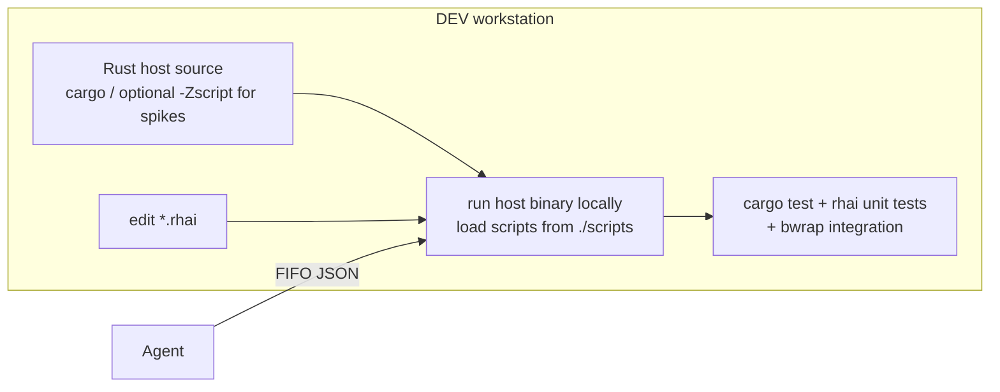

**Practices**

1. **Host** developed as a normal Cargo crate (preferred) or short-lived
   `-Zscript` spike that is immediately extracted (§8a).
2. **Behavior** iterated as `.rhai` files — save file → host `inotify` on
   `scripts/` → hot-reload Engine (no host recompile).
3. Agent/IDE drives the same JSON-Lines protocol as prod.
4. Whitebox: Rust tests for jail/execv/codec; Rhai tests for handler logic.
5. Blackbox: existing cmdstream suites against a DEV binary + scripts bundle.
6. Optional: AI regenerates **only** `.rhai` + specs during conversation;
   host changes go through normal PR/CI.

**DEV self-regen split**

| Change type | Action in DEV |
|-------------|---------------|
| `.rhai` / config.md | Hot-reload in running process |
| Rust host source | Rebuild binary; restart or execv binary |
| design SST | May trigger AI to rewrite handlers; host unchanged |

### 13.5 PROD mode — mission-critical shape

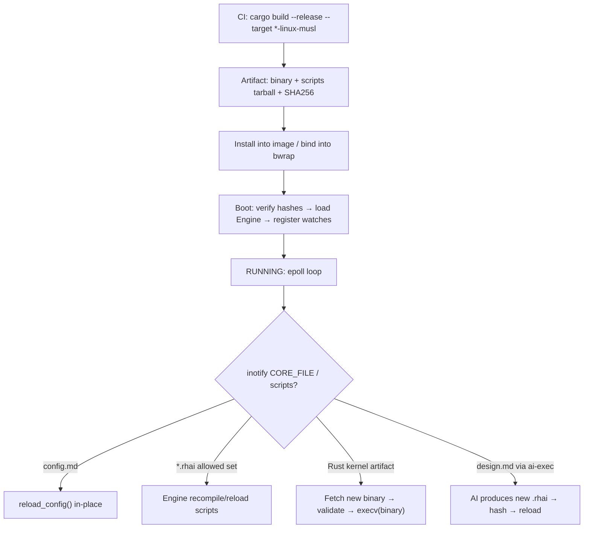

**Hard PROD rules**

1. Runtime process image = **stable Rust binary only** (no `cargo`, no `-Zscript`).
2. Scripts are **content-hashed**; Boot Before verifies `SHA256SUMS` or signed bundle.
3. Script errors are contained (Rhai safety limits); only explicit FATAL paths ABEND.
4. `execv` replaces the **binary** when the host kernel changes; script reload does
   **not** create a new EPHEMERAL_HOME (same as today’s self-regen vs Reboot split).
5. Sidecar discovery stays in Rust (config/0600); scripts may call `dispatch_ai_exec`
   but cannot invent a new probe order without host support.
6. Airgap: binary + scripts + optional local Ollama — no crates.io at runtime.

**PROD self-regen mapping to today’s SST**

| Today (Python SST) | Rhai approach |
|--------------------|---------------|
| AI rewrites `daemon.py` → py_compile → execv | AI rewrites `.rhai` → hash check → Engine reload (**common path**) |
| Rare “kernel” redesign | AI/humans change Rust → CI binary → execv (**uncommon path**) |
| config.md hot-reload | Same: host reload_config + update Rhai Scope |
| Reboot P4b new EPHEMERAL_HOME | Unchanged; host clears state; scripts reload from bundle |

This is how you get **Python-like Lean** for day-to-day behavior without
**Python-like Mission** tradeoffs on the kernel.

### 13.6 Concurrency & threading note

Rhai evaluation is typically invoked **synchronously** on the event-loop
thread for Before/On/After (SST: serial, never async). Long AI waits use the
host’s timeout/`dispatch_ai_exec` async machinery; scripts must not spin.

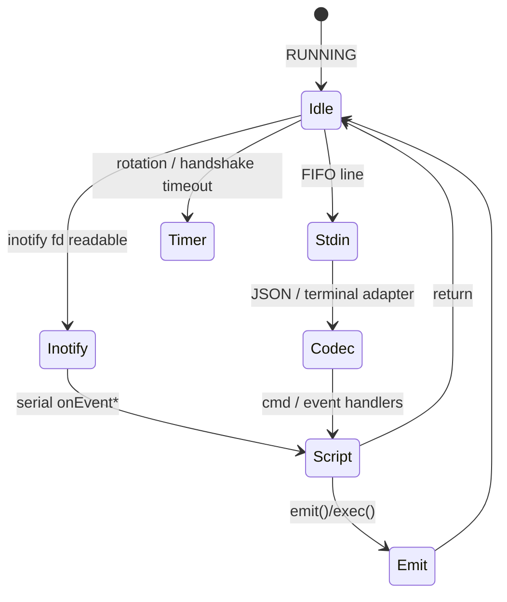

### 13.7 Testing matrix (blackbox + whitebox)

| Layer | Whitebox | Blackbox |
|-------|----------|----------|
| Rust host | Unit tests: jail, sentinel parse, schema reject, hash verify | bwrap suites: handshake, exec stream, shutdown |
| Rhai scripts | Engine tests with mock host APIs | Same FIFO suites; sabotage test = break handler → suite fails |
| Integration | Fault inject sidecar timeout | HEADLESS queue drain when handshake arrives |

### 13.8 When Rhai is the wrong tool

- Handler needs microsecond-tight loops over huge catalogs → keep in Rust.
- Need OS threads / true parallelism inside handlers → not Rhai’s job.
- Team refuses two languages in SST → prefer pure Go/Rust/Python instead.
- Desire to regen the **entire** kernel every CORE_FILE change without CI →
  Python remains the closest match (or accept Rust Script DEV-only).

### 13.9 Summary: DEV vs PROD at a glance

| Concern | DEV | PROD |
|---------|-----|------|
| Host binary | Local `cargo run` / debug build | musl release artifact |
| Scripts | Live-edit `./scripts/*.rhai` | Hashed/signed bundle |
| Hot reload | Always on for scripts | On for config + allowed scripts |
| AI regen target | Prefer `.rhai` | Prefer `.rhai`; binary via CI |
| Toolchain in jail | Optional for debugging | **None** (binary only) |
| Mission profile | Stable Rust host scores apply once binary is used | FinalAvg path = Rust 8.5 + Rhai companion 7.7 architecture |
| cargo -Zscript | Optional host spike only | Forbidden at runtime |

---

## Appendix A — Candidate identity map

| Candidate | What was scored |
|-----------|-----------------|
| Python | CPython 3 daemon as in current SST pseudocode |
| Go | Compiled Go service binary |
| Rust | Stable toolchain crate → static/release binary |
| Rust Script (-Zscript) | Daemon *run via* `cargo +nightly -Zscript` single-file package |
| Zig | Native Zig daemon binary |
| Java (min) | Minimal JVM app (no Spring) |
| Rhai (+Rust) | Architecture: Rhai embedded in Rust host |

## Appendix B — Method metadata

| Field | Value |
|-------|-------|
| Method | Equal-weight 10-dim semantic rubric (+ §12 gates/extras unscored) |
| Weight per dim | 0.1 (scored set) |
| Tie-break | Mission → execv → Lean |
| Workload | I/O-bound hub + catalog storms |
| Spec root | `PROJECT_HOME/boot/specs/` |
| Related canvas | IDE canvas `daemon-language-tradeoff.canvas.tsx` |
| Document class | design-meta (`>= 9000`) |
| Doc version | 0.0.1 |
