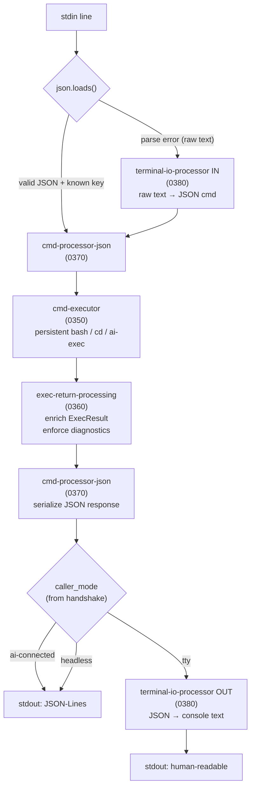

<!-- (c) 2026 Hanaden - Frederick Bloom -- hanaden-ai-daemon-cmdstream.design.md -->
---
title: HANADEN-AI Daemon Command Stream Protocol
class: design
version: 0.1.0
status: active-development
DOB: 2026-08-11T15:58:36.252218434Z
copyright: (c) 2026 Hanaden - Frederick Bloom
absorbs: AGENTS.daemon.ioprotocol.md v0.1.0
changelog: |
  0.1.0  2026-08-13  Refactor: JSON-canonical processing architecture.
                     Add layered command processing (0350-0380).
                     cmd-processor-json is the ONE canonical path.
                     terminal-io-processor is a thin adapter (text↔JSON).
                     Add exec-return-processing with mandatory error diagnostics.
                     Absorb 0300-input-routing into 0370+0380.
                     Absorb 0600-persistent-bash into 0350-cmd-executor.
                     Shrink 0400 to wire-format schema reference.
  0.2.0  2026-08-11  Absorb AGENTS.daemon.ioprotocol.md v0.1.0 into new file.
                     Add handshake protocol (caller mode detection).
                     Add ai-exec request/response dispatch protocol.
                     Add four caller modes (TTY, AI-Connected, Standalone+Sidecar, Headless).
                     Add persistent bash architecture (replaces per-command subprocess).
                     Replace per-turn stat polling with inotify (event-driven catalog).
                     Update phase status format from BOOTSTRAP.md to hanaden-ai-daemon.design.md.
  0.1.0  2026-08-11  (was AGENTS.daemon.ioprotocol.md) Raw passthrough, exec streaming, cd jail.
  0.0.1  2026-08-11  Initial release.
---

# HANADEN-AI Daemon Command Stream Protocol

Standalone reference for interacting with the daemon defined in `hanaden-ai-daemon.design.md`.
Agent-independent: the protocol is identical regardless of which AI engine generated the daemon.

---

## Architecture -- JSON-Canonical Processing

All command processing flows through `cmd-processor-json` as the single canonical
path. The terminal IO processor is a thin adapter that converts raw text to JSON
on input and JSON responses to console text on output. The handshake-established
`caller_mode` determines output format — not the input format.

### Component Files

| File | Responsibility |
|------|---------------|
| `0350-cmd-executor.md` | Execution engine: persistent bash, cd interception, ai-exec dispatch. Produces raw `ExecResult`. |
| `0360-exec-return-processing.md` | Canonical `ExecResult` structure + mandatory error diagnostics. Format-agnostic. |
| `0370-cmd-processor-json.md` | THE single canonical processor. Parses JSON input, dispatches to executor, serializes JSON response. |
| `0380-terminal-io-processor.md` | Thin adapter. Input: raw text/shortcuts → JSON. Output: JSON response → console text. No business logic. |
| `0400-wire-format.md` | Wire format schema reference. Message field types and examples only. No processing logic. |

---
