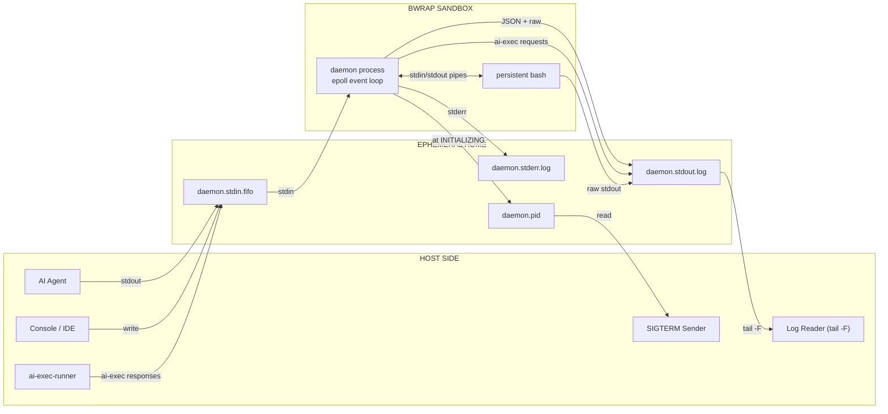

<!-- (c) 2026-* Frederick Bloom -- 0100-channel-layout.md -- Hanaden AI -->
## 1. Channel Layout

All channels live inside the ephemeral home. The home is created before bwrap
launches and is the ONLY writable path inside the sandbox.

```
${TMPDIR:-/tmp}/hanaden-ai-sandbox/<CONV_ID>/hanaden-ai/

  daemon.stdin.fifo          Named pipe (FIFO). Writers send JSON-Lines commands,
                             events, raw shell commands, or handshakes TO the daemon.
                             One FIFO -- all clients share it (console, IDE, agents, sidecar).

  daemon.stdout.log          Append-only log file. Daemon stdout is tee'd here
                             verbatim. Receives JSON ACKs, raw exec stdout,
                             ai-exec requests, and lifecycle status lines.

  daemon.stderr.log          Append-only log file. Daemon stderr tee'd here separately.

  daemon.pid                 Plain text file containing the real OS PID (integer)
                             of the running daemon process. Written at phase=INITIALIZING.

  daemon.stdout.log.{1..4}.gz   Rotated log copies (gzip compressed).
```


### 1b. Channel Architecture -- Mermaid



---
