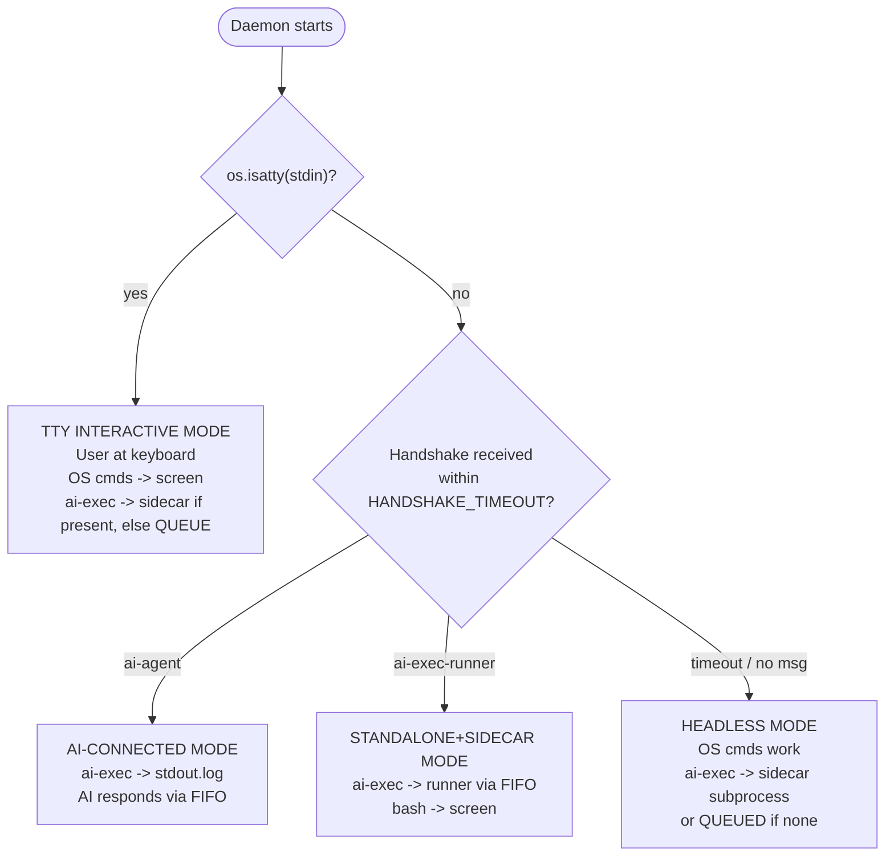
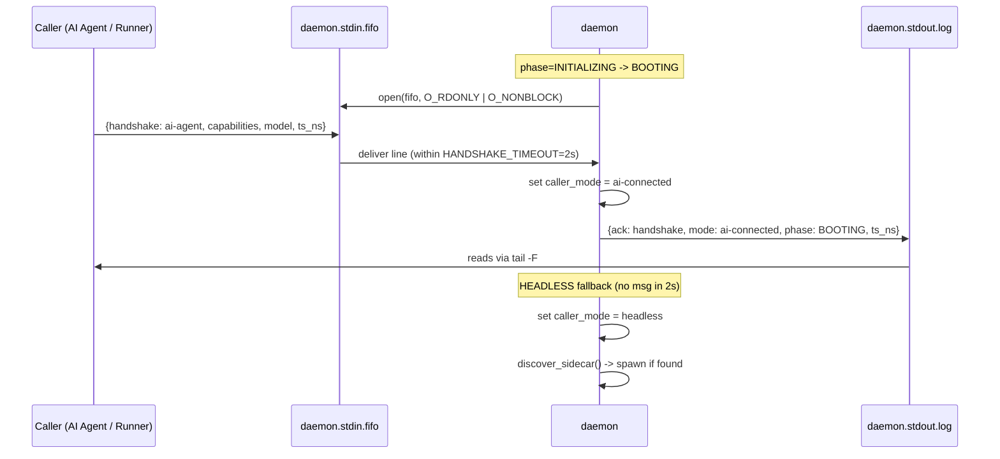

<!-- (c) 2026-* Frederick Bloom -- 0200-caller-mode-detection.md -- Hanaden AI -->

## 2. Caller Mode Detection

The daemon auto-detects its caller mode at startup.



### Handshake Protocol

The FIRST message a caller writes to the FIFO is a handshake:

**AI Agent handshake:**
```json
{"handshake": "ai-agent", "capabilities": ["ai-exec"], "model": "gemini-2.5-pro", "ts_ns": 0}
```

**ai-exec-runner sidecar handshake:**
```json
{"handshake": "ai-exec-runner", "capabilities": ["ai-exec"], "provider": "gemini-cli", "ts_ns": 0}
```

**Daemon ACK:**
```json
{"ack": "handshake", "mode": "ai-connected", "phase": "BOOTING", "ts_ns": 0}
```

#### Handshake Sequence (MSC)



---
