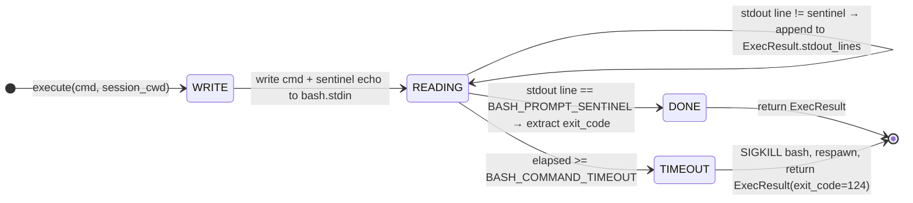

<!-- (c) 2026-* Frederick Bloom -- 0350-cmd-executor.md -- Hanaden AI -->
    
## Command Executor

The command executor is the single execution engine for all commands.
It owns the persistent bash subprocess, handles cd interception (delegating
jail guard to `0700-shell-session-state.md`), and dispatches ai-exec files.

All callers invoke the executor identically. The executor returns an
`ExecResult` (defined in `0360`) which passes through exec-return-processing
(0360) for enrichment before reaching the serializer (0370).

### Pipeline Position

```
                      ┌─────────────────┐
Dispatcher (0370) ──▶ │ Executor (0350) │ ──▶ Enricher (0360) ──▶ Serializer (0370)
                      └─────────────────┘
```

The executor is a **Command** pattern: it executes, captures, and returns.
It does NOT serialize, format, or route.

### Persistent Bash

The daemon owns a single persistent `bash` subprocess. All OS commands
are executed via this bash process.

**Why persistent:**
- Environment variables, aliases, and shell state persist across commands
- No subprocess spawn overhead per command
- Daemon controls stdin/stdout/stderr pipes

### Bash Execution Flow

```
daemon writes to bash stdin:
    cd <session_cwd> && <command>; echo -e "\n__HANADEN_CMD_DONE__ $?"
```



### Stderr Capture (MUST)

The executor MUST read bash stderr concurrently with stdout and populate
`ExecResult.stderr_lines` and `ExecResult.stderr`. Stderr MUST NOT be
discarded or ignored.

```pseudocode
funct execute(cmd, session_cwd) -> ExecResult:
    result = ExecResult(cmd=cmd, ts_start_ns=now())

    // Step 1: cd to session_cwd
    full_cmd = f"cd {session_cwd} && {cmd}; echo -e '\\n__HANADEN_CMD_DONE__ $?'"

    // Step 2: write to bash stdin
    rc = bash.stdin.write(full_cmd)
    if rc.pipe_error:
        result.exit_code = 1
        result.reason = f"bash pipe broken: {rc.error}"
        result.stderr = str(rc.error)
        result.failed_at = "bash_write"
        return result

    // Step 3: read stdout + stderr concurrently until sentinel
    while True:
        line = bash.stdout.readline()
        if line starts with BASH_PROMPT_SENTINEL:
            result.exit_code = extract_exit_code(line)
            break
        if elapsed >= BASH_COMMAND_TIMEOUT:
            bash.kill()
            bash = respawn_bash()
            result.exit_code = 124
            result.reason = f"command timed out after {BASH_COMMAND_TIMEOUT}s"
            result.failed_at = "timeout"
            break
        result.stdout_lines.append(line)

    // Drain stderr (non-blocking)
    result.stderr_lines = bash.stderr.read_available()
    result.stderr = "\n".join(result.stderr_lines)

    result.ts_end_ns = now()
    result.cwd = session_cwd
    return result
```

### cd Interception

When the executor receives a `cd <path>` command, it intercepts it
before bash and delegates to the jail guard in `0700-shell-session-state.md`.
The cd is NOT sent to bash — it mutates `session_cwd` directly.

The executor returns an `ExecResult` with `exit_code=0` on success or
`exit_code=1` with `reason` and `failed_at` on jail-escape or not-a-directory.

### ai-exec Dispatch

When the executor encounters an `AI_SHEBANG` file, it delegates to
the ai-exec dispatch protocol in `0500-aiexec-dispatch-protocol.md`.
The dispatch result is wrapped in an `ExecResult` for uniform processing.

### Bash Lifecycle

**Boot:** Spawned by `spawn_subprocesses()` in onEventBoot().

**Reboot:** Killed (SIGTERM → 2s wait → SIGKILL) and respawned.

**Respawn:** If bash exits unexpectedly during command execution, the
executor MUST respawn a new bash subprocess and return an ExecResult
with `exit_code=1`, `reason="bash exited unexpectedly"`,
`failed_at="bash_respawn"`.

---
