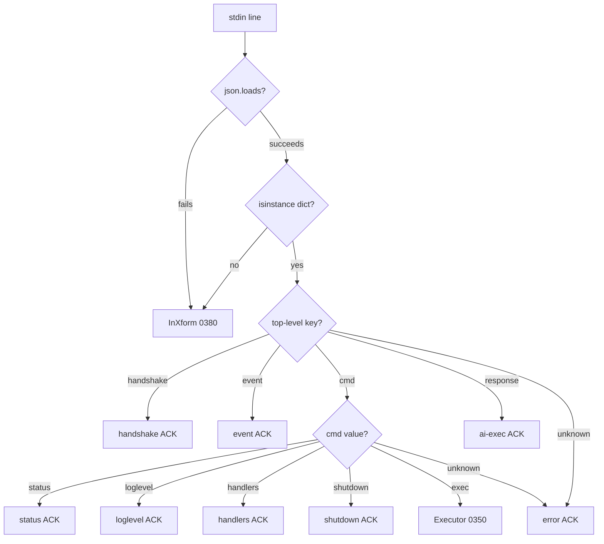

## Command Processor — JSON

The single canonical command processor. ALL commands flow through this
processor regardless of input source. The terminal-io-processor (0380)
converts raw text to JSON before invoking this processor.

### Pipeline Overview — Both Pipes

**Pipe 1 — JSON API** (ai-connected / headless):

```
JSON in → Guard → Dispatcher → Executor(0350) → Enricher(0360) → Serializer → JSON out
                                                                               (no xform)
```

**Pipe 2 — Terminal** (tty):

```
TTY in → InXform(0380) → Guard → Dispatcher → Executor → Enricher → Serializer → OutXform(0380) → TTY out
  ↑        ↑                                                                         ↑
  text   text→dict                                                                dict→text
```

Pipe 2 wraps Pipe 1. The Guard, Dispatcher, Executor, Enricher, and
Serializer are shared. Only the IO endpoints differ.

### Input Processing

Accepts a parsed JSON value and validates it before dispatch.

**JSON Guard (MUST):**
Per [JSON:API §4](https://jsonapi.org/format/#document-top-level), a
JSON:API document MUST be a JSON object at the top level. If `json.loads()`
returns a non-object type (boolean, number, string, null, array), the
input MUST be rerouted to the terminal-io-processor (0380) as raw text.

This prevents `json.loads("false")` (returns native `false`) or
`json.loads("42")` (returns bare scalar `42`) from crashing the key-based
dispatch logic.



### Output Serialization — JSON-Lines

Every response is serialized as a single JSON-Lines object.
Fields are determined by the `ExecResult` contract in `0360`.

**Exec success:**
```json
{"ack": "exec_done", "exit_code": 0, "cwd": "/home/sandbox-user", "ts_ns": 0}
```

**Exec failure (JSON:API error object per 0400):**
```json
{
  "ack": "exec_done",
  "exit_code": 1,
  "cwd": "/home/sandbox-user",
  "error": {
    "code": "CD-FAILED",
    "title": "cd to session_cwd failed",
    "detail": "cd: /homes/.../PROJECT_HOME: No such file or directory",
    "source": {"step": "cd_session_cwd", "command": "echo hello"},
    "meta": {"stderr": "bash: line 1: cd: ..."}
  },
  "ts_ns": 0
}
```

**Streaming (emitted during execution):**
```json
{"ack": "exec_line", "line": "total 16", "ts_ns": 0}
{"ack": "exec_err_line", "line": "Permission denied", "ts_ns": 0}
```

**Control commands, events, handshake, error ACKs:**
Serialized per the wire format schema in `0400-wire-format.md`.

### Dispatch Flow

```pseudocode
funct route_input(line: str) -> JSON:
    // JSON Guard — MUST per JSON:API §4
    try:
        parsed = json.loads(line)
    except JSONDecodeError:
        return terminal_io_processor.handle_raw(line)  // 0380

    if not isinstance(parsed, dict):
        return terminal_io_processor.handle_raw(line)  // 0380

    return process_json(parsed)

funct process_json(msg: dict) -> JSON:
    if "handshake" in msg:
        return handle_handshake(msg)
    if "event" in msg:
        return handle_event(msg)
    if "response" in msg:
        return handle_ai_exec_response(msg)
    if "cmd" not in msg:
        return json_error("unknown JSON keys: " + str(msg.keys()))

    cmd = msg["cmd"]
    if cmd == "exec":
        shell = msg.get("shell", "")
        result = cmd_executor.execute(shell, session_cwd)   // 0350
        result = exec_return_processing.enrich(result)       // 0360
        return serialize_exec_result(result)
    if cmd in ("status", "loglevel", "handlers", "shutdown"):
        return handle_control(msg)
    return json_error("unknown cmd: " + cmd)

funct serialize_exec_result(result: ExecResult) -> JSON:
    obj = {"ack": "exec_done", "exit_code": result.exit_code,
           "cwd": result.cwd, "ts_ns": result.ts_end_ns}
    if result.exit_code != 0:
        obj["error"] = {                         // JSON:API per 0400
            "code":   result.error_code,         // MUST per 0360
            "title":  ERROR_CODE_TITLES[result.error_code],
            "detail": result.reason,             // MUST per 0360
            "source": {"step": result.failed_at, // SHOULD per 0360
                       "command": result.cmd},
            "meta":   {"stderr": result.stderr}  // MUST per 0360
        }
    return json.dumps(obj)
```

### Output Fork — JSON API vs Terminal

The serializer produces ONE JSON dict. What happens next depends on the pipe:

| ACK type | Pipe 1 (JSON API) | Pipe 2 (Terminal OutXform 0380) |
|----------|-------------------|---------------------------------|
| `exec_line` | passthrough | extract `.line` |
| `exec_err_line` | passthrough | `"stderr: " + .line` |
| `exec_done` exit=0 | passthrough | **silent** |
| `exec_done` exit!=0 | passthrough | multi-line error summary |
| `status` | passthrough | `phase=X pid=N uptime=Ns ...` |
| `error` | passthrough | `"ERROR: " + .error.detail` |
| all others | passthrough | **passthrough** (emit as JSON) |

---
