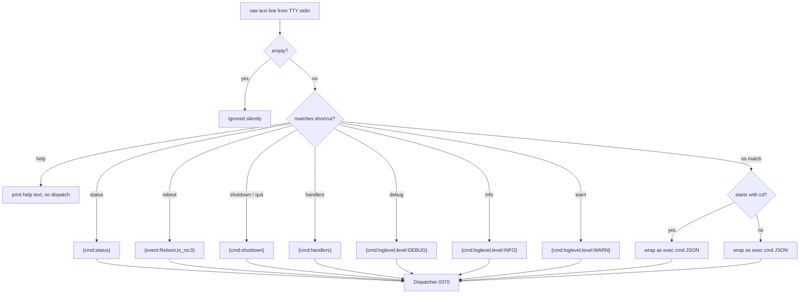

<!-- (c) 2026-* Frederick Bloom -- 0380-terminal-io-processor.md -- Hanaden AI -->

## Terminal IO Processor

Thin adapter with zero business logic. Converts between raw terminal
text and JSON. All actual processing happens in `cmd-processor-json` (0370).

The terminal IO processor is active ONLY when `caller_mode == "tty"`.
In `ai-connected` and `headless` modes, this processor is bypassed entirely.

### Input Side — Raw Text → JSON



### Shortcut Table

```
SHORTCUT           JSON EQUIVALENT
------------------------------------------------------
status             {"cmd":"status"}
reboot             {"event":"Reboot","ts_ns":0}
shutdown           {"cmd":"shutdown"}
quit               {"cmd":"shutdown"}
handlers           {"cmd":"handlers"}
debug              {"cmd":"loglevel","level":"DEBUG"}
info               {"cmd":"loglevel","level":"INFO"}
warn               {"cmd":"loglevel","level":"WARN"}
help               (prints help text, no dispatch)
```

Any other plain text is wrapped as `{"cmd":"exec","shell":"<text>","ts_ns":0,"_origin":"terminal"}`.

### Output Side — JSON Response → Console Text

Takes the JSON response produced by `cmd-processor-json` (0370) and
renders it as human-readable console text.

```pseudocode
funct format_for_terminal(json_response: dict) -> str:
    ack = json_response.get("ack", "")

    // Streaming stdout — pass through raw
    if ack == "exec_line":
        return json_response["line"]

    // Streaming stderr — prefix with stderr:
    if ack == "exec_err_line":
        return "stderr: " + json_response["line"]

    // Exec done
    if ack == "exec_done":
        if json_response["exit_code"] == 0:
            return ""   // success is silent
        err = json_response.get("error", {})
        lines = []
        lines.append(f"ERROR (exit {json_response['exit_code']}): {err.get('detail', 'unknown')}")
        lines.append(f"  code: {err.get('code', 'UNKNOWN')}")
        stderr = err.get("meta", {}).get("stderr", "")
        if stderr:
            lines.append(f"  stderr: {stderr}")
        step = err.get("source", {}).get("step", "")
        if step:
            lines.append(f"  step: {step}")
        return "\n".join(lines)

    // Status ACK — human summary
    if ack == "status":
        return (f"phase={json_response['phase']} pid={json_response['pid']} "
                f"uptime={json_response['uptime_ns']//1_000_000_000}s "
                f"cwd={json_response['session_cwd']} "
                f"mode={json_response['caller_mode']} "
                f"catalog={json_response['catalog_entries']}")

    // Error ACK — extract detail from JSON:API error object
    if ack == "error":
        err = json_response.get("error", {})
        return f"ERROR: {err.get('detail', 'unknown')}"

    // All other ACKs — pass through as JSON (control responses are compact)
    return json.dumps(json_response)
```

### `_origin` Tag

The terminal IO processor adds `"_origin": "terminal"` to all JSON
messages it produces. This tag is used by the output router to determine
whether the response should be rendered as console text or JSON-Lines.

The `_origin` tag is MUST-NOT be included in the final JSON-Lines output
for `ai-connected` or `headless` modes. It is stripped before serialization.

---
