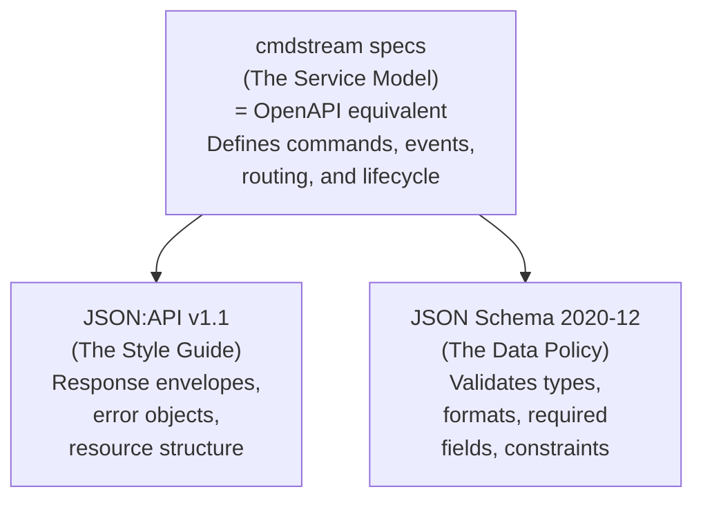

## Wire Format — JSON:API-Aligned Command Protocol

Defines the wire format and schema contracts for all JSON-Lines messages
exchanged with the daemon. Self-contained reference: no external files needed.

### Standards Alignment

This protocol is **not** a REST API but adopts proven API standards so the
daemon can evolve toward RESTful interfaces without redesigning its message
structure. We apply the
"[Triforce of API Design](https://apisyouwonthate.com/newsletter/api-specs-schemas-and-standards/)"
model:



| Layer | Standard | Our Usage |
|-------|----------|-----------|
| Service Model | OpenAPI (conceptual) | `0370-cmd-processor-json.md` + `0380-terminal-io-processor.md` define the "endpoints" (commands, events, handshake) |
| Style Guide | [JSON:API v1.1](https://jsonapi.org/format/) | Response envelope structure: `data`/`errors` separation, error objects with `code`/`title`/`detail`/`source`/`meta` |
| Data Policy | [JSON Schema 2020-12](https://json-schema.org/draft/2020-12/schema) | Formal schema contracts for every message type (embedded below) |

**References:**
- JSON:API v1.1 Specification: https://jsonapi.org/format/
- JSON Schema 2020-12: https://json-schema.org/draft/2020-12/schema
- APIs You Won't Hate — Triforce: https://apisyouwonthate.com/newsletter/api-specs-schemas-and-standards/

---

### Transport

JSON-Lines over stdin/stdout. Each message is a single UTF-8 JSON object
followed by `\n`. No HTTP, no content negotiation, no headers. Future
evolution to HTTP/REST would lift the schemas unchanged into OpenAPI
request/response definitions.

---

### JSON:API Adaptation for IPC

JSON:API requires `data` OR `errors` at the top level. Our daemon adapts
this for streaming IPC:

| JSON:API Concept | Daemon Adaptation |
|---|---|
| `data` (primary resource) | `ack` + payload fields (success responses) |
| `errors` (error array) | `error` (single error object — we never batch errors) |
| `meta` | `ts_ns` on every message; `phase`, `pid`, etc. on status |
| `type` + `id` (resource identity) | `ack` value is the resource type; no `id` needed (IPC, not CRUD) |
| `data` and `errors` MUST NOT coexist | `error` key is ONLY present when the response indicates failure |
| `included` (sideloading) | Not applicable — no relationships in IPC |
| `links` (pagination, self) | Not applicable — no navigation in IPC |

---

### Response Envelope

**Success:**
```json
{
  "ack": "<response_type>",
  "<payload_fields>": "...",
  "ts_ns": 0
}
```

**Failure (JSON:API error object):**
```json
{
  "ack": "<response_type>",
  "error": {
    "code":   "<SCREAMING-KEBAB>",
    "title":  "<stable summary, same across all occurrences>",
    "detail": "<human-readable explanation specific to THIS occurrence>",
    "source": { "step": "<internal step>", "command": "<original cmd>" },
    "meta":   { "stderr": "<verbatim stderr>", "exit_code": 1 }
  },
  "ts_ns": 0
}
```

**JSON:API → Daemon field mapping:**

| JSON:API Error Field | Daemon Wire Field | Description |
|---|---|---|
| `code` | `error.code` | `CD-FAILED`, `TIMEOUT`, `COMMAND-FAILED`, etc. |
| `title` | `error.title` | Stable one-liner (never changes per occurrence) |
| `detail` | `error.detail` | Occurrence-specific explanation |
| `source.pointer` | `error.source.step` | Internal step that failed (adapted from JSON Pointer) |
| `source.parameter` | `error.source.command` | The original command that triggered the error |
| `meta` | `error.meta` | Stderr, exit_code, timeout_s, etc. |

---

## JSON Schema — Message Contracts

All schemas use [JSON Schema 2020-12](https://json-schema.org/draft/2020-12/schema).
These are the **data policy** — they validate types, required fields, and constraints.

### Common Definitions

```json
{
  "$schema": "https://json-schema.org/draft/2020-12/schema",
  "$id": "hanaden://cmdstream/common.schema.json",
  "$defs": {
    "ts_ns": {
      "type": "integer",
      "minimum": 0,
      "description": "Nanosecond-precision Unix timestamp"
    },
    "phase": {
      "type": "string",
      "enum": ["INITIALIZING", "BOOTING", "READY", "RUNNING", "SHUTTING_DOWN"],
      "description": "Daemon lifecycle phase"
    },
    "error_code": {
      "type": "string",
      "pattern": "^[A-Z][A-Z0-9-]+$",
      "description": "SCREAMING-KEBAB error code",
      "enum": [
        "CD-FAILED", "BASH-PIPE-BROKEN", "BASH-EXITED", "TIMEOUT",
        "JAIL-ESCAPE", "NOT-A-DIRECTORY", "COMMAND-FAILED",
        "UNKNOWN-CMD", "UNKNOWN-EVENT", "PARSE-FAILURE", "INTERNAL"
      ]
    },
    "error_object": {
      "type": "object",
      "description": "JSON:API v1.1 §7 Error Object (adapted for IPC)",
      "required": ["code", "title", "detail"],
      "properties": {
        "code":   { "$ref": "#/$defs/error_code" },
        "title":  { "type": "string", "minLength": 1,
                    "description": "Stable summary — same across occurrences" },
        "detail": { "type": "string", "minLength": 1,
                    "description": "Occurrence-specific explanation" },
        "source": {
          "type": "object",
          "properties": {
            "step":    { "type": "string", "description": "Internal step that failed" },
            "command": { "type": "string", "description": "Original command string" },
            "input":   { "type": "string", "description": "Raw input that caused the error" },
            "path":    { "type": "string", "description": "File path (for ai-exec errors)" }
          }
        },
        "meta": {
          "type": "object",
          "properties": {
            "stderr":    { "type": "string", "description": "Verbatim stderr output" },
            "exit_code": { "type": "integer", "description": "Process exit code" },
            "timeout_s": { "type": "integer", "description": "Timeout duration in seconds" }
          }
        }
      }
    }
  }
}
```

---

### Input Schemas (caller → daemon)

**Handshake:**
```json
{
  "$schema": "https://json-schema.org/draft/2020-12/schema",
  "$id": "hanaden://cmdstream/input/handshake.schema.json",
  "type": "object",
  "required": ["handshake", "capabilities"],
  "properties": {
    "handshake":    { "type": "string", "const": "ai-agent" },
    "capabilities": { "type": "array", "items": { "type": "string" },
                      "contains": { "const": "ai-exec" } },
    "model":        { "type": "string" },
    "ts_ns":        { "$ref": "common.schema.json#/$defs/ts_ns" }
  },
  "additionalProperties": false
}
```

**Command — exec:**
```json
{
  "$schema": "https://json-schema.org/draft/2020-12/schema",
  "$id": "hanaden://cmdstream/input/cmd-exec.schema.json",
  "type": "object",
  "required": ["cmd", "shell"],
  "properties": {
    "cmd":   { "type": "string", "const": "exec" },
    "shell": { "type": "string", "minLength": 1 },
    "ts_ns": { "$ref": "common.schema.json#/$defs/ts_ns" }
  },
  "additionalProperties": false
}
```

**Command — control (status, loglevel, handlers, shutdown):**
```json
{
  "$schema": "https://json-schema.org/draft/2020-12/schema",
  "$id": "hanaden://cmdstream/input/cmd-control.schema.json",
  "type": "object",
  "required": ["cmd"],
  "properties": {
    "cmd":   { "type": "string", "enum": ["status", "loglevel", "handlers", "shutdown"] },
    "level": { "type": "string", "enum": ["DEBUG", "INFO", "WARN"] }
  },
  "if":   { "properties": { "cmd": { "const": "loglevel" } } },
  "then": { "required": ["cmd", "level"] },
  "additionalProperties": false
}
```

**Event:**
```json
{
  "$schema": "https://json-schema.org/draft/2020-12/schema",
  "$id": "hanaden://cmdstream/input/event.schema.json",
  "type": "object",
  "required": ["event", "ts_ns"],
  "properties": {
    "event": { "type": "string", "enum": ["UserTurn", "AiTurn", "Reboot"] },
    "ts_ns": { "$ref": "common.schema.json#/$defs/ts_ns" }
  },
  "additionalProperties": false
}
```

**ai-exec response:**
```json
{
  "$schema": "https://json-schema.org/draft/2020-12/schema",
  "$id": "hanaden://cmdstream/input/aiexec-response.schema.json",
  "type": "object",
  "required": ["response", "id", "status"],
  "properties": {
    "response": { "type": "string", "const": "ai-exec" },
    "id":       { "type": "string", "minLength": 1 },
    "status":   { "type": "string", "enum": ["ok", "error"] },
    "result":   { "type": "object" },
    "error":    { "$ref": "common.schema.json#/$defs/error_object" },
    "ts_ns":    { "$ref": "common.schema.json#/$defs/ts_ns" }
  },
  "additionalProperties": false
}
```

---

### Output Schemas (daemon → caller)

**exec_done — success:**
```json
{
  "$schema": "https://json-schema.org/draft/2020-12/schema",
  "$id": "hanaden://cmdstream/output/exec-done-success.schema.json",
  "type": "object",
  "required": ["ack", "exit_code", "cwd", "ts_ns"],
  "properties": {
    "ack":       { "type": "string", "const": "exec_done" },
    "exit_code": { "type": "integer", "const": 0 },
    "cwd":       { "type": "string" },
    "ts_ns":     { "$ref": "common.schema.json#/$defs/ts_ns" }
  },
  "not": { "required": ["error"] },
  "additionalProperties": false
}
```

**exec_done — failure (MUST include error object):**
```json
{
  "$schema": "https://json-schema.org/draft/2020-12/schema",
  "$id": "hanaden://cmdstream/output/exec-done-failure.schema.json",
  "type": "object",
  "required": ["ack", "exit_code", "cwd", "error", "ts_ns"],
  "properties": {
    "ack":       { "type": "string", "const": "exec_done" },
    "exit_code": { "type": "integer", "minimum": 1 },
    "cwd":       { "type": "string" },
    "error":     { "$ref": "common.schema.json#/$defs/error_object" },
    "ts_ns":     { "$ref": "common.schema.json#/$defs/ts_ns" }
  },
  "additionalProperties": false
}
```

**exec_line / exec_err_line (streaming):**
```json
{
  "$schema": "https://json-schema.org/draft/2020-12/schema",
  "$id": "hanaden://cmdstream/output/exec-streaming.schema.json",
  "type": "object",
  "required": ["ack", "line", "ts_ns"],
  "properties": {
    "ack":   { "type": "string", "enum": ["exec_line", "exec_err_line"] },
    "line":  { "type": "string" },
    "ts_ns": { "$ref": "common.schema.json#/$defs/ts_ns" }
  },
  "additionalProperties": false
}
```

**Status ACK:**
```json
{
  "$schema": "https://json-schema.org/draft/2020-12/schema",
  "$id": "hanaden://cmdstream/output/status-ack.schema.json",
  "type": "object",
  "required": ["ack", "phase", "pid", "uptime_ns", "session_cwd", "caller_mode", "catalog_entries", "ts_ns"],
  "properties": {
    "ack":             { "type": "string", "const": "status" },
    "phase":           { "$ref": "common.schema.json#/$defs/phase" },
    "pid":             { "type": "integer", "minimum": 1 },
    "uptime_ns":       { "type": "integer", "minimum": 0 },
    "session_cwd":     { "type": "string" },
    "caller_mode":     { "type": "string", "enum": ["tty", "ai-connected", "standalone-sidecar", "headless"] },
    "catalog_entries": { "type": "integer", "minimum": 0 },
    "ts_ns":           { "$ref": "common.schema.json#/$defs/ts_ns" }
  },
  "additionalProperties": false
}
```

**Error ACK (protocol errors):**
```json
{
  "$schema": "https://json-schema.org/draft/2020-12/schema",
  "$id": "hanaden://cmdstream/output/error-ack.schema.json",
  "type": "object",
  "required": ["ack", "error", "ts_ns"],
  "properties": {
    "ack":   { "type": "string", "const": "error" },
    "error": { "$ref": "common.schema.json#/$defs/error_object" },
    "ts_ns": { "$ref": "common.schema.json#/$defs/ts_ns" }
  },
  "additionalProperties": false
}
```

**Event ACK:**
```json
{
  "$schema": "https://json-schema.org/draft/2020-12/schema",
  "$id": "hanaden://cmdstream/output/event-ack.schema.json",
  "type": "object",
  "required": ["ack", "phase", "ts_ns"],
  "properties": {
    "ack":   { "type": "string" },
    "phase": { "$ref": "common.schema.json#/$defs/phase" },
    "reboot_triggered": { "type": "boolean" },
    "ts_ns": { "$ref": "common.schema.json#/$defs/ts_ns" }
  },
  "additionalProperties": false
}
```

---

### Wire Examples

**Success flow — exec:**
```json
← {"ack":"exec_line","line":"total 16","ts_ns":1786644458198835330}
← {"ack":"exec_line","line":"-rw-r--r-- 1 user user 4096 Aug 13 design.md","ts_ns":1786644458198835331}
← {"ack":"exec_done","exit_code":0,"cwd":"/home/sandbox-user","ts_ns":1786644458199029000}
```

**Failure flow — exec with error object:**
```json
← {"ack":"exec_done","exit_code":1,"cwd":"/home/sandbox-user","error":{"code":"CD-FAILED","title":"cd to session_cwd failed","detail":"cd: /homes/.../PROJECT_HOME: No such file or directory","source":{"step":"cd_session_cwd","command":"echo hello"},"meta":{"stderr":"bash: line 1: cd: /homes/.../PROJECT_HOME: No such file or directory"}},"ts_ns":1786644458199029000}
```

**Protocol error:**
```json
← {"ack":"error","error":{"code":"UNKNOWN-EVENT","title":"unrecognized event name","detail":"unknown event: Foo","source":{"input":"{\"event\":\"Foo\",\"ts_ns\":0}"},"meta":{}},"ts_ns":1786644458199029000}
```

---

### Standard Error Codes

| Code | Title | error.source.step |
|------|-------|-------------------|
| `CD-FAILED` | cd to session_cwd failed | `cd_session_cwd` |
| `BASH-PIPE-BROKEN` | bash stdin pipe broken | `bash_write` |
| `BASH-EXITED` | bash exited unexpectedly | `bash_respawn` |
| `TIMEOUT` | command execution timed out | `timeout` |
| `JAIL-ESCAPE` | path resolves outside sandbox root | `jail_escape` |
| `NOT-A-DIRECTORY` | cd target is not a directory | `not_a_directory` |
| `COMMAND-FAILED` | command returned non-zero exit code | `command` |
| `UNKNOWN-CMD` | unrecognized command | `dispatch` |
| `UNKNOWN-EVENT` | unrecognized event name | `dispatch` |
| `PARSE-FAILURE` | ai-exec file parse failed | `ai_exec` |
| `INTERNAL` | internal daemon error | `internal` |

---

### Schema Validation Rules

Per the triforce model:

1. **JSON:API (style guide):** `error` key MUST NOT appear on success responses.
   `error` key MUST appear on all failure responses. `data` and `errors`
   MUST NOT coexist (JSON:API §7).

2. **JSON Schema (data policy):** Every message MUST validate against its
   corresponding schema above. Unknown fields are rejected
   (`additionalProperties: false`). Required fields missing = validation failure.

3. **Service model:** Processing logic lives in `0370-cmd-processor-json.md`
   and `0380-terminal-io-processor.md`. This file defines ONLY the data shapes.

---
