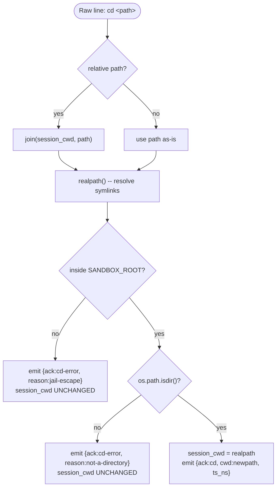

## 7. Shell Session State

### 7a. session_cwd

```
Initial value:  daemon's CWD at startup (/home/hanaden-ai inside bwrap)
Mutated by:     cd <path> (raw passthrough, intercepted -- no subprocess)
Read by:        every exec invocation (cwd= argument to bash)
                status command (included in ACK)
                exec_done response (cwd field)
NOT mutated by: {"cmd":"exec","shell":"cd /foo"} (subprocess cd has no effect)
```

### 7b. cd Interception (Jail Guard)



### 7c. Reboot Behavior

On Reboot, session_cwd resets to daemon's initial CWD.

---
