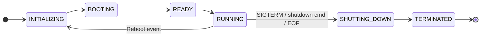

<!-- (c) 2026-* Frederick Bloom -- 0600-lifecycle-sidecar.md -- Hanaden AI -->

## Daemon Lifecycle Phases

```
PHASE_STATUS_FORMAT         = HANADEN/boot/hanaden-ai-daemon.design.md  phase=<PHASE>  daemon=<STATE>
```




## Sidecar Configuration

```
# uv manages llm as a tool -- universal AI adapter
UV_SEARCH_PATHS             = (resolved by AI agent on host: mise which uv)

# P1: Explicit override (skips all probing below)
SIDECAR_BINARY              = (unset)          # path to binary override; if set, used directly
SIDECAR_MODEL               = (unset)          # model string for P1 binary
SIDECAR_API_KEY_ENV         = (unset)          # env var holding API key for P1 binary

# P2: llm via uv -- probe order (api_key_env, llm_plugin, llm_model_name)
# llm_plugin = None means provider is built-in to llm (no install step needed)
# First matching entry with api_key_env present in host env wins.
SIDECAR_PROBE_ORDER = [
    (GEMINI_API_KEY,    llm-gemini,  gemini-2.5-pro),   # Google Gemini
    (ANTHROPIC_API_KEY, llm-claude,  claude-opus-4),    # Anthropic Claude
    (OPENAI_API_KEY,    None,        gpt-4o),           # OpenAI (built-in to llm)
]

# P3: Direct binary fallback (if uv or llm unavailable)
SIDECAR_DIRECT_BINARIES = {
    GEMINI_API_KEY:    [gemini-cli, gemini],
    ANTHROPIC_API_KEY: [claude, claude-cli],
    OPENAI_API_KEY:    [openai, openai-cli],
}

# P4: Ollama (local, no API key)
SIDECAR_OLLAMA_MODEL        = llama3.1
```
