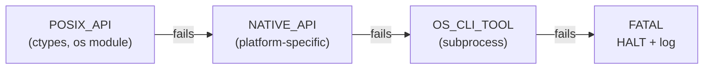

## Event Timers

```
EVENT_TIMER_FORMAT          = yyyyMMdd:HH:mm:ss.SSSSSSSSS
EVENT_TIMER_DURATION_FORMAT = HH:mm:ss.SSSSSSSSS
```

## System Execution Fallback Hierarchy

```
EXEC_FALLBACK_CHAIN         = POSIX_API < NATIVE_API < OS_CLI_TOOL < FATAL
```



