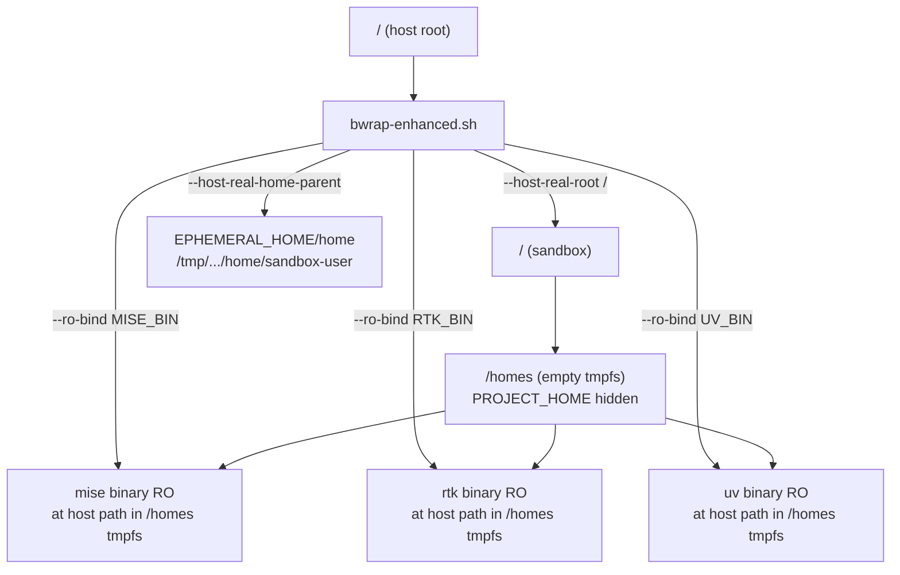

<!-- #!/usr/bin/env ai-exec flow_type=PSEUDOCODE -->
---
title: HANADEN-AI Daemon Design
Mandate: "For all AI tools: every AI-conversation, AI-session, AI-Processor, AI-Agent start, restart, or reboot MUST follow the boot sequence steps sequentially and completely - skipping steps is not allowed."
priority: 0
class: design
version: 0.0.1
status: active-development
DOB: 2026-08-11T15:58:36.252218434Z
copyright: (c) 2026 Hanaden - Frederick Bloom
absorbs: |
  BOOTSTRAP.md v0.0.1-alpha (governance, pseudocode, event model, test cases)
  AGENTS.daemon.ioprotocol.md v0.1.0 (I/O protocol -- absorbed into hanaden-ai-daemon-cmdstream.design.md)
companion-files: |
  hanaden-ai-daemon.config.md    -- all tunable parameters
  hanaden-ai-daemon-cmdstream.design.md -- command-response stream protocol
---

> [!IMPORTANT]
> **AGENT MANDATORY (MUST OBEY) -- UNIVERSAL BOOT SEQUENCE FOR ALL AI AGENTS**
> * **File purpose**: The kernel daemon design -- architecture, event model, and executable pseudocode.
> * **This file IS the kernel.** The daemon IS the primordial process. A kernel is just a ring-0 daemon.
> * **MUST**: Obey RFC 2119 MUST, MUST-NOT statements. Analyze and fully process on every session start, restart, or reboot.
> * **Single entry point**: AI agent configs MUST reference ONLY this file. This file self-loads its companions in strict sequential order (see Step 1).
> * **Read-only**: `bwrap-enhanced.sh` is a host-provided utility. MUST-NOT modify, delete, or chmod. Consumed as-is.

---

# 1. Identity

The daemon is a persistent process inside a vuniverse (see `config/0045-lang-profile.md`). It:
- Monitors the filesystem via inotify (kernel-delivered events, zero polling)
- Dispatches events through a registry (Before -> On -> After triplets)
- Runs OS commands via a persistent bash subprocess (always present)
- Dispatches ai-exec files via: connected AI agent (AI-CONNECTED mode) or persistent
  ai-exec-runner subprocess (HEADLESS mode only -- spawned by sidecar discovery)
- Self-monitors CORE_FILES via inotify; self-regens daemon source via process replacement on change

---

# 2. Definitions

## RFC 2119 Keywords
* MUST (100% required). MUST-NOT (100% forbidden).
* SHOULD (~80% required). SHOULD-NOT (~80% forbidden).
* MAY (optional). MUST/MUST-NOT > SHOULD/SHOULD-NOT > MAY.

## FATAL = HALT = ABEND
When: rule-violation | assertion-failure | logic-ambiguity | missing-required-file | LOGGER.fatal

Action: snapshot call stack + in-scope vars, then emit:
```
[<ts>] [FATAL] [<code>] <msg> | cause: <cause> | at: <FRAME_0> <- <FRAME_1> <- ... <- <FRAME_N> | vars: <k=v> ...
```
* `<ts>` -- ISO 8601 nanosecond UTC: `YYYY-MM-DDThh:mm:ss.nnnnnnnnnZ`
* `<code>` -- SCREAMING-KEBAB token (e.g. `FATAL-NO-DESIGN-FILE`)
* AI MUST-NOT continue, retry, skip, or substitute after ABEND.

## HANADEN.Hybrid.UUIDv7 Identifier
Format: `YYYYMMDD-HHMMSS-uuuuuu-7xxx-Nxxx-xxxxxxxxxxxx-<slug>.<class>[-<semver>].<ext>`

See archived BOOTSTRAP.md for full specification (bidirectional conversion rules, segment descriptions).

## EPHEMERAL_HOME

The daemon's ephemeral runtime directory. MUST be in system tmp. MUST-NOT be inside `PROJECT_HOME`.

EPHEMERAL_HOME provides the **sandbox-user home directory** — writable, disposable.
The bwrap `--host-real-root` is `/` (host root). bwrap overlays its own `/etc`, `/usr`,
`/proc`, `/dev`, `/tmp` on top of the host root. `/homes` is unconditionally hidden by
a tmpfs inside the sandbox — PROJECT_HOME is never visible, preventing pollution.

```
Formula:  ${TMPDIR:-/tmp}/hanaden-ai/<AI_CONV_ID>/pid-<PID>

Parts:
  hanaden-ai   literal prefix (always)
  AI_CONV_ID   env var set by IDE/launcher (Gemini conversation UUID or similar)
  PID          getpid()  (stable across execve self-regen, unique per daemon)

Example: /tmp/hanaden-ai/cc61ee22-941d-4c6e-8a32-0db5536093cd/pid-12345

Pre-seed (MUST run before bwrap-enhanced.sh):
  mkdir -p EPHEMERAL_HOME/home/sandbox-user     # sandbox-user writable home dir

bwrap invocation:
  bwrap-enhanced.sh --clear-env \
    --host-real-root        /                           \
    --host-real-home-parent EPHEMERAL_HOME/home          \
    --ro-bind MISE_BIN  MISE_BIN                         \
    --dir     MISE_BIN_DIR                               \
    --ro-bind RTK_BIN   RTK_BIN                          \
    --dir     RTK_BIN_DIR                                \
    --ro-bind UV_BIN    UV_BIN                            \
    --dir     UV_BIN_DIR                                  \
    -- <entry_cmd per lang profile>
#
# NOTE: The daemon source is AI-generated from the design spec at boot time.
#   It is written to EPHEMERAL_HOME/home/sandbox-user/<filename per lang profile> on the HOST
#   and invoked as /home/sandbox-user/<filename> INSIDE the vuniverse.
#   MUST-NOT reference /tmp/... paths inside the vuniverse -- see /tmp constraint below.
#   MUST-NOT be committed to PROJECT_HOME/boot/.
#   The AI agent generates it, validates syntax (per lang profile syntax_check_cmd), then launches the backend.
#
# /tmp CONSTRAINT (MUST) -- applies to bwrap-enhanced and bwrap backends:
#   bwrap-enhanced.sh mounts --tmpfs /tmp unconditionally.
#   This replaces the host /tmp with a fresh, empty tmpfs inside the vuniverse.
#   CONSEQUENCE: Any file placed at a host path under /tmp (including
#   EPHEMERAL_HOME itself, which lives under /tmp/hanaden-ai/...) is
#   INVISIBLE inside the vuniverse.
#   MUST-NOT reference EPHEMERAL_HOME paths as vuniverse command arguments.
#   The daemon source MUST be placed at EPHEMERAL_HOME/home/sandbox-user/<filename>
#   (host path) so it is accessible as /home/sandbox-user/<filename> inside the vuniverse.
#   The sandbox-user writable home is the ONLY safe location for the daemon source.
```

### Why `--host-real-root /` (not EPHEMERAL_HOME)

bwrap-enhanced.sh unconditionally mounts a tmpfs on `/homes` (line 314), hides
`/etc/profile` and `/etc/profile.d` (lines 315-316), and injects a fake
`/etc/passwd` and `/etc/group` (lines 307-308). These operations require the
host root as the base filesystem — they fail or produce broken results when
EPHEMERAL_HOME is used as root.

### Why `--ro-bind` at host paths (not shims)

Mise shims (e.g. `~/.local/share/mise/shims/rtk`) are symlinks pointing to
`/homes/.../mise`. Since `/homes` is a tmpfs inside the sandbox, symlinks break.
Instead, each tool binary is bound read-only at its **original absolute host path**
inside the `/homes` tmpfs via `--dir` (create parent) + `--ro-bind` (mount file).

**Tool binary vuniverse verification (MUST):**
After the backend launches, the daemon MUST verify each tool binary is accessible at
its absolute host path inside the vuniverse using `access(path, X_OK)` (POSIX).
A binary that is mounted via `--ro-bind` but returns False for `access` is
a misconfiguration — the daemon MUST log WARN and continue (best-effort, per
Step 2 in the boot sequence), but the test suite MUST verify accessibility.

### Sandbox Interior Layout

```
/home/sandbox-user/         → writable (EPHEMERAL_HOME/home/sandbox-user)
/homes/                     → empty tmpfs (PROJECT_HOME hidden)
/homes/.../mise             → RO bind of mise binary at host path
/homes/.../rtk/latest/rtk   → RO bind of rtk binary at host path
/homes/.../uv/latest/bin/uv → RO bind of uv binary at host path
PATH                        → MISE_BIN_DIR:RTK_BIN_DIR:UV_BIN_DIR:/usr/bin:/bin
```



Created by daemon at initial boot. Purged and recreated (same path) on Reboot (P4b).
`execve()` (self-regen) does NOT touch EPHEMERAL_HOME -- same dir survives.

---

