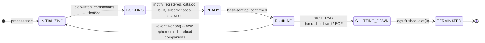
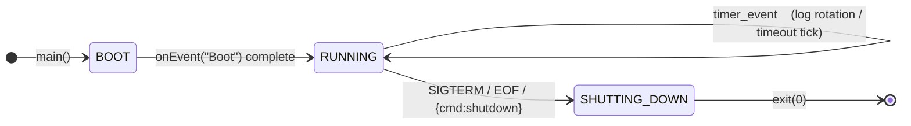
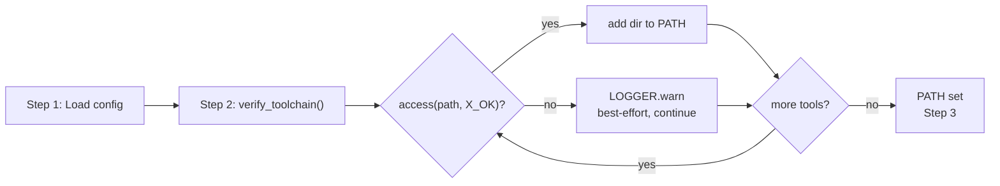
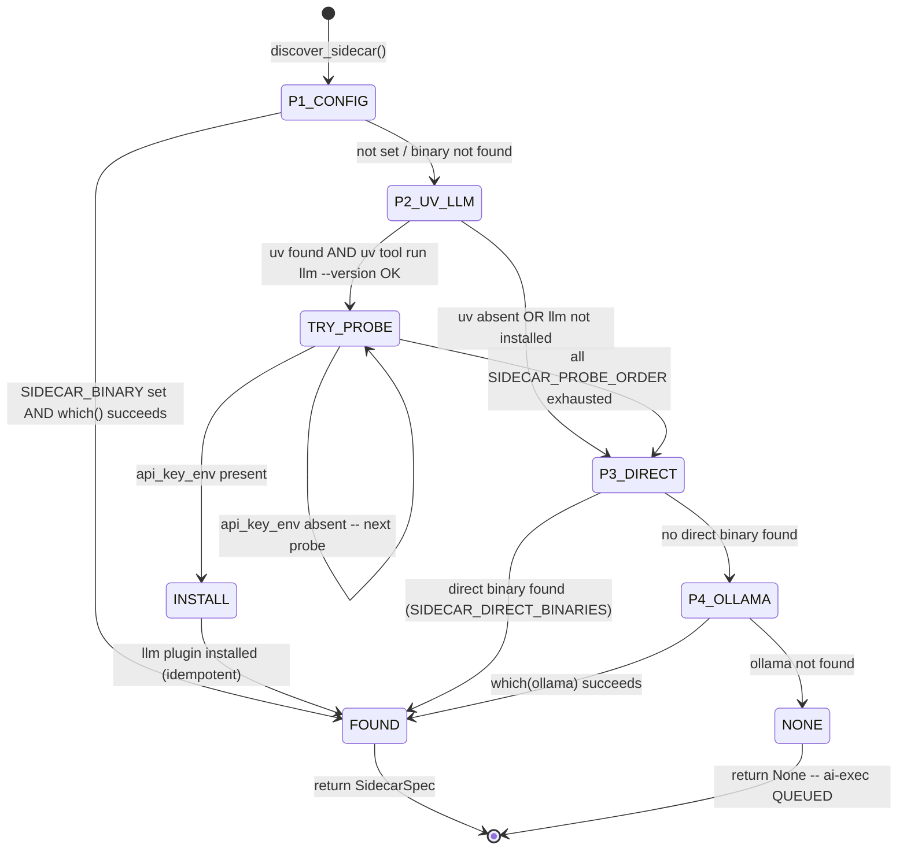
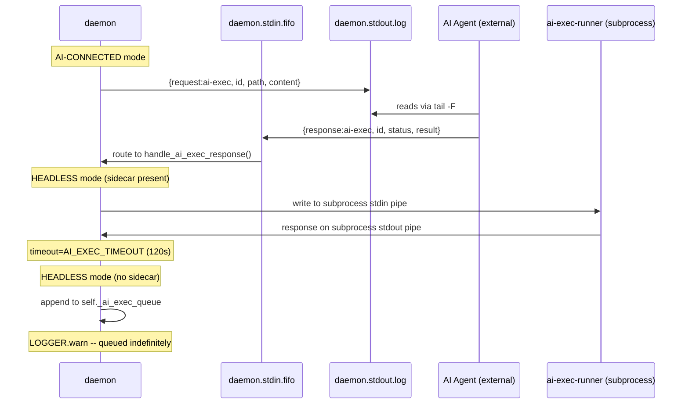

# 3. Boot Sequence

## Phase Lifecycle (MUST follow in order)



## Boot Entry Point

```pseudocode
funct main()
    cd to /
    println "*** CWD " + CWD
    onEvent("Boot")
    MUST loop: event loop (epoll-driven, zero-poll)
        process inotify events via loop.add_reader(inotify_fd, handler)
        process stdin events via loop.connect_read_pipe(stdin)
        dispatch to onEvent[X]* triplet handlers in order as event type [X]
```



## Step 0 -- MANDATORY EVENT GATE

> [!CAUTION]
> * MUST auto-discover Events-X from functs matching onEvent[X][NONE|Before|After]() defined in pseudocode.
> * MUST fire Event[X] triplet serially (never async): onEvent[X]Before() -> onEvent[X]() -> onEvent[X]After().
> * Non-existent triplet members are NOOP, silently skipped.
> * MUST-NOT call triplet members `onEvent[X]Before()` / `onEvent[X]()` / `onEvent[X]After()` directly -- MUST call dispatcher `onEvent("X")` which invokes the triplet in order.

## Step 1 -- Self-Load Companions (strict sequential, no forward refs)

```pseudocode
// phase=INITIALIZING
// Write daemon.pid to EPHEMERAL_HOME/daemon.pid
//
// STRICT LOAD ORDER (no forward references allowed):
//   1. Load /boot/hanaden-ai-daemon.config.md   <- defines ALL parameters used below
//   2. Load /boot/hanaden-ai-daemon-cmdstream.design.md  <- uses config params + design concepts
//   3. Execute THIS file's pseudocode (all params and protocol now defined)
//
// Apply config parameters into runtime constants.
```

## Step 2 -- Verify Toolchain (best-effort, MUST-NOT fail boot)

Tool binaries are pre-mounted into the sandbox via `--ro-bind` passthrough args
(see EPHEMERAL_HOME section). The daemon does NOT run `mise activate` or discover
tools at runtime — they are already at known, fixed paths.

```pseudocode
// phase=INITIALIZING (after Step 1)
// Tool binaries are pre-bound at their host paths inside the sandbox.
// MISE_BIN, RTK_BIN, UV_BIN are read from config.md TOOLCHAIN_BINARIES.
// The AI agent (caller) resolves these paths on the HOST before launching bwrap.
//
// Inside the sandbox, the daemon verifies accessibility and extends PATH:

funct verify_toolchain():
    tool_dirs = set()
    for name, path in TOOLCHAIN_BINARIES:
        if access(path, X_OK):
            LOGGER.info("toolchain: " + name + " = " + path)
            tool_dirs.add(dirname(path))
        else:
            LOGGER.warn("toolchain: " + name + " NOT accessible at " + path + " (best-effort, continuing)")
    // Prepend tool dirs to PATH (backend sets PATH=/usr/bin:/bin by default)
    environ["PATH"] = ":".join(tool_dirs) + ":" + environ.get("PATH", "/usr/bin:/bin")
    LOGGER.info("PATH=" + environ["PATH"])
```



## Step 3 -- Register inotify Watches + Build Catalog

```pseudocode
// phase=BOOTING
// ONE walk of the filesystem tree
// Register inotify watch on every directory
// Classify every file: OS_SHEBANG, AI_SHEBANG, NONE
// Build initial catalog (flat dict: path -> CatalogEntry)
// See section 5 for inotify architecture
```

## Step 3a -- Persistent Subprocess Registry

The daemon owns a registry of persistent subprocesses. All lifecycle operations
(boot spawn, reboot teardown, self-regen via execve) operate on this registry
uniformly. No special-casing per subprocess type.

```pseudocode
# Registry: always present after spawn_subprocesses()
self._subprocesses: dict[str, PersistentSubprocess] = {}

# "bash" -- always present
# "ai-exec" -- present ONLY in HEADLESS mode (spawned by discover_sidecar())
#              ABSENT in AI-CONNECTED and STANDALONE+SIDECAR modes
#              (in those modes the external AI/runner handles ai-exec via FIFO/log)
```

```pseudocode
funct spawn_subprocesses():
    // Always: spawn persistent bash
    self._subprocesses["bash"] = Popen(
        ["bash", "--norc", "--noprofile"],
        stdin=PIPE, stdout=PIPE, stderr=PIPE
    )
    LOGGER.info("spawned subprocess: bash")

    // Conditional: spawn ai-exec runner only in HEADLESS mode
    if self._caller_mode == "headless":
        spec = discover_sidecar()        // runtime probe, see below
        if spec is not None:
            self._subprocesses["ai-exec"] = Popen(
                [spec.binary] + spec.args,
                stdin=PIPE, stdout=PIPE,
                env={spec.api_key_env: os.environ.get(spec.api_key_env, "")}
            )
            LOGGER.info("spawned subprocess: ai-exec (" + spec.binary + ")")
        else:
            LOGGER.warn("HEADLESS: no sidecar found -- ai-exec files QUEUED")

funct discover_sidecar() -> SidecarSpec or None:
    // P1: Explicit config override (highest priority)
    if SIDECAR_BINARY is set:
        path = which(SIDECAR_BINARY)
        if path: return SidecarSpec(binary=path, args=[], model=SIDECAR_MODEL, api_key_env=SIDECAR_API_KEY_ENV)
        LOGGER.warn("SIDECAR_BINARY not found in PATH -- falling through to probe")

    // P2: llm via uv -- universal AI adapter (preferred)
    // SIDECAR_PROBE_ORDER is declared in config.md (never hardcoded here)
    uv = first_found(UV_SEARCH_PATHS)
    if uv:
        rc = subprocess([uv, "tool", "run", "llm", "--version"], timeout=5).returncode
        if rc == 0:
            for (api_key_env, llm_plugin, model) in SIDECAR_PROBE_ORDER:
                if os.environ.get(api_key_env):
                    if llm_plugin is not None:  // install plugin idempotently
                        subprocess([uv, "tool", "run", "llm", "install", llm_plugin], timeout=30)
                    return SidecarSpec(
                        binary=uv,
                        args=["tool", "run", "llm", "-m", model],
                        model=model,
                        api_key_env=api_key_env
                    )
        else:
            LOGGER.warn("uv found but llm not installed -- run: uv tool install llm")

    // P3: Direct binary fallback (no uv/llm available)
    for (api_key_env, _, model) in SIDECAR_PROBE_ORDER:
        if os.environ.get(api_key_env):
            for binary in SIDECAR_DIRECT_BINARIES.get(api_key_env, []):
                path = which(binary)
                if path: return SidecarSpec(binary=path, args=[], model=model, api_key_env=api_key_env)

    // P4: Ollama -- local, no API key needed
    path = which("ollama")
    if path:
        return SidecarSpec(
            binary=path,
            args=["run", SIDECAR_OLLAMA_MODEL],
            model=SIDECAR_OLLAMA_MODEL,
            api_key_env=None,
            extra_env={"OLLAMA_HOST": os.environ.get("OLLAMA_HOST", "http://localhost:11434")}
        )

    return None  // no sidecar available
```



## Step 4 -- Dispatch Files

```pseudocode
// For each file in catalog (boot order):
//   OS_SHEBANG + has_x -> run via persistent bash
//   AI_SHEBANG -> dispatch_ai_exec(path)
//   IMPLICIT_AI (README.md, CONSTITUTION.md) -> dispatch_ai_exec(path)
//   NONE -> stat only, no execution

funct dispatch_ai_exec(path):
    content = read_file(path)
    if self._caller_mode == "ai-connected":
        // Write request to stdout.log; external AI reads it, responds via FIFO
        emit {"request":"ai-exec","id":uuid4(),"path":path,"content":content,...}
    elif "ai-exec" in self._subprocesses:
        // HEADLESS: pipe directly to persistent sidecar subprocess
        write_to_pipe(self._subprocesses["ai-exec"].stdin,
                      {"request":"ai-exec","id":uuid4(),"path":path,"content":content,...})
        response = read_from_pipe(self._subprocesses["ai-exec"].stdout, timeout=AI_EXEC_TIMEOUT)
        handle_ai_exec_response(response)
    else:
        // HEADLESS, no sidecar: queue
        self._ai_exec_queue.append(path)
        LOGGER.warn("ai-exec QUEUED (no sidecar): " + path)
```

#### ai-exec Dispatch Routes (MSC)



## Step 5 -- Spawn Subprocesses + Transition to RUNNING

```pseudocode
// Calls spawn_subprocesses() (see Step 3a)
// Sets up bash sentinel: PROMPT_COMMAND for command completion detection
// phase=READY -> phase=RUNNING
```

---

