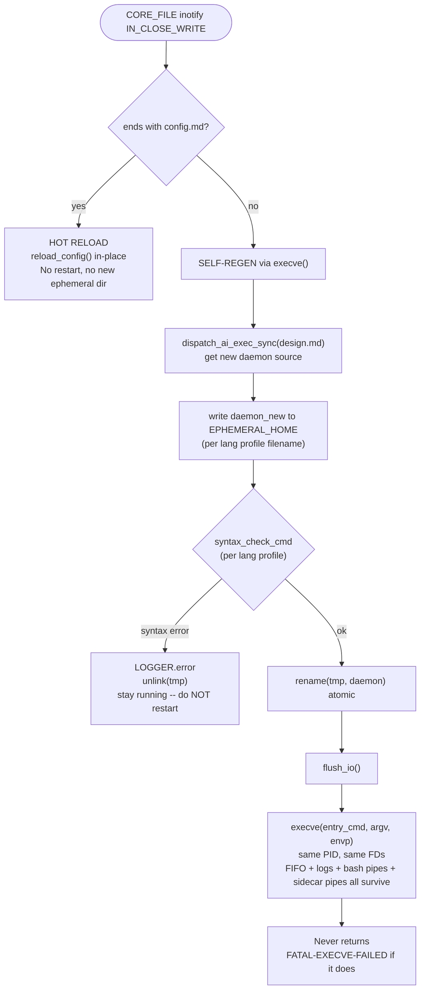

<!-- (c) 2026-* Frederick Bloom -- 0300-inotify-architecture.md -- Hanaden AI -->
# 5. inotify Architecture

## No Polling. Ever.

The old model (buildDirTreeStats + calcDirStatsDiff + shadow stat caches) is DELETED.
The daemon uses Linux inotify for real-time, kernel-delivered file change notifications.

## Boot: Initial Watch Registration

```pseudocode
funct register_watches(root_path):
    // Walk root_path recursively. For each directory:
    //   inotify_add_watch() if not already watched
    // For each file: stat, classify, add to catalog
    // Idempotent: if wd already exists for a path, skip.
    WATCH_MASK = IN_CREATE | IN_DELETE | IN_MODIFY | IN_CLOSE_WRITE |
                 IN_MOVED_FROM | IN_MOVED_TO | IN_ATTRIB |
                 IN_DELETE_SELF | IN_MOVE_SELF
    for dirpath, dirnames, filenames in os.walk(root_path):
        if dirpath not in self._path_to_wd:
            wd = inotify_add_watch(self._inotify_fd, dirpath, WATCH_MASK)
            self._wd_to_path[wd] = dirpath
            self._path_to_wd[dirpath] = wd
        for fname in filenames:
            fpath = os.path.join(dirpath, fname)
            if fpath not in self._catalog:
                self._catalog[fpath] = self.classify_file(fpath)
```

Called from:
1. `onEventBoot()` with root_path="/" -- initial full tree
2. `handle_inotify_event()` on IN_CREATE+IN_ISDIR -- new subdir
3. `handle_inotify_event()` on IN_MOVED_TO+IN_ISDIR -- dir moved in

## Runtime: inotify Event Handling

```pseudocode
funct handle_inotify_event(wd, mask, cookie, name):
    dirpath = self._wd_to_path[wd]
    fullpath = os.path.join(dirpath, name) if name else dirpath

    if mask & IN_CREATE and mask & IN_ISDIR:
        register_watches(fullpath)

    elif mask & IN_CREATE:
        entry = classify_file(fullpath)
        self._catalog[fullpath] = entry
        if entry.exec_type == "AI_SHEBANG":
            await dispatch_ai_exec(fullpath)
        elif entry.exec_type == "OS_SHEBANG" and entry.permissions & 0o111:
            await run_os_exec(fullpath)
        await fire_event("FileCreated", {"path": fullpath})

    elif mask & IN_MODIFY or mask & IN_CLOSE_WRITE:
        if fullpath in self._catalog:
            self._catalog[fullpath] = classify_file(fullpath)
            if fullpath in CORE_FILES:
                handle_core_file_change(fullpath)
            await fire_event("FileModified", {"path": fullpath})

    elif mask & IN_DELETE:
        if fullpath in self._catalog:
            entry = self._catalog.pop(fullpath)
            if entry.handlers_registered:
                for h in entry.handlers_registered:
                    self._registry.pop(h, None)
            await fire_event("FileDeleted", {"path": fullpath})

    elif mask & IN_DELETE_SELF or mask & IN_IGNORED:
        self._wd_to_path.pop(wd, None)
        self._path_to_wd.pop(dirpath, None)

    elif mask & IN_MOVED_FROM:
        self._pending_moves[cookie] = (fullpath, self._catalog.pop(fullpath, None))

    elif mask & IN_MOVED_TO:
        if cookie in self._pending_moves:
            old_path, entry = self._pending_moves.pop(cookie)
            if entry:
                entry.path = fullpath
                self._catalog[fullpath] = entry
            if mask & IN_ISDIR:
                register_watches(fullpath)
            await fire_event("FileMoved", {"from": old_path, "to": fullpath})

    elif mask & IN_Q_OVERFLOW:
        LOGGER.warn("inotify queue overflow -- triggering full rescan")
        register_watches("/")
```

## Core File Change Response

Two distinct response paths. Never confuse them:



```pseudocode
funct handle_core_file_change(path):
    if path ends with "config.md":
        // HOT RELOAD: re-read config, apply params in-place. No restart.
        LOGGER.info("config hot-reload: " + path)
        reload_config()
        return

    // All other CORE_FILES (design.md, cmdstream.design.md, CONSTITUTION.md,
    // any hanaden-ai-daemon*.md): SELF-REGEN via execve()
    LOGGER.info("CORE_FILE changed: " + path + " -> self-regen + execve()")
    self_regen_and_exec()

funct self_regen_and_exec():
    // Step 1: Dispatch design.md as ai-exec to get new daemon implementation
    //         (uses existing ai-exec channel -- does NOT restart first)
    new_src = dispatch_ai_exec_sync("/boot/hanaden-ai-daemon.design.md")

    // Step 2: Write to temp file and validate syntax
    tmp = EPHEMERAL_HOME + "/daemon_new" + lang_profile.file_ext
    write_file(tmp, new_src)
    rc = run(lang_profile.syntax_check_cmd.replace("{file}", tmp)).wait()
    if rc != 0:
        LOGGER.error("self-regen: syntax error in new daemon -- aborting exec, staying up")
        unlink(tmp)
        return

    // Step 3: Atomic replace
    rename(tmp, EPHEMERAL_HOME + "/" + lang_profile.filename)

    // Step 4: Flush all I/O
    flush_io()
    LOGGER.info("self-regen: execve()ing new daemon -- same PID, same FDs, zero downtime")

    // Step 5: Replace process image in-place (execve with explicit envp)
    //   Same PID -> daemon.pid stays valid
    //   Same open FDs -> FIFO, stdout.log, stderr.log, bash pipes, sidecar pipes all survive
    //   Backend parent sees no change (child PID unchanged)
    //   envp from config/0055-vuniverse-env.md -- NOT inherited
    HANADEN_REGEN_N += 1
    envp = build_envp_from_vuniverse_config()
    execve(lang_profile.entry_cmd, [lang_profile.entry_cmd, EPHEMERAL_HOME + "/" + lang_profile.filename], envp)
    // Never returns. If execve fails: FATAL
    LOGGER.fatal("FATAL-EXECVE-FAILED: execve() returned -- should never happen")
    exit(255)
```

---

