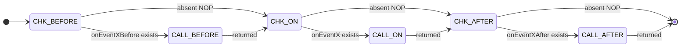

# 6. Event Model

## Event Registry

Auto-discovered from top-level functions matching `onEvent[X][Before|On|After]()`.
Registered at file load time. MUST-NOT call event handlers directly.

## Event Dispatch

```pseudocode
funct onEvent(eventName, context=None):
    // Serial dispatch: Before -> On -> After. Never async.
    for phase in ["Before", "", "After"]:
        handler_name = "onEvent" + eventName + phase
        if handler_name in self._registry:
            self._registry[handler_name](context)
```



## Built-in Events

### Boot

```pseudocode
funct onEventBootBefore():
    EVENT_TIMER_START_BOOT = OS.currentTimeNanos()
    LOGGER.info("onEventBootBefore()")

funct onEventBoot():
    LOGGER.info("onEventBoot()")
    LOGGER.info("*** boot() - BOOTING HANADEN - Frederick Bloom ***")
    LOGGER.info Linux-like kernel sysinfo: uname -a, runtime version, pid, cpuinfo, df -h, free -m
    register_watches("/")       // initial full tree walk + inotify registration
    // classify catalog entries
    spawn_subprocesses()        // bash always; ai-exec runner only if HEADLESS (see Step 3a)
    // dispatch ai-exec files (CONSTITUTION.md, README.md, then AI_SHEBANG files)

funct onEventBootAfter():
    EVENT_TIMER_END_BOOT = OS.currentTimeNanos()
    var durationNs = EVENT_TIMER_END_BOOT - EVENT_TIMER_START_BOOT
    LOGGER.info("event.Boot duration=" + OS.formatDurationNs(durationNs))
```

### Reboot

```pseudocode
funct onEventRebootBefore():
    EVENT_TIMER_START_REBOOT = OS.currentTimeNanos()
    LOGGER.info("onEventRebootBefore()")

funct onEventReboot():
    LOGGER.info("onEventReboot()")
    println "*** === REBOOTING HANADEN - Frederick Bloom ***"
    // P1 -- stop active writers
    stop all subprocesses and subagents
    // P2 -- flush I/O
    flush stdio, stdout, stderr
    release console lock if acquired
    close all file handlers
    // P3 -- deregister all event handlers
    deregister all onEvent handlers
    // P4 -- clear in-memory state
    clear conversation vars, session context, working memory, AI cache, global vars
    // P4a -- kill ALL owned subprocesses uniformly (bash + ai-exec if present)
    for name, proc in self._subprocesses.items():
        proc.send_signal(SIGTERM)
        wait(REBOOT_SUBPROC_SIGTERM_WAIT)
        if proc.poll() is None: proc.kill()
        LOGGER.info("killed subprocess: " + name)
    self._subprocesses.clear()

```mermaid
stateDiagram-v2
    direction LR
    [*]       --> NEXT     : begin P4a
    NEXT      --> SIGTERM  : proc = next(self._subprocesses)
    NEXT      --> DONE     : no more subprocesses
    SIGTERM   --> WAITING  : send SIGTERM, start timer
    WAITING   --> CLEAR    : proc.poll() is not None (exited cleanly)
    WAITING   --> SIGKILL  : timer >= REBOOT_SUBPROC_SIGTERM_WAIT AND proc.poll() is None
    SIGKILL   --> CLEAR    : send SIGKILL (force)
    CLEAR     --> NEXT     : LOGGER.info(killed: name) -- loop back
    DONE      --> [*]      : self._subprocesses.clear()
    // P4b -- purge old ephemeral dir, create fresh one
    //   New dir = new FIFO, new empty logs, new daemon.pid
    //   This is the ONLY path that creates a new ephemeral dir.
    //   self-regen (execve()) does NOT touch EPHEMERAL_HOME.
    old_home = EPHEMERAL_HOME
    EPHEMERAL_HOME = path_join(
        environ.get("TMPDIR", "/tmp"),
        "hanaden-ai",
        environ.get("AI_CONV_ID", "no-conv"),
        "pid-" + str(getpid())
    )
    makedirs(EPHEMERAL_HOME, mode=0o700)
    makedirs(EPHEMERAL_HOME + "/home/sandbox-user", mode=0o755)  // pre-seed sandbox-user home
    create_fifo(EPHEMERAL_HOME + "/daemon.stdin.fifo")
    open_append(EPHEMERAL_HOME + "/daemon.stdout.log")
    open_append(EPHEMERAL_HOME + "/daemon.stderr.log")
    write_file(EPHEMERAL_HOME + "/daemon.pid", str(getpid()))
    purge(old_home)
    // P5 -- reset catalog (inotify watches are kernel-managed, survive memory clear)
    clear self._catalog
    // Re-boot (spawn_subprocesses() called inside onEventBoot())
    onEvent("Boot")

#### Reboot Phase Sequence

```mermaid
flowchart TD
    RB(["Reboot triggered"]) --> P1["P1: stop active writers"]
    P1 --> P2["P2: flush I/O, release console lock\nclose all file handlers"]
    P2 --> P3["P3: deregister all onEvent handlers"]
    P3 --> P4["P4: clear in-memory state\nconversation vars, working memory, AI cache"]
    P4 --> P4A["P4a: kill all self._subprocesses\nSIGTERM → wait → SIGKILL\nbash + ai-exec if present"]
    P4A --> P4B["P4b: purge old EPHEMERAL_HOME\nconstruct path: tmp/hanaden-ai/CONV_ID/pid-PID\nos.makedirs + pre-seed homes/ + FIFO + logs + pid"]
    P4B --> P5["P5: clear self._catalog\ninotify watches survive (kernel-managed)"]
    P5 --> BOOT(["onEvent('Boot')"])
```

funct onEventRebootAfter():
    EVENT_TIMER_END_REBOOT = OS.currentTimeNanos()
    var durationNs = EVENT_TIMER_END_REBOOT - EVENT_TIMER_START_REBOOT
    LOGGER.info("event.Reboot duration=" + OS.formatDurationNs(durationNs))
```

### UserTurn

```pseudocode
funct onEventUserTurnBefore():
    EVENT_TIMER_START_USER_TURN = OS.currentTimeNanos()
    LOGGER.info("onEventUserTurnBefore()")
    // No filesystem scan. Catalog is already current via inotify.
    // CORE_FILE changes already triggered reboot via inotify.

funct onEventUserTurn():
    LOGGER.info("onEventUserTurn()")

funct onEventUserTurnAfter():
    EVENT_TIMER_END_USER_TURN = OS.currentTimeNanos()
    var durationNs = EVENT_TIMER_END_USER_TURN - EVENT_TIMER_START_USER_TURN
    LOGGER.info("event.UserTurn duration=" + OS.formatDurationNs(durationNs))
```

### AiTurn

```pseudocode
funct onEventAiTurnBefore():
    EVENT_TIMER_START_AI_TURN = OS.currentTimeNanos()
    LOGGER.info("onEventAiTurnBefore()")

funct onEventAiTurn():
    LOGGER.info("onEventAiTurn()")

funct onEventAiTurnAfter():
    EVENT_TIMER_END_AI_TURN = OS.currentTimeNanos()
    var durationNs = EVENT_TIMER_END_AI_TURN - EVENT_TIMER_START_AI_TURN
    LOGGER.info("event.AiTurn duration=" + OS.formatDurationNs(durationNs))
```

### inotify-Driven Events (NEW)

These fire in real-time, between turns, whenever inotify delivers events:

```pseudocode
funct onEventFileCreated(context):
    LOGGER.info("file created: " + context.path)

funct onEventFileModified(context):
    LOGGER.info("file modified: " + context.path)

funct onEventFileDeleted(context):
    LOGGER.info("file deleted: " + context.path)

funct onEventFileMoved(context):
    LOGGER.info("file moved: " + context.from + " -> " + context.to)

funct onEventCoreFileChanged(context):
    LOGGER.warn("CORE_FILE changed: " + context.path + " -> triggering response")
    handle_core_file_change(context.path)

funct onEventAiExecBefore(context):
    LOGGER.info("processing ai-exec: " + context.path)

funct onEventAiExecAfter(context):
    LOGGER.info("ai-exec complete: " + context.path + " status=" + context.status)
```

---

