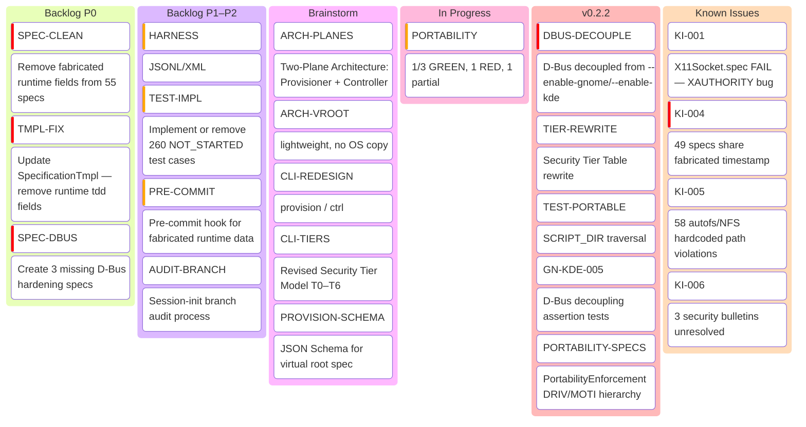
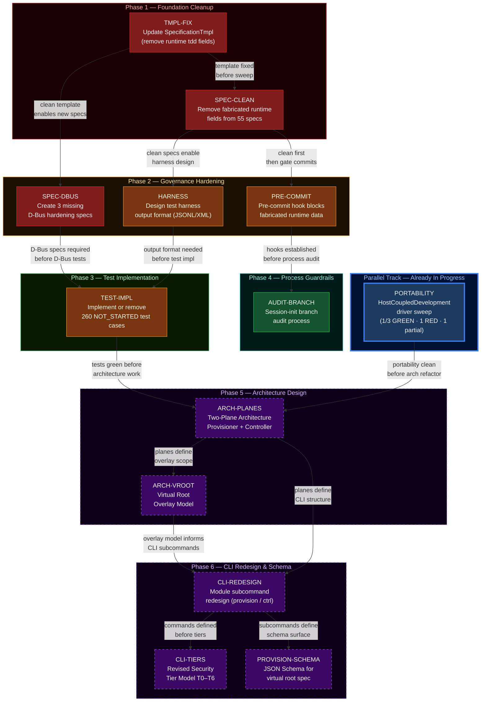

<!-- (c) 2026-* Frederick Bloom -- TODO.md -- Hanaden AI -->

# TODO Kanban — `hanaden-bwrap-enhanced`

> **Version:** 0.2.2 · **Branch:** `security/harden-dbus-isolation`
> **Last Updated:** 2026-08-27

---

## Kanban Board Overview



---

## Execution Workflow — Dependency Order

> Work top-to-bottom. Items within a phase are parallelizable.
> Cross-phase edges are hard dependencies — do not start a successor until its predecessor is done.



### Critical Path

```
TMPL-FIX → SPEC-CLEAN → HARNESS → TEST-IMPL → ARCH-PLANES → ARCH-VROOT → CLI-REDESIGN → CLI-TIERS / PROVISION-SCHEMA
```

### Phase Summary

| Phase | Gate | Items | Parallelizable? |
|:------|:-----|:------|:----------------|
| **1 — Foundation Cleanup** | Start immediately | TMPL-FIX → SPEC-CLEAN | Sequential (template first) |
| **2 — Governance Hardening** | Phase 1 complete | SPEC-DBUS, HARNESS, PRE-COMMIT | Yes (all 3 independent) |
| **3 — Test Implementation** | Phase 2 complete (DBUS + HARNESS) | TEST-IMPL | Single large item |
| **4 — Process Guardrails** | PRE-COMMIT complete | AUDIT-BRANCH | Single item |
| **∥ — Parallel Track** | Already started | PORTABILITY | Independent; gates Phase 5 |
| **5 — Architecture Design** | Phase 3 + PORTABILITY complete | ARCH-PLANES → ARCH-VROOT | Sequential |
| **6 — CLI Redesign & Schema** | Phase 5 complete | CLI-REDESIGN → CLI-TIERS, PROVISION-SCHEMA | CLI-TIERS + SCHEMA parallel after CLI-REDESIGN |

---

## 🔴 Backlog

### P0 — Critical (Governance Audit Remediation)
*Source: [AiGovernanceEffectivenessAudit.lessonlearned](lessons-learned/20260827-002949-460372-7977-9d23-48546e657a18-AiGovernanceEffectivenessAudit.lessonlearned-0.0.1.md) §11*

- [ ] **SPEC-CLEAN: Remove fabricated runtime fields from all spec frontmatter**
  - Remove `state`, `last-run`, `iterations`, `coverage-lines` from `tdd:` block in all 55 specs
  - `tdd:` block retains only `test-file:` (static reference)
  - Scope: 55 spec files under `BwrapEnhanced2026.strat/`

- [ ] **TMPL-FIX: Update SpecificationTmpl to remove runtime fields from tdd: block**
  - Remove `state`, `last-run`, `iterations`, `coverage-lines` from template
  - Scope: 1 template file

- [ ] **SPEC-DBUS: Create missing D-Bus hardening specs**
  - D-Bus session bus isolation spec (decoupled from `--enable-gnome`/`--enable-kde`)
  - D-Bus portal escape threat model spec
  - D-Bus default-deny posture spec
  - Scope: 3 new spec documents

### P1 — High

- [ ] **HARNESS: Design test harness output format**
  - Choose JSONL or XML for machine-readable test results
  - Align with [GenericSdlcEngine.strat](../../../generic-sdlc-and-engine-readonly/) standard for Bash testing (bats-core + JSONL)
  - Separate runtime results from static spec documents (JUnit/JaCoCo pattern)

- [ ] **TEST-IMPL: Implement or remove 260 NOT_STARTED test cases**
  - 260 test cases across 45 contradictory specs currently list `NOT_STARTED`
  - Each case must be implemented with honest RED→GREEN TDD or explicitly removed with rationale
  - See Appendix A of governance audit for per-spec breakdown

- [ ] **PRE-COMMIT: Add pre-commit hook for fabricated runtime data**
  - Scan spec frontmatter for runtime fields (`state:`, `last-run:`, `iterations:`, `coverage-lines:`)
  - Block commit if detected

### P2 — Medium

- [ ] **AUDIT-BRANCH: Session-init branch audit process**
  - On session start, verify branch name correlates with spec coverage
  - Document process in CONTRIBUTING.md or AGENTS.md

---

## 🟡 Planned (Architecture — Brainstorm Stage)
*Source: [VirtualRootProvisionerArch.brainstorm](architecture-design-features-specs/brainstorming-ideas-only/20260825-234818-159890-7bd1-86c0-6cfd6234e1f1-VirtualRootProvisionerArch.brainstorm-0.0.1.md)*

> [!NOTE]
> These items are from brainstorming notes — NOT approved specs, NOT committed architecture.
> Each requires a formal spec before implementation begins.

- [ ] **ARCH: Two-Plane Architecture (Provisioner + Controller)**
  - Split `bwrap-enhanced.sh` into two modules:
    - `provision` — Control Plane (creates/manages virtual root environments on host)
    - `ctrl` — Data Plane (executes processes inside sandbox, replaces current bare script)
  - Aligns with Immutable Principle: External Construction (Provisioner) → External Enforcement (Controller)

- [ ] **ARCH: Virtual Root Overlay Model**
  - Virtual root contains ONLY synthetic/override layer (`etc/`, `home/`, empty placeholders)
  - Host OS provides runtime binds (`/usr`, `/lib`, `/bin`, `/var`, `/opt` — all RO)
  - No full OS copy, no container image required — lightweight (kilobytes)

- [ ] **CLI: Module subcommand redesign**
  - `bwrap-enhanced provision <subcommand>` — `create`, `modify`, `describe`, `list`, `snapshot`, `diff`, `schema`
  - `bwrap-enhanced ctrl [options] -- CMD [ARGS...]`
  - Flag renames: `--host-real-root` → `--root-dir`, `--host-real-home-parent` → `--home-dir`, `--virtual-user-name` → `--virtual-user`

- [ ] **CLI: Revised Security Tier Model (T0–T6)**
  - T0: Full shield (core VFS + home RW)
  - T1: RO socket passthrough (`--enable-wayland`, `--enable-audio`, `--enable-a11y`)
  - T2: RW socket passthrough (`--enable-gnome`, `--enable-kde`)
  - T3: Bounded host FS READ (`--enable-mise-ro`, `--enable-local-bin-ro`)
  - T4: Bounded host FS WRITE (`--enable-mise-rw`, `--enable-local-bin-rw`, `--enable-opt-rw`)
  - T5: Portal bridge / shields pierced (`--enable-dbus`)
  - T6: No sandbox (no `ctrl`)
  - `--share-net` remains orthogonal (not a tier)

- [ ] **PROVISION: JSON Schema for virtual root spec**
  - `provision schema` emits to stdout
  - Spec files (YAML/JSON) validate against it
  - Self-documenting, no external deps

---

## 🔵 In Progress

- [ ] **PORTABILITY: HostCoupledDevelopment driver sweep** *(branch: `security/harden-dbus-isolation`, commit `30cd1d0`)*
  - 3 specs: `NoHardcodedHostPaths`, `NoHostTopologyInSpecs`, `RelativeResourceDiscovery`
  - `NoHostTopologyInSpecs` status: RED (58 autofs/NFS violations still exist)
  - `NoHardcodedHostPaths` status: 1/2 cases implemented (NHP-002 regression test missing)
  - `RelativeResourceDiscovery` status: PASS (2/2 cases implemented)

---

## 🟢 Done (v0.2.2)

- [x] **D-Bus Decoupling** — `--enable-gnome`/`--enable-kde` no longer implicitly set `ENABLE_DBUS=true`
- [x] **Security Tier Table Rewrite** — Tiers reordered to reflect corrected isolation model
- [x] **Test Path Portability** — `test_gnome_passthrough.sh` / `test_kde_passthrough.sh` use `SCRIPT_DIR` traversal
- [x] **GN-005 / KDE-005** — D-Bus decoupling assertions added to both passthrough test scripts
- [x] **PortabilityEnforcement DRIV/MOTI hierarchy** — 3 portability specs created and linked

## 🟢 Done (v0.2.1)

- [x] **Legal Corpus Reorganization** — CLA reference collection, comparison matrix, third-party licenses
- [x] **Boot Cruft Cleanup** — Removed 52 legacy draft specs and 8 obsolete bootstrap run records
- [x] **Version Alignment** — Standardized to `0.2.1`

## 🟢 Done (v0.2.0)

- [x] **Dual-Licensing & Governance Framework** — AGPL-3.0 + Section 7 terms + Commercial License
- [x] **CLA v1.0** — Contributor License Agreement
- [x] **Unified CONSTITUTION.md** — Immutable Principle, Zero Side-Effects, Indemnification
- [x] **Enterprise VFS Architecture** — Mermaid topology + MSC diagrams in README

## 🟢 Done (v0.1.0)

- [x] **Full SDLC TDD spec hierarchy** — 10 feature suites, 45 specs, 77 assertions
- [x] **GUI/toolchain passthrough flags** — Wayland, X11, Audio, A11y, D-Bus, GNOME, KDE, Chrome, Mise
- [x] **Agent governance configs** — AGENTS.md, GEMINI.md, CLAUDE.md with SCI enforcement

---

## 🟠 Known Issues / Tech Debt

| ID | Issue | Severity | Source |
|:---|:------|:---------|:-------|
| KI-001 | X11Socket.spec status: FAIL (known X11 XAUTHORITY bug) | Medium | [X11Socket.spec](architecture-design-features-specs/BwrapEnhanced2026.strat/UncontainedAgentExecution.driv/NamespaceIsolatedSandbox.moti/GuiPassthrough.feat/X11Socket.spec/) |
| KI-002 | SandboxExecEngine.arch — NOT_STARTED (no test exists) | Low | Governance Audit §A.3 |
| KI-003 | BwrapPreflight.feat — integration test missing | Low | Governance Audit §A.3 |
| KI-004 | 49 specs share fabricated timestamp `2026-08-18T16:08:59Z` | P0 | Governance Audit §2.4 |
| KI-005 | 58 autofs/NFS hardcoded path violations in specs | Medium | NoHostTopologyInSpecs (RED) |
| KI-006 | 3 security bulletins unresolved | Review | [security-bulletins/](security-bulletins/) |

---

> **Governance Note:** All items derived from actual project artifacts — commit history,
> spec audit, brainstorming docs, changelog, and lessons-learned reports.
> No fabricated or assumed items.
