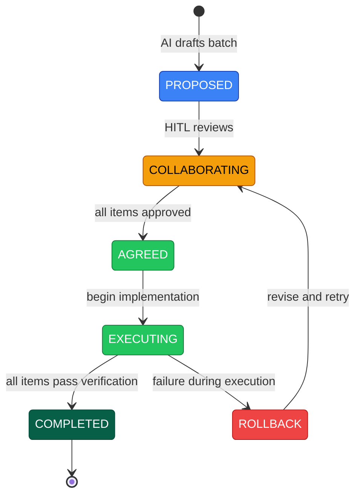

<!-- (c) 2026-* Frederick Bloom -- CliRevision.ai-hitl.collab.md -- Hanaden AI -->

# bwrap-enhanced 0.4.1 -- CLI Revision

> **Status:** `COLLABORATING`
> **Created:** 2026-09-08T21:28Z
> **Branch:** `0.4.1-a`
> **Type:** AI-HITL Collaboration Document

---

## Protocol Reference

<!-- TEMPLATE-EXTRACTABLE: This section is generic. Future template harvesting
     should preserve this section verbatim. -->

### Editing Rules (asymmetric)

**HITL (human) may:**
- Edit ANY part of this document -- prose, code blocks, proposals, status lines
- Add, modify, or delete content anywhere
- Answer Q markers by filling in A lines
- Add MSG markers with instructions or notes

**AI must:**
- Use ONLY comment-protocol markers (Q, A, MSG) to communicate
- Re-read the FULL document on every session -- HITL may have edited any part,
  not just answer lines. Do not assume only A markers changed.
- Not edit prose, proposals, or status lines without explicit HITL instruction

### Comment Protocol Markers

**Questions and Answers:**
```
<!-- AI-HITL-Q-{WHO}: {TAG} -- {question} -->
<!-- AI-HITL-A-{WHO}: {answer} -->
```

| Marker | Meaning |
|--------|---------|
| `AI-HITL-Q-AI:` | Question **from AI**, needs HITL answer |
| `AI-HITL-A-HITL:` | Answer **from HITL** |
| `AI-HITL-Q-HITL:` | Question **from HITL**, needs AI answer |
| `AI-HITL-A-AI:` | Answer **from AI** |

**Messages / Notes:**
```
<!-- MSG-AI-HITL:
{free-form message from either party}
-->
```

Use MSG for instructions, context, or notes that are not Q/A pairs.
Example: AI can use MSG to tell HITL where to place an answer or
explain what a question means. HITL can use MSG to give AI context.

### Discovery (grep)

```bash
grep 'AI-HITL-Q'         *.ai-hitl.collab.md   # all questions
grep 'AI-HITL-A-.*: --'  *.ai-hitl.collab.md   # unanswered
grep 'MSG-AI-HITL'        *.ai-hitl.collab.md   # all messages
```

### Item Approval

Each item ends with: `### Status: [ ] APPROVED` or `[x] APPROVED`.

Document transitions COLLABORATING -> AGREED when ALL items show `[x]`
and ALL `AI-HITL-A-` markers are non-empty.

### Lifecycle (FSM)



**Legend:** 🔵 Draft (AI only) · 🟡 Active (both parties) · 🟢 Go (approved/running) · 🔴 Failure · ⬛ Terminal

| State | Meaning |
|-------|---------|
| `PROPOSED` | AI drafted the batch, HITL has not reviewed |
| `COLLABORATING` | Active iteration -- open Q/A markers, items being revised |
| `AGREED` | All items approved, no open questions -- ready to execute |
| `EXECUTING` | Implementation in progress |
| `ROLLBACK` | Execution failed -- AI writes failure record, returns to COLLABORATING |
| `COMPLETED` | All items executed and verified -- terminal |

Rollback is durable -- failure records accumulate like a WAL.

---

## Batch: bwrap-enhanced 0.4.1 -- CLI Revision

**Purpose:** Consolidate all outstanding CLI revision items into a single
executable batch. Collaborate until agreed, then execute.

### Table of Contents

- [Item 0: Version Constant Fix](#item-0-version-constant-fix)
- [Item 1: Revised CLI Help Output](#item-1-revised-cli-help-output)
- [Item 3: Banner Emission Spec](#item-3-banner-emission-spec)
- [Item 4: `--ide-seed` Addition](#item-4---ide-seed-addition)
- [Item 5: DRY — Single Source of CLI Contract](#item-5-dry--single-source-of-cli-contract)
- [Item 6: Spec↔Test Sync (Option C Hybrid)](#item-6-spectest-sync-option-c-hybrid)
- [Item 7: 0.4.0 Spec Archival](#item-7-040-spec-archival)

---

## Item 0: Version Constant Fix

### Problem

[Line 76 of bwrap-enhanced.sh](file:///homes/home-local/hanasaki/data/dev-projects-local/hanaden-bwrap-enhanced-worktrees/0.4.1-a/PROJECT_HOME/src/main/hanaden-bwrap-enhanced/bwrap-enhanced.sh#L76)
currently reads:

```bash
readonly _SCRIPT_VERSION="0.4.0"
```

Every other source says `0.4.1`:

| Source | Value |
|--------|-------|
| `VERSION` file | `0.4.1-beta` ✅ |
| `_SCRIPT_VERSION` (line 76, on disk) | `0.4.0` ❌ |
| Branch name | `0.4.1-a` ✅ |
| ScopeVeryNarrow spec | `0.4.1` ✅ |
| Tests (DBAN/DISP-VER/HLP-LIST) | expect `v0.4.1` ✅ |

### Action

Change line 76 to:

```bash
readonly _SCRIPT_VERSION="0.4.1"
```

<!-- AI-HITL-Q-AI: VERSION_SOURCE -- should _SCRIPT_VERSION be hardcoded "0.4.1" or
     read from the VERSION file at runtime? VERSION file says "0.4.1-beta". -->
<!-- AI-HITL-A-HITL: -->
<!-- MSG-AI-HITL:
HTIL - please place answer here.
-->

### Status: `[ ] APPROVED`

---

## Item 1: Revised CLI Help Output

### Proposed `usage_top()` — full text

This is the **proposed revision** incorporating:
- Version fixed to `0.4.1`
- `--ide-seed IDE` added to `provision` (required arg)
- `--ide-seed IDE` added to `fsck` (optional)
- `--flag false = [ERROR]` (0.4.1 spec)
- Banner restored (emitted on every invocation to stderr)

```
bwrap-enhanced.sh  [DYNAMIC VERSION -- see BANNER_FORMAT below]  --  Bubblewrap Sandbox Launcher
(c) 2026 Frederick Bloom - All rights reserved.

bwrap-enhanced.sh  SUBCOMMAND  [OPTIONS]  [ARGS]
bwrap-enhanced.sh  --help | -h
bwrap-enhanced.sh  --version | -v

  provision
    --host-real-root        PATH         (default: ~/virtual-roots; MUST NOT exist)
    --virtual-user-name     NAME         (default: sandbox_user)
    --host-real-home-parent PATH         (default: HOST_REAL_ROOT/home)
    --ide-seed              IDE          (required; IDE: antigravity-ide)
<!-- AI-HITL-Q-AI: IDE_SEED_REQUIRED -- provision --ide-seed is marked REQUIRED.
     This means provision without --ide-seed is an error. Is that the intent?
     Or should it be optional (default: no IDE seeding, just skeleton)? -->
<!-- AI-HITL-A-HITL: -->
    --log-level             NAME|NUMBER  (default: INFO)
    -n, --dry-run

  fsck  [ROOT_PATH]
    --host-real-root        PATH         (default: ~/virtual-roots)
    --virtual-user-name     NAME         (default: sandbox_user)
    --ide-seed              IDE          (optional; check IDE seed integrity)
    --log-level             NAME|NUMBER  (default: INFO)
    -n  (check only)  -a  (auto-repair)  -r  (interactive)  -f  (force)  -v  (verbose)

  start  -- CMD [ARG...]
    --host-real-root        PATH         (default: ~/virtual-roots; MUST exist)
    --virtual-user-name     NAME         (default: sandbox_user)
    --host-real-home-parent PATH         (default: HOST_REAL_ROOT/home)
    --log-level             NAME|NUMBER  (default: INFO)
    -n, --dry-run                        (resolve and print bwrap argv; no exec)
    --validate                           (validate flags and paths; no exec)
    --net-passthrough       [true|false] (default: false)
    --env-passthrough       [true|false] (default: false)
    --x11-passthrough       [true|false] (default: false; implied by wayland/gnome/kde
                                          -- do not pass explicitly with an implying flag)
    --wayland-passthrough   [true|false] (default: false; implies x11)
    --gnome-passthrough     [true|false] (default: false; implies x11)
    --kde-passthrough       [true|false] (default: false; implies x11)
    --audio-passthrough     [true|false] (default: false)
    --a11y-passthrough      [true|false] (default: false)
    --dbus-passthrough      [true|false] (default: false; NEVER implied -- always explicit)
    --mise-passthrough      [ro|rw]      (default: off; bare = ro)
    --local-bin-passthrough [ro|rw]      (default: off; bare = ro)

  stop  [stub -- not yet implemented]
    --host-real-root PATH  --log-level NAME|NUMBER  -f, --force  -t, --timeout SECONDS

  ls  [stub -- not yet implemented]
    --log-level NAME|NUMBER  -a, --all  -q, --quiet  --format table|json|csv

absent  <  ro  <  rw      (privilege escalation order)

bare boolean flag = true  (most restrictive ON state)
bare graded flag  = ro    (most restrictive ON state)
flag absent       = false = default deny
--flag false      = [ERROR]   (false is implicit; omit the flag)

IDE seeds:  antigravity-ide
<!-- AI-HITL-Q-AI: IDE_LIST_SOURCE -- should the help text list allowed IDE values
     inline like this, or say "Run: bwrap-enhanced.sh provision --help"?
     Also: is the ide-seed list hardcoded in the script, or read from a config/dir? -->
<!-- AI-HITL-A-HITL: -->

Log levels: FATAL(100) < ERROR(200) < WARN(300) < INFO(400) < DEBUG(500) < TRACE(600)
Default: INFO(400). All output goes to stderr.
Run: bwrap-enhanced.sh SUBCOMMAND --help  for detailed subcommand help.
```

### Proposed `usage_provision()` revision

```
bwrap-enhanced.sh provision [OPTIONS]

  Create a virtual root skeleton. NOT idempotent.
  Can also seed IDE workspace configuration into a new or existing root.

OPTIONS
  -h, --help
      This help text. Exit 0.

  --host-real-root PATH
      Root directory to create. MUST NOT already exist (for fresh provision).
      Default: ~/virtual-roots

  --virtual-user-name NAME
      Username whose home directory will be created inside the root.
      Default: sandbox_user

  --host-real-home-parent PATH
      Parent directory for the user home.
      Default: HOST_REAL_ROOT/home

  --ide-seed IDE
      Seed IDE workspace configuration into the virtual root.
      Required. Allowed values: antigravity-ide
      Fresh provision: creates root skeleton AND seeds IDE config.
      Existing root: updates/adds IDE seed only (no skeleton re-creation).

  --log-level NAME|NUMBER
      FATAL(100) ERROR(200) WARN(300) INFO(400) DEBUG(500) TRACE(600)
      Default: INFO

  -n, --dry-run
      Print what would be created; do not create anything.

FOUR-WAY GATE (skeleton creation)
  ROOT missing + provision called  -> CREATE skeleton + seed IDE, exit 0
  ROOT exists  + provision called  -> seed/update IDE only, exit 0
  ROOT missing + provision absent  -> [FATAL] exit 2 (use provision first)
  ROOT exists  + provision absent  -> caller invokes 'start' directly

CREATES
  DIRS:     usr etc home proc dev tmp run opt var
  SYMLINKS: bin->usr/bin  lib->usr/lib  lib64->usr/lib64
  HOME:     HOST_REAL_HOME_PARENT/VIRTUAL_USER_NAME/
  IDE:      IDE-specific workspace configuration (per --ide-seed)
```

> [!WARNING]
> **DESIGN QUESTION — FOUR-WAY GATE REVISION:**
>
> Currently, `provision` on an existing root is `[FATAL] exit 2` (NOT idempotent).
> But `--ide-seed` on an existing root needs to succeed (update/add IDE seed).
>
> **Option A:** `--ide-seed` relaxes the gate — if root exists AND `--ide-seed`
> is given, allow the operation (seed/update only, no skeleton re-creation).
>
> **Option B:** Separate subcommand `provision ide-seed` to keep provision pure.
>
> **The text above assumes Option A. Discuss before approving.**

<!-- AI-HITL-Q-AI: FOUR_WAY_GATE — Option A or B? If A: bare provision on existing
     root stays FATAL; only --ide-seed gets the relaxation? -->
<!-- AI-HITL-A-HITL: -->

### Proposed `usage_fsck()` addition

```
  (added to fsck OPTIONS section)

  --ide-seed IDE
      Also check IDE seed integrity. Without this flag, fsck checks only
      the base skeleton. Allowed values: antigravity-ide
      Reports: seeded IDEs, their status (ok/broken/missing), repair options.

  (added to fsck CHECKS section)

  9  IDE seed integrity (if --ide-seed given)           (auto-repairable)
     - workspace config files present
     - workspace config files valid
     - IDE-specific directory structure present
```

### Status: `[ ] APPROVED`

---

## Item 3: Banner Emission Spec

### Requirement

Every invocation of `bwrap-enhanced.sh` — regardless of subcommand, success,
or failure — MUST emit a one-line version banner to **stderr** before any
other output.

### Banner Template

The banner format depends on the BANNER_FORMAT decision below.
Item 3 proposes the simple fallback; Item 1 proposes the dynamic version.
The agreed format will be used in both places.

<!-- AI-HITL-Q-AI: BANNER_FORMAT -- specify the exact dynamic version format.
     Candidates: (a) v0.4.1-beta (0.4.1-a @ 9d36975)
                 (b) v0.4.1-beta/0.4.1-a/9d36975
                 (c) v0.4.1-beta+0.4.1-a.9d36975
                 (d) simple: v0.4.1 (no git info)
                 (e) other -- write your template.
     Also: read VERSION file at runtime, or bake in at build? -->
<!-- AI-HITL-A-HITL: -->

<!-- AI-HITL-Q-AI: COPYRIGHT -- you removed "Hanaden -" prefix. Confirm canonical
     copyright holder. Current code L273: "(c) 2026 Hanaden - Frederick Bloom." -->
<!-- AI-HITL-A-HITL: -->

<!-- AI-HITL-Q-AI: BANNER_VS_VERSION -- should the stderr banner (every run) be
     simple "name v0.4.1 -- tagline" while --version (stdout) shows the full
     dynamic string with git info? Or should both show the same thing? -->
<!-- AI-HITL-A-HITL: -->

**Simple fallback (if no git info chosen):**

```
${_SCRIPT_NAME}  v${_SCRIPT_VERSION}  --  Bubblewrap Sandbox Launcher
```

### Concrete Example at v0.4.1 (simple)

```
bwrap-enhanced.sh  v0.4.1  --  Bubblewrap Sandbox Launcher
```

### Rules

- **Destination:** stderr (fd 2)
- **When:** Every invocation -- success, error, help, version, unknown subcommand
- **Before:** Any other stderr output (log messages, errors)
- `--version` additionally prints the version string to **stdout**

### Implementation

Restore `_emit_banner()`:

```bash
_emit_banner() {
    printf '%s  v%s  --  Bubblewrap Sandbox Launcher\n' \
        "$_SCRIPT_NAME" "$_SCRIPT_VERSION" >&2
}
```

Called at the top of `main()` before dispatching.

### Existing Tests (currently FAILING -- will pass after fix)

| Test ID | What it checks |
|---------|----------------|
| `DBAN-001` | `--help` emits banner to stderr containing `bwrap-enhanced.sh v` and `Bubblewrap Sandbox Launcher` |
| `DBAN-002` | Unknown subcommand error path also has banner |
| `DBAN-003` | `--version` outputs version to stdout |

### Status: `[ ] APPROVED`

---

## Item 4: `--ide-seed` Addition

### What changed from 0.4.0

| Aspect | 0.4.0 spec (frozen L47) | 0.4.1 spec (this doc) |
|--------|-------------------------|----------------------|
| Flag name | `--ide-seed` | `--ide-seed` (same) |
| Argument type | `PATH` (default: `PROJECT_HOME/boot`) | `IDE` (named identifier) |
| Required? | No (had default) | Yes (provision), Optional (fsck) |
| Values | Any path | `antigravity-ide` (enum, currently 1 item) |
| Subcommands | provision only | provision + fsck |

### Semantics

**On `provision`:**
- `--ide-seed antigravity-ide` is **required**
- Fresh provision (root doesn't exist): creates skeleton AND seeds IDE config
- Existing root: updates/adds IDE seed only (see FOUR-WAY GATE question above)
- What "seeding" means for `antigravity-ide`: TBD — workspace config files,
  `.agents/` directory, project-specific IDE settings

<!-- AI-HITL-Q-AI: IDE_SEED_FILES — what files/dirs does seeding antigravity-ide create?
     Candidates: (a) .agents/ + AGENTS.md  (b) .gemini/ config  (c) AGENTS.md + GEMINI.md
     at root  (d) boot/ contents  (e) other — specify exact list -->
<!-- AI-HITL-A-HITL: -->

<!-- AI-HITL-Q-AI: IDE_SEED_IDEMPOTENT — is --ide-seed idempotent? Running twice on
     same root+IDE = same result (no error)? Or re-seed = error? -->
<!-- AI-HITL-A-HITL: -->

**On `fsck`:**
- `--ide-seed antigravity-ide` is **optional**
- Without it: fsck checks only the base skeleton (dirs, symlinks, home)
- With it: additionally checks IDE seed integrity:
  - Are IDE config files present?
  - Are they valid / not corrupt?
  - Is the IDE-specific directory structure intact?
- Reports status: ok / broken / missing
- `-a` can auto-repair broken/missing IDE seeds

### Files to modify

1. `bwrap-enhanced.sh` — `usage_top()`, `usage_provision()`, `usage_fsck()`, provision parser, fsck parser, new `_provision_seed_ide()` function, new fsck check
2. `ScopeVeryNarrow.bstorm-0.4.1.md` — add `--ide-seed` to CLI contract section

### Status: `[ ] APPROVED`

---

## Item 5: DRY — Single Source of CLI Contract

### All 8 files containing CLI contract copies

| # | File | Full synopsis? | Status |
|---|------|---------------|--------|
| 1 | [`bwrap-enhanced.sh` `usage_top()`](file:///homes/home-local/hanasaki/data/dev-projects-local/hanaden-bwrap-enhanced-worktrees/0.4.1-a/PROJECT_HOME/src/main/hanaden-bwrap-enhanced/bwrap-enhanced.sh#L270-L328) | ✅ Full | **Runtime SSoT** |
| 2 | [`ScopeVeryNarrow.bstorm-0.4.1.md`](file:///homes/home-local/hanasaki/data/dev-projects-local/hanaden-bwrap-enhanced-worktrees/0.4.1-a/PROJECT_HOME/docs/architecture-design-features-specs/20260907-022151-216248-79ba-8006-40d96da98ddb-ScopeVeryNarrow.bstorm-0.4.1.md#L44-L98) | ✅ Full | Design spec |
| 3 | [`0.4.0-…-tooling-brainstorming.md`](file:///homes/home-local/hanasaki/data/dev-projects-local/hanaden-bwrap-enhanced-worktrees/0.4.1-a/PROJECT_HOME/docs/architecture-design-features-specs/0.4.0-hanaden-bwrap-enhanced-tooling-detailed-architecture-design-brainstorming.md#L40-L93) | ✅ Full (stale) | Frozen 0.4.0 |
| 4 | [`README.md`](file:///homes/home-local/hanasaki/data/dev-projects-local/hanaden-bwrap-enhanced-worktrees/0.4.1-a/README.md) | ✅ Partial | Public-facing |
| 5 | [`CONSTITUTION.md`](file:///homes/home-local/hanasaki/data/dev-projects-local/hanaden-bwrap-enhanced-worktrees/0.4.1-a/CONSTITUTION.md) | ⚠️ References flags | Governance |
| 6 | [`cli-reference.html`](file:///homes/home-local/hanasaki/data/dev-projects-local/hanaden-bwrap-enhanced-worktrees/0.4.1-a/site/technical/project-core/cli-reference.html) | ✅ Full | Marketing site |
| 7 | [`security-model.html`](file:///homes/home-local/hanasaki/data/dev-projects-local/hanaden-bwrap-enhanced-worktrees/0.4.1-a/site/technical/project-core/security-model.html) | ⚠️ References flags | Marketing site |
| 8 | [`CliContractEngine.arch-0.3.0.md`](file:///homes/home-local/hanasaki/data/dev-projects-local/hanaden-bwrap-enhanced-worktrees/0.4.1-a/PROJECT_HOME/docs/architecture-design-features-specs/bwrap-enhanced-architecture-design-features-specs/BwrapEnhanced2026.strat/UncontainedAgentExecution.driv/NamespaceIsolatedSandbox.moti/CliContractEngine.arch/20260830-174727-854081-7f11-82a9-2e6933a1791c-CliContractEngine.arch-0.3.0.md) | ⚠️ References flags | SDLC arch doc |

### Decision needed: Where is the single DRY copy?

**Recommendation:** `bwrap-enhanced.sh` `usage_top()` is the single authoritative copy because:
- It is executable (what `--help` actually outputs)
- It is version-pinned (contains `_SCRIPT_VERSION`)
- It is testable (DBAN and HLP tests validate it)

**Every other file should:**
- **Reference it** — "See `bwrap-enhanced.sh --help` for the full CLI reference"
- **Or quote a versioned snapshot** — with explicit version tag so staleness is detectable
- **Or be archived** — (for 0.4.0-era docs)

### Status: `[ ] DECIDED — which file is the single source?`

<!-- AI-HITL-Q-AI: DRY_SSOT — confirm usage_top() in bwrap-enhanced.sh as THE
     single DRY source? -->
<!-- AI-HITL-A-HITL: -->

<!-- AI-HITL-Q-AI: SECONDARY_COPIES — for README.md and site HTML:
     (a) replace CLI section with "See bwrap-enhanced.sh --help"
     (b) keep versioned snapshot with staleness warning
     (c) auto-generate from --help output during build/CI -->
<!-- AI-HITL-A-HITL: -->

---

## Item 6: Spec↔Test Sync (Option C Hybrid)

### Current state

- **49 specs** in the SDLC strat tree — 40 have no test
- **198 test files** (899 test cases) — 167 have no governing spec
- **9 matched pairs** — 18% alignment

### Phase 1: Validate (read-only, no edits)

Read each of the 40 untested specs. For each, answer:
- Is this spec still needed? (Some may be obsoleted by 0.4.1)
- Does an organic test already cover this? (Many do, under different paths)
- Is the spec correct? (Does it match current code?)

Read each of the 34 organic test feats. For each, answer:
- Does this test validate something real?
- Is there a spec it should map to?
- Does it need a new spec written?

### Phase 2: Remap (file moves only)

Remap the 14 Category A tests that ARE the spec's test but at wrong paths.

### Phase 3: Write specs for core untested features

Priority 1 (core subcommands, 100+ tests, no spec):
- `Provision.feat` — 14 test specs, 80+ test cases
- `Fsck.feat` — 14 test specs, 60+ test cases
- `CliContract.feat` — 18 test specs, 30+ test cases
- `Dispatch.feat` — 5 test specs, 10+ test cases

Priority 2 (per-flag features):
- Each `Flag*.feat` needs a spec document

### Phase 4: Write tests for untested specs

Priority 1: `ForegroundHold.feat` (4 specs, 0 tests — orphan reaper)
Priority 2: `PassthroughArgs.feat` (5 specs, 0 tests)
Priority 3: Remaining GUI/identity/network specs

<!-- AI-HITL-Q-AI: PHASE1_TIMING -- should Phase 1 read-only audit start now
     as a separate task, or finish Items 0-5,7 first and come back to this? -->
<!-- AI-HITL-A-HITL: -->

### Status: `[ ] APPROVED -- start Phase 1?`

---

## Item 7: 0.4.0 Spec Archival

### Proposed header for `0.4.0-hanaden-bwrap-enhanced-tooling-detailed-architecture-design-brainstorming.md`

Prepend after the existing copyright comment:

```markdown
> [!CAUTION]
> **SUPERSEDED — This document is frozen at v0.4.0.**
>
> This is the original `SCOPE-very-narrow.md` design brainstorming document,
> carried forward from the `security/harden-dbus-isolation` and
> `feature/0.4.0-rewrite` branches. It was renamed from
> `0.4.0-detailed-architecture-design-brainstorming.md` during the
> `feature/0.4.1-rewrite` merge.
>
> **Superseded by:**
> [`ScopeVeryNarrow.bstorm-0.4.1.md`](20260907-022151-216248-79ba-8006-40d96da98ddb-ScopeVeryNarrow.bstorm-0.4.1.md)
>
> **Key differences in 0.4.1:**
> - `--flag false` is now `[ERROR]` (was: silently accepted no-op)
> - `--ide-seed IDE` added to `provision` and `fsck`
> - Banner emission on every invocation (now spec'd)
> - UUIDv7-extended filename convention applied
>
> **Do NOT use this document for implementation decisions.**
> It is preserved for historical lineage and audit trail only.
```

### Also for the test harness companion doc

`0.4.0-hanaden-bwrap-enhanced-test-harness-detailed-architecture-design-brainstorming.md`:

```markdown
> [!CAUTION]
> **SUPERSEDED — This document is frozen at v0.4.0.**
>
> Superseded by the test harness spec in:
> - The `bwrap-enhanced-test-harness-runner.sh` source itself
> - The BashObservability project's `BashObservabilityGeneric.bstorm-0.4.1.md`
>   (for the logging/observability subsystem extraction)
>
> **Do NOT use this document for implementation decisions.**
```

<!-- AI-HITL-Q-AI: LEGACY_RENAME -- should the 0.4.0 frozen docs also be renamed
     to UUIDv7 convention, or leave their legacy names since they are archived? -->
<!-- AI-HITL-A-HITL: -->

### Status: `[ ] APPROVED`

---

## Execution Checklist (after all items approved)

- `[ ]` Item 0 — Fix `_SCRIPT_VERSION` to `"0.4.1"` on line 76
- `[ ]` Item 3 — Restore `_emit_banner()` function and call it from `main()`
- `[ ]` Item 1 — Update `usage_top()` with revised help text (incl. `--ide-seed`)
- `[ ]` Item 1 — Update `usage_provision()` with `--ide-seed` option
- `[ ]` Item 1 — Update `usage_fsck()` with `--ide-seed` option
- `[ ]` Item 4 — Implement `--ide-seed` parsing in provision and fsck
- `[ ]` Item 4 — Update `ScopeVeryNarrow.bstorm-0.4.1.md` with `--ide-seed`
- `[ ]` Item 7 — Add superseded header to 0.4.0 tooling brainstorming doc
- `[ ]` Item 7 — Add superseded header to 0.4.0 test harness brainstorming doc
- `[ ]` Item 5 — Update secondary CLI copies (README, site, etc.) to reference SSoT
- `[ ]` Update 20 `ExplicitFalse` + 9 `BoolFlagParsing` tests to expect exit 1
- `[ ]` Run full test suite -- target: 898/899 (only START-EXEC-003 env-dependent)

<!-- AI-HITL-Q-AI: EXEC_ORDER -- execution order preference?
     (a) one pass -- all items, then one test run
     (b) item-by-item -- fix, test, fix, test
     (c) grouped: (0+3 version+banner), then (1+4 help+ide-seed), then (5+7 docs) -->
<!-- AI-HITL-A-HITL: -->

- `[ ]` Item 6 — Begin Phase 1 read-only spec↔test audit

<!-- AI-HITL-Q-AI: PRIORITY_OVERRIDE -- any items that MUST be deferred to 0.4.2? -->
<!-- AI-HITL-A-HITL: -->
