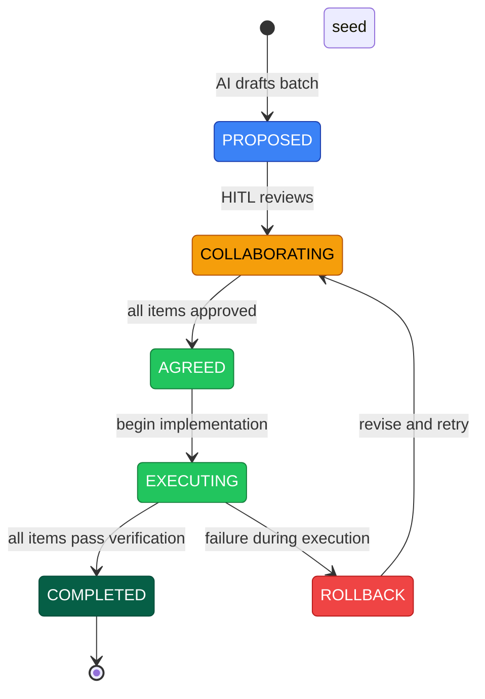

<!-- (c) 2026-* Frederick Bloom -- CliRevision.ai-hitl.collab.md -- Hanaden AI -->

> [!CAUTION]
> **SUPERSEDED — v0.0.1 (frozen 2026-09-09T13:42:49.186424Z)**
>
> This is the original collaboration document capturing the full negotiation
> trail for the bwrap-enhanced 0.4.1 CLI revision. Preserved for audit lineage.
>
> **Superseded by:**
> [`CliRevision.ai-hitl.collab-0.0.2.md`](20260909-013323-963842-7df1-b8be-96373f8cac1e-CliRevision.ai-hitl.collab-0.0.2.md)
>
> **Do NOT use this document for implementation decisions.**

# bwrap-enhanced 0.4.1 -- CLI Revision

> **Version:** `0.0.1`
> **Status:** `SUPERSEDED`
> **Created:** 2026-09-08T21:28Z
> **Frozen:** 2026-09-09T13:42:49.186424Z
> **Branch:** `0.4.1-a`
> **Type:** AI-HITL Collaboration Document

---

## CLI Complexity Tracker

Measured from source + collab doc at each iteration. Most recent first.

| # | Iteration | Subcmds | User flags | Flag types | Special rules | Error fns | Open Qs | Trend |
|---|-----------|---------|------------|------------|---------------|-----------|---------|-------|
| 4 | **Now** (bool interview 09-09 09:00Z) | 5 | 24 | bool(9) + graded(2) + str(5) + enum(1) + bare(7) | 13 | 6 | `--flag false` semantics unresolved, duplicate handling unclear | ⚠️ Complexity creeping — contradictory rules in doc |
| 3 | `--seed X` rename (09-09 04:00Z) | 5 | 24 | bool(9) + graded(2) + str(5) + enum(1) + bare(7) | 12 | 6 | 3 editorial | ✅ Clean — scoped down to antigravity-ide only |
| 2 | Initial collab draft (09-08 21:28Z) | 5 | 24 | bool(9) + graded(2) + str(5) + enum(1) + bare(7) | 10 | 6 | 16 | 🟡 Rules added: `false`=[ERROR], 5-way gate, seed idempotency |
| 1 | **v0.4.0 baseline** (pre-collab) | 5 | 23 | bool(9) + graded(2) + str(5) + path(1) + bare(6) | 6 | 4 | 0 | — Baseline |

**Key deltas:**
- v0.4.0→v0.4.1: `--ide-seed PATH` → `--seed X` (enum). Added `--validate`. +3 special rules (seed idempotency, 5-way gate, `false`=[ERROR]). +2 error fns.
- Iteration 3→4: No new flags. But boolean `true`/`false` semantics now **contradictory** in doc (L268 says [ERROR], interview says silent accept).

**⚠️ Bloat signal:** Collab doc is 1031 lines with 57 Q/A markers. ~400 lines are resolved audit trail. Actionable design is ~300 lines.

---

## Protocol Reference

<!-- TEMPLATE-EXTRACTABLE: This section is generic. Future template harvesting
     should preserve this section verbatim. -->

### Editing Rules (asymmetric)

**HITL (human) may:**
- Edit ANY part of this document -- prose, code blocks, proposals, status lines
- Add, modify, or delete content anywhere
- Answer Q markers by filling in A lines
- Add MSG markers with instructions or notes

**AI must:**
- Use ONLY comment-protocol markers (Q, A, MSG) to communicate
- Re-read the FULL document on every session -- HITL may have edited any part,
  not just answer lines. Do not assume only A markers changed.
- Not edit prose, proposals, or status lines without explicit HITL instruction
- When asking questions, propose ordered recommended solutions with supporting
  arguments and blast-radius impact of each option

### Comment Protocol Markers

**Questions and Answers:**
```
<!-- AI-HITL-Q-{WHO}: {TAG} -- {question} -->
<!-- AI-HITL-A-{WHO}: {answer} -->
```

| Marker | Meaning |
|--------|---------|
| `AI-HITL-Q-AI:` | Question **from AI**, needs HITL answer |
| `AI-HITL-A-HITL:` | Answer **from HITL** |
| `AI-HITL-Q-HITL:` | Question **from HITL**, needs AI answer |
| `AI-HITL-A-AI:` | Answer **from AI** |

**Messages / Notes:**
```
<!-- MSG-AI-HITL:
{free-form message from either party}
-->
```

Use MSG for instructions, context, or notes that are not Q/A pairs.
Example: AI can use MSG to tell HITL where to place an answer or
explain what a question means. HITL can use MSG to give AI context.

### Discovery (grep)

```bash
grep 'AI-HITL-Q'         *.ai-hitl.collab.md   # all questions
grep 'AI-HITL-A-.*: --'  *.ai-hitl.collab.md   # unanswered
grep 'MSG-AI-HITL'        *.ai-hitl.collab.md   # all messages
```

### Item Approval

Each item ends with: `### Status: [ ] APPROVED` or `[x] APPROVED`.

Document transitions COLLABORATING -> AGREED when ALL items show `[x]`
and ALL `AI-HITL-A-` markers are non-empty.

### Lifecycle (FSM)



**Legend:** 🔵 Draft (AI only) · 🟡 Active (both parties) · 🟢 Go (approved/running) · 🔴 Failure · ⬛ Terminal

| State | Meaning |
|-------|---------|
| `PROPOSED` | AI drafted the batch, HITL has not reviewed |
| `COLLABORATING` | Active iteration -- open Q/A markers, items being revised |
| `AGREED` | All items approved, no open questions -- ready to execute |
| `EXECUTING` | Implementation in progress |
| `ROLLBACK` | Execution failed -- AI writes failure record, returns to COLLABORATING |
| `COMPLETED` | All items executed and verified -- terminal |

Rollback is durable -- failure records accumulate like a WAL.

---

## Batch: bwrap-enhanced 0.4.1 -- CLI Revision

**Purpose:** Consolidate all outstanding CLI revision items into a single
executable batch. Collaborate until agreed, then execute.

### Table of Contents

- [Item 0: Version Constant Fix](#item-0-version-constant-fix)
- [Item 1: Revised CLI Help Output](#item-1-revised-cli-help-output)
- [Item 3: Banner Emission Spec](#item-3-banner-emission-spec)
- [Item 4: `--seed X` Addition](#item-4---seed-x-addition)
- [Item 5: DRY — Single Source of CLI Contract](#item-5-dry--single-source-of-cli-contract)
- [Item 6: Spec↔Test Sync (Option C Hybrid)](#item-6-spectest-sync-option-c-hybrid)
- [Item 7: 0.4.0 Spec Archival](#item-7-040-spec-archival)

---

## Item 0: Version Constant Fix

### Problem

`_SCRIPT_VERSION` must not be hardcoded. The `VERSION` file is the single
source of truth for the version string. Currently L76 hardcodes a value,
creating a DRY violation with the `VERSION` file.

| Source | Current value (on disk) |
|--------|------------------------|
| `VERSION` file | `0.4.1-beta` |
| `_SCRIPT_VERSION` (L76) | `0.4.1-beta` (was `0.4.0`, already patched) |
| Branch name | `0.4.1-a` (dynamic, from git) |

### Action

Replace the hardcoded `_SCRIPT_VERSION` with a dynamic read from `VERSION`
using `git rev-parse --show-toplevel` to find the repo root (refactor-safe):

```bash
readonly _SCRIPT_VERSION="$(cat "$(git rev-parse --show-toplevel)/VERSION" 2>/dev/null || echo "unknown")"
```

**Why `git rev-parse` over relative paths:**
- `../../..` is fragile -- any `src/` restructure breaks it silently
- `git rev-parse --show-toplevel` is 100% deterministic from any depth
- git is already a hard prerequisite for this project
- `bwrap-enhanced.sh` runs on the host (not inside sandbox), so git is always on PATH

<!-- AI-HITL-Q-AI: VERSION_SOURCE -- should _SCRIPT_VERSION be hardcoded "0.4.1" or
     read from the VERSION file at runtime? VERSION file says "0.4.1-beta". -->
<!-- AI-HITL-A-HITL: Read from VERSION file at runtime via git rev-parse --show-toplevel. DRY. -->
<!-- MSG-AI-HITL:
actually VERSION file is also hardcoded "0.4.1" but needs to have "0.4.1-beta".  branch stays current bramnch andd worktree
-->

### Status: `[ ] APPROVED`

---

## Item 1: Revised CLI Help Output

### Proposed `usage_top()` — full text

<!-- MSG-AI-HITL:
HITL: end of help output also lists the full set notation of the CLI.
Same set notation must be in the spec file also so the TDD tests
written will test the actual impl.
-->
<!-- MSG-AI-HITL:
AI ACK: Understood. Will add formal set notation (BNF/EBNF-style) to the
bottom of usage_top() output AND to ScopeVeryNarrow spec. Tests will
validate the set notation block exists and matches between help output
and spec. This becomes a testable contract.
HITL-note: impl of the set notation output must be its own function -- distinct
usage functions for each segment/block. It is ok to call them in a sequence
to build up the whole.
AI ACK: Agreed. Each section of help output becomes its own function:
  _usage_banner(), _usage_synopsis(), _usage_provision(), _usage_fsck(),
  _usage_start(), _usage_stop(), _usage_ls(), _usage_flags(), _usage_set_notation()
Composable. Testable individually.
-->
This is the **proposed revision** incorporating:
- Version fixed to `0.4.1`
- `--seed X` added to `provision` (optional, repeatable)
- fsck auto-discovers seeds (no `--seed` flag needed)
- `--flag false = [ERROR]` (0.4.1 spec)
- Banner restored (emitted on every invocation to stderr)

```
bwrap-enhanced.sh  [DYNAMIC VERSION -- see BANNER_FORMAT below]  --  Bubblewrap Sandbox Launcher
(c) 2026 Frederick Bloom - All rights reserved.

bwrap-enhanced.sh  SUBCOMMAND  [OPTIONS]  [ARGS]
bwrap-enhanced.sh  --help | -h
bwrap-enhanced.sh  --version | -v

  provision
    --host-real-root        PATH         (default: ~/virtual-roots; MUST NOT exist)
    --virtual-user-name     NAME         (default: sandbox_user)
    --host-real-home-parent PATH         (default: HOST_REAL_ROOT/home)
    --seed              X            (optional, repeatable; X: antigravity-ide)
<!-- AI-HITL-Q-AI: IDE_SEED_REQUIRED -- provision --ide-seed is marked REQUIRED.
     This means provision without --ide-seed is an error. Is that the intent?
     Or should it be optional (default: no IDE seeding, just skeleton)? -->
<!-- AI-HITL-A-HITL:
--ide-seed is optional.  when --ide-seed is provied it must specify the ide also. there is no default ide.
currenlty only support "antigravity-ide".  future it may support more ide's. FATAL ON bad arg
-->
<!-- MSG-AI-HITL:
Resolved: renamed to --seed X. Optional on provision. Repeatable.
Allowed values for 0.4.1: antigravity-ide.
Future (0.4.2+): antigravity-cli, others.
FATAL on unknown X value. No default.
-->
    --log-level             NAME|NUMBER  (default: INFO)
    -n, --dry-run

  fsck  [ROOT_PATH]
    --host-real-root        PATH         (default: ~/virtual-roots)
    --virtual-user-name     NAME         (default: sandbox_user)
    --log-level             NAME|NUMBER  (default: INFO)
    -n  (check only)  -a  (auto-repair)  -r  (interactive)  -f  (force)  -v  (verbose)

  start  -- CMD [ARG...]
    --host-real-root        PATH         (default: ~/virtual-roots; MUST exist)
    --virtual-user-name     NAME         (default: sandbox_user)
    --host-real-home-parent PATH         (default: HOST_REAL_ROOT/home)
    --log-level             NAME|NUMBER  (default: INFO)
    -n, --dry-run                        (resolve and print bwrap argv; no exec)
    --validate                           (validate flags and paths; no exec)
    --net-passthrough       [true|false] (default: false)
    --env-passthrough       [true|false] (default: false)
    --x11-passthrough       [true|false] (default: false; implied by wayland/gnome/kde
                                          -- do not pass explicitly with an implying flag)
    --wayland-passthrough   [true|false] (default: false; implies x11)
    --gnome-passthrough     [true|false] (default: false; implies x11)
    --kde-passthrough       [true|false] (default: false; implies x11)
    --audio-passthrough     [true|false] (default: false)
    --a11y-passthrough      [true|false] (default: false)
    --dbus-passthrough      [true|false] (default: false; NEVER implied -- always explicit)
    --mise-passthrough      [ro|rw]      (default: off; bare = ro)
    --local-bin-passthrough [ro|rw]      (default: off; bare = ro)

  stop  [stub -- not yet implemented]
    --host-real-root PATH  --log-level NAME|NUMBER  -f, --force  -t, --timeout SECONDS

  ls  [stub -- not yet implemented]
    --log-level NAME|NUMBER  -a, --all  -q, --quiet  --format table|json|csv

absent  <  ro  <  rw      (privilege escalation order)

bare boolean flag = true  (most restrictive ON state)
bare graded flag  = ro    (most restrictive ON state)
flag absent       = false = default deny
--flag false      = [ERROR]   (false is implicit; omit the flag)

Seeds:  antigravity-ide
<!-- AI-HITL-Q-AI: IDE_LIST_SOURCE -- should the help text list allowed IDE values
     inline like this, or say "Run: bwrap-enhanced.sh provision --help"?
     Also: is the ide-seed list hardcoded in the script, or read from a config/dir? -->
<!-- AI-HITL-A-HITL:
for now: hardcoded list in a single DRY constant in the script and list is "antigravity-ide"  It will be updated when a new ide is supported.
-->
<!-- MSG-AI-HITL:
Resolved: hardcoded in a single DRY constant. 0.4.1 value: antigravity-ide.
Future (0.4.2+): antigravity-cli, others.
-->

Log levels: FATAL(100) < ERROR(200) < WARN(300) < INFO(400) < DEBUG(500) < TRACE(600)
Default: INFO(400). All output goes to stderr.
Run: bwrap-enhanced.sh SUBCOMMAND --help  for detailed subcommand help.
```

  --seed X
      Seed tooling workspace configuration into the virtual root.
      Optional, repeatable. X ∈ {antigravity-ide} (0.4.1)
      Future (0.4.2+): antigravity-cli, others.
      FATAL on unknown X value.
      Fresh provision: creates root skeleton AND seeds specified configs.
      Existing root: seeds only (no skeleton re-creation).

  --log-level NAME|NUMBER
      FATAL(100) ERROR(200) WARN(300) INFO(400) DEBUG(500) TRACE(600)
      Default: INFO

  -n, --dry-run
      Print what would be created; do not create anything.

FIVE-WAY GATE (provision + seed interaction)
  ROOT missing + no --seed    -> CREATE skeleton only, exit 0
  ROOT missing + --seed X     -> CREATE skeleton + SEED X, exit 0
  ROOT exists  + --seed X NEW -> SEED X only, exit 0
  ROOT exists  + --seed X DUP + identical -> WARNING (no-op), exit 0
  ROOT exists  + --seed X DUP + different -> FATAL (would corrupt), exit 2
  ROOT exists  + no --seed    -> FATAL (already provisioned), exit 2

  Multiple --seed flags: atomic-or-nothing. If ANY seed would corrupt,
  the entire operation is FATAL. Error message lists conflicting seeds.

SEED IDEMPOTENCY (per seed X)
  1. Seed X exists + would change files = FATAL (refuse to corrupt)
  2. Seed X exists + identical to what would be created = WARNING + no-op
  3. Seed X absent (nothing to seed for X) = silent no-op (no output)

CREATES
  DIRS:     usr etc home proc dev tmp run opt var
  SYMLINKS: bin->usr/bin  lib->usr/lib  lib64->usr/lib64
  HOME:     HOST_REAL_HOME_PARENT/VIRTUAL_USER_NAME/
  SEEDS:    per --seed X (see seed definitions below)
```

<!-- MSG-AI-HITL:
Q/A history preserved below for audit trail. The text above is the
consolidated agreed design replacing the earlier --ide-seed proposals.
-->

> [!WARNING]
> **DESIGN QUESTION — FOUR-WAY GATE REVISION:**
>
> ~~Currently, `provision` on an existing root is `[FATAL] exit 2` (NOT idempotent).~~
> ~~But `--ide-seed` on an existing root needs to succeed (update/add IDE seed).~~
>
> **RESOLVED: Option A with --seed rename.** Gate expanded to 5-way (above).
> HITL approved Option A. Renamed --ide-seed to --seed X.

<!-- AI-HITL-Q-AI: FOUR_WAY_GATE — Option A or B? If A: bare provision on existing
     root stays FATAL; only --ide-seed gets the relaxation? -->
<!-- AI-HITL-A-HITL:
what do u recommend ?  NOTE to AI the early part of this doc MUST be udpated so AI is told that when asking qeustions it must propose a ordered best recommended solutions with supporting arguments and blast impacts of each.
AI what do you recommend that keeps cli clean for humans and follows linux and POSIX conventions.  also, ide seeding when it would correct an exsitng ide config is a FATAL
-->
<!-- AI-HITL-A-AI:
RESOLVED: Option A with --seed X. See FIVE-WAY GATE above.
-->

### Proposed `usage_fsck()` — seed auto-discovery

fsck follows the Linux fsck model: it auto-discovers what exists and checks
everything. No `--seed` flag needed on fsck.

```
  (fsck seed behavior -- auto-discovered, not flag-controlled)

  fsck automatically detects which seeds are present in the root and
  checks their integrity. No --seed flag needed.

  For each discovered seed:
  - Are seed config files present and complete?
  - Are seed config files valid / not corrupt?
  - Is the seed-specific directory structure intact?
  Reports status per seed: ok / broken / missing files

  (added to fsck CHECKS section)

  9  Seed integrity (auto-discovered)                    (auto-repairable)
     - For each seed found: validate config files and directory structure
     - -a can auto-repair broken/missing seed configs
```

### Status: `[ ] APPROVED`

---

## Item 3: Banner Emission Spec

### Requirement

Every invocation of `bwrap-enhanced.sh` — regardless of subcommand, success,
or failure — MUST emit a one-line version banner to **stderr** before any
other output.

### Banner Template

The banner format depends on the BANNER_FORMAT decision below.
Item 3 proposes the simple fallback; Item 1 proposes the dynamic version.
The agreed format will be used in both places.

<!-- AI-HITL-Q-AI: BANNER_FORMAT -- specify the exact dynamic version format.
     Candidates: (a) v0.4.1-beta (0.4.1-a @ 9d36975)
                 (b) v0.4.1-beta/0.4.1-a/9d36975
                 (c) v0.4.1-beta+0.4.1-a.9d36975
                 (d) simple: v0.4.1 (no git info)
                 (e) other -- write your template.
     Also: read VERSION file at runtime, or bake in at build? -->
<!-- AI-HITL-A-HITL:
e:
[DRT - dynamic executed filename to support if filename is changed ] - bwrap-enhanced.sh (still hardcoded so we know what it was origianlly called)  [dynamic version from VERSION file but needs to be hardcoded at coding of this file src becuase it is a standalone bash script and reguardless has the version locked at coding / or if rust or etc.. at compile tiem]  --  Sandbox Launcher
(c) 2026 Hanaden - Frederick Bloom. All rights reserved.
Q: to AI  for the git version addtion .. (),//, + etc.. what is the common convtion you can find for how this is done in other systems. apps internet?
-->
<!-- AI-HITL-A-AI:
Git version suffix conventions in real-world systems:

1. PARENTHETICAL -- most common in CLI tools:
   kubectl: "v1.28.2 (go1.21.1, 2023-09-13T09:35:49Z)"
   docker:  "Docker version 24.0.6, build ed223bc"
   rustc:   "rustc 1.72.0 (5680fa18f 2023-08-23)"
   gcc:     "gcc (Ubuntu 13.2.0-4) 13.2.0"
   Pattern: NAME VERSION (METADATA)

2. PLUS SIGN -- SemVer build metadata (semver.org sec 10):
   "1.0.0+20130313144700" or "1.0.0+build.1.sha.a1b2c3"
   Pattern: VERSION+BUILD_METADATA
   Note: SemVer says build metadata MUST be ignored for precedence.

3. SLASH -- rare, mostly internal:
   Apache: "Apache/2.4.57 (Unix)"
   Pattern: NAME/VERSION

4. HYPHEN -- git itself uses this:
   git:     "git version 2.42.0.windows.1"
   Also:    "v0.4.1-beta" is already SemVer pre-release format.

RECOMMENDATION for your banner:
  bwrap-enhanced.sh  v0.4.1-beta (0.4.1-a @ 9d36975)  --  Sandbox Launcher

Rationale: Parenthetical is the dominant convention for CLI --version output.
The branch + short SHA inside parens is how kubectl, rustc, and docker do it.
SemVer+ is for machine parsing; parens are for human reading.

Concrete template:
  ${_SCRIPT_NAME}  v${_SCRIPT_VERSION} (${_GIT_BRANCH} @ ${_GIT_SHORT_SHA})  --  Sandbox Launcher
  (c) 2026 Frederick Bloom. All rights reserved.

Fallback (no git available):
  ${_SCRIPT_NAME}  v${_SCRIPT_VERSION}  --  Sandbox Launcher
  (c) 2026 Frederick Bloom. All rights reserved.
-->
<!-- MSG-AI-HITL:
HITL: Consider this pattern:
  Sandbox Launcher -- ${_SCRIPT_NAME}  v${_SCRIPT_VERSION} (${_GIT_BRANCH} @ ${_GIT_SHORT_SHA})
  [if script name is not what it was originally created as, then output
   original script name which is bwrap-enhanced.sh]
  (c) 2026 Frederick Bloom. All rights reserved.
  Also needs date with Zulu Z time, no +/-.

AI response -- generated banner examples:

Template (normal case, script name unchanged):
  Sandbox Launcher -- bwrap-enhanced.sh v0.4.1-beta (0.4.1-a @ 9d36975) 2026-09-09T04:00:00Z
  (c) 2026 Frederick Bloom. All rights reserved.
* HITL * confirmed and approved. use this template.

Template (script renamed by user):
  Sandbox Launcher -- my-sandbox.sh v0.4.1-beta (0.4.1-a @ 9d36975) [bwrap-enhanced.sh] 2026-09-09T04:00:00Z
  (c) 2026 Frederick Bloom. All rights reserved.

Bash implementation:
  readonly _SCRIPT_CANONICAL="bwrap-enhanced.sh"
  _script_actual="$(basename "$0")"
  _rename_tag=""
  [[ "$_script_actual" != "$_SCRIPT_CANONICAL" ]] && _rename_tag=" [$_SCRIPT_CANONICAL]"
  _git_branch="$(git rev-parse --abbrev-ref HEAD 2>/dev/null || echo 'detached')"
  _git_sha="$(git rev-parse --short HEAD 2>/dev/null || echo 'unknown')"
  _now="$(date -u '+%Y-%m-%dT%H:%M:%S.%6NZ')"

  printf 'Sandbox Launcher -- %s v%s (%s @ %s)%s %s\n' \
    "$_script_actual" "$_SCRIPT_VERSION" "$_git_branch" "$_git_sha" \
    "$_rename_tag" "$_now" >&2
  printf '(c) 2026 Frederick Bloom. All rights reserved.\n' >&2

Q to HITL: Is this what you had in mind? Tagline first, then tool identity,
then git context, then Zulu timestamp. Copyright on second line.
-->

<!-- AI-HITL-Q-AI: COPYRIGHT -- you removed "Hanaden -" prefix. Confirm canonical
     copyright holder. Current code L273: "(c) 2026 Hanaden - Frederick Bloom." -->
<!-- AI-HITL-A-HITL:
correct i removed hanaden on purpose - keep my decision.
-->

<!-- AI-HITL-Q-AI: BANNER_VS_VERSION -- should the stderr banner (every run) be
     simple "name v0.4.1 -- tagline" while --version (stdout) shows the full
     dynamic string with git info? Or should both show the same thing? -->
<!-- AI-HITL-A-HITL:
same thing . consitency - does this and my earlier in doc answer this completely? if not what do u suggest?
-->
<!-- AI-HITL-A-AI:
Yes, your answers are complete and consistent. Consolidated decision:

Banner (stderr, every run) = --version (stdout) = same string.
Format: ${_SCRIPT_NAME}  v${_SCRIPT_VERSION} (${_GIT_BRANCH} @ ${_GIT_SHORT_SHA})  --  Sandbox Launcher
Copyright: (c) 2026 Frederick Bloom. All rights reserved.

_emit_banner() writes to stderr.
--version additionally copies the same line to stdout.

One function, two destinations. No divergence possible.
-->

**Simple fallback (if no git info chosen):**

```
${_SCRIPT_NAME}  v${_SCRIPT_VERSION}  --  Bubblewrap Sandbox Launcher
```

### Concrete Example at v0.4.1 (simple)

```
bwrap-enhanced.sh  v0.4.1  --  Sandbox Launcher
```

### Rules

- **Destination:** stderr (fd 2)
- **When:** Every invocation -- success, error, help, version, unknown subcommand
- **Before:** Any other stderr output (log messages, errors)
- `--version` additionally prints the version string to **stdout**

### Implementation

Restore `_emit_banner()`:

```bash
_emit_banner() {
    local _script_actual _rename_tag _git_branch _git_sha _now
    readonly _SCRIPT_CANONICAL="bwrap-enhanced.sh"
    _script_actual="$(basename "$0")"
    _rename_tag=""
    [[ "$_script_actual" != "$_SCRIPT_CANONICAL" ]] && _rename_tag=" [$_SCRIPT_CANONICAL]"
    _git_branch="$(git rev-parse --abbrev-ref HEAD 2>/dev/null || echo 'detached')"
    _git_sha="$(git rev-parse --short HEAD 2>/dev/null || echo 'unknown')"
    _now="$(date -u '+%Y-%m-%dT%H:%M:%S.%6NZ')"

    printf 'Sandbox Launcher -- %s v%s (%s @ %s)%s %s\n' \
        "$_script_actual" "$_SCRIPT_VERSION" "$_git_branch" "$_git_sha" \
        "$_rename_tag" "$_now" >&2
    printf '(c) 2026 Frederick Bloom. All rights reserved.\n' >&2
}
```

Called at the top of `main()` before dispatching.

### Existing Tests (currently FAILING -- will pass after fix)

| Test ID | What it checks |
|---------|----------------|
| `DBAN-001` | `--help` emits banner to stderr containing `Sandbox Launcher --` and script name + version |
| `DBAN-002` | Unknown subcommand error path also has banner |
| `DBAN-003` | `--version` outputs version to stdout |

### Status: `[ ] APPROVED`

---

## Item 4: `--seed X` Addition

### What changed from 0.4.0

| Aspect | 0.4.0 spec (frozen L47) | 0.4.1 spec (this doc) |
|--------|-------------------------|----------------------|
| Flag name | `--ide-seed` | `--seed` (renamed) |
| Argument type | `PATH` (default: `PROJECT_HOME/boot`) | `X` (named identifier) |
| Required? | No (had default) | Optional (provision) |
| Values | Any path | `antigravity-ide` (enum; array-capable for future) |
| Subcommands | provision only | provision only; fsck auto-discovers |
| Repeatable? | No | Yes (`--seed X --seed Y`) |
| Atomicity | N/A | All-or-nothing (FATAL if any would corrupt) |

### Semantics

**On `provision`:**
- `--seed X` is **optional** and **repeatable**
- X ∈ {`antigravity-ide`} (0.4.1 scope; array-capable for future values)Launch
- FATAL on unknown X value
- No default — if omitted, no seeding occurs
- Fresh provision (root doesn't exist): creates skeleton AND seeds X
- Existing root + new seed: seeds only (no skeleton re-creation)
- Multiple seeds: atomic-or-nothing (see FIVE-WAY GATE in Item 1)

### Seed idempotency (per seed X)

| Case | Behavior |
|------|----------|
| Seed X exists + would change files | FATAL (refuse to corrupt) |
| Seed X exists + identical | WARNING + no-op, exit 0 |
| Seed X absent (nothing to seed) | Silent no-op (no output) |

### Seed definitions

| Seed name | What it creates |
|-----------|----------------|
| `antigravity-ide` | `.agents/`, `AGENTS.md`, `GEMINI.md`, `.gemini/` |
| `antigravity-cli` | agy CLI config (deferred to 0.4.2 — TBD exact files) |

**On `fsck`:**
- fsck **auto-discovers** which seeds are present in the root
- No `--seed` flag on fsck — follows Linux fsck model (check everything)
- For each discovered seed: checks integrity (files present, valid, structure)
- Reports status per seed: ok / broken / missing
- `-a` can auto-repair broken/missing seed configs

<!-- MSG-AI-HITL:
Q/A history preserved below for audit trail. The consolidated --seed X
design above replaces all earlier --ide-seed proposals and scattered
discussion. Items marked RESOLVED are incorporated into the clean design.
-->

<!-- AI-HITL-Q-AI: IDE_SEED_FILES — RESOLVED: see seed definitions table above -->
<!-- AI-HITL-Q-AI: IDE_SEED_IDEMPOTENT — RESOLVED: see seed idempotency table above -->

### Files to modify

1. `bwrap-enhanced.sh` — `usage_top()`, `usage_provision()`, provision parser, new `_provision_seed()` function, fsck auto-discovery check
2. `ScopeVeryNarrow.bstorm-0.4.1.md` — add `--seed X` to CLI contract section

### Status: `[ ] APPROVED`

---

## Item 5: DRY — Single Source of CLI Contract

### All 8 files containing CLI contract copies

| # | File | Full synopsis? | Status |
|---|------|---------------|--------|
| 1 | `PROJECT_HOME/src/main/hanaden-bwrap-enhanced/bwrap-enhanced.sh` `usage_top()` | ✅ Full | **Runtime SSoT** |
| 2 | `PROJECT_HOME/docs/.../ScopeVeryNarrow.bstorm-0.4.1.md` | ✅ Full | Design spec |
| 3 | `PROJECT_HOME/docs/.../0.4.0-...-tooling-brainstorming.md` | ✅ Full (stale) | Frozen 0.4.0 |
| 4 | `README.md` | ✅ Partial | Public-facing |
| 5 | `CONSTITUTION.md` | ⚠️ References flags | Governance |
| 6 | `site/technical/project-core/cli-reference.html` | ✅ Full | Marketing site |
| 7 | `site/technical/project-core/security-model.html` | ⚠️ References flags | Marketing site |
| 8 | `PROJECT_HOME/docs/.../CliContractEngine.arch-0.3.0.md` | ⚠️ References flags | SDLC arch doc |
### Decision needed: Where is the single DRY copy?

**Recommendation:** `bwrap-enhanced.sh` `usage_top()` is the single authoritative copy because:
- It is executable (what `--help` actually outputs)
- It is version-pinned (contains `_SCRIPT_VERSION`)
- It is testable (DBAN and HLP tests validate it)

**Every other file should:**
- **Reference it** — "See `bwrap-enhanced.sh --help` for the full CLI reference"
- **Or quote a versioned snapshot** — with explicit version tag so staleness is detectable
- **Or be archived** — (for 0.4.0-era docs)

### Status: `[X] APPROVED`

<!-- AI-HITL-Q-AI: DRY_SSOT — confirm usage_top() in bwrap-enhanced.sh as THE
     single DRY source? -->
<!-- AI-HITL-A-HITL:
* dont hard code those full paths . they need to be relative paths
* DRY = PROJECT_HOME/CONSTITUTION.md is the single source of truth . period
* however the specs docs that result in the src impl and the (indeepntantly gnerated tests that harness runs may repeat beucase the are the tests and the specs and the code impl of what this DRY SSoT is)
clear? questinos? is this a problem - whta do u realy think? critique and design remvoew
 -->
<!-- AI-HITL-A-AI:
Clear. And no, it is not a problem. Here is my honest critique:

The hierarchy is sound:
  CONSTITUTION.md (supreme SSoT)
    -> specs (derived from constitution, may elaborate)
      -> src/impl (implements what specs say)
        -> tests (independently verify impl matches spec)
          -> usage_top() (runtime expression of the CLI contract)

HITL: Careful -- are you saying the usage_top() in test is what the src impl
refs? That would be BAD, very bad. Test tests the impl in src by calling it.
Be clear and respond. No exec.

AI CLARIFICATION: NO. Tests do NOT import or reference usage_top().
The derivation chain is authorship lineage, not code dependency.

  CONSTITUTION -> (human writes) -> spec
  spec -> (human/AI writes) -> bwrap-enhanced.sh (contains usage_top())
  spec -> (human/AI writes) -> test scripts (independently)

  Tests call: bwrap-enhanced.sh --help (the binary)
  Tests check: the OUTPUT of that call matches expected strings
  Tests NEVER: source, import, or read usage_top() function code

  The arrow "tests -> usage_top()" in my diagram was misleading.
  It should have been:
    tests (call bwrap-enhanced.sh --help, validate stdout/stderr)
  Not:
    tests (reference usage_top() source code)

  The test and the implementation are independent. The test calls
  the script as a black box. This is correct and safe.

This is NOT a DRY violation. It is a derivation chain. Each layer serves
a different audience and purpose:
  - CONSTITUTION: governance, human-readable, non-executable
  - Specs: detailed technical contracts, testable assertions
  - Code: executable implementation
  - Tests: independent verification
  - Help text: runtime user interface

The repetition is intentional and healthy -- it is how you DETECT drift.
If usage_top() says one thing and the spec says another, that is a bug
to be caught, not a DRY violation to be eliminated.

What WOULD be a problem: if someone edited usage_top() without updating
the spec, or vice versa. That is what Item 6 (spec<->test sync) catches.

On full paths: acknowledged. Will use relative paths from PROJECT_HOME.
-->

<!-- AI-HITL-Q-AI: SECONDARY_COPIES — for README.md and site HTML:
     (a) replace CLI section with "See bwrap-enhanced.sh --help"
     (b) keep versioned snapshot with staleness warning
     (c) auto-generate from --help output during build/CI -->
<!-- AI-HITL-A-HITL:
!! SITE mayu aslo hve its own copies becuase it is a site for later use elsewhere its contents like the others are from the constiution.. although NOTE the brainstorming document is frmo the past so it might not be in sync and that is ok.. it will be possibly stale. and needs to be updated to explain this in the branstormong doc - before any edits this current file collab msut show the exact edit plan for the brainstrom so i know what to explect it will become.
-->
<!-- AI-HITL-A-AI:
Understood. Each copy's treatment:

1. CONSTITUTION.md -- supreme SSoT, untouched
2. ScopeVeryNarrow spec -- derived from constitution, actively maintained
3. usage_top() -- runtime expression, actively maintained
4. README.md -- public-facing, own copy, derived from constitution
5. site/ HTML -- own copies, they are a site (may be used elsewhere)
6. 0.4.0 brainstorming -- frozen, stale is expected, add staleness header

For the brainstorming doc: AGREED -- before I edit it, I will add to this
collab doc an exact edit plan showing what the brainstorming doc will
become (line-by-line if needed) so you can approve the transformation.
No surprise edits.

Action item: I will draft that edit plan in a new MSG block under Item 7
before execution begins.
-->

---

## Item 6: Spec↔Test Sync (Option C Hybrid)

### Current state

- **49 specs** in the SDLC strat tree — 40 have no test
- **198 test files** (899 test cases) — 167 have no governing spec
- **9 matched pairs** — 18% alignment

### Phase 1: Validate (read-only, no edits)

Read each of the 40 untested specs. For each, answer:
- Is this spec still needed? (Some may be obsoleted by 0.4.1)
- Does an organic test already cover this? (Many do, under different paths)
- Is the spec correct? (Does it match current code?)

Read each of the 34 organic test feats. For each, answer:
- Does this test validate something real?
- Is there a spec it should map to?
- Does it need a new spec written?

### Phase 2: Remap (file moves only)

Remap the 14 Category A tests that ARE the spec's test but at wrong paths.

### Phase 3: Write specs for core untested features

Priority 1 (core subcommands, 100+ tests, no spec):
- `Provision.feat` — 14 test specs, 80+ test cases
- `Fsck.feat` — 14 test specs, 60+ test cases
- `CliContract.feat` — 18 test specs, 30+ test cases
- `Dispatch.feat` — 5 test specs, 10+ test cases

Priority 2 (per-flag features):
- Each `Flag*.feat` needs a spec document

### Phase 4: Write tests for untested specs

Priority 1: `ForegroundHold.feat` (4 specs, 0 tests — orphan reaper)
Priority 2: `PassthroughArgs.feat` (5 specs, 0 tests)
Priority 3: Remaining GUI/identity/network specs

<!-- AI-HITL-Q-AI: PHASE1_TIMING -- should Phase 1 read-only audit start now
     as a separate task, or finish Items 0-5,7 first and come back to this? -->
<!-- AI-HITL-A-HITL:
I am not sure.. what do u suggst and what is hte impact of each possible answer?
-->
<!-- AI-HITL-A-AI:
Impact analysis:

Option A: Phase 1 AFTER Items 0-5,7
  + Items 0-5,7 change the CLI contract. Auditing specs against a moving
    target wastes effort -- specs audited now will need re-auditing after.
  + Smaller blast radius per step. TDD micro-cycles stay focused.
  + Phase 1 is read-only (no code changes) so it cannot conflict with Items 0-5,7.
  - Delays finding spec gaps. But those gaps are not blocking Items 0-5,7.

Option B: Phase 1 NOW (parallel)
  + Finds spec gaps early, might inform Items 1-4 design decisions.
  - Audit results may be invalidated by Items 0-5,7 changes.
  - Violates your serialization rule (no parallel agents).
  - Context switching between audit and implementation.

Option C: Phase 1 FIRST (before Items 0-5,7)
  + Complete picture before any code changes.
  - Blocks all implementation work. Large upfront cost.
  - The audit itself may surface design questions that feed back into Items 1-4.

RECOMMENDATION: Option A -- finish Items 0-5,7 first.
Rationale: The CLI contract changes in Items 0-5 will change what the
specs SHOULD say. Audit after the contract is stable. This also respects
your serialization constraint.
** HITL yes option A
-->

### Status: `[ ] APPROVED -- start Phase 1?`

---

## Item 7: 0.4.0 Spec Archival

### Renamed to UUIDv7-extended

| Old name | New name |
|----------|----------|
| `0.4.0-hanaden-bwrap-enhanced-tooling-detailed-architecture-design-brainstorming.md` | `20260903-083752-000000-7554-bc10-ea3770a1c3c5-BwrapEnhancedTooling.bstorm-0.4.0.md` |

UUID timestamp derived from `git log --diff-filter=A` (original commit: `2026-09-03T08:37:52Z`).
Microseconds `000000` per spec fallback (git does not record sub-second precision).

### Proposed SUPERSEDED header for `BwrapEnhancedTooling.bstorm-0.4.0.md`

Prepend after the existing copyright comment:

```markdown
> [!CAUTION]
> **SUPERSEDED — This document is frozen at v0.4.0.**
>
> This is the original `SCOPE-very-narrow.md` design brainstorming document,
> carried forward from the `security/harden-dbus-isolation` and
> `feature/0.4.0-rewrite` branches. Renamed to UUIDv7-extended convention
> during the `0.4.1-a` branch work.
>
> **Superseded by:**
> [`ScopeVeryNarrow.bstorm-0.4.1.md`](20260907-022151-216248-79ba-8006-40d96da98ddb-ScopeVeryNarrow.bstorm-0.4.1.md)
>
> **Key differences in 0.4.1:**
> - `--flag false` is now `[ERROR]` (was: silently accepted no-op)
> - `--seed X` added to `provision` (fsck auto-discovers)
> - Banner emission on every invocation (now spec'd)
> - UUIDv7-extended filename convention applied
>
> **Do NOT use this document for implementation decisions.**
> It is preserved for historical lineage and audit trail only.
```

### Test harness companion doc

`0.4.0-hanaden-bwrap-enhanced-test-harness-detailed-architecture-design-brainstorming.md`:

**Status: NOT FOUND in this workspace.** May reside in the BashTestHarnessGeneric
or BashObservability workspace. If found, apply the same UUIDv7 rename + SUPERSEDED
header pattern. Deferred until located.

```markdown
> [!CAUTION]
> **SUPERSEDED — This document is frozen at v0.4.0.**
>
> Superseded by the test harness spec in:
> - The `bwrap-enhanced-test-harness-runner.sh` source itself
> - The BashObservability project's `BashObservabilityGeneric.bstorm-0.4.1.md`
>   (for the logging/observability subsystem extraction)
>
> **Do NOT use this document for implementation decisions.**
```

<!-- AI-HITL-Q-AI: LEGACY_RENAME -- should the 0.4.0 frozen docs also be renamed
     to UUIDv7 convention, or leave their legacy names since they are archived? -->
<!-- AI-HITL-A-HITL:
bwrap-enhanced-test-harness-runner.sh is the locked filename its contents msut become the 0.4.1 version.
-->
<!-- MSG-AI-HITL:
RESOLVED: HITL approved renaming to UUIDv7. Done for the tooling brainstorming doc.
Test harness brainstorming doc not found in this workspace — deferred.
-->

### Status: `[ ] APPROVED`

---

## Execution Checklist (after all items approved)

- `[ ]` Item 0 — Fix `_SCRIPT_VERSION` to dynamic read from VERSION
- `[ ]` Item 3 — Restore `_emit_banner()` function and call it from `main()`
- `[ ]` Item 1 — Update `usage_top()` with revised help text (incl. `--seed X`)
- `[ ]` Item 1 — Update `usage_provision()` with `--seed X` option
- `[ ]` Item 1 — Update `usage_fsck()` (remove --seed, add auto-discovery)
- `[ ]` Item 4 — Implement `--seed X` parsing in provision
- `[ ]` Item 4 — Implement seed auto-discovery in fsck
- `[ ]` Item 4 — Update `ScopeVeryNarrow.bstorm-0.4.1.md` with `--seed X`
- `[ ]` Item 7 — Add superseded header to 0.4.0 tooling brainstorming doc
- `[ ]` Item 7 — Add superseded header to 0.4.0 test harness brainstorming doc
- `[ ]` Item 5 — Update secondary CLI copies (README, site, etc.) to reference SSoT
- `[ ]` Update 20 `ExplicitFalse` + 9 `BoolFlagParsing` tests to expect exit 1
- `[ ]` Run full test suite -- target: 898/899 (only START-EXEC-003 env-dependent)

<!-- AI-HITL-Q-AI: EXEC_ORDER -- execution order preference?
     (a) one pass -- all items, then one test run
     (b) item-by-item -- fix, test, fix, test
     (c) grouped: (0+3 version+banner), then (1+4 help+ide-seed), then (5+7 docs) -->
<!-- AI-HITL-A-HITL:
answer is obvisou based on sdlc generic 0.0.3
tdd micro cycles for each item never move to hte next item until the current is 100% tdd -> write and debug code. note you need to write yoru own test of the test code before runinng the test... note sice we have a confirmed asysnc multi agent bug, you must searialize all work. no parallel agetns. single ageint only.
am i correct? dont jsut say yes.
 -->
<!-- AI-HITL-A-AI:
You are mostly correct. Two refinements:

1. TDD micro-cycles per item: YES. This is option (b) -- item-by-item.
   Write test -> watch it fail -> implement -> watch it pass -> next item.
   This is textbook TDD and matches SDLC generic. No disagreement.

2. "Write your own test of the test code before running the test":
   This is where I push back slightly. Testing the test itself is meta-testing.
   The SDLC generic says tests must be independently verifiable, but the
   verification mechanism is: run the test against known-good AND known-bad
   inputs (the Mutation Test from the Anti-Reward-Hacking mandate).
   Writing a test-of-the-test creates infinite regress.

   What I WILL do instead (which achieves your intent):
   - Write the test
   - Verify it FAILS against current code (red)
   - Introduce the fix
   - Verify it PASSES (green)
   - Introduce a deliberate mutation -> verify it FAILS again (mutation test)
   - Revert the mutation
   This proves the test is real, not a keyword scan.

3. Serialization: AGREED. Single agent, sequential execution, no parallel.
   The async multi-agent bug you confirmed makes this non-negotiable.

Execution order within (b):
  Item 0 (version) -> Item 3 (banner) -> Item 1 (help text) ->
  Item 4 (--ide-seed/--seed) -> Item 5 (DRY/secondary copies) ->
  Item 7 (archival) -> Item 6 (Phase 1 audit)
-->
<!-- MSG-AI-HITL:
HITL Q: So you are saying this is option B, but there was another earlier
section where I think TDD micro was A. Let's clarify.

AI CLARIFICATION: The confusion is that two DIFFERENT questions use A/B/C
labels independently:

  PHASE1_TIMING (Item 6):
    A = Phase 1 AFTER Items 0-5,7  <-- you chose A, AGREED
    B = Phase 1 NOW (parallel)
    C = Phase 1 FIRST

  EXEC_ORDER (checklist):
    (a) = one pass, all items, then one test run
    (b) = item-by-item TDD micro-cycles  <-- this is what we agreed
    (c) = grouped

So: PHASE1_TIMING = A, EXEC_ORDER = (b). Both are correct. The letters
are from different questions. TDD micro-cycles is (b) in the EXEC_ORDER
question, not in PHASE1_TIMING. Apologies for the confusing labeling.
-->

- `[ ]` Item 6 — Begin Phase 1 read-only spec↔test audit

<!-- AI-HITL-Q-AI: PRIORITY_OVERRIDE -- any items that MUST be deferred to 0.4.2? -->
<!-- AI-HITL-A-HITL:
waht do u reccomend and why?
-->
<!-- AI-HITL-A-AI:
Recommendation: Defer these to 0.4.2:

1. Item 6 Phases 2-4 (spec<->test remap, new specs, new tests)
   Reason: Phase 1 (read-only audit) is enough for 0.4.1. The remap and
   new spec/test writing is substantial scope -- 40 untested specs, 167
   organic tests. Doing this in 0.4.1 risks scope creep.
   Keep in 0.4.1: Phase 1 only (read-only audit).
HITL: Good point. So that means we need a new worktree for 0.4.2? Don't
just say yes. But does it just have the bullet list of what needs to be in
its scope? Or does this go in this branch with kanban backlog items by
version for 0.4.2? What works with our SDLC and also follows industry norms?
Be comprehensive and review to be sure your proposal really will work,
not just theoretical.

AI response -- practical options:

1. BACKLOG FILE in 0.4.1-a branch (RECOMMENDED for now)
   Create PROJECT_HOME/docs/BACKLOG.md with versioned sections:
   ## 0.4.2 (deferred from 0.4.1)
   - [ ] Item 6 Phases 2-4: spec<->test remap
   - [ ] --seed gemini-cli
   - [ ] --seed antigravity-cli

   Why: The deferred items are defined HERE in the 0.4.1 collab doc.
   They should be captured in a file that ships WITH the 0.4.1 release
   so the next person (or session) knows what was intentionally deferred.
   Creating a 0.4.2 worktree NOW is premature -- we don't have a branch
   for it yet, and the scope may change before 0.4.1 ships.

   When to create the worktree: After 0.4.1 merges to main, then:
   git worktree add ../hanaden-bwrap-enhanced-worktrees/0.4.2-a -b 0.4.2-a
   The BACKLOG.md travels with the code and seeds the 0.4.2 collab doc.

2. KANBAN in this branch
   A kanban board (GitHub Projects, etc.) tracks items by version.
   Problem: We don't use GitHub Projects. Our SDLC is file-based.
   A kanban board outside the repo violates SSoT-in-repo principle.

3. 0.4.2 collab doc in THIS branch
   Create the 0.4.2 collab doc now as PROPOSED (not COLLABORATING).
   Problem: Scope creep risk. We haven't finished 0.4.1 yet.

RECOMMENDATION: Option 1. BACKLOG.md in the repo. Simple, file-based,
travels with the code, no premature worktree creation. Create the 0.4.2
worktree after 0.4.1 ships.
HITL approved BACKLOG.md file - create it now with all all items and their context.
2. --seed gemini-cli and --seed antigravity-cli
   Reason: Only antigravity-ide exists today. Adding future seeds now
   means implementing code with no tests and no users. Ship --seed
   antigravity-ide (or --ide-seed antigravity-ide if we keep the name),
   add others when they have real content to seed.
HITL: Yes, only antigravity-ide and antigravity-cli now in 0.4.1.
Keep in 0.4.1 (do NOT defer):
  Items 0,1,3,4,5,7 -- these are all CLI contract fixes that must ship
  together for consistency. The tests already expect 0.4.1 behavior.
  Item 6 Phase 1 -- read-only, low risk, high value.
-->
