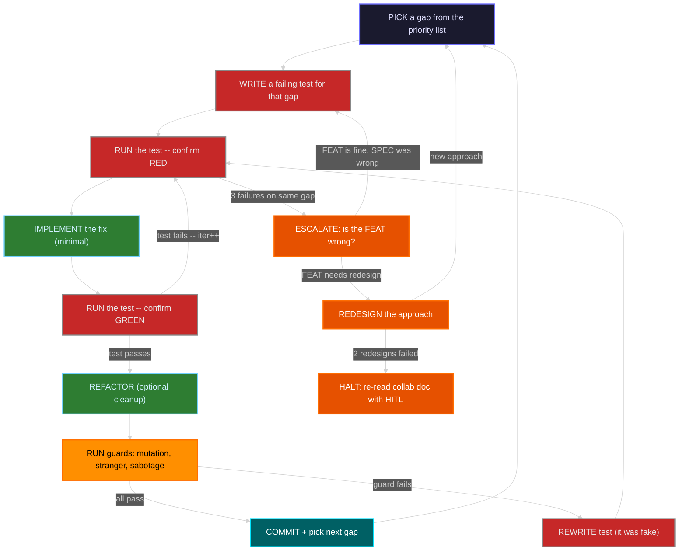
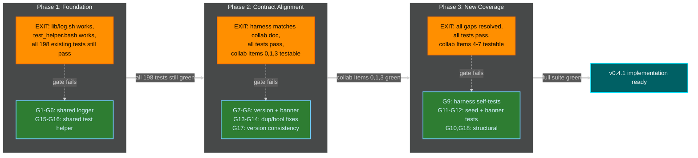
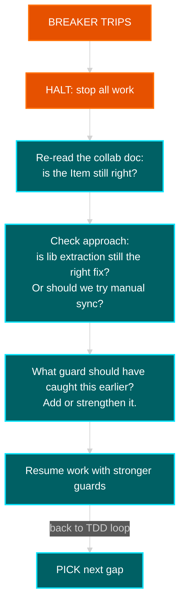
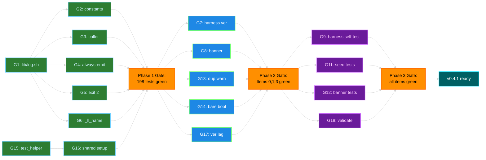

<!-- (c) 2026-* Frederick Bloom -- TestHarnessGapAnalysis.ai-hitl.analys-0.0.2.md -- Hanaden AI -->

# Test Harness Gap Analysis -- bwrap-enhanced 0.4.1

> **Version:** `0.0.2`
> **Status:** `COLLABORATING`
> **Created:** 2026-09-09T18:13:14.447957Z
> **Branch:** `0.4.1-a`
> **Type:** AI-HITL Analysis Document (companion to CliRevision collab)
> **Companion:** [CliRevision.ai-hitl.collab-0.0.2](20260909-013323-963842-7df1-b8be-96373f8cac1e-CliRevision.ai-hitl.collab-0.0.2.md)

---

## 0. How to Use These Two Documents Together

You have two documents in this folder. They serve different purposes and are meant to be used in sequence:

| Document | Role | Answers |
|----------|------|---------|
| **CliRevision collab** (this folder's other `.md`) | **WHAT** to build | "What does the CLI look like? What items are approved? What is the help text?" |
| **This gap analysis** | **HOW** to get there safely | "What's broken today? What order do we fix things? Where are the traps? How do we avoid death spirals?" |

### The workflow

1. **Open the collab doc.** Find an Item (0-7) with `[ ] APPROVED`. Get HITL approval -> `[x]`.
2. **Come here.** Look up that Item in the [Traceability Index](#11-traceability-index) below. It tells you which gaps (G1-G18) are involved and which test files / source files to touch.
3. **Follow the TDD micro-cycle** described in [Section 5](#5-the-tdd-micro-cycle----how-each-gap-gets-resolved). Write the test first. Watch it fail. Fix the code. Watch it pass. Run the guards. Commit.
4. **Check the breakers** in [Section 7](#7-circuit-breakers----when-to-stop-and-rethink). If anything trips, stop and re-read the collab doc before continuing.
5. **Repeat** until all Items are `[x] APPROVED` and all gaps are resolved.

The collab doc is the **contract**. This document is the **navigation chart**. Neither replaces the other.

---

## 1. The One Loop -- How It Actually Works

The SDLC engine (0.0.3 section 0.1) says there is **one** control loop. "Inner", "mid", "outer" are zoom levels of that same loop. Here is how it works in practice for this project, with the looping made explicit:



### How to read this diagram

**The main loop** is the rectangle path: PICK -> WRITE_TEST -> RUN_RED -> IMPLEMENT -> RUN_GREEN -> REFACTOR -> RUN_GUARDS -> COMMIT -> back to PICK. This is the "happy path" -- one gap resolved per cycle.

**The inner retry loop** is the arrow from RUN_GREEN back to RUN_RED. When your implementation doesn't pass the test, you go back and try again. This is normal. It's the RED->GREEN cycle of TDD.

**The guard loop** is the arrow from RUN_GUARDS back to REWRITE -> RUN_RED. When a guard (mutation/stranger/sabotage) fails, it means your test was fake -- it would pass even without the requirement. You rewrite the test and re-enter the TDD loop.

**The escalation path** fires after 3 failures on the same gap. This is the circuit breaker. It forces you to zoom out: is the feature definition wrong? Is the architecture wrong? If two redesigns also fail, you halt and go back to the collab doc with the human.

**The recursion** is that COMMIT -> PICK is the same loop starting over, but now you're one gap closer to done. Each pass through the loop reduces the gap count by one.

---

## 2. The Three Phases -- Successive Refinement

The 18 gaps don't all happen in a flat list. They have **dependencies**: you can't rewrite 198 test files to use a shared helper (G16) until the shared helper exists (G15). You can't test the harness banner (G8) until the shared logger works (G1).

So the work divides into three phases. Each phase is a complete pass through the one loop above, but scoped to a different set of gaps. Each phase has an **exit gate** -- a set of conditions that must be true before the next phase starts.



**Why three phases instead of just doing everything?** Because Phase 1 is infrastructure. If you change the logger and break it, every subsequent gap becomes harder to debug. If you change the test helper and break 198 tests, you can't tell whether the problem is the helper or the gap you're working on. So you stabilize the foundation first, then build on it.

---

## 3. The Logger -- The Biggest Gap (G1-G6)

This is the gap identified as a major concern. Two scripts have independently evolved copies of the same log system, and they have diverged in 6 critical ways.

### Where the code lives today

| Script | File | Logger lines |
|--------|------|-------------|
| **Main script** | `src/main/hanaden-bwrap-enhanced/bwrap-enhanced.sh` | Lines 78-131 |
| **Test harness** | `src/test/hanaden-bwrap-enhanced/bwrap-enhanced-test-harness-runner.sh` | Lines 44-92 |

### The 6 divergences

#### G1: Different constant names

**Main script** uses `_LOG_FATAL`, `_LOG_ERROR`, etc.
**Harness** uses `_LL_FATAL`, `_LL_ERROR`, etc.

This means you cannot `source` one into the other -- the names collide with different prefixes.

#### G2: Inverted parameter semantics

Both scripts have `_log()` with 3 positional args, but they mean different things:

| Param | Main script | Test harness |
|-------|------------|--------------|
| `$1` | `threshold` (max level to show) | `threshold` (same) |
| `$2` | `level` (message's severity) | `current` (caller's log level) |
| `$3` | `tag` (e.g. `[ERROR]`) | `label` (e.g. `ERROR`, no brackets) |

The main script checks `level <= threshold`. The harness checks `current >= threshold`. Same numeric outcome for the common case, but conceptually inverted.

#### G3: Caller introspection -- missing in harness

The main script includes `FUNCNAME[2]:BASH_LINENO[1]` in every log line (log4j-style). This is tested by LOG-LOC-001 and LOG-LOC-002.

The harness has no caller introspection. When the harness logs an error, you get `[ERROR] something went wrong` with no indication of which function or line produced it.

```
Main script output:   [ERROR] cmd_fsck:770 missing /usr directory
Harness output:       [ERROR] missing test suite directory
```

#### G4: ERROR/FATAL always-emit -- missing in harness

The main script has a short-circuit: `if level <= ERROR` -> always emit, regardless of threshold. This means `_error()` output is never suppressed, even at `--log-level FATAL`.

The harness has no such rule. At `--log-level FATAL`, harness `_error()` calls are **silently swallowed**.

#### G5: Different exit codes for _fatal()

| Script | `_fatal()` exit code |
|--------|---------------------|
| Main script | `exit 2` |
| Test harness | `exit 1` |

If anything checks exit codes from the harness, fatal errors look like regular errors.

#### G6: _ll_name() exists only in harness

The harness has a utility function `_ll_name()` that converts a numeric log level back to its name (e.g., `400` -> `INFO`). The main script doesn't have this. It should be in the shared library.

### The fix -- extract to `src/lib/log.sh`

The `src/lib/` directory already exists and the harness already `source`s from it (it uses `test-emit.sh`). The fix is:

1. Create `src/lib/log.sh` with the main script's logger (it has the better implementation -- caller introspection, always-emit)
2. Add a source guard (`[[ -n "${_LOG_SH_SOURCED:-}" ]] && return 0`)
3. Both scripts `source` it instead of having their own copies
4. Standardize on `_LOG_*` constants, `exit 2` for `_fatal()`, and the main script's `_log()` semantics

---

## 4. All 18 Gaps -- Summary with Collab Item Cross-Reference

| Gap | Description | Collab Item | Phase | Effort |
|-----|-------------|-------------|-------|--------|
| **G1** | Extract shared `lib/log.sh` | Item 5 (DRY) | 1 | Medium |
| **G2** | Consistent `_LOG_*` constant names | Item 5 (DRY) | 1 | Small |
| **G3** | Caller introspection in harness | Item 5 (DRY) | 1 | Small |
| **G4** | ERROR/FATAL always-emit in harness | Item 5 (DRY) | 1 | Small |
| **G5** | Consistent `_fatal()` exit code 2 | Item 5 (DRY) | 1 | Small |
| **G6** | `_ll_name()` in shared lib | Item 5 (DRY) | 1 | Small |
| **G7** | Harness version -> dynamic from VERSION | Item 0 | 2 | Small |
| **G8** | Harness banner -> `_emit_banner()` | Item 3 | 2 | Small |
| **G9** | Harness self-tests (test the test tool) | -- (new) | 3 | Large |
| **G10** | Black-box only constraint documented | Item 5 | 3 | Small |
| **G11** | `--seed X` tests don't exist | Item 4 | 3 | Large |
| **G12** | Banner emission tests don't exist | Item 3 | 3 | Medium |
| **G13** | Duplicate flag tests: ERROR -> WARNING | Item 1 | 2 | Medium |
| **G14** | Bool flag tests contradict bare-only spec | Item 1 | 2 | Medium |
| **G15** | Fragile `../../../../../../..` path in tests | -- (infra) | 1 | Medium |
| **G16** | No shared test helpers (`setup()` duplication) | -- (infra) | 1 | Medium |
| **G17** | Harness version inconsistency (0.2.0 vs 0.4.0) | Item 0 | 2 | Small |
| **G18** | No `--validate` mode in harness | -- (new) | 3 | Medium |

---

## 5. The TDD Micro-Cycle -- How Each Gap Gets Resolved

For **every** gap in the table above, the engineer (human or AI) follows this exact sequence. No shortcuts. No skipping RED.

### Step-by-step

1. **Pick the next gap** from Phase 1 (or Phase 2/3 if Phase 1's exit gate passed).
2. **Write the test first.** The test MUST fail before you write any implementation code. This is not negotiable -- SDLC 0.0.3 section 1.2 calls `NOT_STARTED -> GREEN` a TRANSITION_REJECTED. It's completion theater.
3. **Run the test. Confirm it fails (RED).** Record the failure. This is `first-failure` in the TDD state.
4. **Implement the minimal fix.** Only enough code to make the test pass. Not more.
5. **Run the test. Confirm it passes (GREEN).**
   - If it fails: increment the iteration counter, go back to step 4.
   - If it fails 3 times: **escalate**. The test or the feature definition may be wrong. See [Section 7](#7-circuit-breakers----when-to-stop-and-rethink).
6. **Refactor** if needed. Tests must stay green during refactor.
7. **Run the three guards** (see [Section 6](#6-guard-predicates----how-to-check-your-tests-are-real)):
   - Mutation test: introduce a deliberate bug -> does the test catch it?
   - Stranger test: could someone who didn't write the spec produce this test?
   - Sabotage test: remove the requirement -> does the test still pass?
8. **If all guards pass: commit.** If any guard fails: your test is fake. Rewrite it (go to step 2).
9. **Pick the next gap.** Repeat.

### How this maps to the SDLC one loop

| Step above | SDLC zoom level | SDLC event emitted |
|------------|-----------------|-------------------|
| 2 (write test) | SPEC (inner) | -- (preparation) |
| 3 (confirm RED) | SPEC (inner) | `TEST_FAIL` -> TDD state `RED` |
| 5 (confirm GREEN) | SPEC (inner) | `TEST_PASS` -> TDD state `GREEN` |
| 5 (fails again) | SPEC (inner) | `CODE_REGRESSION` -> stay `RED` |
| 5 (3 failures) | L3 (mid) | `INTEGRATION_FLAW` -> re-examine FEAT |
| 7 (guards) | SPEC (DONE gate) | `GUARD_PASSED` or `GUARD_BLOCKED` |
| 8 (commit) | Instance | `TRANSITION_COMMITTED` + `MERGE_READY` |

---

## 6. Guard Predicates -- How to Check Your Tests Are Real

These are not abstract concepts. They are concrete questions you ask about each test before marking a gap as DONE.

### Mutation test

> "I deliberately break the code. Does the test catch it?"

Example for G4 (always-emit):
```bash
# In lib/log.sh, REMOVE the always-emit short-circuit:
# - if [[ "$level" -le "${_LOG_ERROR}" ]] || [[ "$level" -le "$threshold" ]]; then
# + if [[ "$level" -le "$threshold" ]]; then
# Now run the test. If it still passes -> the test is FAKE.
```

### Stranger test

> "Could someone who never read the spec produce this test by observing the code?"

Example for G3 (caller introspection):
```bash
# Read only the _log() function. Can you see that it includes FUNCNAME[2]:BASH_LINENO[1]?
# Yes -> a stranger could write a test for this. Test is REAL.
# No -> the test is testing the spec's words, not the code's behavior. Rewrite.
```

### Sabotage test

> "I remove the requirement from the spec. Does the test still pass?"

Example for G5 (exit code):
```bash
# Remove "exit 2" from the spec. Now _fatal() exits with... what?
# If the test would still pass (because it doesn't check exit code) -> test is FAKE.
```

---

## 7. Circuit Breakers -- When to Stop and Rethink

These are concrete thresholds. When they trip, you stop writing code and go back to the collab doc.

| Breaker | Triggers when | What to do |
|---------|--------------|------------|
| **3-fail** | Same test fails 3 times after different implementations | Stop. Is the test wrong? Is the feature wrong? Is the architecture wrong? Escalate one level. |
| **Cascade** | Changing `test_helper.bash` breaks more than 20 of the 198 existing tests | Stop. The helper is too aggressive. Roll back, make a smaller change. |
| **Scope creep** | A single TDD cycle touches more than 5 files | Stop. You're doing too much at once. Split the gap into smaller gaps. |
| **HITL timeout** | 3 commits without human review | Stop. Show the human what you've done. Get approval before continuing. |
| **Regression** | A previously-green gap goes RED after working on a different gap | Stop. Something is coupled that shouldn't be. Find the coupling, add a test for it. |

### What happens when a breaker trips



---

## 8. Phase 1 Execution Detail -- Logger Extraction

This is the most critical phase because it touches shared infrastructure. Here is the exact sequence:

### Step 1: Create `src/lib/log.sh`

Write the shared library. Source guard. Constants. `_log()` with caller introspection and always-emit. Convenience wrappers. `_resolve_log_level()`. `_ll_name()`.

### Step 2: Write tests for `src/lib/log.sh`

These tests validate the library IN ISOLATION before either script uses it:

| Test file | What it checks |
|-----------|---------------|
| `suites/Infrastructure.feat/SharedLog.spec/test_shared_log.bats` | `_log` emits to stderr, includes caller:line, respects threshold, always-emits ERROR/FATAL |
| (same file) | `_fatal` exits 2, `_resolve_log_level` handles names and numbers, source guard prevents double-source |

### Step 3: Wire the main script

Replace lines 78-131 of `bwrap-enhanced.sh` with `source "${_LIB_DIR}/log.sh"`. Run the full existing test suite (198 files). Everything must still pass.

### Step 4: Wire the test harness

Replace lines 44-92 of `bwrap-enhanced-test-harness-runner.sh` with `source "${LIB_DIR}/log.sh"`. Run the harness subcommands manually. Everything must still work.

### Step 5: Create `test_helper.bash`

Shared BATS helper with `_resolve_project_home()` and `_create_temp_root()`. Source it from a few test files first (not all 198 at once -- cascade breaker).

### Phase 1 exit gate

- `[ ]` `lib/log.sh` exists and passes its own tests
- `[ ]` `bwrap-enhanced.sh` sources `lib/log.sh` instead of inline logger
- `[ ]` `bwrap-enhanced-test-harness-runner.sh` sources `lib/log.sh` instead of inline logger
- `[ ]` All 198 existing `.bats` tests still pass
- `[ ]` `test_helper.bash` exists (wired to a few files, not all)

---

## 9. Phases 2-3 Execution Summary

### Phase 2: Contract alignment (after Phase 1 gate passes)

Work through collab Items 0, 1, 3 in TDD micro-cycles:

1. **G7/G17** -- Harness version: make `_HARNESS_VERSION` dynamic from VERSION file, same as collab Item 0
2. **G8** -- Harness banner: implement `_emit_banner()` per collab Item 3 template
3. **G13** -- Duplicate flag: rewrite 10 tests from `exit 1 + [ERROR]` to `exit 0 + [WARN]`, then change `_err_duplicate()` -> `_warn_duplicate()` in the main script
4. **G14** -- Bool bare-only: resolve the open question (reject `true`? accept `true`? warn on `true`?) with HITL, then update tests + parser

### Phase 3: New test coverage (after Phase 2 gate passes)

Work through collab Items 4, 6, 7:

1. **G12** -- Create `BannerEmission.spec` with DBAN-001/002/003 tests
2. **G11** -- Create `SeedParsing.spec` and `SeedIdempotency.spec` tests, implement `--seed X`
3. **G18** -- Consider `--validate` mode for the harness
4. **G9** -- Write tests for the harness itself (the child SDLC instance -- test the test tool)

---

## 10. Dependency Map -- What Blocks What



---

## 11. Traceability Index

Every collab Item -> its gaps -> the test files and source files involved.

| Collab Item | Gaps | Test files to create/modify | Source files to modify | Spec files to update |
|-------------|------|---------------------------|----------------------|---------------------|
| **Item 0** | G7, G17 | `Dispatch.feat/VersionBanner.spec/test_version_banner.bats` | `bwrap-enhanced.sh:76`, `bwrap-enhanced-test-harness-runner.sh:34` | -- |
| **Item 1** | G13, G14 | `CliContract.feat/DuplicateFlagRejection.spec/`, `CliContract.feat/BoolFlagParsing.spec/`, `Dispatch.feat/SubcommandHelp.spec/` | `bwrap-enhanced.sh` (usage_top, _err_duplicate, _parse_bool_passthrough) | `ScopeVeryNarrow.bstorm-0.4.1.md` |
| **Item 3** | G8, G12 | `Dispatch.feat/BannerEmission.spec/test_banner_emission.bats` **(new)** | `bwrap-enhanced.sh` (_emit_banner, main), `bwrap-enhanced-test-harness-runner.sh` (_print_banner) | -- |
| **Item 4** | G11 | `CliContract.feat/SeedParsing.spec/test_seed_parsing.bats` **(new)**, `Provision.feat/SeedIdempotency.spec/test_seed_idempotency.bats` **(new)** | `bwrap-enhanced.sh` (provision parser, _provision_seed, fsck) | `ScopeVeryNarrow.bstorm-0.4.1.md` |
| **Item 5** | G1-G6, G10 | `Infrastructure.feat/SharedLog.spec/test_shared_log.bats` **(new)** | `src/lib/log.sh` **(new)**, `bwrap-enhanced.sh:78-131`, `bwrap-enhanced-test-harness-runner.sh:44-92` | -- |
| **Item 6** | -- | (read-only audit -- no new tests in 0.4.1) | -- | -- |
| **Item 7** | -- | -- | `BwrapEnhancedTooling.bstorm-0.4.0.md` (add SUPERSEDED header) | -- |
| **Infra** | G9, G15, G16, G18 | `test_helper.bash` **(new)**, harness self-test suite **(new)** | `bwrap-enhanced-test-harness-runner.sh` | -- |

---

## 12. HITL Decision Points -- Where Human Must Intervene

These are the points where the loop blocks on human input. The AI cannot proceed without explicit approval.

| # | Decision | When it fires | Collab ref |
|---|----------|--------------|------------|
| H1 | Approve lib/log.sh API contract (constant names, function signatures, source guard pattern) | Before Phase 1 begins | Item 5 |
| H2 | Resolve: `--net-passthrough true` -- reject? accept? warn? | Before G14 implementation | Item 1 open question |
| H3 | Confirm duplicate flag change: ERROR -> WARNING (10 tests change behavior) | Before G13 implementation | Item 1 line 128 |
| H4 | Approve harness version strategy (sync with project or independent semver?) | Before G7 implementation | Item 0 |
| H5 | Review Phase 1 merge (lib extraction complete, 198 tests still pass) | Phase 1 exit gate | -- |
| H6 | Review Phase 2 merge (harness aligned, contracts match collab doc) | Phase 2 exit gate | -- |
| H7 | Review Phase 3 merge (new coverage, harness self-tested) | Phase 3 exit gate | -- |
| H8 | Any breaker trip: human decides recovery path | Any phase | -- |

---

> **This document and the collab doc are both needed.** The collab doc says "build `--seed X`". This document says "but first extract the logger, because if you don't, the harness can't reliably report errors when your seed tests fail." One is the contract, the other is the navigation chart.
