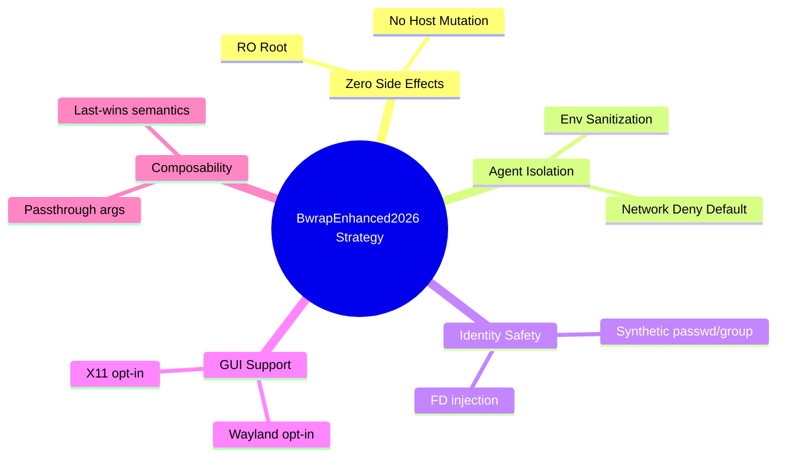

<!-- (c) 2026-* Frederick Bloom -- BwrapEnhanced2026.strat-0.0.1.md -- Hanaden AI Loader -->
---
filename-id:   20260816-182145-BwrapEnhanced2026.strat
node-type:     STRAT
layer:         0
version:       0.0.1
status:        Active
author:        Frederick Bloom
copyright:     (c) 2026-* Frederick Bloom
description: >
  Strategy: Provide a production-grade, zero-side-effect sandbox for AI agent execution
  via Linux user-namespace bubblewrap (bwrap) with a comprehensive CLI.
---

# BwrapEnhanced2026: Strategy

## Rationale

AI agents (LLMs, agentic loops, code interpreters) are fundamentally untrusted workloads.
They may generate and execute arbitrary shell commands, touch files, consume credentials,
exfiltrate data, or corrupt system state. Running them on bare metal or in a simple
`bash -c` subshell creates unacceptable production risk.

The strategy is to provide a single, composable, zero-dependency sandbox harness
(`bwrap-enhanced.sh`) that any AI orchestrator can call as a drop-in subprocess boundary.
The harness must be zero-mutation to the host (read-only root), zero-network by default,
zero-credential-leak (clear env), and zero-identity-confusion (synthetic identity files).

## Strategic Goals

## Decomposition

- **Driver:** UncontainedAgentExecution.driv — root cause being addressed
- **Motivation:** NamespaceIsolatedSandbox.moti — solution chosen
- **Architecture:** SandboxExecEngine.arch — system design
- **Features (9):** ZeroSideEffects, VfsIsolation, NetworkIsolation, EnvSanitization,
  IdentityInjection, HostShadowing, GuiPassthrough, PassthroughArgs, ForegroundHold
- **Specs (36):** One per leaf behavior (see SdlcHierarchyOverview)

## Changelog

| Version | Date | Author | Changes |
|---------|------|--------|---------|
| 0.0.1 | 2026-08-16 | Frederick Bloom + AI | Initial |
| 0.0.1 | 2026-08-17 | Frederick Bloom + AI | Enriched: Rationale, Mermaid mindmap |
