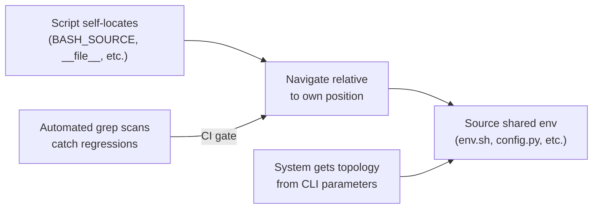

<!-- (c) 2026-* Frederick Bloom -- 20260827-000058-037414-72c3-97e6-c71ad41d483b-PortableProjectStructure.moti-0.0.1.md -- Hanaden AI -->
---
filename-id:   20260827-000058-037414-72c3-97e6-c71ad41d483b-PortableProjectStructure.moti-0.0.1
node-type:     MOTI
layer:         1
version:       0.0.1
status:        Active
author:        Frederick Bloom
copyright:     (c) 2026-* Frederick Bloom
description: >
  Motivation: Solve HostCoupledDevelopment via relative resource discovery,
  parameter-driven configuration, and automated enforcement scans.
---

# PortableProjectStructure: Motivation (Solution Channel)

## Rationale

All file references in the project MUST be relative to the referencing file's
own filesystem position. Scripts discover resources at runtime using
language-appropriate self-location mechanisms. Spec documents describe
observable sandbox behavior in terms of the sandbox's own parameters, never
in terms of host-specific filesystem mechanisms.

## Solution Architecture

## Key Principles (Language-Agnostic)

1. **Self-locating:** every script/program finds its own directory first
2. **Relative navigation:** resources found by walking relative paths from self
3. **Parameter-driven:** runtime topology comes from CLI args, not assumptions
4. **Enforcement:** automated scans prevent regression to hardcoded paths
5. **Spec purity:** specs describe behavior, not host mechanisms

## Decomposition

- **Feature:** PortabilityEnforcement.feat
