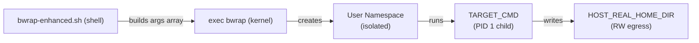

<!-- (c) 2026-* Frederick Bloom -- NamespaceIsolatedSandbox.moti-0.0.1.md -- Hanaden AI Loader -->
---
filename-id:   20260816-182145-NamespaceIsolatedSandbox.moti
node-type:     MOTI
layer:         1
version:       0.0.1
status:        Active
author:        Frederick Bloom
copyright:     (c) 2026-* Frederick Bloom
description: >
  Motivation: Solve UncontainedAgentExecution via Linux user namespaces + bubblewrap.
  Unprivileged user-namespace sandbox providing RO root, network isolation, env sanitization.
---

# NamespaceIsolatedSandbox: Motivation

## Rationale

Linux user namespaces (available since kernel 3.8, enabled by default in modern distros)
allow unprivileged processes to create isolated filesystem, network, and PID namespaces
without root. Bubblewrap (bwrap) is the battle-hardened implementation used by Flatpak
and systemd. It provides a composable CLI for building sandbox configurations.

The key insight: `bwrap --bind HOST_ROOT / --remount-ro /` creates a perfect read-only
view of the entire host system inside a namespace, with zero chance of host mutation.

## Solution Architecture

## Why bwrap vs Docker/Podman

| Feature | bwrap | Docker |
|---------|-------|--------|
| Requires root/daemon | No | Yes (daemon) |
| Zero side effects on host | Yes | No (image layers) |
| Startup latency | < 50ms | 500ms+ |
| Single binary | Yes | No |
| Composable CLI | Yes | Limited |

## Changelog

| Version | Date | Author | Changes |
|---------|------|--------|---------|
| 0.0.1 | 2026-08-16 | Frederick Bloom + AI | Initial |
| 0.0.1 | 2026-08-17 | Frederick Bloom + AI | Enriched: Rationale, comparison table, solution Mermaid |
