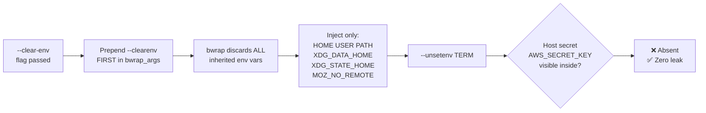

<!-- (c) 2026-* Frederick Bloom -- 20260816-101335-439238-2dda-d806-82ae3c4c4c1b-EnvStrip.spec-0.0.1.md -- Hanaden AI Loader -->
---
filename-id:   20260816-101335-439238-2dda-d806-82ae3c4c4c1b-EnvStrip.spec
node-type:     SPEC
layer:         4
spec-domain:   SEC
version:       0.0.1
status:        Implemented
author:        Frederick Bloom
copyright:     (c) 2026-* Frederick Bloom
description: >
  When --clear-env is passed, bwrap --clearenv MUST be prepended FIRST in bwrap_args.
  All host environment variables MUST be discarded. Only explicitly injected vars
  (HOME, USER, PATH, XDG_DATA_HOME, XDG_STATE_HOME, MOZ_NO_REMOTE) are visible
  inside. TERM MUST be explicitly unset to prevent escape-code corruption.
parent:        20260816-101335-229795-bd24-f66d-e833628900cd-EnvSanitization.feat
leaf-value:    "--clearenv prepended first; TERM unset; only injected vars visible"
leaf-unit:     "env var count"
tdd:
  test-file:      src/test/hanaden-bwrap-enhanced/BwrapEnhanced2026.strat/UncontainedAgentExecution.driv/NamespaceIsolatedSandbox.moti/EnvSanitization.feat/EnvStrip.spec/test_env_strip.sh
---

# EnvStrip: --clear-env Discards All Host Environment Variables

## Specification Statement

When `--clear-env` is passed, `--clearenv` MUST be the FIRST argument in `bwrap_args`
(prepended, not appended). All host environment variables MUST be stripped. Only the
explicitly `--setenv`-injected variables survive: `HOME`, `USER`, `PATH`,
`XDG_DATA_HOME`, `XDG_STATE_HOME`, `MOZ_NO_REMOTE`. `TERM` MUST be explicitly
unset via `--unsetenv TERM`.

## Rationale

AI agents are frequently invoked by orchestrators that carry sensitive API keys, cloud
credentials, and database URLs in their environment. These vars must not reach the agent
sandbox:
- `AWS_SECRET_ACCESS_KEY`, `OPENAI_API_KEY`, `ANTHROPIC_API_KEY` — cloud API keys
- `DATABASE_URL`, `REDIS_URL` — database connection strings
- `KUBECONFIG` — Kubernetes cluster access
- `GITHUB_TOKEN`, `NPM_TOKEN` — repository access tokens

`--clearenv` is the only reliable way to prevent host environment leakage. TERM is
explicitly unset because some tools read it to configure terminal output — a leaked
TERM could cause display corruption or be used to fingerprint the host terminal.

`--clearenv` must be FIRST in bwrap_args because bwrap processes args left-to-right:
if --setenv HOME is before --clearenv, HOME is cleared; if --clearenv is first, then
subsequent --setenv calls correctly inject only the desired vars.

## Constraints

| Constraint | Value | Condition |
|------------|-------|-----------|
| --clearenv position in bwrap_args | First (index 0) | With --clear-env |
| Host vars visible inside | 0 | With --clear-env |
| Injected vars visible | HOME USER PATH XDG_DATA_HOME XDG_STATE_HOME MOZ_NO_REMOTE | With --clear-env |
| TERM visible inside | Not visible (--unsetenv TERM) | With --clear-env |
| Total env var count inside | ≤ 10 | With --clear-env |

## Leaf Value

> 🛑 **Primitive** — terminal specification.

**Value:** `--clearenv` first in bwrap_args; 0 host vars; only injected vars visible
**Source:** bwrap-enhanced.sh L490-L530 (CLEAR_ENV=true branch)

## Measurement Method

```bash
# Export a secret on host, verify absent inside:
export AWS_SECRET_ACCESS_KEY="top-secret-key-$$"
./bwrap-enhanced.sh ... --clear-env -- env | grep AWS_SECRET
# Expected: no output (empty)

# Verify TERM is not set:
./bwrap-enhanced.sh ... --clear-env -- bash -c 'echo "TERM=${TERM:-UNSET}"'
# Expected: TERM=UNSET

# Verify HOME is set correctly:
./bwrap-enhanced.sh ... --clear-env -- bash -c 'echo $HOME'
# Expected: /home/VUSER

# Count total env vars:
./bwrap-enhanced.sh ... --clear-env -- env | wc -l
# Expected: ≤ 10
```

## Test Suite

> **Suite ID:** 20260816-101335-439238-2dda-d806-82ae3c4c4c1b-EnvStrip.spec-SUITE

### ⚙️ Functional Tests

| ID | Description | Method | Pass Criteria | TDD |
|----|-------------|--------|---------------|-----|
| ES-001 | Host secret absent with --clear-env | `export SEC=x; env` inside | SEC absent | NOT_STARTED |
| ES-002 | TERM unset with --clear-env | `echo $TERM` inside | empty | NOT_STARTED |
| ES-003 | HOME injected correctly | `echo $HOME` inside | /home/VUSER | NOT_STARTED |
| ES-004 | USER injected correctly | `echo $USER` inside | VIRTUAL_USER_NAME | NOT_STARTED |
| ES-005 | PATH injected correctly | `echo $PATH` inside | /usr/bin:/bin (at minimum) | NOT_STARTED |
| ES-006 | Total env count minimal | `env \| wc -l` inside | ≤ 10 | NOT_STARTED |

### 🛡️ Security Tests

| ID | Description | Attack / Scenario | Expected Defense | TDD |
|----|-------------|-------------------|------------------|-----|
| ES-S001 | API key leakage | `OPENAI_API_KEY=sk-xxx env` inside (--clear-env) | Key absent | NOT_STARTED |
| ES-S002 | DB credential leakage | `DATABASE_URL=postgres://... env` inside | URL absent | NOT_STARTED |
| ES-S003 | Kubeconfig leakage | `KUBECONFIG=~/.kube/config env` inside | KUBECONFIG absent | NOT_STARTED |

## References

- bwrap-enhanced.sh L490-L530 (CLEAR_ENV conditional: --clearenv prepend + --unsetenv TERM)

## Changelog

| Version | Date | Author | Changes |
|---------|------|--------|---------|
| 0.0.1 | 2026-08-16 | Frederick Bloom + AI | Initial spec |
| 0.0.1 | 2026-08-17 | Frederick Bloom + AI | Enrich: Rationale with real secrets examples, Measurement Method, security tests |

## Behavioral Flow


