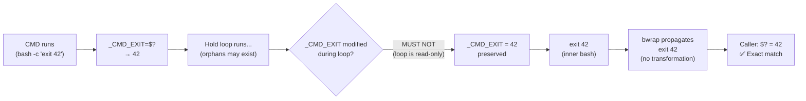

<!-- (c) 2026-* Frederick Bloom -- 20260816-182145-362408-7fa0-bbf1-933d901d0f1f-ExitCodePreserved.spec-0.0.1.md -- Hanaden AI Loader -->
---
filename-id:   20260816-182145-362408-7fa0-bbf1-933d901d0f1f-ExitCodePreserved.spec
node-type:     SPEC
layer:         4
spec-domain:   FUNC
version:       0.0.1
status:        Implemented
author:        Frederick Bloom
copyright:     (c) 2026-* Frederick Bloom
description: >
  The sandbox MUST exit with exactly the same exit code as TARGET_CMD. The inner bash
  captures _CMD_EXIT=$? immediately after "$@", runs the orphan hold loop (which does
  not modify _CMD_EXIT), then calls exit "$_CMD_EXIT". The outer sandbox process
  (bwrap) propagates this exit code to the caller.
parent:        20260816-101335-883684-8118-6a29-86cf4df2ae9f-ForegroundHold.feat
leaf-value:    "sandbox exit code == CMD exit code (0-255)"
leaf-unit:     "exit code equality"
tdd:
  test-file:      src/test/hanaden-bwrap-enhanced/BwrapEnhanced2026.strat/UncontainedAgentExecution.driv/NamespaceIsolatedSandbox.moti/ForegroundHold.feat/ExitCodePreserved.spec/test_exit_code_preserved.sh
---

# ExitCodePreserved: CMD Exit Code Propagates Through Sandbox to Caller

## Specification Statement

The exit code of `bwrap-enhanced.sh` MUST equal the exit code of `TARGET_CMD`.
Specifically: `_CMD_EXIT=$?` is captured immediately after `"$@"`, the hold loop
does not modify it, and `exit "$_CMD_EXIT"` is the final statement of the inner bash.
bwrap propagates the inner bash exit code to the caller without modification.

## Rationale

Exit codes are the primary signal mechanism between processes. CI systems, orchestrators,
and shell scripts rely on exit codes to determine whether a sandboxed command succeeded.
If the sandbox always returned 0 (or any code other than CMD's actual exit code), all
error detection would be broken — failed builds would appear to succeed, test failures
would be masked, and security scans would be muted.

The exact propagation chain: `CMD exit code → _CMD_EXIT → exit "$_CMD_EXIT" → inner
bash exit → bwrap exit → caller $?`.

## Constraints

| Constraint | Value | Condition |
|------------|-------|-----------|
| _CMD_EXIT captured | immediately after "$@" | Always |
| Hold loop modifies _CMD_EXIT | MUST NOT | Always |
| final exit statement | exit "$_CMD_EXIT" | Always |
| Sandbox exit code | == CMD exit code | 0-255 |
| Orphan children do not affect exit code | yes (loop exits after orphans, then uses _CMD_EXIT) | Always |

## Leaf Value

> 🛑 **Primitive** — terminal specification.

**Value:** `sandbox $? == CMD $?` for all exit codes 0-255
**Source:** bwrap-enhanced.sh L544-L565 (`_CMD_EXIT=$?` + hold loop + `exit "$_CMD_EXIT"`)

## Measurement Method

```bash
for expected_code in 0 1 42 127 255; do
  actual=$(./bwrap-enhanced.sh ... -- bash -c "exit $expected_code"; echo $?)
  [ "$actual" = "$expected_code" ] \
    && echo "PASS: exit $expected_code preserved" \
    || echo "FAIL: expected $expected_code got $actual"
done
```

## Test Suite

> **Suite ID:** 20260816-182145-362408-7fa0-bbf1-933d901d0f1f-ExitCodePreserved.spec-SUITE
> **Suite name:** Exit Code Preserved Spec Suite

### ⚙️ Functional Tests

| ID | Description | Method | Pass Criteria | TDD |
|----|-------------|--------|---------------|-----|
| ECP-001 | Exit 0 preserved | `/bin/true` → $? | 0 | NOT_STARTED |
| ECP-002 | Exit 1 preserved | `/bin/false` → $? | 1 | NOT_STARTED |
| ECP-003 | Exit 42 preserved | `bash -c 'exit 42'` → $? | 42 | NOT_STARTED |
| ECP-004 | Exit 127 preserved | `bash -c 'notfound_$$'` → $? | 127 | NOT_STARTED |
| ECP-005 | Exit 255 preserved | `bash -c 'exit 255'` → $? | 255 | NOT_STARTED |
| ECP-006 | Orphan hold does not alter code | `(sleep 1 &); exit 42` → $? | 42 | NOT_STARTED |

## References

- bwrap-enhanced.sh L544-L565 (inner bash: _CMD_EXIT=$? → hold loop → exit "$_CMD_EXIT")

## Changelog

| Version | Date | Author | Changes |
|---------|------|--------|---------|
| 0.0.1 | 2026-08-16 | Frederick Bloom + AI | Initial spec |
| 0.0.1 | 2026-08-17 | Frederick Bloom + AI | Enrich: Rationale (CI/CD exit code criticality), full measurement method, 0-255 test matrix |

## Behavioral Flow


