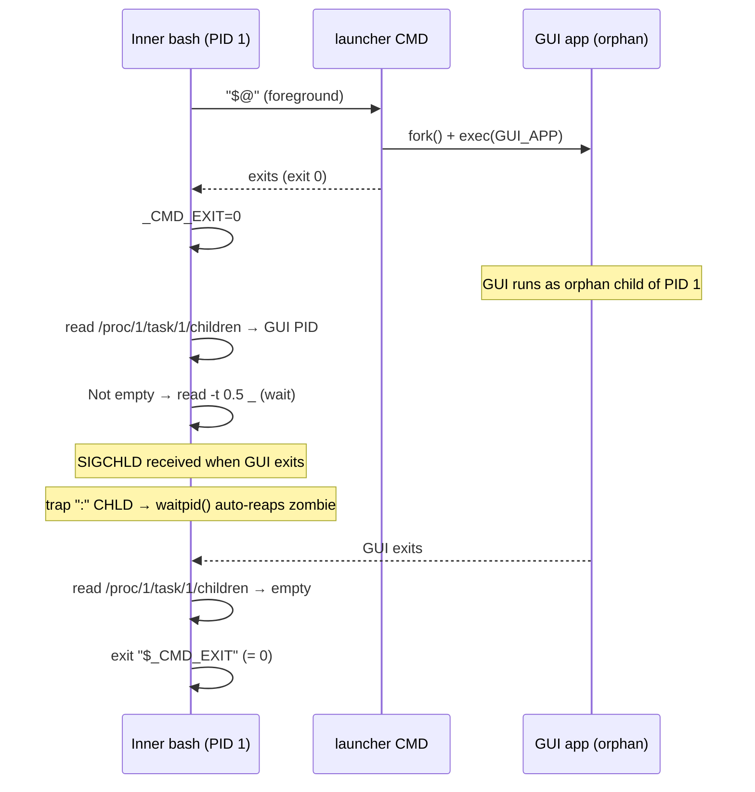

<!-- (c) 2026-* Frederick Bloom -- 20260816-101335-950898-408b-602c-e42f7f0c5658-OrphanReap.spec-0.0.1.md -- Hanaden AI Loader -->
---
filename-id:   20260816-101335-950898-408b-602c-e42f7f0c5658-OrphanReap.spec
node-type:     SPEC
layer:         4
spec-domain:   FUNC
version:       0.0.1
status:        Implemented
author:        Frederick Bloom
copyright:     (c) 2026-* Frederick Bloom
description: >
  After CMD exits, the inner bash MUST poll /proc/1/task/1/children until empty.
  A SIGCHLD trap (trap ":" CHLD) MUST auto-reap zombie children. The sandbox MUST
  NOT exit while orphaned child processes (e.g., GUI apps) are still running.
  When all children have exited, the sandbox exits with _CMD_EXIT.
parent:        20260816-101335-883684-8118-6a29-86cf4df2ae9f-ForegroundHold.feat
leaf-value:    "poll /proc/1/task/1/children until empty; trap SIGCHLD for zombie reaping"
leaf-unit:     "hold mechanism"
tdd:
  test-file:      src/test/hanaden-bwrap-enhanced/BwrapEnhanced2026.strat/UncontainedAgentExecution.driv/NamespaceIsolatedSandbox.moti/ForegroundHold.feat/OrphanReap.spec/test_orphan_reap.sh
---

# OrphanReap: Hold Loop Waits for Orphan Children; SIGCHLD Reaps Zombies

## Specification Statement

After `"$@"` exits:
1. `trap ":" CHLD` MUST be set before CMD execution to auto-reap SIGCHLD signals
2. The hold loop MUST read `/proc/1/task/1/children` every ~0.5s
3. The loop MUST NOT exit until the children file is empty
4. When all orphans exit, `exit "$_CMD_EXIT"` MUST be called

## Rationale

GUI applications commonly use the fork-exec-parent-exits pattern:
```
launcher_process() {
    fork() → gui_child_process
    exec(GUI_APP)   // parent exits after fork
}
```
The launcher exits immediately (exit 0), but the GUI app continues as an orphan child
of PID 1. Without the hold loop, PID 1 (inner bash) would exit immediately after
the launcher exits, destroying the sandbox namespace and killing the GUI app.

The SIGCHLD trap prevents zombie accumulation: when a child exits, the kernel sends
SIGCHLD to PID 1. The trap handler (`:` = no-op) causes bash to call `waitpid()`,
harvesting the exit status and removing the zombie from the process table.

## Constraints

| Constraint | Value | Condition |
|------------|-------|-----------|
| SIGCHLD trap | `trap ":" CHLD` set before "$@" | Always |
| Poll source | /proc/1/task/1/children | Always |
| Poll interval | ~0.5s via `read -t 0.5 _` | Always |
| Hold condition | children file non-empty | Always |
| Exit condition | children file empty | Always |
| Exit code after hold | _CMD_EXIT (CMD's code, not orphan's) | Always |

## Leaf Value

> 🛑 **Primitive** — terminal specification.

**Value:** `trap ":" CHLD` + hold loop on `/proc/1/task/1/children`
**Source:** bwrap-enhanced.sh L533-L565

## Measurement Method

```bash
# CMD that forks a 2s child then exits with code 42:
time ./bwrap-enhanced.sh ... -- bash -c '(sleep 2 &); exit 42'
# Expected:
# wall time: ~2s (waits for orphan sleep 2)
# exit code: 42 (CMD exit code, not orphan exit code)

# Verify no zombie after sandbox exits:
./bwrap-enhanced.sh ... -- bash -c '(sleep 0.5 &)'
sleep 1
ps aux | grep -c 'Z '   # Expected: 0 (no zombies)
```

## Test Suite

> **Suite ID:** 20260816-101335-950898-408b-602c-e42f7f0c5658-OrphanReap.spec-SUITE

### ⚙️ Functional Tests

| ID | Description | Method | Pass Criteria | TDD |
|----|-------------|--------|---------------|-----|
| OR-001 | Hold for 2s orphan | `(sleep 2 &); exit 0` as CMD; measure time | ~2s | NOT_STARTED |
| OR-002 | CMD exit code preserved through hold | `(sleep 1 &); exit 42` → $? | 42 | NOT_STARTED |
| OR-003 | Multiple orphans: waits for last | `(sleep 1 &); (sleep 2 &); exit 0` | ~2s | NOT_STARTED |
| OR-004 | No zombies after sandbox exit | ps check after sandbox | 0 Z-state | NOT_STARTED |
| OR-005 | Static: `trap ":" CHLD` in payload | grep payload in script | CHLD trap present | NOT_STARTED |

## References

- bwrap-enhanced.sh L533-L565 (trap CHLD, "$@", _CMD_EXIT, hold loop, exit)
- proc(5) — /proc/[pid]/task/[tid]/children — kernel children list
- bash(1) — trap ":" CHLD — SIGCHLD handler + waitpid() semantics

## Changelog

| Version | Date | Author | Changes |
|---------|------|--------|---------|
| 0.0.1 | 2026-08-16 | Frederick Bloom + AI | Initial spec |
| 0.0.1 | 2026-08-17 | Frederick Bloom + AI | Enrich: Rationale (fork-exec-parent-exits pattern), SIGCHLD zombie explanation, Measurement Method |

## Behavioral Flow: Fork-Exec-Parent-Exits Pattern


