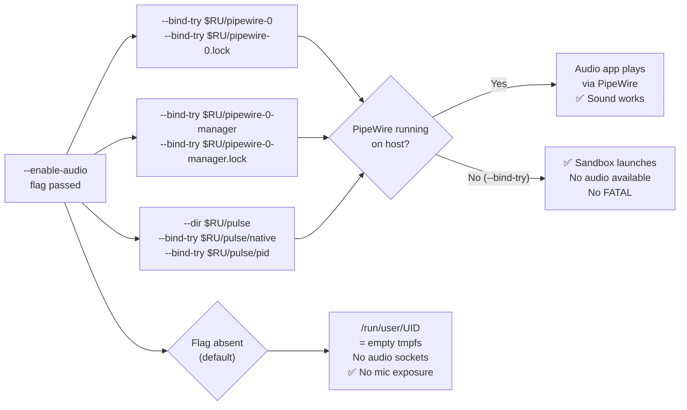

<!-- (c) 2026-* Frederick Bloom -- 20260818-042727-6a120c28-1028-4fd4-AudioPassthrough.spec-0.0.1.md -- Hanaden AI Loader -->
---
filename-id:   20260818-042727-6a120c28-1028-4fd4-AudioPassthrough.spec
node-type:     SPEC
layer:         4
spec-domain:   FUNC
version:       0.0.1
status:        Implemented
author:        Frederick Bloom
copyright:     (c) 2026-* Frederick Bloom
description: >
  When --enable-audio is passed, PipeWire and PulseAudio sockets under
  /run/user/UID MUST be RW-bound into the sandbox: pipewire-0, pipewire-0.lock,
  pipewire-0-manager, pipewire-0-manager.lock, pulse/native, pulse/pid.
  Without --enable-audio, no audio sockets are present in the sandbox.
parent:        20260816-182145-GuiPassthrough.feat
leaf-value:    "--bind-try pipewire-0 + pipewire-0-manager + pulse/native + pulse/pid"
leaf-unit:     "RW socket bind-mounts (try)"
tdd:
  test-file:      src/test/hanaden-bwrap-enhanced/BwrapEnhanced2026.strat/UncontainedAgentExecution.driv/NamespaceIsolatedSandbox.moti/GuiPassthrough.feat/AudioPassthrough.spec/test_audio_passthrough.sh
---

# AudioPassthrough: PipeWire and PulseAudio Sockets RW-Bound When --enable-audio

## Specification Statement

With `--enable-audio`: the following sockets under `/run/user/$(id -u)` MUST be
RW-bound via `--bind-try` (silently skipped if absent):

- `pipewire-0` — PipeWire main socket
- `pipewire-0.lock` — PipeWire lock file
- `pipewire-0-manager` — PipeWire session manager socket
- `pipewire-0-manager.lock` — PipeWire session manager lock
- `pulse/` — PulseAudio directory (created via `--dir`)
- `pulse/native` — PulseAudio native socket
- `pulse/pid` — PulseAudio PID file

Without `--enable-audio`, NONE of these paths MUST be present in the sandbox's
`/run/user/UID` tmpfs.

## Rationale

AI agents that run browser automation (Playwright, Puppeteer recording audio),
video processing (ffmpeg with ALSA), or voice interface testing require audio
output from the sandboxed process to be audible on the host. PipeWire is the
modern Linux audio server (Debian 12+) that multiplexes access to the sound card.
PulseAudio compatibility is preserved via PipeWire's PulseAudio emulation layer.

All sockets are RW-bound (not RO) because audio protocol communication is
bidirectional — the client writes audio frames and receives server acknowledgments.
Using `--bind-try` (not `--bind`) means the sandbox launches successfully even on
systems without PipeWire running (headless CI servers, containers).

The security tradeoff: audio socket access gives the sandbox the ability to capture
microphone input as well as play audio — hence opt-in rather than default.

## Constraints

| Constraint | Value | Condition |
|------------|-------|-----------|
| pipewire-0 | RW-bound (--bind-try) | With --enable-audio |
| pipewire-0.lock | RW-bound (--bind-try) | With --enable-audio |
| pipewire-0-manager | RW-bound (--bind-try) | With --enable-audio |
| pipewire-0-manager.lock | RW-bound (--bind-try) | With --enable-audio |
| pulse/native | RW-bound (--bind-try) | With --enable-audio |
| pulse/pid | RW-bound (--bind-try) | With --enable-audio |
| Sandbox fails if sockets absent | MUST NOT (--bind-try) | Always |
| Default: no audio sockets | yes (empty /run/user/UID tmpfs) | Without --enable-audio |

## Leaf Value

> 🛑 **Primitive** — terminal specification.

**Value:** 7 RW socket binds via `--bind-try` under `/run/user/UID`; 0 audio sockets without flag
**Source:** bwrap-enhanced.sh L367-L378

## Measurement Method

```bash
_RU="/run/user/$(id -u)"

# With --enable-audio (on system with PipeWire running):
./bwrap-enhanced.sh ... --enable-audio -- bash -c \
  'stat /run/user/$(id -u)/pipewire-0 2>&1'
# Expected: socket file exists (or "No such file" if PipeWire not running on host)

# Verify --bind-try: no FATAL if pipewire absent
./bwrap-enhanced.sh ... --enable-audio -- /bin/true
# Expected: exit 0 (even if PipeWire not running on host)

# Without --enable-audio: sockets absent
./bwrap-enhanced.sh ... -- bash -c \
  'stat /run/user/$(id -u)/pipewire-0 2>&1'
# Expected: "No such file or directory"

# PulseAudio via PipeWire compat:
./bwrap-enhanced.sh ... --enable-audio -- bash -c \
  'pactl info 2>&1 | head -2'
# Expected: PulseAudio/PipeWire server info
```

## Test Suite

> **Suite ID:** 20260818-042727-6a120c28-1028-4fd4-AudioPassthrough.spec-SUITE

### ⚙️ Functional Tests

| ID | Description | Method | Pass Criteria | TDD |
|----|-------------|--------|---------------|-----|
| AUD-001 | pipewire-0 accessible with --enable-audio | `stat $RU/pipewire-0` inside | socket exists (if PW running) | NOT_STARTED |
| AUD-002 | pulse/native accessible with --enable-audio | `stat $RU/pulse/native` inside | socket exists (if PW running) | NOT_STARTED |
| AUD-003 | --enable-audio succeeds on system without PipeWire | run /bin/true | exit 0 | NOT_STARTED |
| AUD-004 | Default: no audio sockets | `stat $RU/pipewire-0` inside (no flag) | ENOENT | NOT_STARTED |
| AUD-005 | pactl connects via PipeWire compat | `pactl info` inside (with --enable-audio) | server name shown | NOT_STARTED |
| AUD-006 | pulse/ dir created | `test -d $RU/pulse` inside | exit 0 | NOT_STARTED |

### 🛡️ Security Tests

| ID | Description | Attack / Scenario | Expected Defense | TDD |
|----|-------------|-------------------|------------------|-----|
| AUD-S001 | No audio capture without flag | record mic inside (no flag) | no audio socket → ENOENT | NOT_STARTED |
| AUD-S002 | Audio socket RW (not RO) | write audio frame to pipewire-0 | succeeds (bidirectional IPC) | NOT_STARTED |

## References

- bwrap-enhanced.sh L367-L378 (ENABLE_AUDIO block: 7 --bind-try calls)
- GuiPassthrough.feat (parent feature)
- pipewire(1) — PipeWire multimedia server

## Changelog

| Version | Date | Author | Changes |
|---------|------|--------|---------|
| 0.0.1 | 2026-08-18 | Frederick Bloom + AI | Initial spec — reverse-engineered from bwrap-enhanced.sh L367-L378 |

## Behavioral Flow


