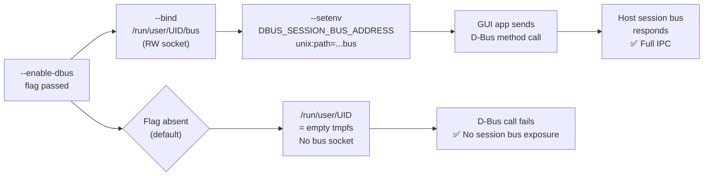

<!-- (c) 2026-* Frederick Bloom -- 20260816-182145-376278-7ed0-be5e-7bcf52516b09-DbusIpcWritable.spec-0.0.1.md -- Hanaden AI Loader -->
---
filename-id:   20260816-182145-376278-7ed0-be5e-7bcf52516b09-DbusIpcWritable.spec
node-type:     SPEC
layer:         4
spec-domain:   FUNC
version:       0.0.1
status:        Implemented
author:        Frederick Bloom
copyright:     (c) 2026-* Frederick Bloom
description: >
  When --enable-dbus is passed, the D-Bus session socket
  (/run/user/UID/bus) MUST be RW-bound and DBUS_SESSION_BUS_ADDRESS injected.
  Without this flag, /run/user/UID is a fresh empty tmpfs with no D-Bus socket.
parent:        20260816-182145-GuiPassthrough.feat
leaf-value:    "--bind /run/user/UID/bus + DBUS_SESSION_BUS_ADDRESS injected"
leaf-unit:     "socket bind + env var"
tdd:
  test-file:      src/test/hanaden-bwrap-enhanced/BwrapEnhanced2026.strat/UncontainedAgentExecution.driv/NamespaceIsolatedSandbox.moti/GuiPassthrough.feat/DbusIpcWritable.spec/test_dbus_ipc_writable.sh
---

# DbusIpcWritable: D-Bus Session Socket RW-Bound When --enable-dbus

## Specification Statement

With `--enable-dbus`: `/run/user/$(id -u)/bus` MUST be RW-bound from host
into the sandbox. `DBUS_SESSION_BUS_ADDRESS` MUST be injected pointing to that socket.
Without this flag, the `/run/user/UID` tmpfs has no D-Bus socket.

## Rationale

Many GUI apps (GNOME apps, KDE apps, system notification daemons) communicate via the
D-Bus session bus. Without the bus, these apps fail silently or crash. The socket is
RW-bound (not RO) because D-Bus communication is bidirectional — the client writes
method calls and receives signals. The `--enable-dbus` flag gives callers
a way to opt in to full D-Bus access when running GNOME/KDE apps in the sandbox.

The security tradeoff: D-Bus access gives the sandboxed process access to the host's
session bus, which may include sensitive services (e.g., secret service, org.freedesktop.NetworkManager).
Hence opt-in rather than default.

> **Scope Note:** `DbusIpcWritable.spec` specifies the single ENABLE_DBUS conditional
> block (L386–L394) that runs when `ENABLE_DBUS=true`, regardless of how that variable
> was set. `GnomePassthrough.spec` and `KdePassthrough.spec` specify the additional
> service sockets bound by their respective flags and the fact that they imply
> `--enable-dbus` via the CLI parser. The D-Bus `bus` socket bind itself is owned
> by this spec; Gnome/KDE specs own their own service sockets only.

## Constraints

| Constraint | Value | Condition |
|------------|-------|-----------|
| /run/user/UID/bus | RW-bound | With --enable-dbus |
| DBUS_SESSION_BUS_ADDRESS | injected | With --enable-dbus |
| Default: /run/user/UID | empty tmpfs | Without --enable-dbus |

## Leaf Value

> 🛑 **Primitive** — terminal specification.

**Value:** RW bind of D-Bus socket + DBUS_SESSION_BUS_ADDRESS env var injected
**Source:** bwrap-enhanced.sh L330-L342

## Measurement Method

```bash
# With --enable-dbus:
./bwrap-enhanced.sh ... --enable-dbus -- bash -c \
  'echo $DBUS_SESSION_BUS_ADDRESS'
# Expected: unix:path=/run/user/UID/bus

./bwrap-enhanced.sh ... --enable-dbus -- busctl --user list 2>&1 | head -3
# Expected: list of D-Bus services

# Without:
./bwrap-enhanced.sh ... -- bash -c 'echo ${DBUS_SESSION_BUS_ADDRESS:-UNSET}'
# Expected: UNSET
```

## Test Suite

> **Suite ID:** 20260816-182145-376278-7ed0-be5e-7bcf52516b09-DbusIpcWritable.spec-SUITE

### ⚙️ Functional Tests

| ID | Description | Method | Pass Criteria | TDD |
|----|-------------|--------|---------------|-----|
| DBU-001 | DBUS_SESSION_BUS_ADDRESS set | `echo $DBUS_SESSION_BUS_ADDRESS` inside | unix:path=... | NOT_STARTED |
| DBU-002 | D-Bus socket accessible | `stat /run/user/$(id -u)/bus` inside | exists | NOT_STARTED |
| DBU-003 | busctl connects | `busctl --user list` inside | services listed | NOT_STARTED |
| DBU-004 | Default: D-Bus not accessible | `echo ${DBUS_SESSION_BUS_ADDRESS:-UNSET}` | UNSET | NOT_STARTED |

## References

- bwrap-enhanced.sh L386-L394 (--enable-dbus handling)

## Changelog

| Version | Date | Author | Changes |
|---------|------|--------|---------|
| 0.0.1 | 2026-08-16 | Frederick Bloom + AI | Initial spec |
| 0.0.1 | 2026-08-17 | Frederick Bloom + AI | Enrich: Rationale (security tradeoff), Measurement Method, Leaf Value |

## Behavioral Flow


