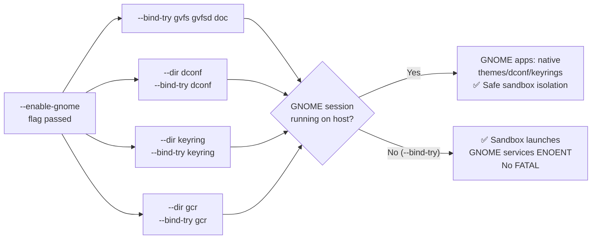

<!-- (c) 2026-* Frederick Bloom -- 20260818-042727-e7aa8f21-a4b5-4a11-GnomePassthrough.spec-0.0.1.md -- Hanaden AI Loader -->
---
filename-id:   20260818-042727-e7aa8f21-a4b5-4a11-GnomePassthrough.spec
node-type:     SPEC
layer:         4
spec-domain:   FUNC
version:       0.0.1
status:        Implemented
author:        Frederick Bloom
copyright:     (c) 2026-* Frederick Bloom
description: >
  When --enable-gnome is passed, GNOME-specific /run/user/UID services MUST be
  RW-bound: gvfs, gvfsd, doc, dconf, keyring, gcr. --enable-gnome does NOT imply
  or enable D-Bus session bus (/run/user/UID/bus), ensuring file pickers remain
  strictly confined to the sandbox unless --enable-dbus is explicitly passed.
parent:        20260816-182145-GuiPassthrough.feat
leaf-value:    "--bind-try gvfs + gvfsd + doc + dconf + keyring + gcr"
leaf-unit:     "RW socket bind-mounts (try)"
tdd:
  test-file:      src/test/hanaden-bwrap-enhanced/BwrapEnhanced2026.strat/UncontainedAgentExecution.driv/NamespaceIsolatedSandbox.moti/GuiPassthrough.feat/GnomePassthrough.spec/test_gnome_passthrough.sh
---

# GnomePassthrough: GNOME Desktop Services RW-Bound When --enable-gnome

## Specification Statement

With `--enable-gnome`: the following paths under `/run/user/$(id -u)` MUST be
RW-bound via `--bind-try` (silently skipped if absent):

- `gvfs` — GNOME Virtual File System daemon socket
- `gvfsd` — GVFS backend daemon socket
- `doc` — XDG Document Portal socket
- `dconf/` — dconf settings database dir (created via `--dir`)
- `dconf` — dconf socket (RW-bound)
- `keyring/` — GNOME Keyring dir (created via `--dir`)
- `keyring` — GNOME Keyring socket (RW-bound)
- `gcr/` — GCR crypto service dir (created via `--dir`)
- `gcr` — GCR socket (RW-bound)

`--enable-gnome` does NOT imply or enable `--enable-dbus`. Without `--enable-dbus`,
`/run/user/$(id -u)/bus` MUST NOT be mounted, preventing sandbox portal escapes.

## Rationale

GNOME native applications depend on a constellation of session services beyond
just the display and audio:

- **GVFS**: File manager integration, network filesystem access (SMB, WebDAV, MTP)
- **dconf**: GNOME settings system — theme, font, keyboard shortcuts
- **GNOME Keyring**: Secret storage (passwords, SSH keys, GPG keys)
- **GCR**: GLib Crypto — certificate verification for HTTPS connections in GNOME apps
- **XDG Document Portal**: Sandboxed file access broker for GNOME apps

AI agents automating GNOME workflows (form filling, GTK theming, dconf settings,
credential-protected services) need these services to function. Sockets are RW-bound
because GNOME IPC is bidirectional. `--bind-try` ensures no FATAL on non-GNOME hosts.
D-Bus session bus is strictly decoupled to ensure zero inadvertent host filesystem escapes.

## Constraints

| Constraint | Value | Condition |
|------------|-------|-----------|
| gvfs | RW-bound (--bind-try) | With --enable-gnome |
| gvfsd | RW-bound (--bind-try) | With --enable-gnome |
| doc | RW-bound (--bind-try) | With --enable-gnome |
| dconf/ | dir created (--dir) | With --enable-gnome |
| dconf socket | RW-bound (--bind-try) | With --enable-gnome |
| keyring/ | dir created (--dir) | With --enable-gnome |
| keyring socket | RW-bound (--bind-try) | With --enable-gnome |
| gcr/ | dir created (--dir) | With --enable-gnome |
| gcr socket | RW-bound (--bind-try) | With --enable-gnome |
| ENABLE_DBUS implied | no (decoupled) | With --enable-gnome |
| Default: no GNOME sockets | yes | Without --enable-gnome |

## Leaf Value

> 🛑 **Primitive** — terminal specification.

**Value:** 9 RW binds (gvfs, gvfsd, doc, dconf, keyring, gcr + 3 --dir) (DBUS decoupled)
**Source:** bwrap-enhanced.sh L395-L408

## Measurement Method

```bash
_RU="/run/user/$(id -u)"

# With --enable-gnome (on GNOME session):
./bwrap-enhanced.sh ... --enable-gnome -- bash -c \
  'stat /run/user/$(id -u)/gvfs 2>&1'
# Expected: socket or dir exists

./bwrap-enhanced.sh ... --enable-gnome -- bash -c \
  'test -d /run/user/$(id -u)/dconf && echo PASS'
# Expected: PASS (--dir creates it)

# DBUS decoupled (bus socket MUST NOT exist without --enable-dbus):
./bwrap-enhanced.sh ... --enable-gnome -- bash -c \
  'test ! -e /run/user/$(id -u)/bus && echo ISOLATED'
# Expected: ISOLATED

# No FATAL on non-GNOME host:
./bwrap-enhanced.sh ... --enable-gnome -- /bin/true
# Expected: exit 0

# Without --enable-gnome:
./bwrap-enhanced.sh ... -- bash -c \
  'test -e /run/user/$(id -u)/gvfs; echo $?'
# Expected: 1
```

## Test Suite

> **Suite ID:** 20260818-042727-e7aa8f21-a4b5-4a11-GnomePassthrough.spec-SUITE

### ⚙️ Functional Tests

| ID | Description | Method | Pass Criteria | TDD |
|----|-------------|--------|---------------|-----|
| GN-001 | dconf dir created | `test -d $RU/dconf` inside | exit 0 | NOT_STARTED |
| GN-002 | keyring dir created | `test -d $RU/keyring` inside | exit 0 | NOT_STARTED |
| GN-003 | gcr dir created | `test -d $RU/gcr` inside | exit 0 | NOT_STARTED |
| GN-004 | gvfs accessible (if GNOME session) | `stat $RU/gvfs` inside | exists or ENOENT | NOT_STARTED |
| GN-005 | D-Bus decoupled (bus absent) | `test ! -e $RU/bus` inside | exit 0 | NOT_STARTED |
| GN-006 | --enable-gnome ok on non-GNOME host | run /bin/true | exit 0 | NOT_STARTED |
| GN-007 | Default: no gvfs | `test -e $RU/gvfs` inside (no flag) | exit 1 | NOT_STARTED |
| GN-008 | dconf socket RW | `touch $RU/dconf/probe` inside | succeeds (dconf service writes) | NOT_STARTED |

## References

- bwrap-enhanced.sh L395-L408 (ENABLE_GNOME block)
- bwrap-enhanced.sh L750-L753 (CLI: --enable-gnome decoupled from DBUS)
- GNOME Session Services — https://wiki.gnome.org/

## Changelog

| Version | Date | Author | Changes |
|---------|------|--------|---------|
| 0.0.1 | 2026-08-18 | Frederick Bloom + AI | Initial spec — reverse-engineered from bwrap-enhanced.sh L395-L408 |
| 0.0.2 | 2026-08-25 | Frederick Bloom + AI | Security hardening: decoupled --enable-gnome from --enable-dbus |

## Behavioral Flow


