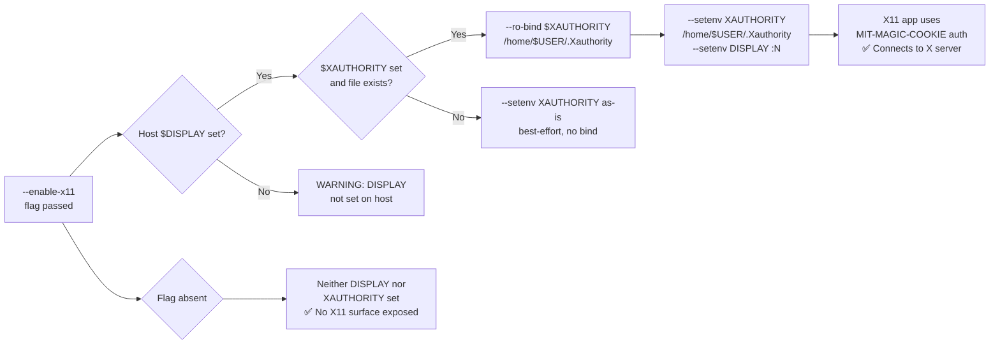

<!-- (c) 2026-* Frederick Bloom -- 20260816-182145-374510-76d9-9c92-8b7d6c9bef94-X11Socket.spec-0.0.1.md -- Hanaden AI Loader -->
---
filename-id:   20260816-182145-374510-76d9-9c92-8b7d6c9bef94-X11Socket.spec
node-type:     SPEC
layer:         4
spec-domain:   FUNC
version:       0.0.1
status:        Implemented
author:        Frederick Bloom
copyright:     (c) 2026-* Frederick Bloom
description: >
  When --enable-x11 is passed AND $DISPLAY is set on the host, the sandbox MUST
  RO-bind the XAUTHORITY file from its host path to /home/$VIRTUAL_USER_NAME/.Xauthority
  and set XAUTHORITY to the remapped sandbox-local path. DISPLAY is injected from
  the host value. If XAUTHORITY is unset or the file does not exist, the env var
  is passed as-is (best-effort, no bind). Without --enable-x11, neither DISPLAY
  nor XAUTHORITY are set inside.
parent:        20260816-182145-GuiPassthrough.feat
leaf-value:    "--ro-bind $XAUTHORITY /home/$USER/.Xauthority + --setenv XAUTHORITY /home/$USER/.Xauthority + --setenv DISPLAY"
leaf-unit:     "bind + env vars"
tdd:
  test-file:      src/test/hanaden-bwrap-enhanced/BwrapEnhanced2026.strat/UncontainedAgentExecution.driv/NamespaceIsolatedSandbox.moti/GuiPassthrough.feat/X11Socket.spec/test_x11_socket.sh
---

# X11Socket: XAUTHORITY RO-Bound and DISPLAY Injected When --enable-x11

## Specification Statement

With `--enable-x11`, when host `$DISPLAY` is set: the XAUTHORITY file MUST be
RO-bound from its host path to `/home/$VIRTUAL_USER_NAME/.Xauthority` inside the
sandbox (so X11 apps can authenticate with the X server). The `XAUTHORITY` env var
MUST be set to the remapped sandbox-local path (not the original host path). `DISPLAY`
is injected from the host value. If `XAUTHORITY` is unset or the file does not exist
on the host, the env var is passed as-is (best-effort, no bind). Without `--enable-x11`,
neither DISPLAY nor XAUTHORITY are set inside the sandbox.

## Rationale

X11 apps use MIT-MAGIC-COOKIE authentication via the `.Xauthority` file. Without
access to this file, an X11 client gets "Authorization required, but no authorization
protocol specified" and fails to connect. The file is RO-bound (not RW) because the
sandbox should not be able to modify the host's X11 authorization cookies — doing so
could allow revocation or impersonation attacks on the X server.

## Constraints

| Constraint | Value | Condition |
|------------|-------|-----------|
| $XAUTHORITY file | RO-bound to /home/$USER/.Xauthority | With --enable-x11, if file exists |
| DISPLAY env var | injected | With --enable-x11 |
| XAUTHORITY env var | set to /home/$USER/.Xauthority | With --enable-x11, if file exists |
| Default: DISPLAY | not set | Without --enable-x11 |

## Leaf Value

> 🛑 **Primitive** — terminal specification.

**Value:** `--ro-bind $XAUTHORITY /home/$USER/.Xauthority + --setenv XAUTHORITY /home/$USER/.Xauthority + --setenv DISPLAY`
**Source:** bwrap-enhanced.sh L483-L485

## Measurement Method

```bash
# With --enable-x11:
./bwrap-enhanced.sh ... --enable-x11 -- bash -c 'echo $DISPLAY'
# Expected: :N

./bwrap-enhanced.sh ... --enable-x11 -- bash -c 'stat $XAUTHORITY'
# Expected: file exists, RO

# Without:
./bwrap-enhanced.sh ... -- bash -c 'echo ${DISPLAY:-UNSET}'
# Expected: UNSET
```

## Test Suite

> **Suite ID:** 20260816-182145-374510-76d9-9c92-8b7d6c9bef94-X11Socket.spec-SUITE

### ⚙️ Functional Tests

| ID | Description | Method | Pass Criteria | TDD |
|----|-------------|--------|---------------|-----|
| X11-001 | DISPLAY set with --enable-x11 | `echo $DISPLAY` inside | :N | NOT_STARTED |
| X11-002 | XAUTHORITY file accessible | `stat $XAUTHORITY` inside | exists | NOT_STARTED |
| X11-003 | Default: DISPLAY not set | `echo ${DISPLAY:-UNSET}` inside | UNSET | NOT_STARTED |
| X11-004 | XAUTHORITY is RO | `touch $XAUTHORITY` inside | EROFS or permission denied | NOT_STARTED |

## References

- bwrap-enhanced.sh L315-L330 (--enable-x11 handling)

## Changelog

| Version | Date | Author | Changes |
|---------|------|--------|---------|
| 0.0.1 | 2026-08-16 | Frederick Bloom + AI | Initial spec |
| 0.0.1 | 2026-08-17 | Frederick Bloom + AI | Enrich: Rationale (MIT-MAGIC-COOKIE), Measurement Method, Leaf Value |
| 0.0.1 | 2026-08-18 | Frederick Bloom + AI | BUG: XAUTHORITY file never --ro-bind'd — only env var set. Spec updated: require remap to /home/$USER/.Xauthority. TDD state → FAIL. |

## Behavioral Flow


