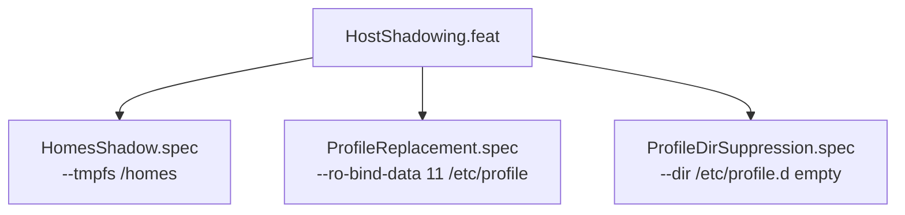

<!-- (c) 2026-* Frederick Bloom -- HostShadowing.feat-0.0.1.md -- Hanaden AI Loader -->
---
filename-id:   20260816-182145-HostShadowing.feat
node-type:     FEAT
layer:         2
version:       0.0.1
status:        Implemented
author:        Frederick Bloom
copyright:     (c) 2026-* Frederick Bloom
parent:        20260816-182145-NamespaceIsolatedSandbox.moti
description: >
  Feature: Host-specific paths (host /homes, /etc/profile, /etc/profile.d) are
  shadowed inside the sandbox to prevent remote mount hangs, conda/nvm contamination, and
  identity pollution from the host's real environment.
---

# HostShadowing: Shadow Host-Specific Problematic Paths

## Rationale

Production Linux systems have host-specific filesystem layout quirks that would pollute
the sandbox: remote-backed unmanaged /homes that hang on access, /etc/profile.d full of
conda/nvm init scripts, /etc/profile sourcing all of these. Shadowing them with
tmpfs overlays and FD-injected replacements creates a clean, reproducible environment.

## Feature Overview

## Changelog

| Version | Date | Author | Changes |
|---------|------|--------|---------|
| 0.0.1 | 2026-08-16 | Frederick Bloom + AI | Initial |
| 0.0.1 | 2026-08-17 | Frederick Bloom + AI | Enriched |
