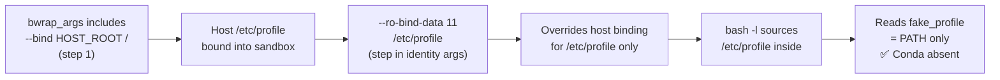

<!-- (c) 2026-* Frederick Bloom -- 20260816-182145-396674-7f51-9154-4b5642424c96-ProfileReplacement.spec-0.0.1.md -- Hanaden AI Loader -->
---
filename-id:   20260816-182145-396674-7f51-9154-4b5642424c96-ProfileReplacement.spec
node-type:     SPEC
layer:         4
spec-domain:   FUNC
version:       0.0.1
status:        Implemented
author:        Frederick Bloom
copyright:     (c) 2026-* Frederick Bloom
description: >
  The host /etc/profile (which sources profile.d contamination scripts) MUST be
  replaced inside the sandbox with a minimal FD-injected file via --ro-bind-data 11
  /etc/profile. The replacement is applied as part of the identity injection step.
  See MinimalProfile.spec for the required content.
parent:        20260816-101335-567491-3888-a3a0-3027a6c05b38-HostShadowing.feat
leaf-value:    "--ro-bind-data 11 /etc/profile overrides host /etc/profile"
leaf-unit:     "bind-mount override"
tdd:
  test-file:      src/test/hanaden-bwrap-enhanced/BwrapEnhanced2026.strat/UncontainedAgentExecution.driv/NamespaceIsolatedSandbox.moti/HostShadowing.feat/ProfileReplacement.spec/test_profile_replacement.sh
---

# ProfileReplacement: Host /etc/profile Replaced by Minimal FD-Injected File

## Specification Statement

Inside the sandbox, `/etc/profile` MUST be the `fake_profile` content (minimal PATH
setting only), NOT the host `/etc/profile`. The replacement MUST be achieved via
`--ro-bind-data 11 /etc/profile`, overriding the host file that was bound in step 1.

## Rationale

The host `/etc/profile` on a typical development machine sources conda, nvm, pyenv,
google-cloud-sdk, aws-cli initialization scripts from `/etc/profile.d/`. If the
sandbox were to use the host `/etc/profile`, a `bash -l` invocation inside would load
all host toolchains — making the sandbox environment non-reproducible and potentially
causing version conflicts with the agent's expected environment.

This spec covers the shadowing aspect (overriding the host file) while MinimalProfile.spec
covers the required content of the replacement.

## Constraints

| Constraint | Value | Condition |
|------------|-------|-----------|
| /etc/profile source inside sandbox | fake_profile (FD 11) | Always |
| Host /etc/profile | NOT visible inside | Always |
| Replacement mechanism | --ro-bind-data 11 /etc/profile | In bwrap_args |

## Leaf Value

> 🛑 **Primitive** — terminal specification.

**Value:** `--ro-bind-data 11 /etc/profile` overrides host file
**Source:** bwrap-enhanced.sh L263-L290 + L327-L335

## Measurement Method

```bash
# Inside sandbox:
cat /etc/profile
# Expected: PATH=/usr/bin:/bin; export PATH (NOT the host file content)

# Verify the host file is NOT what's shown:
diff /etc/profile <(cat /etc/profile_on_host 2>/dev/null || echo "different") | head -5
# Expected: differences exist

# Verify conda not loaded by login shell:
bash -l -c 'command -v conda 2>&1'
# Expected: not found
```

## Test Suite

> **Suite ID:** 20260816-182145-396674-7f51-9154-4b5642424c96-ProfileReplacement.spec-SUITE

### ⚙️ Functional Tests

| ID | Description | Method | Pass Criteria | TDD |
|----|-------------|--------|---------------|-----|
| PR-001 | /etc/profile is minimal inside | `cat /etc/profile` inside | PATH only | NOT_STARTED |
| PR-002 | Host sourcing absent | `grep 'source\|\\.' /etc/profile` inside | 0 matches | NOT_STARTED |
| PR-003 | Login bash: conda absent | `bash -l -c 'command -v conda'` inside | not found | NOT_STARTED |

## References

- bwrap-enhanced.sh L327-L335 (--ro-bind-data 11 /etc/profile in bwrap_args)
- MinimalProfile.spec (required content of fake_profile)

## Changelog

| Version | Date | Author | Changes |
|---------|------|--------|---------|
| 0.0.1 | 2026-08-16 | Frederick Bloom + AI | Initial spec |
| 0.0.1 | 2026-08-17 | Frederick Bloom + AI | Enrich: Rationale, Measurement Method, Leaf Value |

## Behavioral Flow


