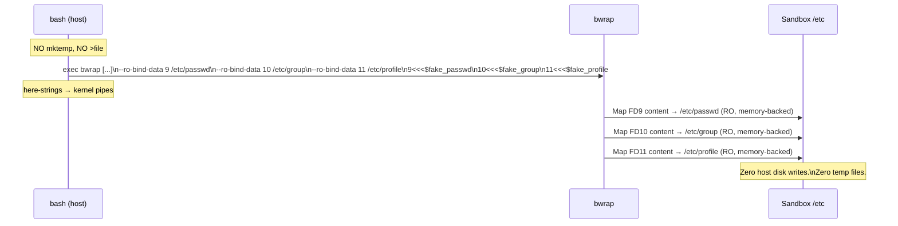

<!-- (c) 2026-* Frederick Bloom -- 20260816-182145-358033-7667-a5f2-2675b83ea9b5-FdInjection.spec-0.0.1.md -- Hanaden AI Loader -->
---
filename-id:   20260816-182145-358033-7667-a5f2-2675b83ea9b5-FdInjection.spec
node-type:     SPEC
layer:         4
spec-domain:   FUNC
version:       0.0.1
status:        Implemented
author:        Frederick Bloom
copyright:     (c) 2026-* Frederick Bloom
description: >
  The synthetic identity files (fake_passwd, fake_group, fake_profile) MUST be
  injected into the sandbox via bwrap --ro-bind-data on FDs 9, 10, 11 respectively,
  using bash here-string redirects (9<<<$var). No mktemp or host file writes.
parent:        20260816-101335-345119-c389-12dd-dba63c99bb07-IdentityInjection.feat
leaf-value:    "--ro-bind-data 9 /etc/passwd, 10 /etc/group, 11 /etc/profile via 9<<<$var"
leaf-unit:     "FD redirects"
tdd:
  test-file:      src/test/hanaden-bwrap-enhanced/BwrapEnhanced2026.strat/UncontainedAgentExecution.driv/NamespaceIsolatedSandbox.moti/IdentityInjection.feat/FdInjection.spec/test_fd_injection.sh
---

# FdInjection: Identity Files Injected via bash FD Here-Strings (No Host Disk Write)

## Specification Statement

`fake_passwd` MUST be injected via `--ro-bind-data 9 /etc/passwd` + `9<<<$fake_passwd`
in the exec call. `fake_group` via FD 10. `fake_profile` via FD 11. No `mktemp`,
`tee`, or `>file` writes to host disk.

## Rationale

Temp file approaches are fragile:
- Race conditions: another process can read or modify the temp file before it's used
- Leak: if the script is killed before cleanup, temp files persist
- Permissions: temp files have a window where they're world-readable

FD-based injection avoids all of these: the file content lives in bash process memory,
passed directly to bwrap via a kernel pipe (the bash here-string). bwrap reads it
exactly once and maps it into the sandbox as a read-only memory-backed file. No disk
write ever occurs.

## Constraints

| Constraint | Value | Condition |
|------------|-------|-----------|
| FD 9 → /etc/passwd | via --ro-bind-data 9 + 9<<<$fake_passwd | Always |
| FD 10 → /etc/group | via --ro-bind-data 10 + 10<<<$fake_group | Always |
| FD 11 → /etc/profile | via --ro-bind-data 11 + 11<<<$fake_profile | Always |
| mktemp calls | 0 in script source | Always |
| Temp files on host disk | 0 per invocation | Always |

## Leaf Value

> 🛑 **Primitive** — terminal specification.

**Value:** 3 FD injections via bash here-strings; 0 temp files
**Source:** bwrap-enhanced.sh L327-L335 (--ro-bind-data in bwrap_args), L575-L580 (exec with FD redirects)

## Measurement Method

```bash
# Inside sandbox:
cat /etc/passwd | grep VUSER  # Expected: VUSER entry present (from FD 9)
cat /etc/group | grep VUSER   # Expected: VUSER entry present (from FD 10)
cat /etc/profile               # Expected: PATH line (from FD 11)

# No temp files on host:
REF=$(mktemp /tmp/ref-XXXXXX); touch -r "$REF" "$REF"
./bwrap-enhanced.sh ... -- /bin/true
find /tmp /var/tmp -newer "$REF" 2>/dev/null | grep -v "$REF"
# Expected: 0 results

# Static check:
grep -n 'mktemp' src/main/hanaden-bwrap-enhanced/bwrap-enhanced.sh | grep -v '#'
# Expected: 0 results
```

## Test Suite

> **Suite ID:** 20260816-182145-358033-7667-a5f2-2675b83ea9b5-FdInjection.spec-SUITE

### ⚙️ Functional Tests

| ID | Description | Method | Pass Criteria | TDD |
|----|-------------|--------|---------------|-----|
| FDI-001 | /etc/passwd contains VUSER | `cat /etc/passwd` inside | VUSER entry | NOT_STARTED |
| FDI-002 | /etc/group contains VUSER group | `cat /etc/group` inside | VUSER group | NOT_STARTED |
| FDI-003 | /etc/profile is minimal | `cat /etc/profile` inside | PATH only | NOT_STARTED |
| FDI-004 | No temp files on host | pre/post find | 0 results | NOT_STARTED |
| FDI-005 | Static: no mktemp in script | grep mktemp bwrap-enhanced.sh | 0 results | NOT_STARTED |

## References

- bwrap-enhanced.sh L327-L335 (--ro-bind-data 9/10/11 in bwrap_args array)
- bwrap-enhanced.sh L575-L580 (exec bwrap ... 9<<<$fake_passwd 10<<<... 11<<<...)

## Changelog

| Version | Date | Author | Changes |
|---------|------|--------|---------|
| 0.0.1 | 2026-08-16 | Frederick Bloom + AI | Initial spec |
| 0.0.1 | 2026-08-17 | Frederick Bloom + AI | Enrich: FD injection rationale vs temp files, Measurement Method, Leaf Value |

## Behavioral Flow


