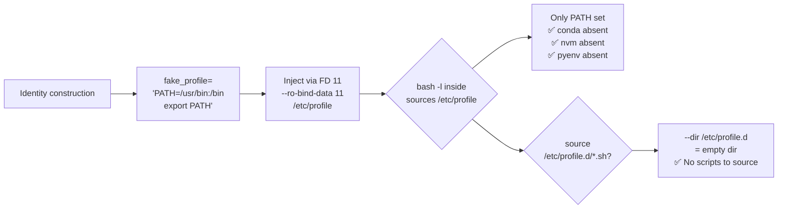

<!-- (c) 2026-* Frederick Bloom -- 20260816-182145-356975-7c19-bb3e-d3bdac8d4f72-MinimalProfile.spec-0.0.1.md -- Hanaden AI Loader -->
---
filename-id:   20260816-182145-356975-7c19-bb3e-d3bdac8d4f72-MinimalProfile.spec
node-type:     SPEC
layer:         4
spec-domain:   FUNC
version:       0.0.1
status:        Implemented
author:        Frederick Bloom
copyright:     (c) 2026-* Frederick Bloom
description: >
  The synthetic /etc/profile MUST contain only: PATH=/usr/bin:/bin; export PATH
  No sourcing of /etc/profile.d, no host conda/nvm/pyenv init, no aliases.
  Exactly 2-3 lines.
parent:        20260816-101335-345119-c389-12dd-dba63c99bb07-IdentityInjection.feat
leaf-value:    "/etc/profile = 'PATH=/usr/bin:/bin; export PATH'"
leaf-unit:     "file content"
tdd:
  test-file:      src/test/hanaden-bwrap-enhanced/BwrapEnhanced2026.strat/UncontainedAgentExecution.driv/NamespaceIsolatedSandbox.moti/IdentityInjection.feat/MinimalProfile.spec/test_minimal_profile.sh
---

# MinimalProfile: /etc/profile Contains Only Minimal PATH Setting

## Specification Statement

The `fake_profile` MUST contain only: `PATH=/usr/bin:/bin; export PATH` (and nothing
else). It MUST NOT source `/etc/profile.d` or any other file. The injected
`/etc/profile` inside the sandbox MUST have ≤ 3 lines.

## Rationale

The host `/etc/profile` typically:
1. Sources all of `/etc/profile.d/*.sh` — which initializes conda, nvm, pyenv, aws CLI, etc.
2. Sets `JAVA_HOME`, `GOPATH`, `NVM_DIR`, and other tool-specific vars
3. May modify `PATH` to include host-specific tool directories

All of this would contaminate the sandbox environment with host toolchain state,
making the sandbox non-reproducible and potentially introducing version conflicts.
The minimal profile ensures the sandbox gets a clean, reproducible environment.

## Constraints

| Constraint | Value | Condition |
|------------|-------|-----------|
| Line count | ≤ 3 | Always |
| Content | PATH=/usr/bin:/bin; export PATH | Mandatory |
| source /etc/profile.d | ABSENT | Always |
| conda init | ABSENT | Always |
| nvm init | ABSENT | Always |

## Leaf Value

> 🛑 **Primitive** — terminal specification.

**Value:** `fake_profile = "PATH=/usr/bin:/bin\nexport PATH"`
**Source:** bwrap-enhanced.sh L220-L226

## Measurement Method

```bash
# Inside sandbox:
cat /etc/profile
# Expected: PATH=/usr/bin:/bin; export PATH (2 lines max)

wc -l /etc/profile  # Expected: ≤ 3

# Verify login bash doesn't load conda:
bash -l -c 'declare -f conda 2>/dev/null; echo ${CONDA_PREFIX:-UNSET}'
# Expected: UNSET (conda not loaded)

# Verify login bash doesn't load nvm:
bash -l -c 'type nvm 2>&1'
# Expected: "bash: type: nvm: not found"
```

## Test Suite

> **Suite ID:** 20260816-182145-356975-7c19-bb3e-d3bdac8d4f72-MinimalProfile.spec-SUITE

### ⚙️ Functional Tests

| ID | Description | Method | Pass Criteria | TDD |
|----|-------------|--------|---------------|-----|
| MP-001 | /etc/profile line count ≤ 3 | `wc -l /etc/profile` inside | ≤ 3 | NOT_STARTED |
| MP-002 | /etc/profile sets PATH | `bash -l -c 'echo $PATH'` inside | /usr/bin:/bin present | NOT_STARTED |
| MP-003 | conda not initialized | `bash -l -c 'declare -f conda'` | empty | NOT_STARTED |
| MP-004 | nvm not initialized | `bash -l -c 'type nvm 2>&1'` | not found | NOT_STARTED |
| MP-005 | No source /etc/profile.d in profile | `grep 'profile.d' /etc/profile` inside | 0 matches | NOT_STARTED |

## References

- bwrap-enhanced.sh L220-L226 (fake_profile here-string construction)

## Changelog

| Version | Date | Author | Changes |
|---------|------|--------|---------|
| 0.0.1 | 2026-08-16 | Frederick Bloom + AI | Initial spec |
| 0.0.1 | 2026-08-17 | Frederick Bloom + AI | Enrich: Rationale (host profile contamination), Measurement Method |

## Behavioral Flow


