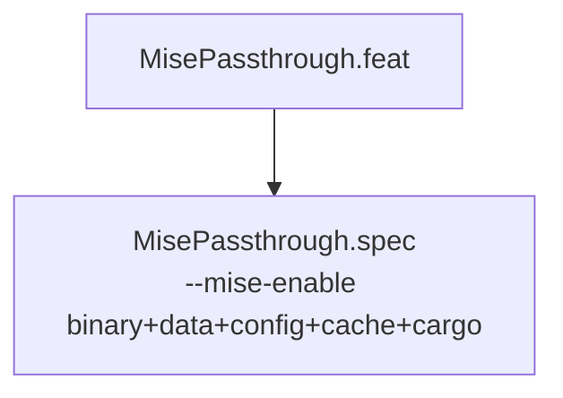

<!-- (c) 2026-* Frederick Bloom -- 20260818-042727-cd786e3d-d1d1-42f9-MisePassthrough.feat-0.0.1.md -- Hanaden AI Loader -->
---
filename-id:   20260818-042727-cd786e3d-d1d1-42f9-MisePassthrough.feat
node-type:     FEAT
layer:         2
version:       0.0.1
status:        Implemented
author:        Frederick Bloom
copyright:     (c) 2026-* Frederick Bloom
description: >
  Feature: mise toolchain manager passthrough. When --mise-enable is passed,
  mise binary, data dir (installs/shims/plugins), and optional config/cache/cargo
  dirs are RO-bound into the sandbox at their host paths. --mise-enable rw upgrades
  the data dir bind to RW. PATH is set to shims-first. Fatal validation guards
  ensure mise binary and data dir exist before launch.
parent:        20260816-182145-NamespaceIsolatedSandbox.moti
---

# MisePassthrough: Mise Toolchain Manager Passthrough

## Rationale

mise is a polyglot toolchain manager (Node.js, Python, Go, Rust, Ruby, etc.) that
manages tool versions via shims. AI coding agents running inside the sandbox need
access to tools installed by mise (node, python, cargo, go) without requiring those
tools to be installed at the system level inside the virtual root.

The passthrough approach binds mise's existing host installation into the sandbox
at the same paths, preserving shim-target resolution semantics. The binary and data
dir are required (FATAL if absent); config, cache, and cargo are optional (warning + skip).

## Feature Overview

## Changelog

| Version | Date | Author | Changes |
|---------|------|--------|---------|
| 0.0.1 | 2026-08-18 | Frederick Bloom + AI | Initial feat — reverse-engineered from bwrap-enhanced.sh L418-L468 |
