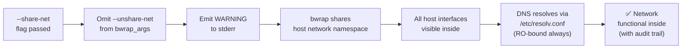

<!-- (c) 2026-* Frederick Bloom -- 20260816-182145-371939-73de-bc5e-353b3cdc8f51-ShareNetOptIn.spec-0.0.1.md -- Hanaden AI Loader -->
---
filename-id:   20260816-182145-371939-73de-bc5e-353b3cdc8f51-ShareNetOptIn.spec
node-type:     SPEC
layer:         4
spec-domain:   SEC
version:       0.0.1
status:        Implemented
author:        Frederick Bloom
copyright:     (c) 2026-* Frederick Bloom
description: >
  When --share-net is passed, --unshare-net is omitted from bwrap_args and the
  sandbox shares the host network namespace. A security WARNING must be printed to
  stderr. /etc/resolv.conf and /etc/nsswitch.conf are bound RO regardless of mode.
parent:        20260816-101335-568793-78c7-6584-1edf4cbe8f6a-NetworkIsolation.feat
leaf-value:    "omit --unshare-net + WARNING on stderr + resolv.conf RO-bound"
leaf-unit:     "behavior"
tdd:
  test-file:      src/test/hanaden-bwrap-enhanced/BwrapEnhanced2026.strat/UncontainedAgentExecution.driv/NamespaceIsolatedSandbox.moti/NetworkIsolation.feat/ShareNetOptIn.spec/test_share_net_opt_in.sh
---

# ShareNetOptIn: Explicit --share-net Enables Host Network with Warning

## Specification Statement

When `--share-net` is passed to `bwrap-enhanced.sh`, `--unshare-net` MUST be omitted
from bwrap_args (so the sandbox shares the host network namespace). A WARNING MUST be
emitted to stderr indicating that network isolation is disabled. `/etc/resolv.conf`
and `/etc/nsswitch.conf` MUST be RO-bound regardless of network mode.

## Rationale

Some legitimate AI workloads need network access — for example, a build agent that
installs dependencies, or a browser agent that fetches pages. Completely blocking
network without an override would make the sandbox unusable for these workloads. The
opt-in design ensures:
1. The default is safe (no network)
2. Callers who need network must explicitly acknowledge the risk via `--share-net`
3. The WARNING on stderr creates an audit trail — CI logs will show network was enabled

The `--ro-bind /etc/resolv.conf` ensures DNS works when network is shared, without
allowing the sandbox to modify DNS configuration.

## Constraints

| Constraint | Value | Condition |
|------------|-------|-----------|
| --unshare-net in bwrap_args | Omitted | With --share-net |
| Host network namespace | Shared | With --share-net |
| WARNING on stderr | Must appear | Always with --share-net |
| /etc/resolv.conf | RO-bound | Both modes |
| /etc/nsswitch.conf | RO-bound | Both modes |

## Leaf Value

> 🛑 **Primitive** — terminal specification.

**Value:** `--unshare-net` omitted; WARNING on stderr; resolv.conf RO-bound
**Source:** bwrap-enhanced.sh L228-L237

## Measurement Method

```bash
# With --share-net flag:
output=$(./bwrap-enhanced.sh ... --share-net -- curl -s http://1.1.1.1 2>/tmp/stderr_out)
# Network should work:
echo "$output" | grep -q "301\|200\|text" && echo "PASS: network works"
# WARNING should appear on stderr:
grep -qi "warning\|WARN" /tmp/stderr_out && echo "PASS: warning emitted"
# resolv.conf bound:
./bwrap-enhanced.sh ... --share-net -- cat /etc/resolv.conf | grep -q "nameserver"
echo "PASS: resolv.conf accessible"
```

## Test Suite

> **Suite ID:** 20260816-182145-371939-73de-bc5e-353b3cdc8f51-ShareNetOptIn.spec-SUITE

### ⚙️ Functional Tests

| ID | Description | Method | Pass Criteria | TDD |
|----|-------------|--------|---------------|-----|
| SNO-001 | Network works with --share-net | `curl http://1.1.1.1` inside | response received | NOT_STARTED |
| SNO-002 | WARNING on stderr with --share-net | grep stderr | "WARNING" or "WARN" | NOT_STARTED |
| SNO-003 | resolv.conf bound RO in both modes | `cat /etc/resolv.conf` inside | nameserver lines | NOT_STARTED |
| SNO-004 | DNS resolves with --share-net | `nslookup example.com` inside | IP address | NOT_STARTED |
| SNO-005 | No WARNING without --share-net | grep stderr (no --share-net) | no WARNING | NOT_STARTED |

## References

- bwrap-enhanced.sh L228-L237 (--share-net flag / --unshare-net conditional)

## Changelog

| Version | Date | Author | Changes |
|---------|------|--------|---------|
| 0.0.1 | 2026-08-16 | Frederick Bloom + AI | Initial spec |
| 0.0.1 | 2026-08-17 | Frederick Bloom + AI | Enrich: Rationale, Measurement Method, Leaf Value |

## Behavioral Flow


