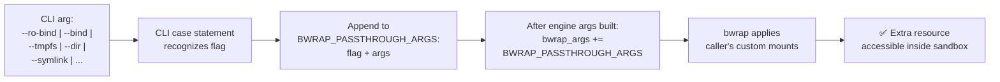

<!-- (c) 2026-* Frederick Bloom -- 20260816-182145-400011-731d-a8b9-6f9e9342b3db-BindPassthrough.spec-0.0.1.md -- Hanaden AI Loader -->
---
filename-id:   20260816-182145-400011-731d-a8b9-6f9e9342b3db-BindPassthrough.spec
node-type:     SPEC
layer:         4
spec-domain:   FUNC
version:       0.0.1
status:        Implemented
author:        Frederick Bloom
copyright:     (c) 2026-* Frederick Bloom
description: >
  The CLI MUST accept and forward to BWRAP_PASSTHROUGH_ARGS the following bwrap
  bind/layout flags: --ro-bind, --ro-bind-try, --bind, --bind-try, --dev-bind,
  --dev-bind-try, --symlink, --dir, --tmpfs. All are forwarded verbatim (after
  tilde expansion) and appended after engine args.
parent:        20260816-101335-793496-22fc-af44-ba4384f68d3f-PassthroughArgs.feat
leaf-value:    "9 bind/layout flag types forwarded to BWRAP_PASSTHROUGH_ARGS"
leaf-unit:     "forwarded flag types"
tdd:
  test-file:      src/test/hanaden-bwrap-enhanced/BwrapEnhanced2026.strat/UncontainedAgentExecution.driv/NamespaceIsolatedSandbox.moti/PassthroughArgs.feat/BindPassthrough.spec/test_bind_passthrough.sh
---

# BindPassthrough: Bind/Dir/Symlink/Tmpfs Flags Forwarded to bwrap

## Specification Statement

The CLI MUST accept and forward all of the following flag types to `BWRAP_PASSTHROUGH_ARGS`:
`--ro-bind SRC DST`, `--ro-bind-try SRC DST`, `--bind SRC DST`, `--bind-try SRC DST`,
`--dev-bind SRC DST`, `--dev-bind-try SRC DST`, `--symlink SRC DST`, `--dir PATH`,
`--tmpfs PATH`. The resulting sandbox MUST have the corresponding mounts applied.

## Rationale

The engine provides a comprehensive set of default mounts (VFS isolation, home egress,
etc.) but cannot anticipate every workload's resource needs. A passthrough mechanism
for all nine bwrap bind/layout flag types gives callers the full power of bwrap's
mount API without requiring changes to the engine. The engine's security contract
(RO root, minimal env, network isolation) is preserved because passthrough args come
LAST — callers can add mounts but cannot remove existing ones.

## Constraints

| Constraint | Value | Condition |
|------------|-------|-----------|
| Forwarded flag types | 9 (as listed above) | Always |
| Tilde expansion in path args | Applied | Always |
| Position in bwrap_args | After all engine args | Always |
| Engine security mounts | Cannot be removed by passthrough | By design (append-only) |

## Leaf Value

> 🛑 **Primitive** — terminal specification.

**Value:** All 9 bind flag types recognized and forwarded
**Source:** bwrap-enhanced.sh L655-L695

## Measurement Method

```bash
# Test each flag type:
./bwrap-enhanced.sh ... --ro-bind /usr/bin/jq /jq -- /jq --version
# Expected: jq version string

./bwrap-enhanced.sh ... --dir /scratchpad -- test -d /scratchpad && echo "PASS"
./bwrap-enhanced.sh ... --tmpfs /workspace -- stat -f -c %T /workspace
# Expected: tmpfs

./bwrap-enhanced.sh ... --symlink /usr/bin /mybin -- readlink /mybin
# Expected: /usr/bin
```

## Test Suite

> **Suite ID:** 20260816-182145-400011-731d-a8b9-6f9e9342b3db-BindPassthrough.spec-SUITE

### ⚙️ Functional Tests

| ID | Description | Method | Pass Criteria | TDD |
|----|-------------|--------|---------------|-----|
| BP-001 | --ro-bind forwarded | `--ro-bind /bin/jq /jq; /jq --version` inside | jq version | NOT_STARTED |
| BP-002 | --bind forwarded | `--bind $TMPDIR /rw; touch /rw/x` inside | exit 0 | NOT_STARTED |
| BP-003 | --dir forwarded | `--dir /scratch; test -d /scratch` inside | exit 0 | NOT_STARTED |
| BP-004 | --tmpfs forwarded | `--tmpfs /ws; stat -f -c %T /ws` inside | tmpfs | NOT_STARTED |
| BP-005 | --symlink forwarded | `--symlink /usr/bin /mybin; readlink /mybin` inside | /usr/bin | NOT_STARTED |
| BP-006 | --ro-bind-try on absent path | `--ro-bind-try /absent /x; /bin/true` | exit 0 (no error) | NOT_STARTED |

## References

- bwrap-enhanced.sh L655-L695 (all passthrough flag case statements)

## Changelog

| Version | Date | Author | Changes |
|---------|------|--------|---------|
| 0.0.1 | 2026-08-16 | Frederick Bloom + AI | Initial spec |
| 0.0.1 | 2026-08-17 | Frederick Bloom + AI | Enrich: Rationale, Measurement Method, full flag list |

## Behavioral Flow


