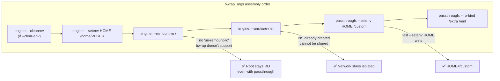

<!-- (c) 2026-* Frederick Bloom -- 20260816-182145-407236-71d2-b08c-fdff1e21d4da-LastWinsSemantics.spec-0.0.1.md -- Hanaden AI Loader -->
---
filename-id:   20260816-182145-407236-71d2-b08c-fdff1e21d4da-LastWinsSemantics.spec
node-type:     SPEC
layer:         4
spec-domain:   FUNC
version:       0.0.1
status:        Implemented
author:        Frederick Bloom
copyright:     (c) 2026-* Frederick Bloom
description: >
  BWRAP_PASSTHROUGH_ARGS MUST be appended AFTER all engine-generated bwrap_args.
  This gives passthrough --setenv values last-occurrence-wins semantics over engine
  defaults. The engine's security mounts (RO root, network isolation) cannot be
  overridden by passthrough because bwrap mount args are additive, not replaceable.
parent:        20260816-101335-793496-22fc-af44-ba4384f68d3f-PassthroughArgs.feat
leaf-value:    "bwrap_args = engine_args + BWRAP_PASSTHROUGH_ARGS (passthrough appended last)"
leaf-unit:     "arg array ordering"
tdd:
  test-file:      src/test/hanaden-bwrap-enhanced/BwrapEnhanced2026.strat/UncontainedAgentExecution.driv/NamespaceIsolatedSandbox.moti/PassthroughArgs.feat/LastWinsSemantics.spec/test_last_wins_semantics.sh
---

# LastWinsSemantics: Passthrough Args Appended After Engine Args

## Specification Statement

`BWRAP_PASSTHROUGH_ARGS` MUST be appended to `bwrap_args` AFTER all engine-generated
args via `bwrap_args+=(${BWRAP_PASSTHROUGH_ARGS[@]})` at L481-L488. This ensures
caller `--setenv` values override engine defaults (last-occurrence-wins in bwrap
for env vars). Security mounts cannot be removed by passthrough because bwrap does
not support removing previously added bind mounts.

## Rationale

The append-last design solves two opposing requirements:
1. **Caller extensibility**: Callers need to inject custom env vars that override engine
   defaults (e.g., custom PATH, PYTHONPATH, CUDA_VISIBLE_DEVICES)
2. **Security immutability**: The engine's security binds (RO root via --remount-ro,
   network isolation via --unshare-net) must NOT be overrideable by callers

The bwrap semantics make this work naturally:
- For `--setenv`: bwrap uses last-occurrence-wins → caller wins
- For `--remount-ro /`: bwrap doesn't support "un-remounting" → security bind is permanent
- For `--unshare-net`: network namespace is already created → cannot be shared after-the-fact

## Constraints

| Constraint | Value | Condition |
|------------|-------|-----------|
| Passthrough position | After all engine args | Always |
| bwrap_args assembly | engine_args + BWRAP_PASSTHROUGH_ARGS | Always |
| --setenv caller override | wins (last-wins) | Always |
| --remount-ro / override | impossible (by bwrap design) | Always |
| --unshare-net override | impossible (by bwrap design) | Always |

## Leaf Value

> 🛑 **Primitive** — terminal specification.

**Value:** `bwrap_args += (${BWRAP_PASSTHROUGH_ARGS[@]})` at L481-L488
**Source:** bwrap-enhanced.sh L481-L488

## Measurement Method

```bash
# Caller --setenv HOME /custom overrides engine /home/VUSER:
./bwrap-enhanced.sh ... --setenv HOME /custom -- bash -c 'echo $HOME'
# Expected: /custom (passthrough wins)

# Engine --remount-ro / cannot be overridden:
./bwrap-enhanced.sh ... -- bash -c 'touch /etc/probe 2>&1'
# Expected: EROFS (even with passthrough, root stays RO)

# Static: verify append order in script:
grep -n 'BWRAP_PASSTHROUGH_ARGS' src/main/hanaden-bwrap-enhanced/bwrap-enhanced.sh \
  | grep 'bwrap_args+='
# Expected: line number > any --remount-ro line
```

## Test Suite

> **Suite ID:** 20260816-182145-407236-71d2-b08c-fdff1e21d4da-LastWinsSemantics.spec-SUITE

### ⚙️ Functional Tests

| ID | Description | Method | Pass Criteria | TDD |
|----|-------------|--------|---------------|-----|
| LW-001 | Caller HOME overrides engine | `--setenv HOME /custom; echo $HOME` inside | /custom | NOT_STARTED |
| LW-002 | Caller PATH overrides engine | `--setenv PATH /custom; echo $PATH` inside | /custom | NOT_STARTED |
| LW-003 | Engine --remount-ro still active | `touch /etc/probe` inside | EROFS | NOT_STARTED |
| LW-004 | Static: BWRAP_PASSTHROUGH_ARGS appended last | grep line order | passthrough after remount-ro | NOT_STARTED |

### 🛡️ Security Tests

| ID | Description | Attack / Scenario | Expected Defense | TDD |
|----|-------------|-------------------|------------------|-----|
| LW-S001 | Caller tries to unset network isolation | `--setenv SOME_VAR x` after engine | --unshare-net still active | NOT_STARTED |

## References

- bwrap-enhanced.sh L481-L488 (bwrap_args+=(${BWRAP_PASSTHROUGH_ARGS[@]}))

## Changelog

| Version | Date | Author | Changes |
|---------|------|--------|---------|
| 0.0.1 | 2026-08-16 | Frederick Bloom + AI | Initial spec |
| 0.0.1 | 2026-08-17 | Frederick Bloom + AI | Enrich: Rationale (append-last design), security invariants, Measurement Method |

## Behavioral Flow: Append-Last Guarantees


