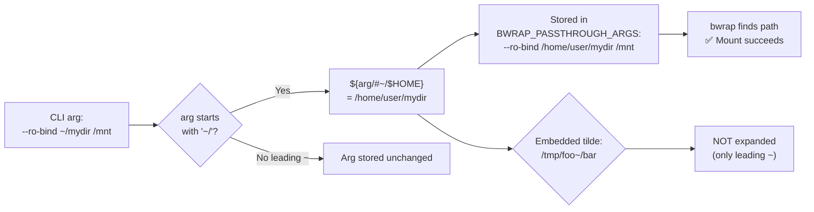

<!-- (c) 2026-* Frederick Bloom -- 20260816-182145-405192-7961-a325-3a05cb110b4c-TildeExpansion.spec-0.0.1.md -- Hanaden AI Loader -->
---
filename-id:   20260816-182145-405192-7961-a325-3a05cb110b4c-TildeExpansion.spec
node-type:     SPEC
layer:         4
spec-domain:   FUNC
version:       0.0.1
status:        Implemented
author:        Frederick Bloom
copyright:     (c) 2026-* Frederick Bloom
description: >
  Any path argument starting with ~/ in passthrough flags (--ro-bind, --bind, --dir,
  --host-real-root, --host-real-home-parent) MUST be expanded to $HOME/... before
  storage. Expansion uses bash pattern substitution: ${arg/#\~/$HOME}.
parent:        20260816-101335-793496-22fc-af44-ba4384f68d3f-PassthroughArgs.feat
leaf-value:    "~/path → $HOME/path via ${arg/#\\~/$HOME} before storage"
leaf-unit:     "substitution"
tdd:
  test-file:      src/test/hanaden-bwrap-enhanced/BwrapEnhanced2026.strat/UncontainedAgentExecution.driv/NamespaceIsolatedSandbox.moti/PassthroughArgs.feat/TildeExpansion.spec/test_tilde_expansion.sh
---

# TildeExpansion: Tilde in Path Arguments Expanded to $HOME

## Specification Statement

Path arguments containing a leading `~/` in any passthrough flag MUST be expanded to
`$HOME/...` via `${arg/#\~/$HOME}` bash parameter substitution before the value is
stored in `BWRAP_PASSTHROUGH_ARGS` or used as a configuration variable.

## Rationale

Operators commonly use `~/` to refer to their home directory in command-line invocations.
Without explicit tilde expansion, the literal string `~/mydir` would be passed to bwrap
as-is, and bwrap would fail to find the path (tilde is a shell special that bwrap itself
does not expand). The bash substitution `${arg/#\~/$HOME}` expands ONLY leading tildes
(not tildes embedded in paths like `foo~/bar`), matching standard shell semantics.

## Constraints

| Constraint | Value | Condition |
|------------|-------|-----------|
| ~/path in SRC of bind flags | Expanded to $HOME/path | Before storage |
| ~/path in DST of bind flags | Expanded to $HOME/path | Before storage |
| ~/path in --host-real-root | Expanded | Before storage |
| ~/path in --host-real-home-parent | Expanded | Before storage |
| Embedded tilde (not leading) | NOT expanded | e.g., /tmp/foo~/bar |

## Leaf Value

> 🛑 **Primitive** — terminal specification.

**Value:** `${arg/#\~/$HOME}` applied to all path args with leading `~/`
**Source:** bwrap-enhanced.sh L660-L690 (CLI case statement path args)

## Measurement Method

```bash
# Create a test dir in host $HOME:
mkdir -p ~/tilde-test-$$
./bwrap-enhanced.sh ... --ro-bind ~/tilde-test-$$ /tilde-check -- ls /tilde-check
# Expected: contents of ~/tilde-test-$$ (not "No such file")

# Verify embedded tilde NOT expanded:
# (This would fail bwrap if incorrectly expanded - check arg storage)
```

## Test Suite

> **Suite ID:** 20260816-182145-405192-7961-a325-3a05cb110b4c-TildeExpansion.spec-SUITE

### ⚙️ Functional Tests

| ID | Description | Method | Pass Criteria | TDD |
|----|-------------|--------|---------------|-----|
| TE-001 | ~/src in --ro-bind expanded | bind ~/dir /mnt; ls /mnt inside | dir contents | NOT_STARTED |
| TE-002 | ~/src in --bind expanded | bind ~/dir /mnt; touch /mnt/x inside | exit 0 | NOT_STARTED |
| TE-003 | --host-real-home-parent ~/ expanded | pass ~/home-parent as arg | resolves correctly | NOT_STARTED |
| TE-004 | Embedded tilde NOT expanded | path /tmp/foo~/bar | unchanged | NOT_STARTED |

## References

- bwrap-enhanced.sh L660-L690 (tilde expansion in CLI arg processing)

## Changelog

| Version | Date | Author | Changes |
|---------|------|--------|---------|
| 0.0.1 | 2026-08-16 | Frederick Bloom + AI | Initial spec |
| 0.0.1 | 2026-08-17 | Frederick Bloom + AI | Enrich: Rationale (bash tilde semantics), Measurement Method, Leaf Value |

## Behavioral Flow


