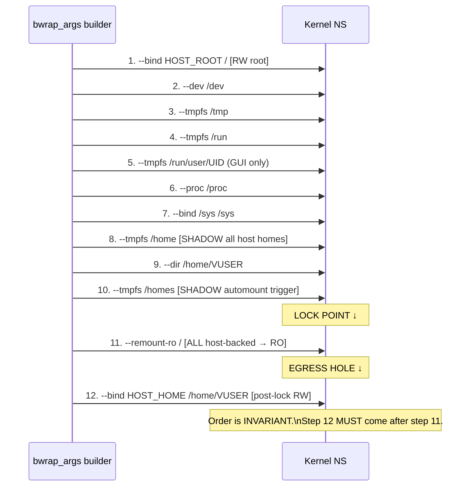

<!-- (c) 2026-* Frederick Bloom -- 20260816-101335-371252-22ef-1234-5678a9012345-BindSequence.spec-0.0.1.md -- Hanaden AI Loader -->
---
filename-id:   20260816-101335-371252-22ef-1234-5678a9012345-BindSequence.spec
node-type:     SPEC
layer:         4
spec-domain:   FUNC
version:       0.0.1
status:        Implemented
author:        Frederick Bloom
copyright:     (c) 2026-* Frederick Bloom
description: >
  The bwrap_args array MUST be assembled in a strict 12-step sequence defined in
  exec_sandbox(). Steps MUST NOT be reordered. Specifically: all --dir and
  --bind-try calls MUST precede --remount-ro /, and the post-lock home re-bind
  MUST follow --remount-ro /. This ordering contract is the architectural invariant
  for VFS correctness.
parent:        20260816-101335-342292-15b3-b177-2dc4d1112a1f-VfsIsolation.feat
leaf-value:    "12-step strict mount sequence"
leaf-unit:     "steps"
tdd:
  test-file:      src/test/hanaden-bwrap-enhanced/BwrapEnhanced2026.strat/UncontainedAgentExecution.driv/NamespaceIsolatedSandbox.moti/VfsIsolation.feat/BindSequence.spec/test_bind_sequence.sh
---

# BindSequence: 12-Step Strict Mount Sequence Invariant

## Specification Statement

The `bwrap_args` array MUST be assembled in the 12-step order defined in `exec_sandbox()`:
(1) initial root bind → (2) /usr RO + symlinks → (3) /etc RO → (4) /proc /dev →
(5) namespace flags → (6) tmpfs scratch → (7) /run/user + GUI sockets →
(8) /home tmpfs + /home/VUSER dir → (9) pre-lock home bind →
(10) FD-injected identity files → (11) `--remount-ro /` → (12) post-lock RW home re-bind.
Any reordering MUST be treated as a defect.

## Rationale

The 12-step sequence is order-dependent at the kernel level:
- `--dir /home/VUSER` MUST precede `--bind HOST_HOME /home/VUSER` because bwrap requires
  the target path to exist before binding to it
- `--remount-ro /` locks ALL mounts set up before it; anything bound before step 11
  becomes read-only (including the home pre-lock bind from step 9)
- Step 12 (`--bind HOST_HOME /home/VUSER` after `--remount-ro /`) is what creates the
  "write-hole": bwrap applies this as a fresh RW bind on top of the locked root

## Constraints

| Constraint | Value | Condition |
|------------|-------|-----------|
| Step order | 1→2→3→4→5→6→7→8→9→10→11→12 | Always; non-negotiable |
| --dir before --bind for same path | Required | bwrap kernel requirement |
| --remount-ro / at step 11 | Not earlier, not later | Write-hole integrity |
| Post-lock bind at step 12 | After --remount-ro / | Write-hole creation |

## Leaf Value

> 🛑 **Primitive** — terminal specification.

**Value:** 12-step strict sequence as documented in SandboxExecEngine.arch
**Source:** bwrap-enhanced.sh L238-L461

## Measurement Method

```bash
# Verify functional outcome of the sequence:
# 1. /home is tmpfs (step 8)
stat -f -c %T /home   # Expected: tmpfs
# 2. /home/VUSER is RW (step 12)
touch ~/probe && rm ~/probe  # Expected: exit 0
# 3. / is RO (step 11)
touch /etc/probe 2>&1 | grep -qi "read-only"  # Expected: EROFS
# 4. /usr is RO (step 2)
touch /usr/probe 2>&1 | grep -qi "read-only"  # Expected: EROFS
# Static: verify --remount-ro precedes post-lock --bind in script
awk '/remount-ro/{found=1} found && /bind.*home.*VUSER/{print NR; exit}' \
  src/main/hanaden-bwrap-enhanced/bwrap-enhanced.sh
# Expected: line number > line of --remount-ro
```

## Test Suite

> **Suite ID:** 20260816-101335-371252-22ef-1234-5678a9012345-BindSequence.spec-SUITE

### ⚙️ Functional Tests

| ID | Description | Method | Pass Criteria | TDD |
|----|-------------|--------|---------------|-----|
| BSQ-001 | Sandbox launches (valid sequence) | valid invocation → exit 0 | exit 0 | NOT_STARTED |
| BSQ-002 | /home is tmpfs | stat -f -c %T /home inside | tmpfs | NOT_STARTED |
| BSQ-003 | /home/VUSER is RW | touch ~/probe inside | exit 0 | NOT_STARTED |
| BSQ-004 | / is RO | touch /etc/probe inside | EROFS | NOT_STARTED |
| BSQ-005 | /usr is RO | touch /usr/probe inside | EROFS | NOT_STARTED |
| BSQ-006 | Static: --remount-ro before post-lock bind | awk line number check | remount-ro line < rebind line | NOT_STARTED |

## References

- bwrap-enhanced.sh L238-L461 (full 12-step sequence in exec_sandbox())
- SandboxExecEngine.arch §3 (Mount Sequence Contract)

## Changelog

| Version | Date | Author | Changes |
|---------|------|--------|---------|
| 0.0.1 | 2026-08-16 | Frederick Bloom + AI | Initial spec |
| 0.0.1 | 2026-08-16 | Frederick Bloom + AI | Enrich: Rationale, Measurement Method, Leaf Value |

## Behavioral Flow: 12-Step VFS Mount Sequence


