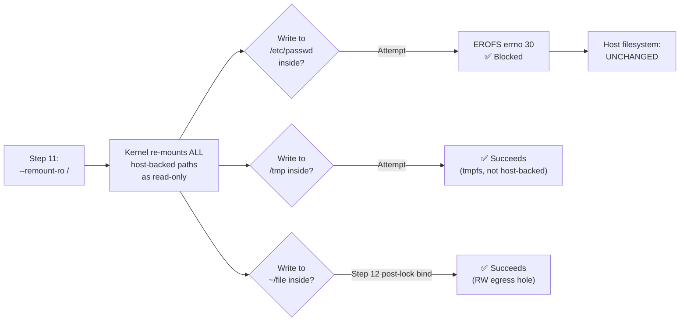

<!-- (c) 2026-* Frederick Bloom -- 20260816-101335-378762-25d9-eb0e-63ec85831f67-ReadOnlyRoot.spec-0.0.1.md -- Hanaden AI Loader -->
---
filename-id:   20260816-101335-378762-25d9-eb0e-63ec85831f67-ReadOnlyRoot.spec
node-type:     SPEC
layer:         4
spec-domain:   SEC
version:       0.0.1
status:        Implemented
author:        Frederick Bloom
copyright:     (c) 2026-* Frederick Bloom
description: >
  After step 11 (--remount-ro /), all host-backed mounts in the sandbox root
  filesystem MUST be read-only. Any write attempt to a host-backed path (e.g.
  /etc/probe, /usr/bin/evil) MUST fail with EROFS (errno 30). Ephemeral mounts
  (/tmp, /dev/shm) remain writable as they are tmpfs, not host-backed.
parent:        20260816-101335-342292-15b3-b177-2dc4d1112a1f-VfsIsolation.feat
leaf-value:    "EROFS errno 30 on all host-backed write attempts"
leaf-unit:     "errno"
tdd:
  test-file:      src/test/hanaden-bwrap-enhanced/BwrapEnhanced2026.strat/UncontainedAgentExecution.driv/NamespaceIsolatedSandbox.moti/VfsIsolation.feat/ReadOnlyRoot.spec/test_read_only_root.sh
---

# ReadOnlyRoot: Host-Backed VFS Paths Are Read-Only After --remount-ro

## Specification Statement

After `--remount-ro /` is applied (step 11), any write attempt to any host-backed path
inside the sandbox MUST return EROFS (errno 30, "Read-only file system"). Ephemeral
tmpfs mounts (`/tmp`, `/dev/shm`) MUST remain writable. `/home/VUSER` MUST be writable
(post-lock RW bind, step 12).

## Rationale

Without `--remount-ro /`, the initial `--bind HOST_ROOT /` creates a fully writable
view of the host root. Any write inside the sandbox would propagate directly to the
host filesystem. The `--remount-ro /` call converts ALL bound mounts (including the
root bind) to read-only in a single atomic operation, making it impossible for sandboxed
processes to modify `/etc`, `/usr`, `/bin`, or any other host-backed path.

The subsequent post-lock `--bind HOST_HOME /home/VUSER` (step 12) is a fresh bind that
bwrap applies AFTER the remount-ro, creating the only writable exception: the egress home.

## Constraints

| Constraint | Value | Condition |
|------------|-------|-----------|
| Write to /etc inside sandbox | EROFS (errno 30) | Always |
| Write to /usr inside sandbox | EROFS (errno 30) | Always |
| Write to /tmp inside sandbox | Succeeds (tmpfs) | Always |
| Write to /dev/shm inside sandbox | Succeeds (tmpfs) | Always |
| Write to /home/VUSER inside sandbox | Succeeds (post-lock RW bind) | Always |

## Leaf Value

> 🛑 **Primitive** — terminal specification.

**Value:** `EROFS (errno 30)` on all host-backed paths post --remount-ro /
**Source:** bwrap-enhanced.sh L454-L461 (`--remount-ro /` in bwrap_args step 11)

## Measurement Method

```bash
# Inside the sandbox, test host-backed paths:
touch /etc/probe 2>&1
# Expected: "touch: cannot touch '/etc/probe': Read-only file system"

touch /usr/bin/evil 2>&1
# Expected: "Read-only file system"

# Test errno directly:
python3 -c "
import os, errno
try: open('/etc/probe','w')
except OSError as e:
    assert e.errno == errno.EROFS, f'Expected EROFS({errno.EROFS}), got {e.errno}'
    print('PASS: errno=EROFS')
"

# Verify ephemeral still writable:
touch /tmp/test && echo "PASS: /tmp writable"
touch ~/test && echo "PASS: ~/VUSER writable"
```

## Test Suite

> **Suite ID:** 20260816-101335-378762-25d9-eb0e-63ec85831f67-ReadOnlyRoot.spec-SUITE
> **Suite name:** Read-Only Root Spec Suite
> **Test file:** `src/test/hanaden-bwrap-enhanced/.../ReadOnlyRoot.spec/test_readonly_root.sh`

### ⚙️ Functional Tests

| ID | Description | Method | Pass Criteria | TDD |
|----|-------------|--------|---------------|-----|
| ROR-001 | Write to /etc fails with EROFS | `touch /etc/probe` inside | EROFS | NOT_STARTED |
| ROR-002 | Write to /usr fails with EROFS | `touch /usr/evil` inside | EROFS | NOT_STARTED |
| ROR-003 | Write to /bin fails with EROFS | `touch /bin/evil` inside | EROFS | NOT_STARTED |
| ROR-004 | /tmp is writable (ephemeral) | `touch /tmp/probe` inside | exit 0 | NOT_STARTED |
| ROR-005 | /dev/shm is writable (ephemeral) | `touch /dev/shm/probe` inside | exit 0 | NOT_STARTED |
| ROR-006 | /home/VUSER is writable (post-lock) | `touch ~/probe` inside | exit 0 | NOT_STARTED |
| ROR-007 | errno EROFS verified precisely | python3 errno check | errno == 30 | NOT_STARTED |

### 🛡️ Security Tests

| ID | Description | Attack / Scenario | Expected Defense | TDD |
|----|-------------|-------------------|------------------|-----|
| ROR-S001 | Overwrite /etc/passwd | `echo bad > /etc/passwd` inside | EROFS | NOT_STARTED |
| ROR-S002 | Install malware in /usr/bin | `cp /bin/sh /usr/bin/evil` inside | EROFS | NOT_STARTED |
| ROR-S003 | Modify sudoers | `echo 'ALL ALL=(ALL) NOPASSWD:ALL' >> /etc/sudoers` inside | EROFS | NOT_STARTED |

## References

- bwrap-enhanced.sh L454-L461 (--remount-ro / in step 11 of exec_sandbox)
- SandboxExecEngine.arch §3 Mount Sequence Contract — ordering invariant

## Changelog

| Version | Date | Author | Changes |
|---------|------|--------|---------|
| 0.0.1 | 2026-08-16 | Frederick Bloom + AI | Initial spec |
| 0.0.1 | 2026-08-17 | Frederick Bloom + AI | Enrich: Rationale, EROFS measurement method, security tests |

## Behavioral Flow


