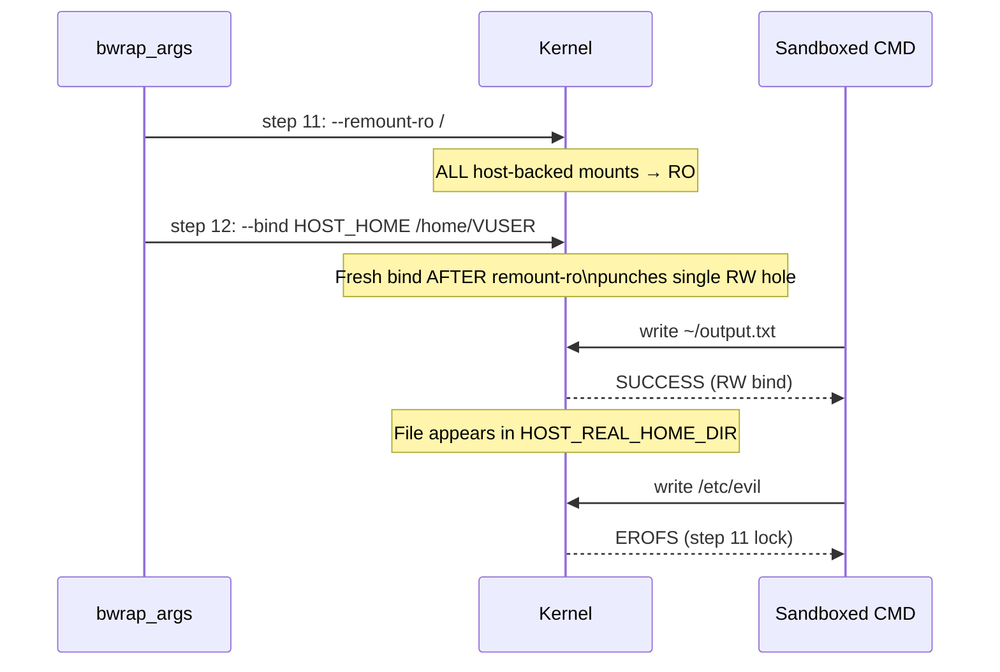

<!-- (c) 2026-* Frederick Bloom -- 20260816-101335-308705-1e8e-d64f-fd09ee3680c8-RwEgressHome.spec-0.0.1.md -- Hanaden AI Loader -->
---
filename-id:   20260816-101335-308705-1e8e-d64f-fd09ee3680c8-RwEgressHome.spec
node-type:     SPEC
layer:         4
spec-domain:   FUNC
version:       0.0.1
status:        Implemented
author:        Frederick Bloom
copyright:     (c) 2026-* Frederick Bloom
description: >
  /home/VUSER inside the sandbox MUST be read-write, bound to HOST_REAL_HOME_DIR on
  the host. This is achieved via a post-lock --bind (step 12) applied AFTER
  --remount-ro /, punching a single authorized RW "write-hole" through the otherwise
  read-only root. Writes to /home/VUSER persist to the host after sandbox exit.
  Writes to all other paths are blocked by EROFS.
parent:        20260816-101335-342292-15b3-b177-2dc4d1112a1f-VfsIsolation.feat
leaf-value:    "RW bind on /home/VUSER persisting to HOST_REAL_HOME_DIR"
leaf-unit:     "bind-mount"
tdd:
  test-file:      src/test/hanaden-bwrap-enhanced/BwrapEnhanced2026.strat/UncontainedAgentExecution.driv/NamespaceIsolatedSandbox.moti/VfsIsolation.feat/RwEgressHome.spec/test_rw_egress_home.sh
---

# RwEgressHome: Single RW Egress Write-Hole to Host Home Directory

## Specification Statement

`/home/VUSER` inside the sandbox MUST be read-write. Any file written to `/home/VUSER`
during sandbox execution MUST persist to `HOST_REAL_HOME_DIR` on the host filesystem
after the sandbox exits. All other paths remain read-only.

## Rationale

The sandbox needs exactly ONE authorized persistence channel: the operator's designated
home directory. This write-hole is created by a deliberate bwrap technique: applying a
fresh `--bind HOST_HOME /home/VUSER` AFTER `--remount-ro /`. Because bwrap processes
mount operations sequentially, the post-lock bind overrides the root's read-only lock
for that specific mountpoint. This is the "write-hole" pattern — targeted, minimal,
and auditable.

Without any egress path, the sandbox would be useful only for pure-read workloads. With
this single RW bind, the agent can write output files, logs, and artifacts to its home
directory, which the caller retrieves after sandbox exit.

## Constraints

| Constraint | Value | Condition |
|------------|-------|-----------|
| /home/VUSER filesystem access | RW | Always |
| Write propagation | /home/VUSER → HOST_REAL_HOME_DIR | After sandbox exit |
| Post-lock bind position | AFTER --remount-ro / (step 12) | Mandatory ordering |
| All other paths | EROFS | Always |
| Egress paths count | 1 (only /home/VUSER) | By design |

## Leaf Value

> 🛑 **Primitive** — terminal specification.

**Value:** RW `--bind HOST_HOME /home/VUSER` applied after `--remount-ro /`
**Source:** bwrap-enhanced.sh L459-L461 (step 12 of exec_sandbox)

## Measurement Method

```bash
# 1. Write inside sandbox, verify on host
PROBE="probe-$$-$(date +%s)"
sandbox_exec "echo 'hello' > ~/$PROBE"
test -f "$HOST_REAL_HOME_DIR/$PROBE" && echo "PASS: write persisted to host"

# 2. Verify /home/VUSER is RW inside
sandbox_exec "touch ~/rwtest && rm ~/rwtest" && echo "PASS: /home/VUSER is RW"

# 3. Verify /tmp write does NOT persist
sandbox_exec "echo 'temp' > /tmp/tmptest"
! test -f "/tmp/tmptest" && echo "PASS: /tmp does not persist"

# 4. Verify write to /etc fails (EROFS, not the egress)
sandbox_exec "touch /etc/probe 2>&1 | grep -q 'Read-only'" && echo "PASS: /etc EROFS"
```

## Test Suite

> **Suite ID:** 20260816-101335-308705-1e8e-d64f-fd09ee3680c8-RwEgressHome.spec-SUITE
> **Suite name:** RW Egress Home Spec Suite
> **Test file:** `src/test/hanaden-bwrap-enhanced/.../RwEgressHome.spec/test_rw_egress_home.sh`

### ⚙️ Functional Tests

| ID | Description | Method | Pass Criteria | TDD |
|----|-------------|--------|---------------|-----|
| RWE-001 | ~/probe write succeeds inside | `touch ~/probe` inside | exit 0 | NOT_STARTED |
| RWE-002 | Write persists to host home | write ~/f inside; stat on host | file present on host | NOT_STARTED |
| RWE-003 | /tmp write does NOT persist | write /tmp/f inside; stat on host | file NOT on host | NOT_STARTED |
| RWE-004 | /home/VUSER is the only RW bind | all other paths EROFS | 0 exceptions | NOT_STARTED |
| RWE-005 | Large write persists (100MB) | write 100MB to ~/large; check host | 100MB file on host | NOT_STARTED |
| RWE-006 | Write after --remount-ro works | static ordering check | post-lock bind line after remount-ro | NOT_STARTED |

### 🛡️ Security Tests

| ID | Description | Attack / Scenario | Expected Defense | TDD |
|----|-------------|-------------------|------------------|-----|
| RWE-S001 | Cannot write to /etc (not the egress) | `echo x > /etc/hosts` inside | EROFS | NOT_STARTED |
| RWE-S002 | Cannot write to /tmp on host | Write /tmp/evil inside | Not on host after exit | NOT_STARTED |

## References

- bwrap-enhanced.sh L459-L461 (step 12: --bind HOST_HOME /home/VUSER after --remount-ro /)
- SandboxExecEngine.arch §3 Mount Sequence Contract

## Changelog

| Version | Date | Author | Changes |
|---------|------|--------|---------|
| 0.0.1 | 2026-08-16 | Frederick Bloom + AI | Initial spec |
| 0.0.1 | 2026-08-17 | Frederick Bloom + AI | Enrich: Rationale, write-hole explanation, Measurement Method, security tests |

## Behavioral Flow: Post-Lock Write-Hole Pattern


