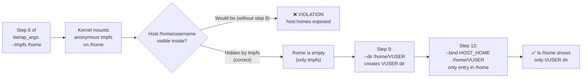

<!-- (c) 2026-* Frederick Bloom -- 20260816-182145-345070-7b5b-b0fd-92cb7e638138-TmpfsHomeOverlay.spec-0.0.1.md -- Hanaden AI Loader -->
---
filename-id:   20260816-182145-345070-7b5b-b0fd-92cb7e638138-TmpfsHomeOverlay.spec
node-type:     SPEC
layer:         4
spec-domain:   FUNC
version:       0.0.1
status:        Implemented
author:        Frederick Bloom
copyright:     (c) 2026-* Frederick Bloom
description: >
  /home inside the sandbox MUST be an anonymous tmpfs mount (--tmpfs /home), hiding
  all host home directories including remote network homes. Only /home/VUSER
  (the egress bind) is visible under this tmpfs. This prevents any host user's home
  directory from being accessible, even if the host uses remote automounts for /home.
parent:        20260816-101335-342292-15b3-b177-2dc4d1112a1f-VfsIsolation.feat
leaf-value:    "tmpfs on /home hiding all host homes"
leaf-unit:     "fstype"
tdd:
  test-file:      src/test/hanaden-bwrap-enhanced/BwrapEnhanced2026.strat/UncontainedAgentExecution.driv/NamespaceIsolatedSandbox.moti/VfsIsolation.feat/TmpfsHomeOverlay.spec/test_tmpfs_home_overlay.sh
---

# TmpfsHomeOverlay: Anonymous tmpfs on /home Hides All Host Home Directories

## Specification Statement

Inside the sandbox, `/home` MUST be an anonymous tmpfs mount created by `--tmpfs /home`.
No host user home directories MUST be visible under `/home`. Only `/home/VUSER` MUST
exist, created by subsequent `--dir /home/VUSER` and the egress bind.

## Rationale

Without this overlay, `/home` would show the host's actual home directories (which on
multi-user systems may include hundreds of user homes). This creates two risks:
1. **Privacy**: sandboxed processes can read other users' home directory names and
   potentially their world-readable files
2. **Mount hangs**: accessing unmanaged `/home/username` triggers remote mount probes
   that can hang for 30–90 seconds

The anonymous tmpfs ensures `/home` is a clean, sandbox-specific workspace with
no knowledge of other users or host filesystem layout.

## Constraints

| Constraint | Value | Condition |
|------------|-------|-----------|
| /home filesystem type | tmpfs | Always inside sandbox |
| Host home dirs visible under /home | 0 | Always |
| /home/VUSER exists | yes (from --dir + egress bind) | Always |
| /home writable by sandbox | yes (tmpfs is RW) | Until --remount-ro step |
| After --remount-ro: /home RO except VUSER | yes | Post step-11 |

## Leaf Value

> 🛑 **Primitive** — terminal specification.

**Value:** `tmpfs` filesystem type on `/home`
**Rationale:** Any other filesystem type (ext4, remote fs, overlay) means the host homes are exposed.
**Source:** bwrap-enhanced.sh L394-L400 (`--tmpfs /home` in bwrap_args step 8)

## Measurement Method

```bash
# Inside the sandbox:
stat -f -c %T /home
# Expected: tmpfs

ls /home
# Expected: only VUSER directory, no other home dirs

# On host — verify no remote mount triggered:
time ls /home
# Expected: exits < 0.1s (no remote probe)
```

## Test Suite

> **Suite ID:** 20260816-182145-345070-7b5b-b0fd-92cb7e638138-TmpfsHomeOverlay.spec-SUITE
> **Suite name:** Tmpfs Home Overlay Spec Suite
> **Test file:** `src/test/hanaden-bwrap-enhanced/.../TmpfsHomeOverlay.spec/test_tmpfs_home_overlay.sh`

### ⚙️ Functional Tests

| ID | Description | Method | Pass Criteria | TDD |
|----|-------------|--------|---------------|-----|
| THO-001 | /home is tmpfs | `stat -f -c %T /home` inside | tmpfs | NOT_STARTED |
| THO-002 | No host home dirs visible | `ls /home` inside | only VUSER | NOT_STARTED |
| THO-003 | /home/VUSER exists | `test -d /home/VUSER` inside | exit 0 | NOT_STARTED |
| THO-004 | No remote hang on ls /home | `time ls /home` inside | < 0.5s | NOT_STARTED |

### 🛡️ Security Tests

| ID | Description | Attack / Scenario | Expected Defense | TDD |
|----|-------------|-------------------|------------------|-----|
| THO-S001 | Other user's home not accessible | `ls /home/root` inside | No such file | NOT_STARTED |
| THO-S002 | Remote home not mounted | `mount \| grep /home` inside | only tmpfs entry | NOT_STARTED |

## References

- bwrap-enhanced.sh L394-L400 (--tmpfs /home in exec_sandbox step 8)
- HostShadowing.feat HomesShadow.spec (related: /homes shadowing)

## Changelog

| Version | Date | Author | Changes |
|---------|------|--------|---------|
| 0.0.1 | 2026-08-16 | Frederick Bloom + AI | Initial spec |
| 0.0.1 | 2026-08-17 | Frederick Bloom + AI | Enrich: Rationale, Constraints, Leaf Value, Measurement Method, expanded test suite |

## Behavioral Flow


