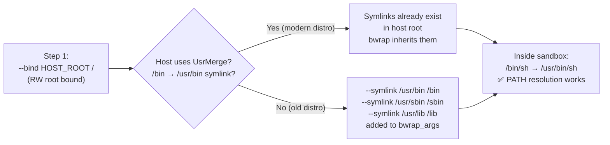

<!-- (c) 2026-* Frederick Bloom -- 20260816-101335-359164-d3d2-8e27-be6f69a3dfb8-UsrMergeSymlinks.spec-0.0.1.md -- Hanaden AI Loader -->
---
filename-id:   20260816-101335-359164-d3d2-8e27-be6f69a3dfb8-UsrMergeSymlinks.spec
node-type:     SPEC
layer:         4
spec-domain:   FUNC
version:       0.0.1
status:        Implemented
author:        Frederick Bloom
copyright:     (c) 2026-* Frederick Bloom
description: >
  On Debian 12+ (usr-merge), /lib, /bin, /sbin, /lib64, /lib32 are symlinks to
  usr/lib, usr/bin, usr/sbin, usr/lib64, usr/lib32. The sandbox must create these
  same symlinks via bwrap --symlink flags so ELF binaries can locate their dynamic
  libraries without the host's real /lib directory.
parent:        20260816-101335-342292-15b3-b177-2dc4d1112a1f-VfsIsolation.feat
leaf-value:    "5 symlinks: /lib→usr/lib /bin→usr/bin /sbin→usr/sbin /lib64→usr/lib64 /lib32→usr/lib32"
leaf-unit:     "symlinks"
tdd:
  test-file:      src/test/hanaden-bwrap-enhanced/BwrapEnhanced2026.strat/UncontainedAgentExecution.driv/NamespaceIsolatedSandbox.moti/VfsIsolation.feat/UsrMergeSymlinks.spec/test_usr_merge_symlinks.sh
---

# UsrMergeSymlinks: Debian 12+ usr-merge Compatibility Symlinks

## Specification Statement

Inside the sandbox VFS, the following symlinks MUST exist:
`/lib → usr/lib`, `/bin → usr/bin`, `/sbin → usr/sbin`,
`/lib64 → usr/lib64`, `/lib32 → usr/lib32`.
These MUST be created via bwrap `--symlink` flags, not by modifying the host VFS.

## Rationale

Debian 12 (Bookworm) completed the usr-merge migration: the traditional directories
`/bin`, `/lib`, `/sbin`, `/lib64`, `/lib32` no longer exist as real directories — they
are symlinks to their `usr/` equivalents. When `bwrap --bind HOST_ROOT /` creates the
sandbox root, the symlinks are bound in from the host root. However, if the host does
NOT have these as symlinks (older Debian, or a stripped root), ELF binaries will fail
to locate their dynamic linker (`ld-linux-x86-64.so.2` at `/lib64/ld-linux-x86-64.so.2`),
causing `Exec format error` or `No such file or directory`. The explicit `--symlink`
flags ensure these paths are always correct regardless of the host root's state.

## Constraints

| Constraint | Value | Condition |
|------------|-------|-----------|
| /bin target | usr/bin | Always |
| /lib target | usr/lib | Always |
| /sbin target | usr/sbin | Always |
| /lib64 target | usr/lib64 | Always |
| /lib32 target | usr/lib32 | Always |
| Creation method | bwrap --symlink (not ln or mkdir) | Always |

## Leaf Value

> 🛑 **Primitive** — terminal specification.

**Value:** 5 symlinks as listed above
**Source:** bwrap-enhanced.sh L249-L257 (`--symlink usr/lib /lib` etc.)

## Measurement Method

```bash
# Inside the sandbox:
for pair in "usr/bin /bin" "usr/lib /lib" "usr/sbin /sbin" "usr/lib64 /lib64" "usr/lib32 /lib32"; do
  target=$(echo $pair | awk '{print $1}')
  link=$(echo $pair | awk '{print $2}')
  actual=$(readlink $link 2>/dev/null)
  [ "$actual" = "$target" ] && echo "PASS: $link -> $target" || echo "FAIL: $link"
done
# Also verify ELF works:
ldd /usr/bin/bash | grep -c "not found"  # Expected: 0
```

## Test Suite

> **Suite ID:** 20260816-101335-359164-d3d2-8e27-be6f69a3dfb8-UsrMergeSymlinks.spec-SUITE

### ⚙️ Functional Tests

| ID | Description | Method | Pass Criteria | TDD |
|----|-------------|--------|---------------|-----|
| UMS-001 | /bin → usr/bin | `readlink /bin` inside | usr/bin | NOT_STARTED |
| UMS-002 | /lib → usr/lib | `readlink /lib` inside | usr/lib | NOT_STARTED |
| UMS-003 | /sbin → usr/sbin | `readlink /sbin` inside | usr/sbin | NOT_STARTED |
| UMS-004 | /lib64 → usr/lib64 | `readlink /lib64` inside | usr/lib64 | NOT_STARTED |
| UMS-005 | /lib32 → usr/lib32 | `readlink /lib32` inside | usr/lib32 | NOT_STARTED |
| UMS-006 | ELF resolves (ldd bash) | `ldd /usr/bin/bash` inside | 0 "not found" | NOT_STARTED |
| UMS-007 | Python interpreter works | `/usr/bin/python3 -c 'print("ok")'` inside | "ok" | NOT_STARTED |

## References

- bwrap-enhanced.sh L249-L257 (`--symlink usr/lib /lib` sequence)
- Debian UsrMerge: https://wiki.debian.org/UsrMerge

## Changelog

| Version | Date | Author | Changes |
|---------|------|--------|---------|
| 0.0.1 | 2026-08-16 | Frederick Bloom + AI | Initial spec |
| 0.0.1 | 2026-08-16 | Frederick Bloom + AI | Enrich: Rationale, Measurement Method, Leaf Value, ELF test |

## Behavioral Flow


