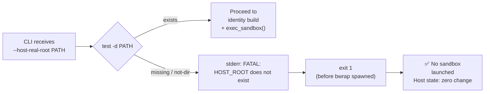

<!-- (c) 2026-* Frederick Bloom -- 20260816-101335-647528-f2a3-e9c3-ad6fc01b1d64-MissingRootFatal.spec-0.0.1.md -- Hanaden AI Loader -->
---
filename-id:   20260816-101335-647528-f2a3-e9c3-ad6fc01b1d64-MissingRootFatal.spec
node-type:     SPEC
layer:         4
spec-domain:   FUNC
version:       0.0.1
status:        Implemented
author:        Frederick Bloom
copyright:     (c) 2026-* Frederick Bloom
description: >
  If HOST_REAL_ROOT_DIR does not exist as a directory on the host filesystem,
  bwrap-enhanced.sh MUST print a FATAL ERROR to stderr and exit with non-zero exit code.
  bwrap MUST NOT be launched. No host paths MUST be created.
parent:        20260816-101335-625206-4466-d976-ccc25027e9ed-ZeroSideEffects.feat
leaf-value:    "exit code >= 1 with FATAL on stderr"
leaf-unit:     "exit code"
tdd:
  test-file:      src/test/hanaden-bwrap-enhanced/BwrapEnhanced2026.strat/UncontainedAgentExecution.driv/NamespaceIsolatedSandbox.moti/ZeroSideEffects.feat/MissingRootFatal.spec/test_missing_root_fatal.sh
---

# MissingRootFatal: FATAL Exit When HOST_ROOT_DIR Does Not Exist

## Specification Statement

When `HOST_REAL_ROOT_DIR` is set to a path that does not exist as a directory,
`bwrap-enhanced.sh` MUST emit a FATAL ERROR message to stderr, exit with a non-zero
code (≥1), and MUST NOT launch bwrap.

## Rationale

If bwrap is launched with a missing host root, the `--bind MISSING_PATH /` call inside
bwrap will fail with a bwrap-internal error that is much harder to diagnose than a clear
pre-launch FATAL. Pre-validation provides operator-friendly diagnostics with the exact
expected path, making the error actionable. The FATAL-before-launch pattern also ensures
zero host mutation even on error paths.

## Constraints

| Constraint | Value | Condition |
|------------|-------|-----------|
| Exit code | ≥ 1 | Always when ROOT_DIR missing |
| FATAL on stderr | MUST appear | Always |
| bwrap launched | MUST NOT | When ROOT_DIR missing |
| Host mutations | 0 | Even on FATAL path |

## Leaf Value

> 🛑 **Primitive** — terminal specification.

**Value:** `exit code ≥ 1, FATAL on stderr, bwrap not launched`
**Rationale:** A zero exit code or silent failure would hide the configuration error.
**Source:** L722-L730 of bwrap-enhanced.sh validation block.

## Measurement Method

```bash
# Create a path that does not exist
FAKE_ROOT="/tmp/fake-root-missing-$$"
# Invoke and capture
output=$(./bwrap-enhanced.sh --host-real-root "$FAKE_ROOT" -- /bin/true 2>&1)
exit_code=$?
# Assertions:
test $exit_code -ge 1              && echo "PASS: non-zero exit"
echo "$output" | grep -qi "FATAL" && echo "PASS: FATAL on stderr"
# bwrap not launched (check via strace or process list):
! pgrep -x bwrap                   && echo "PASS: bwrap not launched"
```

## Test Suite

> **Suite ID:** 20260816-101335-647528-f2a3-e9c3-ad6fc01b1d64-MissingRootFatal.spec-SUITE

### ⚙️ Functional Tests

| ID | Description | Method | Pass Criteria | TDD |
|----|-------------|--------|---------------|-----|
| MRF-001 | Non-zero exit on missing root | missing root path → $? | $? ≥ 1 | NOT_STARTED |
| MRF-002 | FATAL on stderr | grep "FATAL" in stderr | match | NOT_STARTED |
| MRF-003 | bwrap not launched | pgrep bwrap during invocation | 0 results | NOT_STARTED |
| MRF-004 | Path in FATAL message | grep "$FAKE_ROOT" in stderr | match | NOT_STARTED |
| MRF-005 | 0 host mutations | find -newer ref | 0 results | NOT_STARTED |
| MRF-006 | File path (not dir) also FATAL | pass a file path as root | exit ≥1 + FATAL | NOT_STARTED |

## References

- bwrap-enhanced.sh L722-L730 (ROOT_DIR validation)

## Changelog

| Version | Date | Author | Changes |
|---------|------|--------|---------|
| 0.0.1 | 2026-08-16 | Frederick Bloom + AI | Initial spec |
| 0.0.1 | 2026-08-16 | Frederick Bloom + AI | Enrich: Rationale, Measurement Method, Leaf Value, expanded tests |

## Behavioral Flow


