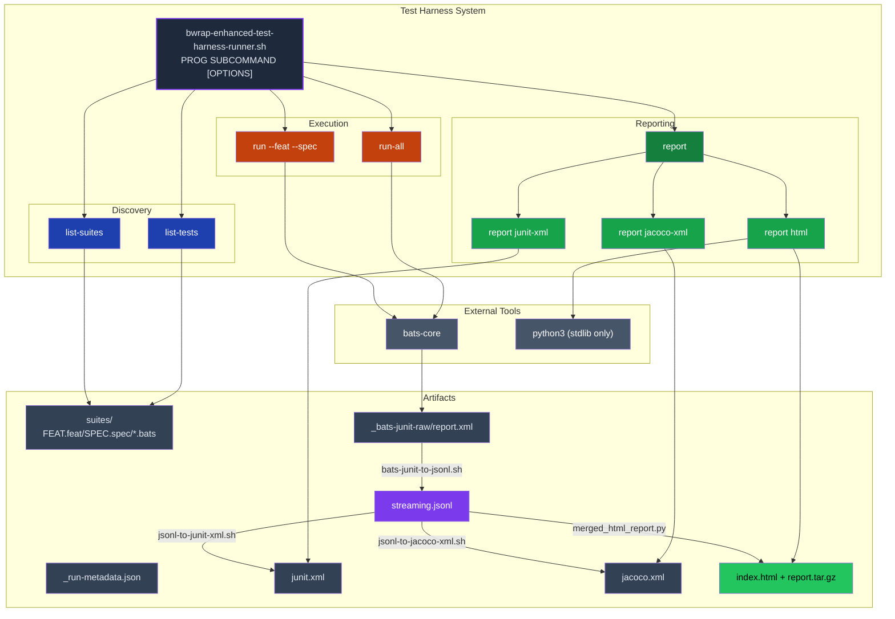
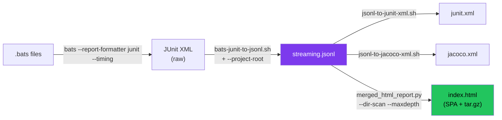
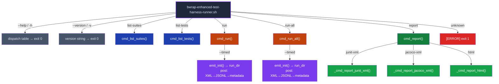
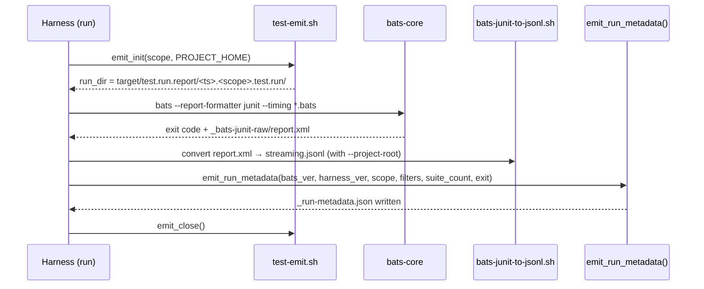
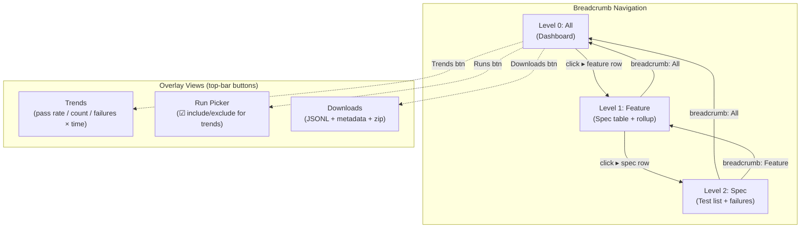
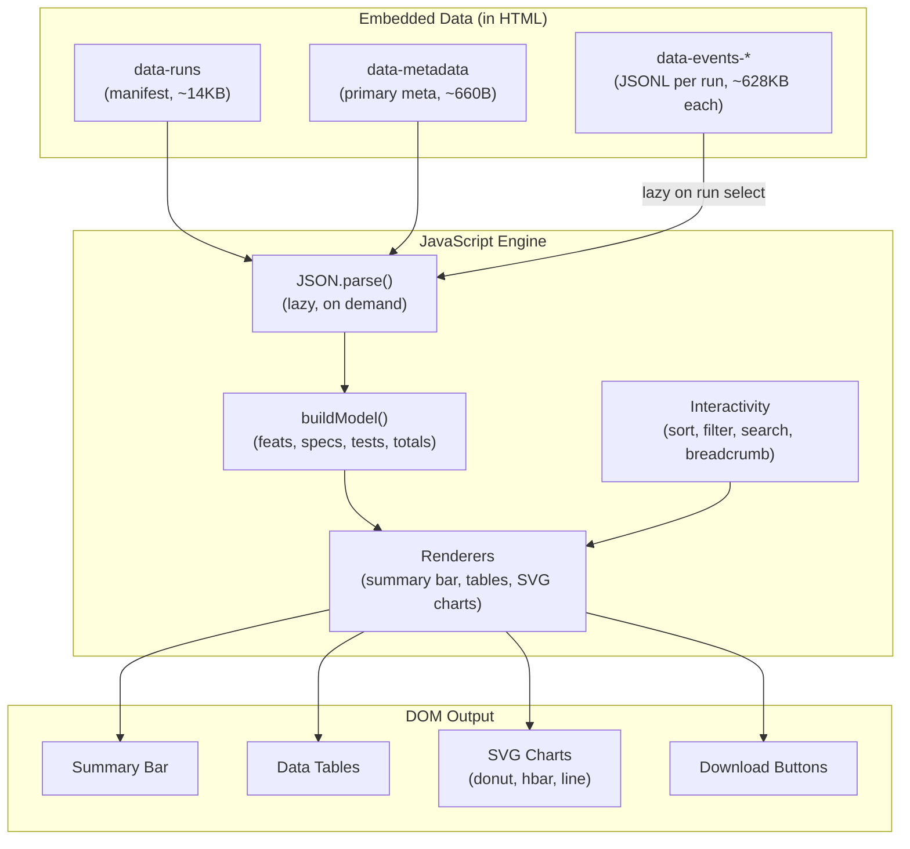

<!-- (c) 2026-* Frederick Bloom -- Hanaden AI -->

# Test Harness System — Detailed Architecture Design

**System:** `bwrap-enhanced-test-harness-runner.sh` — the canonical test runner for bwrap-enhanced.

**Version:** 0.4.0 (proposed)

**Scope:** This document is the **single source of truth** for the entire scope, design, and architecture of the test harness, its pipeline, schemas, report generator, and HTML SPA report.

---

## System Overview



## Pipeline Flow



## Command Dispatch Tree



## Derived Directories and Files

All paths derive from the script's own location:

```
_HARNESS_DIR  = $(cd "$(dirname "$0")" && pwd)
_SUITES_DIR   = ${_HARNESS_DIR}/suites
_PROJECT_HOME = $(cd "${_HARNESS_DIR}/../../.." && pwd)
_LIB_DIR      = ${_PROJECT_HOME}/src/lib
```

### Full Project Directory Tree

```
PROJECT_HOME/                                      ← _PROJECT_HOME (derived: 3 levels up from harness)
├── src/
│   ├── lib/                                       ← _LIB_DIR
│   │   ├── bats-junit-to-jsonl.sh                 ← JUnit XML → JSONL converter
│   │   ├── jsonl-to-junit-xml.sh                  ← JSONL → JUnit XML converter
│   │   ├── jsonl-to-jacoco-xml.sh                 ← JSONL → JaCoCo XML converter
│   │   ├── test-emit.sh                           ← emit_init(), emit_run_metadata(), emit_close()
│   │   ├── schemas/
│   │   │   ├── test-event.schema.json             ← JSONL test event schema
│   │   │   └── coverage-event.schema.json         ← JSONL coverage event schema
│   │   └── report-generators/
│   │       ├── merged_html_report.py              ← HTML SPA generator (data packager)
│   │       ├── report_template.html               ← [NEW v0.4.0] HTML template with CSS+JS
│   │       ├── _html_templates.py                 ← [LEGACY v0.2.0] Python HTML string builders
│   │       ├── junit_html_report.py               ← [LEGACY v0.2.0] JUnit-only HTML
│   │       ├── jacoco_html_report.py              ← [LEGACY v0.2.0] JaCoCo-only HTML
│   │       ├── unified_html_report.py             ← [LEGACY v0.2.0] unified HTML
│   │       └── __init__.py
│   ├── main/
│   │   └── hanaden-bwrap-enhanced/
│   │       └── bwrap-enhanced.sh                  ← system under test (SUT)
│   └── test/
│       └── hanaden-bwrap-enhanced/                ← _HARNESS_DIR
│           ├── bwrap-enhanced-test-harness-runner.sh  ← THIS FILE (entry point)
│           └── suites/                            ← _SUITES_DIR
│               ├── AudioPassthrough.feat/
│               │   └── PipewireSocketBind.spec/
│               │       └── test_pipewire_socket_bind.bats
│               ├── BwrapPreflight.feat/
│               │   ├── BwrapBinaryPresent.spec/
│               │   │   └── test_bwrap_binary_present.bats
│               │   ├── BwrapMinimalSmoke.spec/
│               │   │   └── test_bwrap_minimal_smoke.bats
│               │   └── UserNamespaceEnabled.spec/
│               │       └── test_user_namespace_enabled.bats
│               ├── CliContract.feat/
│               │   ├── BoolFlagParsing.spec/
│               │   │   └── test_bool_flag_parsing.bats
│               │   └── ... (45+ test files)
│               └── ... (43 features total)
└── target/
    └── test.run.report/                           ← --timed output root
        ├── 20260901-111005-977759.run-all.test.run/       ← full suite run
        │   ├── _bats-junit-raw/
        │   │   └── report.xml                     ← raw bats JUnit XML
        │   ├── streaming.jsonl                    ← normalized JSONL
        │   ├── _run-metadata.json                 ← aggregate stats
        │   ├── junit.xml                          ← generated JUnit XML
        │   └── jacoco.xml                         ← generated JaCoCo XML
        ├── 20260901-021332-069238.run--feat-BwrapPreflight--spec-BwrapBinaryPresent.test.run/
        │   └── ... (same structure)               ← scoped run
        └── html/                                  ← report html --output
            ├── index.html                         ← self-contained SPA
            └── report.tar.gz                      ← compressed for transfer
```

### Directory Naming Conventions

| Pattern | Meaning | Example |
|:---|:---|:---|
| `<YYYYMMDD-HHMMSS-uuuuuu>.run-all.test.run/` | Full suite run | `20260901-111005-977759.run-all.test.run/` |
| `<YYYYMMDD-HHMMSS-uuuuuu>.run--feat-<F>.test.run/` | Feature-scoped run | `20260901-021332-069238.run--feat-BwrapPreflight.test.run/` |
| `<YYYYMMDD-HHMMSS-uuuuuu>.run--feat-<F>--spec-<S>.test.run/` | Spec-scoped run | `20260901-021332-069238.run--feat-BwrapPreflight--spec-BwrapBinaryPresent.test.run/` |

---

## 1. System Definition

Command tool that discovers, executes, and reports on the bwrap-enhanced test suite using **bats-core** as the test engine. Follows the `git`/`rtk`/`podman`/`systemctl` dispatcher pattern:

```
bwrap-enhanced-test-harness-runner.sh  SUBCOMMAND  [OPTIONS]  [ARGS]
```

Options belong to the subcommand — they always follow the subcommand name.
The only pre-subcommand forms are:

```
bwrap-enhanced-test-harness-runner.sh --help | -h     # dispatch table (all subcommands), exit 0
bwrap-enhanced-test-harness-runner.sh --version | -v  # version string, exit 0
```

**Entry point:** `PROJECT_HOME/src/test/hanaden-bwrap-enhanced/bwrap-enhanced-test-harness-runner.sh`

---

## 2. Subcommands

| Subcommand | Status | Purpose |
|:---|:---|:---|
| `list-suites` | **full** | Discover and list all feat/spec pairs in `suites/` |
| `list-tests` | **full** | List all `@test` cases discovered in suites |
| `run` | **full** | Run a filtered subset of tests (by `--feat`/`--spec`/`--filter`) |
| `run-all` | **full** | Run the entire test suite (all populated suites) |
| `report` | **full** | Generate reports from JSONL data (sub-dispatch: `junit-xml`, `jacoco-xml`, `html`) |
| `json-schema-list` | **full** | List all embedded JSON schemas |
| `json-schema-emit` | **full** | Emit a named embedded JSON schema to stdout |

### 2.1 `list-suites` — Discover test suites

```
bwrap-enhanced-test-harness-runner.sh list-suites [OPTIONS]
```

| Arg | Type | Default | Description |
|:---|:---|:---|:---|
| `-h`, `--help` | flag | — | Show help and exit 0 |
| `--feat` | PATTERN | `*` (all) | Filter by feat name (fnmatch glob, omit `.feat` suffix) |
| `--spec` | PATTERN | `*` (all) | Filter by spec name (fnmatch glob, omit `.spec` suffix) |
| `--populated` | flag | `false` | Show only suites containing at least one `.bats` file |
| `--format` | `table\|names` | `table` | `table`: aligned columns (FEAT SPEC TESTS STATUS); `names`: bare `FEAT/SPEC` one per line |
| `--log-level` | NAME\|NUMBER | `INFO` (400) | Filter log verbosity |

**Exit codes:** `0` = success, `1` = option parse error

### 2.2 `list-tests` — List all individual tests

```
bwrap-enhanced-test-harness-runner.sh list-tests [OPTIONS]
```

| Arg | Type | Default | Description |
|:---|:---|:---|:---|
| `-h`, `--help` | flag | — | Show help and exit 0 |
| `--feat` | PATTERN | `*` (all) | Filter by feat name (fnmatch glob) |
| `--spec` | PATTERN | `*` (all) | Filter by spec name (fnmatch glob) |
| `--format` | `table\|ids` | `table` | `table`: FEAT SPEC ID NAME; `ids`: bare test IDs (first token of name) |
| `--log-level` | NAME\|NUMBER | `INFO` (400) | Filter log verbosity |

**Exit codes:** `0` = success (even if 0 tests found), `1` = option parse error

### 2.3 `run` — Execute filtered test subset

```
bwrap-enhanced-test-harness-runner.sh run [OPTIONS]
```

| Arg | Type | Default | Description |
|:---|:---|:---|:---|
| `-h`, `--help` | flag | — | Show help and exit 0 |
| `--feat` | PATTERN | `*` (all) | Run only suites matching this feat glob |
| `--spec` | PATTERN | `*` (all) | Run only specs matching this spec glob |
| `--filter` | REGEX | `""` (none) | Pass `--filter REGEX` to bats (match by test name) |
| `--format` | `pretty\|tap\|tap13\|junit` | `pretty` | Bats formatter |
| `--timed` | flag | `false` | Enable timing + JSONL emission to `target/test.run.report/` |
| `-j`, `--jobs` | N | 25% of cores (≥1, ≤6) | Parallel bats execution (passed as `bats -j N`) |
| `--log-level` | NAME\|NUMBER | `INFO` (400) | Filter log verbosity |
| `-n`, `--dry-run` | flag | `false` | Print bats invocation; do not run |

**Exit codes:** `0` = all tests passed, `1` = one or more tests failed, `2` = no `.bats` files matched, `3` = option parse error

**Derived scope label** (for `--timed` output directory name):
```
feat_pat="*", spec_pat="*"     → scope="run"
feat_pat="X",  spec_pat="*"    → scope="run--feat-X"
feat_pat="X",  spec_pat="Y"    → scope="run--feat-X--spec-Y"
```

**`--timed` post-processing flow:**



### 2.4 `run-all` — Execute full test suite

```
bwrap-enhanced-test-harness-runner.sh run-all [OPTIONS]
```

| Arg | Type | Default | Description |
|:---|:---|:---|:---|
| `-h`, `--help` | flag | — | Show help and exit 0 |
| `--populated-only` | flag | `true` | Skip suites with no `.bats` files |
| `--no-populated-only` | flag | — | Include empty suites (produces no tests) |
| `--format` | `pretty\|tap\|tap13\|junit` | `pretty` | Bats formatter |
| `--timed` | flag | `false` | Enable timing + JSONL emission |
| `-j`, `--jobs` | N | 25% of cores (≥1, ≤6) | Parallel bats execution (passed as `bats -j N`) |
| `--log-level` | NAME\|NUMBER | `INFO` (400) | Filter log verbosity |
| `-n`, `--dry-run` | flag | `false` | Print bats invocation; do not run |

**Exit codes:** same as `run`

Same `--timed` post-processing as `run`; scope is always `"run-all"`.

### 2.5 `report` — Generate reports (sub-dispatch)

```
bwrap-enhanced-test-harness-runner.sh report SUBCOMMAND [OPTIONS]
```

| Sub-subcommand | Purpose |
|:---|:---|
| `junit-xml` | Convert `streaming.jsonl` → JUnit XML |
| `jacoco-xml` | Convert `streaming.jsonl` → JaCoCo XML |
| `html` | Generate self-contained HTML SPA report |

#### 2.5.1 `report junit-xml`

```
bwrap-enhanced-test-harness-runner.sh report junit-xml [OPTIONS]
```

| Arg | Type | Default | Description |
|:---|:---|:---|:---|
| `-h`, `--help` | flag | — | Show help and exit 0 |
| `--input` | PATH | ✗ **required** | Path to `streaming.jsonl` |
| `--log-level` | NAME\|NUMBER | `INFO` (400) | Filter log verbosity |

**Exit codes:** `0` = success, `1` = `--input` missing, `2` = file not found

**Tool invoked:** `bash ${_LIB_DIR}/jsonl-to-junit-xml.sh "$input"`
**Output:** `junit.xml` written to same directory as input

#### 2.5.2 `report jacoco-xml`

```
bwrap-enhanced-test-harness-runner.sh report jacoco-xml [OPTIONS]
```

| Arg | Type | Default | Description |
|:---|:---|:---|:---|
| `-h`, `--help` | flag | — | Show help and exit 0 |
| `--input` | PATH | ✗ **required** | Path to `streaming.jsonl` |
| `--log-level` | NAME\|NUMBER | `INFO` (400) | Filter log verbosity |

**Exit codes:** `0` = success, `1` = `--input` missing, `2` = file not found

**Tool invoked:** `bash ${_LIB_DIR}/jsonl-to-jacoco-xml.sh "$input"`
**Output:** `jacoco.xml` written to same directory as input

#### 2.5.3 `report html` (v0.4.0 — redesigned)

```
bwrap-enhanced-test-harness-runner.sh report html [OPTIONS]
```

| Arg | Type | Default | Description |
|:---|:---|:---|:---|
| `-h`, `--help` | flag | — | Show help and exit 0 |
| `--dir-scan` | DIR | ✗ **required** | Base directory to scan for `*.test.run/` directories |
| `--maxdepth` | N | `1` | Max directory depth for discovery (like `find -maxdepth`) |
| `--primary` | NAME | latest `run-all` by timestamp | Which discovered run to show initially in detail view |
| `-o`, `--output` | DIR | `./` (cwd) | Base output directory; site is written to `[DIR]/site/` |
| `--log-level` | NAME\|NUMBER | `INFO` (400) | Filter log verbosity |

**Output directory:** `[--output]/site/index.html` + `report.tar.gz`  
**Tool invoked:** `python3 ${_LIB_DIR}/report-generators/merged_html_report.py --dir-scan DIR --maxdepth N -o DIR`

**Examples:**
```bash
# Default: scan runs, output to ./site/
bwrap-enhanced-test-harness-runner.sh report html \
    --dir-scan target/test.run.report/

# Explicit output directory
bwrap-enhanced-test-harness-runner.sh report html \
    --dir-scan target/test.run.report/ \
    -o target/reports/
# → writes to target/reports/site/index.html

# Explicit primary run
bwrap-enhanced-test-harness-runner.sh report html \
    --dir-scan target/test.run.report/ \
    --primary 20260901-111005-977759.run-all.test.run
```

### 2.6 `json-schema-list` — List embedded schemas

```
bwrap-enhanced-test-harness-runner.sh json-schema-list
```

No options. Prints one schema name per line to stdout.

**Output:**
```
test-event
coverage-event
```

**Exit codes:** `0` = success

### 2.7 `json-schema-emit` — Emit named schema

```
bwrap-enhanced-test-harness-runner.sh json-schema-emit SCHEMA_NAME
```

| Arg | Type | Default | Description |
|:---|:---|:---|:---|
| `SCHEMA_NAME` | string | ✗ **required** | Name of the schema to emit (from `json-schema-list`) |
| `-h`, `--help` | flag | — | Show help and exit 0 |

**Exit codes:** `0` = success, `1` = missing or unknown schema name

**Design rationale:** The harness is **fully self-contained** — JSON schemas for test events and coverage events are embedded directly as heredocs in the shell script. The harness never reads schema files from disk. External tools that need the schema can either:
- Pipe stdout directly: `harness json-schema-emit test-event | jq .`
- Write to a temp file: `harness json-schema-emit test-event > /tmp/test-event.schema.json`
- Write to a known directory and reference it when invoking validators

**Examples:**
```bash
# Inspect a schema
bwrap-enhanced-test-harness-runner.sh json-schema-emit test-event | jq .

# Export to temp for validator use
bwrap-enhanced-test-harness-runner.sh json-schema-emit test-event > /tmp/test-event.schema.json
bwrap-enhanced-test-harness-runner.sh json-schema-emit coverage-event > /tmp/coverage-event.schema.json

# Validate a JSONL file against embedded schema
bwrap-enhanced-test-harness-runner.sh json-schema-emit test-event > /tmp/te.json
jsonschema -i streaming.jsonl /tmp/te.json
```

### Full CLI Quick Reference

```
bwrap-enhanced-test-harness-runner.sh  SUBCOMMAND  [OPTIONS]  [ARGS]
bwrap-enhanced-test-harness-runner.sh  --help | -h
bwrap-enhanced-test-harness-runner.sh  --version | -v

  list-suites
    --feat     PATTERN       (default: *)
    --spec     PATTERN       (default: *)
    --populated              (default: false)
    --format   table|names   (default: table)
    --log-level NAME|NUMBER  (default: INFO)

  list-tests
    --feat     PATTERN       (default: *)
    --spec     PATTERN       (default: *)
    --format   table|ids     (default: table)
    --log-level NAME|NUMBER  (default: INFO)

  run
    --feat     PATTERN       (default: *)
    --spec     PATTERN       (default: *)
    --filter   REGEX         (default: none)
    --format   pretty|tap|tap13|junit  (default: pretty)
    --timed                  (default: false)
    -j, --jobs N             (default: 25% of cores, ≥1, ≤6)
    --log-level NAME|NUMBER  (default: INFO)
    -n, --dry-run            (default: false)

  run-all
    --populated-only         (default: true)
    --format   pretty|tap|tap13|junit  (default: pretty)
    --timed                  (default: false)
    -j, --jobs N             (default: 25% of cores, ≥1, ≤6)
    --log-level NAME|NUMBER  (default: INFO)
    -n, --dry-run            (default: false)

  report  SUBCOMMAND
    junit-xml   --input JSONL
    jacoco-xml  --input JSONL
    html        --dir-scan DIR [OPTIONS]
                [-o, --output DIR]  (default: ./)
                [--maxdepth N] [--primary NAME]

  json-schema-list             List all embedded JSON schemas
  json-schema-emit NAME        Emit the named schema to stdout
```

---

## 3. Suites Layout

```
PROJECT_HOME/src/test/hanaden-bwrap-enhanced/suites/
  <FEAT>.feat/
    <SPEC>.spec/
      test_<name>.bats
```

**Example:**
```
suites/
  BwrapPreflight.feat/
    BwrapBinaryPresent.spec/
      test_bwrap_binary_present.bats    → PF-BIN-001, PF-BIN-002, PF-BIN-004
    BwrapMinimalSmoke.spec/
      test_bwrap_minimal_smoke.bats     → PF-SMOKE-001 … PF-SMOKE-005
  AudioPassthrough.feat/
    PipewireSocketBind.spec/
      test_pipewire_socket_bind.bats    → AUDIO-PW-001
```

Path convention: `src/test/hanaden-bwrap-enhanced/suites/<FEAT>.feat/<SPEC>.spec/test_<name>.bats`

---

## 4. Pipeline Architecture

```
                                ┌→ JUnit XML    (CI: Jenkins/GitLab)
bats ──→ JUnit XML ──→ JSONL ──┼→ JaCoCo XML   (CI: coverage gates)
                                └→ HTML SPA     (humans: file:// open, git hosting)
```

| Stage | Input | Output | Tool |
|:---|:---|:---|:---|
| **Test execution** | `.bats` files | JUnit XML | `bats --report-formatter junit --timing` |
| **XML → JSONL** | JUnit XML | `streaming.jsonl` | `bats-junit-to-jsonl.sh` |
| **JSONL → JUnit XML** | `streaming.jsonl` | `junit.xml` | `jsonl-to-junit-xml.py` |
| **JSONL → JaCoCo XML** | `streaming.jsonl` | `jacoco.xml` | `jsonl-to-jacoco-xml.py` |
| **JSONL → HTML SPA** | `streaming.jsonl` × N runs | `index.html` + `report.tar.gz` | `merged_html_report.py` |

---

## 5. Run Directory Layout

Each `--timed` execution creates:

```
target/test.run.report/
  <YYYYMMDD-HHMMSS-uuuuuu>.<scope>.test.run/
    _bats-junit-raw/
      report.xml               ← raw bats JUnit XML
    streaming.jsonl            ← normalized JSONL event stream
    _run-metadata.json         ← aggregate stats for this run
    junit.xml                  ← generated JUnit XML (from JSONL)
    jacoco.xml                 ← generated JaCoCo XML (from JSONL)
```

Directory naming convention:
- `20260901-111005-977759.run-all.test.run` — full suite run
- `20260901-110946-163395.run--feat-BwrapPreflight--spec-BwrapBinaryPresent.test.run` — scoped run

---

## 6. Schemas

All paths in data fields are **project-relative** (stripped of `PROJECT_HOME` prefix via `--project-root` arg to `bats-junit-to-jsonl.sh`).

### 6.1 Test Event Schema

**Source:** [`test-event.schema.json`](file:///homes/home-local/hanasaki/data/dev-projects-local/hanaden-bwrap-enhanced/PROJECT_HOME/src/lib/schemas/test-event.schema.json)

```json
{
  "$schema": "http://json-schema.org/draft-07/schema#",
  "$id": "https://hanaden.ai/schemas/test-event/0.1.0",
  "title": "Hanaden Test Event (JUnit-compatible)",
  "description": "A single JSONL record representing a test execution event. One of: suite_started, test_case, suite_finished.",
  "type": "object",
  "required": ["type", "trace_id", "timestamp_unix_ms"],
  "properties": {
    "type": {
      "type": "string",
      "enum": ["suite_started", "test_case", "suite_finished"]
    },
    "trace_id": {
      "type": "string",
      "description": "32-char hex trace ID linking all events in one harness invocation",
      "pattern": "^[0-9a-f]{32}$"
    },
    "timestamp_unix_ms": {
      "type": "integer",
      "description": "Unix epoch milliseconds when the event was recorded"
    }
  },
  "oneOf": [
    { "$ref": "#/definitions/suite_started" },
    { "$ref": "#/definitions/test_case" },
    { "$ref": "#/definitions/suite_finished" }
  ],
  "definitions": {
    "suite_started": {
      "properties": {
        "type": { "const": "suite_started" },
        "suite_name": {
          "type": "string",
          "description": "Name of the test suite (bats filename)"
        },
        "test_count": {
          "type": "integer",
          "minimum": 0,
          "description": "Number of test cases in this suite"
        }
      },
      "required": ["type", "trace_id", "timestamp_unix_ms", "suite_name", "test_count"]
    },
    "test_case": {
      "properties": {
        "type": { "const": "test_case" },
        "span_id": {
          "type": "string",
          "description": "16-char hex span ID unique to this test case",
          "pattern": "^[0-9a-f]{16}$"
        },
        "vector_id": {
          "type": "string",
          "description": "Structured test ID (e.g. PF-BIN-001)"
        },
        "description": {
          "type": "string",
          "description": "Full test name including ID and human description"
        },
        "feat": {
          "type": "string",
          "description": "Feature area (maps to JUnit classname prefix)"
        },
        "spec": {
          "type": "string",
          "description": "Specification (maps to JUnit classname suffix)"
        },
        "status": {
          "type": "string",
          "enum": ["PASS", "FAIL", "SKIP", "ERROR"],
          "description": "Test outcome"
        },
        "duration_ms": {
          "type": "integer",
          "minimum": 0,
          "description": "Test execution time in milliseconds"
        },
        "error_message": {
          "type": "string",
          "description": "Failure/error summary (present only on FAIL/ERROR)"
        },
        "error_output": {
          "type": "string",
          "description": "Full failure output or stack trace (present only on FAIL/ERROR)"
        }
      },
      "required": [
        "type", "trace_id", "timestamp_unix_ms",
        "span_id", "vector_id", "description",
        "feat", "spec", "status", "duration_ms"
      ]
    },
    "suite_finished": {
      "properties": {
        "type": { "const": "suite_finished" },
        "suite_name": { "type": "string" },
        "tests_run": { "type": "integer", "minimum": 0 },
        "tests_passed": { "type": "integer", "minimum": 0 },
        "tests_failed": { "type": "integer", "minimum": 0 },
        "tests_skipped": { "type": "integer", "minimum": 0 },
        "total_duration_ms": {
          "type": "integer",
          "minimum": 0,
          "description": "Wall-clock time for the entire suite in milliseconds"
        }
      },
      "required": [
        "type", "trace_id", "timestamp_unix_ms",
        "suite_name", "tests_run", "tests_passed",
        "tests_failed", "tests_skipped", "total_duration_ms"
      ]
    }
  }
}
```

**Example JSONL records conforming to this schema:**

#### `suite_started`
```json
{"type":"suite_started","trace_id":"460c378ce8b7b147e8c506dfb73239fb","suite_name":"src/test/hanaden-bwrap-enhanced/suites/BwrapPreflight.feat/BwrapBinaryPresent.spec/test_bwrap_binary_present.bats","timestamp_unix_ms":1788259997584,"test_count":3}
```

#### `test_case`
```json
{"type":"test_case","trace_id":"460c378ce8b7b147e8c506dfb73239fb","span_id":"054aaf30af3992a6","vector_id":"PF-BIN-001","description":"PF-BIN-001: bwrap present on PATH","feat":"src/test/hanaden-bwrap-enhanced/suites/BwrapPreflight","spec":"feat/BwrapBinaryPresent.spec/test_bwrap_binary_present.bats","status":"PASS","duration_ms":16,"timestamp_unix_ms":1788259997584}
```

#### `suite_finished`
```json
{"type":"suite_finished","trace_id":"460c378ce8b7b147e8c506dfb73239fb","suite_name":"src/test/hanaden-bwrap-enhanced/suites/BwrapPreflight.feat/BwrapBinaryPresent.spec/test_bwrap_binary_present.bats","timestamp_unix_ms":1788259997657,"tests_run":3,"tests_passed":3,"tests_failed":0,"tests_skipped":0,"total_duration_ms":73}
```

### 6.2 Coverage Event Schema

**Source:** [`coverage-event.schema.json`](file:///homes/home-local/hanasaki/data/dev-projects-local/hanaden-bwrap-enhanced/PROJECT_HOME/src/lib/schemas/coverage-event.schema.json)

```json
{
  "$schema": "http://json-schema.org/draft-07/schema#",
  "$id": "https://hanaden.ai/schemas/coverage-event/0.1.0",
  "title": "Hanaden Coverage Event (JaCoCo-compatible)",
  "description": "A single JSONL record representing a coverage measurement. Maps to JaCoCo's package→class→method→counter hierarchy via timing-as-coverage.",
  "type": "object",
  "required": [
    "type", "trace_id",
    "feat", "spec",
    "methods_covered", "methods_total",
    "lines_covered", "lines_total"
  ],
  "properties": {
    "type": {
      "type": "string",
      "const": "coverage_record"
    },
    "trace_id": {
      "type": "string",
      "description": "32-char hex trace ID linking to the same run",
      "pattern": "^[0-9a-f]{32}$"
    },
    "feat": {
      "type": "string",
      "description": "Feature/suite name → maps to JaCoCo <package>"
    },
    "spec": {
      "type": "string",
      "description": "Spec/class name → maps to JaCoCo <class>"
    },
    "methods_covered": {
      "type": "integer",
      "minimum": 0,
      "description": "Number of test methods that PASSED (maps to METHOD counter covered)"
    },
    "methods_total": {
      "type": "integer",
      "minimum": 0,
      "description": "Total test methods in this class (maps to METHOD counter total)"
    },
    "lines_covered": {
      "type": "integer",
      "minimum": 0,
      "description": "Sum of assertion lines in passing tests (maps to LINE counter covered)"
    },
    "lines_total": {
      "type": "integer",
      "minimum": 0,
      "description": "Sum of all assertion lines (maps to LINE counter total)"
    }
  },
  "additionalProperties": false
}
```

**Example JSONL record conforming to this schema:**

```json
{"type":"coverage_record","trace_id":"460c378ce8b7b147e8c506dfb73239fb","feat":"src/test/hanaden-bwrap-enhanced/suites/BwrapPreflight.feat/BwrapBinaryPresent.spec/test_bwrap_binary_present.bats","spec":"src/test/hanaden-bwrap-enhanced/suites/BwrapPreflight.feat/BwrapBinaryPresent.spec/test_bwrap_binary_present.bats","methods_covered":3,"methods_total":3,"lines_covered":24,"lines_total":24}
```

### 6.3 Run Metadata (`_run-metadata.json`)

Not a JSONL stream — a single JSON object written once per run by `emit_run_metadata()` in `test-emit.sh`.

```json
{
  "harness_version": "0.2.0",
  "bats_version": "Bats 1.12.0",
  "scope": "run-all",
  "filters": "all",
  "suite_count": 170,
  "bats_exit_code": 1,
  "tests_total": 826,
  "tests_passed": 742,
  "tests_failed": 84,
  "tests_skipped": 0,
  "total_duration_ms": 92000,
  "coverage_lines_covered": 5936,
  "coverage_lines_total": 6608,
  "timestamp_start": "2026-09-01T10:51:09Z",
  "timestamp_end": "2026-09-01T10:52:41Z"
}
```

| Field | Type | Description |
|:---|:---|:---|
| `harness_version` | string | `_HARNESS_VERSION` constant |
| `bats_version` | string | Output of `bats --version` |
| `scope` | string | `"run-all"` or `"run"` or `"run--feat-X--spec-Y"` |
| `filters` | string | Applied filter description (e.g. `"all"`, `"feat=X,spec=Y"`) |
| `suite_count` | integer | Number of `.bats` files matched |
| `bats_exit_code` | integer | Exit code from bats (0 = all pass, 1 = failures) |
| `tests_total` | integer | Total test cases |
| `tests_passed` | integer | Tests with status PASS |
| `tests_failed` | integer | Tests with status FAIL or ERROR |
| `tests_skipped` | integer | Tests with status SKIP |
| `total_duration_ms` | integer | Wall-clock time for the entire run |
| `coverage_lines_covered` | integer | Sum of all `lines_covered` from coverage records |
| `coverage_lines_total` | integer | Sum of all `lines_total` from coverage records |
| `timestamp_start` | ISO-8601 | Run start time |
| `timestamp_end` | ISO-8601 | Run end time |

---

## 7. Report Generator — `merged_html_report.py`

Location: `PROJECT_HOME/src/lib/report-generators/merged_html_report.py`

### 7.1 Role

A **data packager with directory scanner**. It does NOT render HTML content — it scans for data, embeds it in a template, and writes the output.

### 7.2 CLI Contract

```
python3 merged_html_report.py --dir-scan DIR [-o DIR] [OPTIONS]
```

| Arg | Required | Default | Meaning |
|:---|:---|:---|:---|
| `--dir-scan DIR` | ✓ | — | Base directory to scan for `*.test.run/` directories |
| `--maxdepth N` | ✗ | `1` | Max directory depth (like `find -maxdepth`) |
| `--primary NAME` | ✗ | latest `run-all` by timestamp | Which run to display initially |
| `-o`, `--output DIR` | ✗ | `./` (cwd) | Base output directory; site written to `[DIR]/site/` |

### 7.3 Processing Steps

1. `find` matching `*.test.run/` directories under `--dir-scan` (respecting `--maxdepth`)
2. Read each run's `_run-metadata.json` → build **runs manifest**
3. Read each run's `streaming.jsonl` → embed as individual `<script>` blocks
4. Identify **primary run** (latest `run-all` by timestamp, or `--primary`)
5. Read template HTML file (`report_template.html`)
6. Inject data blocks
7. Write `index.html`
8. Create `report.tar.gz` (stdlib `tarfile`)

### 7.4 Directory Scanning

Equivalent to `find <dir-scan> -maxdepth <N> -type d -name '*.test.run'`:

```python
def discover_runs(base_dir, maxdepth=1):
    """Find all *.test.run directories under base_dir."""
    runs = []
    for root, dirs, files in os.walk(base_dir):
        depth = root.replace(base_dir, '').count(os.sep)
        if depth >= maxdepth:
            dirs.clear()  # don't descend further
            continue
        for d in dirs:
            if d.endswith('.test.run'):
                run_path = os.path.join(root, d)
                meta_path = os.path.join(run_path, '_run-metadata.json')
                if os.path.isfile(meta_path):
                    runs.append({
                        'dir_name': d,
                        'path': run_path,
                        'metadata': json.load(open(meta_path)),
                    })
    return sorted(runs, key=lambda r: r['dir_name'])
```

### 7.5 Data Embedding

One `<script type="application/json">` per discovered run, plus a manifest:

```html
<!-- Runs manifest: metadata for all discovered runs -->
<script id="data-runs" type="application/json">[...]</script>

<!-- Primary run's metadata (for initial summary bar) -->
<script id="data-metadata" type="application/json">{...}</script>

<!-- Full JSONL for EACH discovered run — lazy-parsed on selection -->
<script id="data-events-20260901-111005" type="application/json">[...]</script>
<script id="data-events-20260901-105109" type="application/json">[...]</script>
<script id="data-events-20260901-021332" type="application/json">[...]</script>
```

### 7.6 Lazy Parsing Strategy

- On page load: parse `data-runs` (manifest) + `data-metadata` (~14KB)
- On page load: parse primary run's `data-events-*` (~628KB) for drill-down
- On run switch: `JSON.parse()` selected run's block on demand
- Already-parsed runs cached in memory

### 7.7 Size Budget

| Data block | Per run | 20 runs |
|:---|:---|:---|
| `data-events-*` (full JSONL) | ~628KB | ~12.5MB |
| `data-runs` (metadata) | ~660B | ~13KB |
| Template HTML+CSS+JS | — | ~50KB |
| **Total (raw)** | | **~12.6MB** |
| **Total (tar.gz)** | | **~1-2MB** |

### 7.8 Output

Output is a **site directory**, written to `[--output]/site/`:

```
[--output]/site/                ← default: ./site/
  index.html        ← self-contained SPA (~12.6MB raw for 20 runs)
  report.tar.gz     ← compressed archive of the site (~1-2MB)
```

**Examples:**

| CLI | Output path |
|:---|:---|
| `report html --dir-scan ...` (no `-o`) | `./site/index.html` |
| `report html --dir-scan ... -o target/reports` | `target/reports/site/index.html` |

---

## 8. HTML SPA Report — `report_template.html`

Location: `PROJECT_HOME/src/lib/report-generators/report_template.html`

### 8.1 Deployment Constraints

> **CAUTION:** The generated `index.html` MUST work in ALL THREE deployment modes:

| Mode | How opened | What must work |
|:---|:---|:---|
| `file://` local | Double-click / `xdg-open` | Full SPA — all views, charts, downloads |
| Git hosting | GitHub Pages / GitLab Pages — click link | Identical |
| HTTP server | `python3 -m http.server` (optional) | Same |

| Constraint | Reason |
|:---|:---|
| Zero `fetch()` / `XMLHttpRequest` | `file://` blocks CORS |
| Zero `<script src="...">` | External loads fail on `file://` |
| Zero ES module `import` | `file://` has no module CORS |
| Zero `<link rel="stylesheet">` | External CSS unreliable on `file://` |
| Zero CDN | Air-gap + `file://` |
| All data in `<script type="application/json">` | Inline, parsed by `JSON.parse()` |
| All CSS in `<style>` | Inline |
| All JS in `<script>` | Inline, no modules |
| Single file | One `index.html` |

### 8.2 Navigation Model — Breadcrumb Drill-Down

**ONE navigation axis: depth.** No sidebar. No tabs. No ambiguity.

```
Level 0: All          → Dashboard: feature table + charts + failures
Level 1: Feature      → Spec table with rollup for that feature
Level 2: Spec         → Individual test list for that spec
```



### Data Flow — Browser-Side Processing



Additional views via top-bar buttons (overlay, not competing navigation):
- **Trends** — pass rate / test count / failures over time (last 20 runs)
- **Runs** — run picker (include/exclude for trends, switch active run)
- **Downloads** — individual files + Download All .zip

### 8.3 Dashboard (Level 0 — All)

- **Summary bar** (fixed): project name | tests | pass | fail | skip | cov% | time
- **Breadcrumb**: `All ›`
- **Search**: keystroke filter on feature table
- **Charts row**: donut (pass rate) + horizontal bar (timing by feature)
- **Feature table**: FEATURE | TESTS | PASS | FAIL | SKIP | COV% | TIME
  - Each row clickable ▸ to drill into Level 1
  - TOTALS row at bottom
  - Coverage column: colored progress bars (green >80%, amber 50-79%, red <50%)
- **Failures section**: collapsible, expandable per-failure error output

### 8.4 Feature Detail (Level 1)

- **Breadcrumb**: `All` (link) `> FeatureName`
- **Header card**: feature summary (tests/pass/fail/cov%/time, colored border)
- **Spec table**: SPEC | TESTS | PASS | FAIL | COV% | TIME — clickable ▸
- **TOTALS row**

### 8.5 Spec Detail (Level 2 — Leaf)

- **Breadcrumb**: `All` > `FeatureName` > `SpecName`
- **Header card**: spec summary
- **Test table**: ST | TEST | TIME — status icon (✓/✗/⊘), vector ID + description
- **Source**: project-relative path to `.bats` file
- **Failure output**: expanded error output for failed tests

### 8.6 Run Picker

Accessible from `Runs` button in top bar:

```
┌─────────────────────────────────────────────────────────────┐
│ Discovered Runs (6 found)                          [Close]  │
├─────────────────────────────────────────────────────────────┤
│ ☑ 20260901-111005 run-all   826t  742✓  84✗  89.8% ★ view │
│ ☑ 20260901-105109 run-all   826t  742✓  84✗  89.8%   view │
│ ☐ 20260901-021738 run       826t  740✓  86✗  89.6%   view │
│ ☑ 20260901-021332 run        3t    3✓   0✗  100%    view │
│ ☐ 20260901-020244 run-all   826t  738✓  88✗  89.3%   view │
│ ☐ 20260901-015932 run        45t  40✓   5✗   88.9%   view │
├─────────────────────────────────────────────────────────────┤
│ ★ = primary (detail view)   ☑ = included in trends         │
│ [Select All] [Select run-all Only] [Clear]                  │
└─────────────────────────────────────────────────────────────┘
```

- **Checkboxes**: include/exclude runs from trend charts (instant re-render)
- **★ badge**: primary run (full drill-down available)
- **`view` link**: switch active run for drill-down (lazy-parse on demand)
- **Bulk actions**: Select All, Select run-all Only, Clear

### 8.7 Trends View

Three stacked SVG charts:
1. **Pass Rate Trend** (last 20 runs) — line chart with green area fill
2. **Test Count & Duration** — bar + line combined chart
3. **Failures Over Time** — red area chart

Data source: `data-runs` manifest (metadata from all discovered runs).
Only checked runs in the Run Picker contribute to trend charts.

### 8.8 Downloads

From `Downloads` button in top bar:
- `streaming.jsonl` — primary run's raw event stream
- `_run-metadata.json` — primary run's metadata
- `runs-manifest.json` — all discovered runs metadata
- **Download All .zip** — client-side zip (minimal inline builder, ~2KB, no CDN)

### 8.9 JavaScript Architecture

```javascript
// On page load
const allRuns = JSON.parse(document.getElementById('data-runs').textContent);
const metadata = JSON.parse(document.getElementById('data-metadata').textContent);

// Lazy run cache
const runCache = {};
function getRunEvents(runId) {
    if (!runCache[runId]) {
        const el = document.getElementById('data-events-' + runId);
        runCache[runId] = JSON.parse(el.textContent);
    }
    return runCache[runId];
}

// Build model from active run
const model = buildModel(getRunEvents(metadata.primaryRunId));

// Render
renderSummaryBar(model.totals, metadata);
renderDashboard(model);

// Interactivity
initBreadcrumb();    // depth navigation
initSorting();       // column click sorting
initSearch();        // keystroke table filtering
initRunPicker();     // toggle runs, switch active
initDownloads();     // zip/individual downloads
```

---

## 9. Design System — Hanaden Dark v2

| Token | Value | Usage |
|:---|:---|:---|
| `--bg-base` | `#0a0a14` | Page background |
| `--bg-surface` | `#12121e` | Cards, tables |
| `--bg-hover` | `#1a1a2e` | Row hover |
| `--border` | `#2d2d4a` | Borders, grid lines |
| `--text-primary` | `#e2e8f0` | Main text |
| `--text-secondary` | `#94a3b8` | Labels, captions |
| `--accent` | `#7c3aed` | Active elements, links |
| `--pass` | `#22c55e` | Pass indicators |
| `--fail` | `#ef4444` | Fail indicators |
| `--skip` | `#f59e0b` | Skip/warning |
| `--font-mono` | `'JetBrains Mono', monospace` | Numbers, code, paths |
| `--font-sans` | `'Inter', sans-serif` | UI text |

---

## 10. Log Level Contract

```
FATAL(100) < ERROR(200) < WARN(300) < INFO(400) < DEBUG(500) < TRACE(600)
```

All output → **stderr**. Default: **INFO(400)**.

---

## 11. Test Methodology

- **Aggressive TDD loop**: test ⟹ fix ⟹ test
- **FORBIDDEN**: vibe coding, mocking tests, fabricated data, shortcuts
- **Full regression** at each increment
- **100% CLI flag combination/permutation coverage**
- Min cycle delay ≤ 11s; max parallel = 22 (tunable)

---

## 12. Verification Plan

### Automated
```bash
# Full pipeline
bwrap-enhanced-test-harness-runner.sh run-all --timed

# Generate report
bwrap-enhanced-test-harness-runner.sh report html \
    --dir-scan target/test.run.report/ \
    --output target/test.run.report/html/

# Verify output
grep -c 'id="data-events-' target/test.run.report/html/index.html
ls -la target/test.run.report/html/report.tar.gz
```

### Manual — file:// open (NOT http server)
```bash
xdg-open target/test.run.report/html/index.html
```
- All 3 drill-down levels render correctly
- SVG charts render (donut, bars, lines)
- Table sorting works (click headers)
- Search/filter works
- Run picker toggles trends correctly
- "Download All .zip" produces valid zip
- Trend charts show data for checked runs
