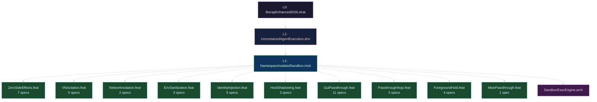
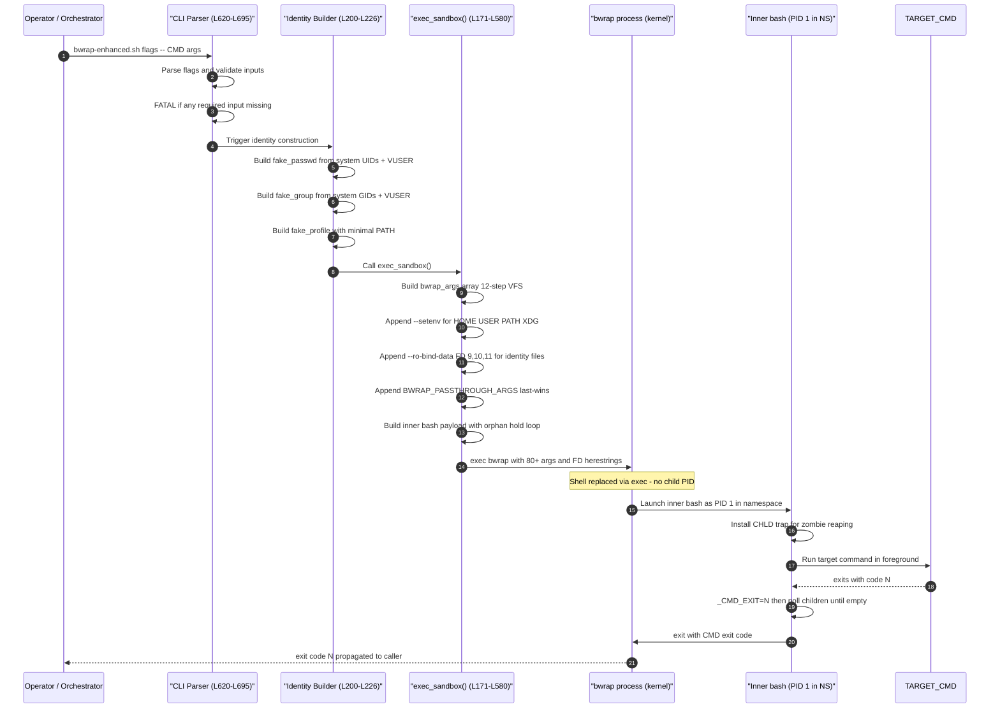

<!-- (c) 2026-* Frederick Bloom -- 20260816-171937-121071-7f00-a05f-7ea9697692bc-SdlcHierarchyOverview.overview-0.0.1.md -- Hanaden AI Loader -->
---
filename-id:   20260816-171937-121071-7f00-a05f-7ea9697692bc-SdlcHierarchyOverview.overview
node-type:     OVERVIEW
layer:         -1
version:       0.0.1
status:        Active
author:        Frederick Bloom
copyright:     (c) 2026-* Frederick Bloom
description: >
  Meta-overview of the complete SDLC hierarchy for the BwrapEnhanced2026 project.
  Documents all 50 nodes, their layers, types, TDD status, and inter-node relationships.
  Read this first to understand the full decomposition before diving into individual docs.
tdd:
  state:          NOT_STARTED
  test-file:      null
  last-run:       null
  iterations:     0
  coverage-lines: "all"
---

# SdlcHierarchyOverview: BwrapEnhanced2026 Complete SDLC Decomposition

## Purpose
SYSTEM  (layer 0, READ-ONLY authority — defines the engine and its rules)
  └──► STRAT  (layer 0 — strategic domains that USE the engine)
          └──► DRIV  (layer 1)
                 └──► MOTI  (layer 2)
                        └──► FEAT  (layer 3)
                               └──► SPEC  (layer 4 — testable leaves)
This document is the entry point for the `BwrapEnhanced2026` SDLC hierarchy.
It maps the complete set of 50 documents, their layer, type, parent, and TDD status.

## SDLC Ordering Rules

| Rule | Description |
|------|-------------|
| Write order | **TOP-DOWN**: Strategy → Driver → Motivator → Features → Arch → Specs → This overview |
| TDD implement order | **BOTTOM-UP**: Leaf specs → parent features → motivator → driver → strategy |
| No explicit `order:` metadata | AI agents MUST infer dependency DAGs semantically |
| Ambiguous ordering | Is a FATAL document quality defect — must be resolved |

## Layer Definitions

| Layer | Type | Count | Description |
|-------|------|-------|-------------|
| -1 | OVERVIEW | 1 | This meta-overview |
| 0 | CORP-STRAT | 1 | Root strategy |
| 1 | T-DRIV | 1 | Technical driver (the problem) |
| 1 | T-MOTI | 1 | Technical motivator (the solution) |
| 2 | FEAT | 9 | Features (solution capabilities) |
| 3 | ARCH | 1 | Architecture (cross-cutting design) |
| 4 | SPEC | 36 | Atomic testable specifications |

## Complete Node Inventory

```
OVERVIEW (L-1)
└── SdlcHierarchyOverview.overview [this file]

STRATEGY (L0)
└── BwrapEnhanced2026.strat

  DRIVER (L1)
  └── UncontainedAgentExecution.driv

    MOTIVATOR (L1)
    └── NamespaceIsolatedSandbox.moti

      FEATURES (L2) — semantic dependency order
      ├── ZeroSideEffects.feat [priority 1 — foundational constraint]
      │   ├── ZeroMutation.spec
      │   ├── MissingRootFatal.spec
      │   ├── MissingHomeFatal.spec
      │   └── EmptyCommandFatal.spec
      ├── VfsIsolation.feat [priority 2 — core VFS]
      │   ├── UsrMergeSymlinks.spec
      │   ├── BindSequence.spec
      │   ├── TmpfsHomeOverlay.spec
      │   ├── ReadOnlyRoot.spec
      │   └── RwEgressHome.spec
      ├── NetworkIsolation.feat [priority 3]
      │   ├── NetworkDeny.spec
      │   └── ShareNetOptIn.spec
      ├── EnvSanitization.feat [priority 4]
      │   ├── EnvStrip.spec
      │   ├── EnvInheritOverride.spec
      │   └── XdgVarsSet.spec
      ├── IdentityInjection.feat [priority 5]
      │   ├── PasswdSystemClone.spec
      │   ├── PasswdVirtualUser.spec
      │   ├── GroupSystemClone.spec
      │   ├── MinimalProfile.spec
      │   └── FdInjection.spec
      ├── HostShadowing.feat [priority 6]
      │   ├── AutofsShadow.spec
      │   ├── ProfileReplacement.spec
      │   └── ProfileDirSuppression.spec
      ├── GuiPassthrough.feat [priority 7 — opt-in]
      │   ├── WaylandDisplay.spec
      │   ├── X11Socket.spec
      │   ├── DbusIpcWritable.spec
      │   ├── GtkThemes.spec
      │   ├── FontconfigCache.spec
      │   └── BrowserPolicies.spec
      ├── PassthroughArgs.feat [priority 8]
      │   ├── TildeExpansion.spec
      │   ├── BindPassthrough.spec
      │   ├── SetenvPassthrough.spec
      │   └── LastWinsSemantics.spec
      └── ForegroundHold.feat [priority 9]
          ├── SyncExecution.spec
          ├── PureBuiltinLoop.spec
          ├── ExitCodePreserved.spec
          └── OrphanReap.spec

      ARCHITECTURE (L3) — cross-cutting, peer of features
      └── SandboxExecEngine.arch (SandboxExecEngine.design)
```

## TDD Implementation Sequence (Bottom-Up)

When implementing TDD tests, write and run in this order (bottom-up: concrete → abstract):

```mermaid
%%{init: {'theme': 'dark'}}%%
flowchart LR
    subgraph P1["🔴 Phase 1 — Leaf Specs (45 atomic)"]
        direction TB
        subgraph P1_ZSE["ZeroSideEffects"]
            ZM["ZeroMutation"] --> MRF["MissingRootFatal"] --> MHF["MissingHomeFatal"] --> ECF["EmptyCommandFatal"] --> CLD["CliDefaults"] --> SEP["SandboxEntrypoint"]
        end
        subgraph P1_VFS["VfsIsolation"]
            USM["UsrMergeSymlinks"] --> BS["BindSequence"] --> THO["TmpfsHomeOverlay"] --> ROR["ReadOnlyRoot"] --> RWE["RwEgressHome"]
        end
        subgraph P1_NET["NetworkIsolation"]
            ND["NetworkDeny"] --> SNO["ShareNetOptIn"]
        end
        subgraph P1_ENV["EnvSanitization"]
            ES["EnvStrip"] --> EIO["EnvInheritOverride"] --> XDG["XdgVarsSet"]
        end
        subgraph P1_IDN["IdentityInjection"]
            PSC["PasswdSystemClone"] --> PVU["PasswdVirtualUser"] --> GSC["GroupSystemClone"] --> MP["MinimalProfile"] --> FDI["FdInjection"]
        end
        subgraph P1_HSH["HostShadowing"]
            AFS["AutofsShadow"] --> PR["ProfileReplacement"] --> PDS["ProfileDirSuppression"]
        end
        subgraph P1_GUI["GuiPassthrough"]
            WD["WaylandDisplay"] --> X11["X11Socket"] --> DBU["DbusIpcWritable"] --> GTK["GtkThemes"] --> FC["FontconfigCache"] --> BP["BrowserPolicies"]
            COB["ChromeOptBind"] --> AUD["AudioPassthrough"] --> A11Y["A11yPassthrough"] --> GN["GnomePassthrough"] --> KDE["KdePassthrough"]
            COB["ChromeOptBind"] --> AUD["AudioPassthrough"] --> A11Y["A11yPassthrough"] --> GN["GnomePassthrough"] --> KDE["KdePassthrough"]
        end
        subgraph P1_MISE["MisePassthrough"]
            MISE["MisePassthrough"]
        end
        subgraph P1_PTA["PassthroughArgs"]
            TE["TildeExpansion"] --> BPT["BindPassthrough"] --> SP["SetenvPassthrough"] --> LW["LastWinsSemantics"] --> UDTP["UnsetenvDirTmpfs"]
        end
        subgraph P1_FGH["ForegroundHold"]
            SE["SyncExecution"] --> PBL["PureBuiltinLoop"] --> ECP["ExitCodePreserved"] --> OR["OrphanReap"]
        end
    end

    subgraph P2["🟡 Phase 2 — Feature Integration (11)"]
        direction TB
        ZSE_F["ZeroSideEffects.feat"] --> VFS_F["VfsIsolation.feat"] --> NET_F["NetworkIsolation.feat"] --> ENV_F["EnvSanitization.feat"]
        ENV_F --> IDN_F["IdentityInjection.feat"] --> HSH_F["HostShadowing.feat"] --> GUI_F["GuiPassthrough.feat"]
        GUI_F --> PTA_F["PassthroughArgs.feat"] --> FGH_F["ForegroundHold.feat"] --> ARCH_F["SandboxExecEngine.arch"]
    end

    subgraph P3["🔵 Phase 3 — Motivator / Driver / Strategy"]
        direction TB
        MOTI["NamespaceIsolatedSandbox.moti"] --> DRIV["UncontainedAgentExecution.driv"] --> STRAT["BwrapEnhanced2026.strat"]
    end

    P1 --> P2 --> P3

    classDef spec fill:#2a2a2a,color:#e8e8e8,stroke:#888
    classDef feat fill:#1a4a2e,color:#d0f0ff,stroke:#70d0ff
    classDef abs  fill:#1a1a2e,color:#e0e0ff,stroke:#7070ff
```



> *Legend: 🔴 Phase 1 = atomic leaf specs (test individually) → 🟡 Phase 2 = feature integration (compose specs) → 🔵 Phase 3 = strategy validation (end-to-end)*

## Source Reference

All specifications reverse-engineered from:
`PROJECT_HOME/src/main/hanaden-bwrap-enhanced/bwrap-enhanced.sh` (827 lines, v1.0.0)
Last analyzed: 2026-08-18 (debug pass)

## Document Status Summary

| Type | Total | Written | TDD State |
|------|-------|---------|-----------|
| OVERVIEW | 1 | 1 | N/A |
| CORP-STRAT | 1 | 1 | NOT_STARTED |
| T-DRIV | 1 | 1 | NOT_STARTED |
| T-MOTI | 1 | 1 | NOT_STARTED |
| FEAT | 10 | 10 | NOT_STARTED |
| ARCH | 1 | 1 | NOT_STARTED |
| SPEC | 45 | 45 | NOT_STARTED |
| **TOTAL** | **60** | **60** | **NOT_STARTED** |

## Master Decomposition Graph (BwrapEnhanced2026)

> Layer boundaries shown as horizontal separators. Top = most abstract, Bottom = most concrete.



> *Legend: ⬛ L0 Strategy · 🔴 L1 Driver · 🟢 L1 Motivator · 🟢 L2 Features (10) · 🟣 L3 Architecture · ⬜ L4 Specs (45)*

### Spec Breakdown by Feature

| Feature | Specs |
|---|---|
| **ZeroSideEffects** | ZeroMutation, MissingRootFatal, MissingHomeFatal, EmptyCommandFatal, CliDefaults, SandboxEntrypoint |
| **VfsIsolation** | UsrMergeSymlinks, BindSequence, TmpfsHomeOverlay, ReadOnlyRoot, RwEgressHome |
| **NetworkIsolation** | NetworkDeny, ShareNetOptIn |
| **EnvSanitization** | EnvStrip, EnvInheritOverride, XdgVarsSet |
| **IdentityInjection** | PasswdSystemClone, PasswdVirtualUser, GroupSystemClone, MinimalProfile, FdInjection |
| **HostShadowing** | AutofsShadow, ProfileReplacement, ProfileDirSuppression |
| **GuiPassthrough** | WaylandDisplay, X11Socket, DbusIpcWritable, GtkThemes, FontconfigCache, BrowserPolicies, ChromeOptBind, AudioPassthrough, A11yPassthrough, GnomePassthrough, KdePassthrough |
| **PassthroughArgs** | TildeExpansion, BindPassthrough, SetenvPassthrough, LastWinsSemantics, UnsetenvDirTmpfsPassthrough |
| **ForegroundHold** | SyncExecution, PureBuiltinLoop, ExitCodePreserved, OrphanReap |
| **MisePassthrough** | MisePassthrough |

## Runtime Flow: bwrap-enhanced.sh Execution Path

> Shows how data flows from operator CLI input through to the running sandbox.



## Layer Abstraction Axis


