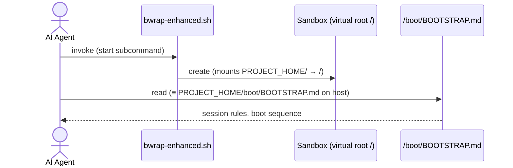

<!-- (c) 2026-* Frederick Bloom -->
<!-- lineage: SCOPE-very-narrow.md -->

Product Name: V-Universe-cli (aka 'vuniverese-cli' - fna: bwrap-enhanced.sh
# Scope — Very Narrow
This is a tool,
Initial tech stack fivsion was Pytho and/or Bash single script with a compliemntay teest harness.  Later, thoughts of a finalk incration as a single Rust crossplathform (maybe compiled - maybe )
We have now settleed on an ecosystem wrapper commnd app;clication using hte command didspatcher patttern for commands and subcommmonds:
vuniverse [CMD] [SUB-CMD]

This document defines the **minimum viable scope and functionality of a PROD release** for this workspace.

**System definition:** Command tool that creates leakproof/escapeproof jails/sandboxes using **bubblewrap (bwrap)** with a "security 101": **default deny, empty virtual filesystem** security model. Systems running inside must believe they are in their own real world that leaves them oblivious to the fact they are in a sandbox.

There are exactly three entry points an AI agent must ingest and act on:

## Entry Point 1: Sandbox Execution — `bwrap-enhanced.sh`

`PROJECT_HOME/src/main/hanaden-bwrap-enhanced/bwrap-enhanced.sh` is a single bash file
implementing a multi-subcommand dispatcher following the `git` / `rtk` / `podman` / `systemctl` pattern:

```
bwrap-enhanced.sh  SUBCOMMAND  [OPTIONS]  [ARGS]
```

Options belong to the subcommand — they always follow the subcommand name.
The only pre-subcommand forms are:

```
bwrap-enhanced.sh --help | -h     # dispatch table (all subcommands), exit 0
bwrap-enhanced.sh --version | -v  # version string, exit 0
```

### Subcommands

| Subcommand  | Status   | Purpose |
|:------------|:---------|:--------|
| `provision` | **full** | Create virtual root skeleton (NOT idempotent) |
| `fsck`      | **full** | Check / repair virtual root integrity |
| `start`     | **full** | Launch a process inside the sandbox |
| `stop`      | stub     | Stop a running sandbox (not yet implemented) |
| `ls`        | stub     | List known virtual roots (not yet implemented) |

Stubs have full `--help` and option parsing but exit `[ERROR] not yet implemented` at execution.

**CLI contract one-liner (quick reference — `--help` is the single source of truth):**
```
bwrap-enhanced.sh  SUBCOMMAND  [OPTIONS]  [ARGS]
bwrap-enhanced.sh  --help | -h
bwrap-enhanced.sh  --version | -v

  provision
    --host-real-root        PATH         (default: ~/virtual-roots; MUST NOT exist)
    --virtual-user-name     NAME         (default: sandbox_user)
    --host-real-home-parent PATH         (default: HOST_REAL_ROOT/home)
    --log-level             NAME|NUMBER  (default: INFO)
    -n, --dry-run

  fsck  [ROOT_PATH]
    --host-real-root        PATH         (default: ~/virtual-roots)
    --virtual-user-name     NAME         (default: sandbox_user)
    --log-level             NAME|NUMBER  (default: INFO)
    -n  (check only)  -a  (auto-repair)  -r  (interactive)  -f  (force)  -v  (verbose)

  start  -- CMD [ARG...]
    --host-real-root        PATH         (default: ~/virtual-roots; MUST exist)
    --virtual-user-name     NAME         (default: sandbox_user)
    --host-real-home-parent PATH         (default: HOST_REAL_ROOT/home)
    --log-level             NAME|NUMBER  (default: INFO)
    -n, --dry-run                        (resolve and print bwrap argv; no exec)
    --validate                           (validate flags and paths; no exec)
    --net-passthrough       [true|false] (default: false)
    --env-passthrough       [true|false] (default: false)
    --x11-passthrough       [true|false] (default: false; implied by wayland/gnome/kde
                                          — do not pass explicitly with an implying flag)
    --wayland-passthrough   [true|false] (default: false; implies x11)
    --gnome-passthrough     [true|false] (default: false; implies x11)
    --kde-passthrough       [true|false] (default: false; implies x11)
    --audio-passthrough     [true|false] (default: false)
    --a11y-passthrough      [true|false] (default: false)
    --dbus-passthrough      [true|false] (default: false; NEVER implied — always explicit)
    --mise-passthrough      [ro|rw]      (default: off; bare = ro)
    --local-bin-passthrough [ro|rw]      (default: off; bare = ro)

  stop  [stub — not yet implemented]
    --host-real-root PATH  --log-level NAME|NUMBER  -f, --force  -t, --timeout SECONDS

  ls  [stub — not yet implemented]
    --log-level NAME|NUMBER  -a, --all  -q, --quiet  --format table|json|csv
```

```
absent  <  ro  <  rw      (privilege escalation order)

bare boolean flag = true  (most restrictive ON state)
bare graded flag  = ro    (most restrictive ON state)
flag absent       = false = default deny
--flag false      = [ERROR]   (false is implicit; omit the flag)
```

---


### `provision` — Create virtual root skeleton

```
bwrap-enhanced.sh provision [OPTIONS]

  -h, --help
  --host-real-root        PATH   Root to create. MUST NOT already exist.
                                 Default: ~/virtual-roots
  --virtual-user-name     NAME   User home to create inside root.
                                 Default: sandbox_user
  --host-real-home-parent PATH   Parent dir for user home.
                                 Default: HOST_REAL_ROOT/home
  --log-level             NAME|NUMBER   Default: INFO
  -n, --dry-run                  Print what would be created; do not create.
```

> [!CAUTION]
> `provision` has **ZERO SIDE EFFECTS** except its one explicit purpose.
> Provisioning is deliberately **NOT idempotent** — it is a special edge-case, not a convenience.
> Strict four-way gate:
>
> | `--host-real-root` state | `provision` called | Result |
> |:---|:---|:---|
> | missing | yes | **CREATE** skeleton → exit 0 |
> | exists  | no  | n/a (caller invokes `start` directly) |
> | missing | no  | `[FATAL]` exit 2 (root missing — use `provision` first) |
> | exists  | yes | `[FATAL]` exit 2 (NOT idempotent — root already exists) |
>
> Creates: `usr etc home proc dev tmp run opt var` dirs; `bin→usr/bin`, `lib→usr/lib`, `lib64→usr/lib64` symlinks; `HOST_REAL_HOME_PARENT/VIRTUAL_USER_NAME` home dir.

**Example:**
```bash
BWRAP=PROJECT_HOME/src/main/hanaden-bwrap-enhanced/bwrap-enhanced.sh

# ~/virtual-roots/project-sample MUST NOT already exist
$BWRAP provision \
  --host-real-root        ~/virtual-roots/project-sample       \
  --host-real-home-parent ~/virtual-roots/project-sample/home  \
  --virtual-user-name     sandbox_user
```

---

### `fsck` — Check / repair virtual root integrity

```
bwrap-enhanced.sh fsck [OPTIONS] [ROOT_PATH]

  ROOT_PATH               Virtual root to check. Default: --host-real-root value.
  -h, --help
  --host-real-root  PATH  Default: ~/virtual-roots
  --virtual-user-name NAME  Default: sandbox_user
  --log-level       NAME|NUMBER  Default: INFO
  -n                Check only — no repairs. Exit 1 if any problem found.
  -a                Auto-repair: fix all repairable problems without prompting.
  -r                Interactive repair: prompt before each fix. Mutex with -a.
  -f                Force: run all checks even if root looks clean.
  -v                Verbose: print every check result, not just failures.
```

**Exit codes (fsck(8) bitmap — OR-able):**

| Code | Meaning |
|:-----|:--------|
| 0    | No errors |
| 1    | Errors found, NOT repaired |
| 2    | Errors found and repaired |
| 4    | Uncorrectable errors (e.g. root is a file, not a dir) |
| 8    | Operational error (fsck itself failed to run) |

**Checks (in order):**

| # | Check | Auto-repairable? |
|:--|:------|:----------------|
| 1 | ROOT exists and is a directory | No — exit 4 |
| 2 | `usr etc home proc dev tmp run opt var` dirs present | Yes |
| 3 | `bin → usr/bin` symlink correct | Yes |
| 4 | `lib → usr/lib` symlink correct | Yes |
| 5 | `lib64 → usr/lib64` symlink correct | Yes |
| 6 | `home/VIRTUAL_USER_NAME` exists | No — run `provision` |
| 7 | `home/VIRTUAL_USER_NAME` is a directory (not file/link) | No — exit 4 |
| 8 | No unexpected top-level entries | Warn only, never auto-removed |

---

### `start` — Launch a process inside the sandbox

```
bwrap-enhanced.sh start [OPTIONS] -- CMD [ARG...]

  -h, --help
  --host-real-root        PATH  Must already exist. Default: ~/virtual-roots
  --virtual-user-name     NAME  Default: sandbox_user
  --host-real-home-parent PATH  Default: HOST_REAL_ROOT/home
  --log-level             NAME|NUMBER  Default: INFO
  -n, --dry-run                 Resolve flags, print bwrap argv, exit 0. No exec.
  --validate                    Validate flags and paths only; exit 0 if clean.

  PASSTHROUGH FLAGS (all default to most restrictive — default deny):

  --net-passthrough       [true|false]   (default: false)
  --env-passthrough       [true|false]   (default: false)
  --x11-passthrough       [true|false]   (default: false; implied by wayland/gnome/kde
                                          — do not pass explicitly with an implying flag)
  --wayland-passthrough   [true|false]   (default: false; implies x11)
  --gnome-passthrough     [true|false]   (default: false; implies x11)
  --kde-passthrough       [true|false]   (default: false; implies x11)
  --audio-passthrough     [true|false]   (default: false)
  --a11y-passthrough      [true|false]   (default: false)
  --dbus-passthrough      [true|false]   (default: false; NEVER implied — always explicit)
  --mise-passthrough      [ro|rw]        (default: off; bare = ro)
  --local-bin-passthrough [ro|rw]        (default: off; bare = ro)

  -- CMD [ARG...]    Required command separator.
```

```
absent  <  ro  <  rw      (privilege escalation order for graded flags)

bare flag = most restrictive ON state  (true for boolean; ro for graded)
flag absent = false = default deny     (never the most permissive)
--flag false = [ERROR]                 (false is implicit; omit the flag)
```

> [!NOTE]
> `--wayland-passthrough`, `--gnome-passthrough`, and `--kde-passthrough` each
> imply `--x11-passthrough true` automatically. Do not pass `--x11-passthrough` separately.
> `--dbus-passthrough` is NEVER implied — always explicit.

> [!CAUTION]
> `start` has **ZERO SIDE EFFECTS**. It creates no directories, writes no scratch files,
> and modifies no host state. `--host-real-root` and the user home MUST already exist
> before calling `start`. Missing paths cause an immediate `[FATAL]` exit 2.
> Use `provision` first if the root does not yet exist.

**Example:**
```bash
BWRAP=PROJECT_HOME/src/main/hanaden-bwrap-enhanced/bwrap-enhanced.sh
PROJECT_NAME=$(basename "$(pwd)")
VIRTUAL_ROOT=~/virtual-roots/${PROJECT_NAME}

$BWRAP start \
  --net-passthrough                  \
  --wayland-passthrough              \
  --dbus-passthrough                 \
  --gnome-passthrough                \
  --kde-passthrough                  \
  --a11y-passthrough                 \
  --mise-passthrough      ro         \
  --virtual-user-name     sandbox_user          \
  --host-real-root        ${VIRTUAL_ROOT}       \
  --host-real-home-parent ${VIRTUAL_ROOT}/home  \
  -- bash --norc --noprofile
```

---

### `stop` — Stop a running sandbox *(stub — not yet implemented)*

```
bwrap-enhanced.sh stop [OPTIONS]

  -h, --help
  --host-real-root PATH   Identify sandbox by root path.
  --log-level NAME|NUMBER
  -f, --force             SIGKILL instead of SIGTERM.
  -t, --timeout SECONDS   Grace period before escalating. Default: 10.
```

---

### `ls` — List known virtual roots *(stub — not yet implemented)*

```
bwrap-enhanced.sh ls [OPTIONS]

  -h, --help
  --log-level NAME|NUMBER
  -a, --all               Show all roots (not just running).
  -q, --quiet             Print root paths only, one per line (scriptable).
  --format FMT            table (default) | json | csv
```

---

### 1a. Log Level Contract

```
FATAL(100) < ERROR(200) < WARN(300) < INFO(400) < DEBUG(500) < TRACE(600)
```

| Level | Tag       | Exit | When emitted |
|:------|:----------|:-----|:-------------|
| FATAL | `[FATAL]` | 2 — unrecoverable, immediate termination | Always |
| ERROR | `[ERROR]` | 1 — user-correctable | Always |
| WARN  | `[WARN]`  | 0 — unexpected, script continues | level ≥ WARN |
| INFO  | `[INFO]`  | 0 — normal operational | level ≥ INFO (default) |
| DEBUG | `[DEBUG]` | 0 — diagnostic detail | level ≥ DEBUG |
| TRACE | `[TRACE]` | 0 — finest-grained | level ≥ TRACE |

- All log output → **stderr**. Default level: **INFO(400)**.
- `--log-level NAME|NUMBER` per subcommand — suppress messages above the given level.
- `[ERROR]` and `[FATAL]` are always emitted regardless of log level.

### 1b. Virtual Environment Configuration

`PROJECT_NAME` is derived **dynamically** from the basename of this project's parent directory:

```bash
PROJECT_NAME=$(basename "$(pwd)")   # e.g. "hanaden-bwrap-enhanced"
VIRTUAL_ROOT=~/virtual-roots/${PROJECT_NAME}
```

| Parameter | Value |
|:---|:---|
| **Virtual root** | `~/virtual-roots/${PROJECT_NAME}` — **becomes the sandbox's root filesystem itself via bind mount to `/`**; used as-is from host |
| **Username inside sandbox** | `sandbox_user` |
| **Environment** | `--env-passthrough` [true|false(default)] — clean env by default |
| **Network** | `--net-passthrough` [true|false(default)] |
| **X11** | `--x11-passthrough` [true|false(default)] — also implied by wayland/gnome/kde |
| **Wayland** | `--wayland-passthrough` [true|false(default)] → implies x11 |
| **Desktop (GNOME / KDE)** | `--gnome-passthrough`, `--kde-passthrough` [true|false(default)] → each imply x11 |
| **Audio** | `--audio-passthrough` [true|false(default)] — PipeWire + PulseAudio |
| **Accessibility (a11y)** | `--a11y-passthrough` [true|false(default)] |
| **D-Bus** | `--dbus-passthrough` [true|false(default)] [⚠ portal escape — always explicit] |
| **mise toolchain** | `--mise-passthrough` [rw|ro(default)] |
| **Local bin** | `--local-bin-passthrough` [rw|ro(default)] — ~/.local/bin |

## Entry Point 2: AI Configuration — `BOOTSTRAP.md`

`PROJECT_HOME/boot/BOOTSTRAP.md` (host path) is the AI bootloader and
configuration document. Inside the sandbox it is accessible as `/boot/BOOTSTRAP.md`.
These two paths are **semantically identical** — the same file, two names.

> [!IMPORTANT]
> AI agents MUST treat `PROJECT_HOME/boot/BOOTSTRAP.md` (host) and
> `/boot/BOOTSTRAP.md` (sandbox) as the **single source of truth** for all
> session boot, configuration, and process rules.

## Path Equivalence

| Host Path (outside sandbox) | Sandbox Path (inside bwrap) |
|:---|:---|
| `PROJECT_HOME/` | `/` (virtual root) |
| `PROJECT_HOME/boot/BOOTSTRAP.md` | `/boot/BOOTSTRAP.md` ← **AI entry point** |

## Boot Sequence



## Entry Point 3: Testing — `bats-core`

Suite location: `PROJECT_HOME/src/test/hanaden-bwrap-enhanced/suites/`

Wrapper: `PROJECT_HOME/src/test/hanaden-bwrap-enhanced/bats-run.sh`

**Current test surface (skeleton phase):**
- **Dispatch table help** — `bwrap-enhanced.sh --help` exits 0, lists all subcommands
- **Per-subcommand help** — each of `provision fsck start stop ls` with `--help` exits 0
- **Per-subcommand flags** — each subcommand lists its own flags in `--help` output
- **Stub exit** — `stop` and `ls` without `--help` exit 1 with "not yet implemented"
- **Version** — `bwrap-enhanced.sh --version` exits 0, prints version string
- **Unknown subcommand** — exits 1 with `[ERROR]` and hint

- **Test methodology — aggressive TDD loop**
- full process TDD generic-sdlc-and-engine-readonly
- FORBIDDEN: vibe coding, shortsighted quick fixes, over-optimizing, mocking the tests, assuming test results or using fabricated data.  MUST always do all the work and full regression testing at each incremental step as validation of success without introduction of regression breakage.
- test ⟹ fix ⟹ test (infinite improvement loop); min cycle delay ≤ 11 s; max parallel execution = 22 (tunable; sized for a typical 24-core CI node, 2 cores reserved for the runner).
- **Reporting & coverage** — via `bats-run.sh` wrapper around `bats --formatter tap`:<br>
  &nbsp;&nbsp;• Header: `START: <YYYY-MM-DDTHH:MM:SSZ>`<br>
  &nbsp;&nbsp;• Per-test line (printed immediately on completion): `<HH:MM:SSZ>  N/total ✓|✗  <name>  elapsed=<s>s  avg=<s>/test  ETA=<HH:MM:SSZ>  est=<s>s  init_est=<s>s  init_eta=<HH:MM:SSZ>`<br>
  &nbsp;&nbsp;&nbsp;&nbsp;(`est` and `ETA` update each test; `init_est`/`init_eta` frozen from first-test rate)<br>
  &nbsp;&nbsp;• Final report: `END: <Z>  passed=N  failed=M  actual=<s>s  init_est=<s>s  init_eta=<HH:MM:SSZ>  delta=±<s>s`<br>
  &nbsp;&nbsp;• JUnit XML via `bats --formatter junit`; bash line coverage via `kcov ≥ 93%`.
- **Full mandate** — 100% CLI flag combination/permutation coverage; leak possibility determined and tested for every combination.
