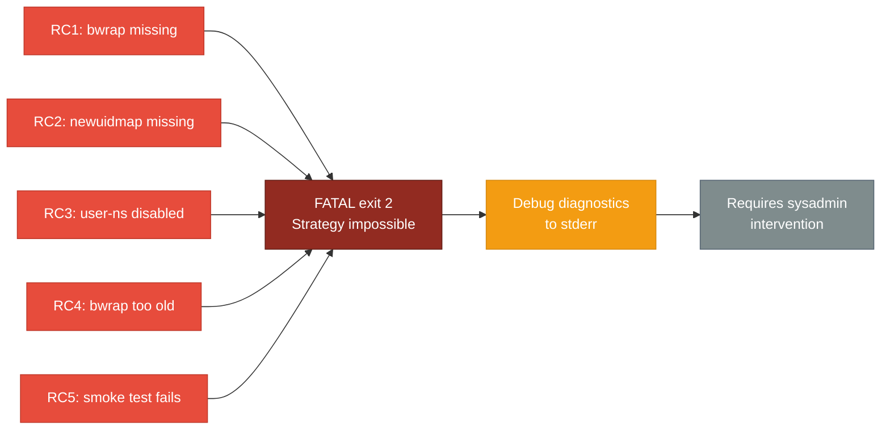

<!-- (c) 2026-* Frederick Bloom -- 20260830-025042-975390-767a-a63b-e0e3e94efa33-HostPreflightRequirement.driv-0.3.0.md -- Hanaden AI Loader -->
---
filename-id:   20260830-025042-975390-767a-a63b-e0e3e94efa33-HostPreflightRequirement.driv
node-type:     DRIV
layer:         1
version:       0.3.0
status:        Active
author:        Frederick Bloom
copyright:     (c) 2026-* Frederick Bloom
description: >
  Driver: The host may not satisfy the minimum kernel and binary prerequisites
  required by bwrap-enhanced.sh. A missing bwrap binary, absent newuidmap/newgidmap,
  or disabled user namespaces makes the entire strategy impossible. No CLI flag
  can rescue this -- it is a hard prerequisite that invalidates the strategy.
  Failure is FATAL exit 2 with debug-level diagnostics.
parent:        20260830-024933-915943-7f3d-8daa-c7c4b56bcb0d-BwrapEnhanced2026.strat
---

# HostPreflightRequirement: Host May Not Satisfy Sandbox Prerequisites

## Problem Statement

The bwrap-enhanced.sh script depends on kernel-level capabilities and userspace
binaries that are not universally present across all Linux distributions and
configurations:

1. `bwrap` binary must be installed and on PATH
2. `newuidmap` and `newgidmap` must be present (shadow-utils / uidmap package)
3. Unprivileged user namespaces must be enabled in the kernel
   (/proc/sys/kernel/unprivileged_userns_clone = 1, or sysctl equivalent)
4. The bwrap version must meet a minimum threshold for required features
   (--as-pid-1, --ro-bind-data, --remount-ro)
5. A minimal sandbox launch must succeed end-to-end (smoke test)

If any of these prerequisites are unmet, the script cannot function at all.
Unlike missing virtual-root directories (which can be provisioned via
--provision-virtual-root-if-needed), host prerequisites are not recoverable
by any flag -- they require system administrator intervention.

This is categorically different from a CLI parsing error or a missing directory.
It invalidates the entire strategy, not just a single feature.

## Root Causes

| RC | Description | Typical Environment |
|----|-------------|---------------------|
| RC1 | bwrap binary not installed | Minimal containers, fresh installs |
| RC2 | newuidmap/newgidmap not installed | Minimal containers, missing uidmap pkg |
| RC3 | Kernel has unprivileged_userns_clone = 0 | Security-hardened Debian/Ubuntu |
| RC4 | bwrap version too old for required features | Debian stable with old bubblewrap |
| RC5 | Smoke test fails despite binaries present | SELinux/AppArmor policy blocking |

## Impact Assessment

## Solution

- MOTI: BwrapRuntimePrerequisites.moti -- verify all prerequisites before any
  CLI parsing or sandbox execution.
- FEAT: BwrapPreflight.feat -- 6 specs covering binary presence, kernel config,
  version check, and minimal smoke test.
- All failures emit [FATAL] exit 2 with debug-level diagnostics to stderr.
- No --rescue, --skip-preflight, or --force flag exists or will be added.

## Why This Is a DRIV (Not a FEAT)

In v0.2.x, BwrapPreflight was a FEAT under NamespaceIsolatedSandbox.moti. This
was architecturally wrong: a preflight failure does not degrade a feature -- it
invalidates the entire strategy. By elevating it to its own DRIV branch, we make
the dependency explicit: if the host cannot run bwrap, nothing else matters.

## Changelog

| Version | Date | Author | Changes |
|---------|------|--------|---------|
| 0.3.0 | 2026-08-30 | Frederick Bloom + AI | Initial -- split from SandboxExecEngine to own DRIV |
