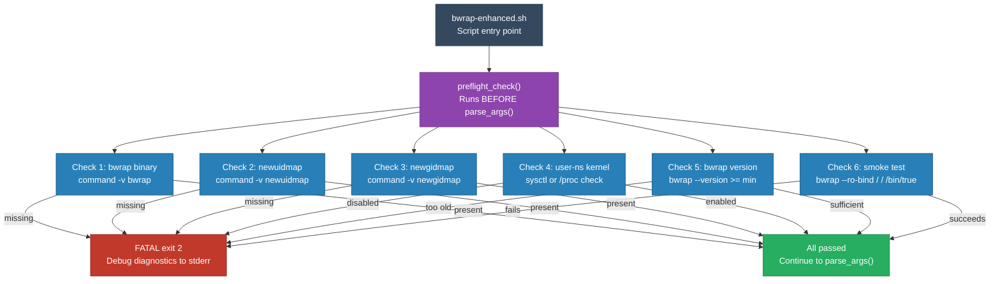

<!-- (c) 2026-* Frederick Bloom -- 20260830-025217-537994-7bd7-a749-cbae6033202c-BwrapRuntimePrerequisites.moti-0.3.0.md -- Hanaden AI Loader -->
---
filename-id:   20260830-025217-537994-7bd7-a749-cbae6033202c-BwrapRuntimePrerequisites.moti
node-type:     MOTI
layer:         1
version:       0.3.0
status:        Active
author:        Frederick Bloom
copyright:     (c) 2026-* Frederick Bloom
description: >
  Motivation: Verify all kernel and binary prerequisites before any CLI parsing
  or sandbox execution. Each check emits [FATAL] exit 2 with debug-level
  diagnostics on failure. No CLI flag can rescue a preflight failure. Preflight
  runs before CLI parsing because a missing bwrap makes ALL flags meaningless.
parent:        20260830-025042-975390-767a-a63b-e0e3e94efa33-HostPreflightRequirement.driv
---

# BwrapRuntimePrerequisites: Verify Host Before Anything

## Rationale

The bwrap-enhanced.sh script depends on specific host capabilities that are not
universally available. Rather than failing cryptically mid-execution when bwrap
returns an error, or worse, silently producing an incomplete sandbox, the script
must validate prerequisites upfront and fail fast with actionable diagnostics.

Preflight checks run before CLI parsing because:
1. A missing bwrap binary makes ALL flags meaningless
2. Disabled user namespaces make the entire strategy impossible
3. Diagnostic output must tell the operator exactly what to install/enable
4. No --provision-virtual-root-if-needed or --dry-run can bypass these checks
5. The error message must be unambiguous: "your HOST is wrong" not "your flags are wrong"

## Solution Architecture

## Why Not a Flag

| Alternative | Why Rejected |
|-------------|--------------|
| --skip-preflight | Would allow running with missing bwrap -- guaranteed crash later |
| --force | Would hide the real problem from the operator |
| Lazy check at bwrap exec time | Cryptic error message from bwrap itself; no diagnostics |
| Make checks soft-fail | Partial sandbox is worse than no sandbox (false security) |

## Feature Decomposition

| Feature | Specs | Description |
|---------|-------|-------------|
| BwrapPreflight.feat | 6 | Binary presence, kernel config, version, smoke test |

All 6 specs are FATAL-on-failure with exit code 2. No spec in this branch
has a success path that degrades functionality -- it is all-or-nothing.

## Changelog

| Version | Date | Author | Changes |
|---------|------|--------|---------|
| 0.3.0 | 2026-08-30 | Frederick Bloom + AI | Initial -- elevated from FEAT to own DRIV+MOTI branch |
